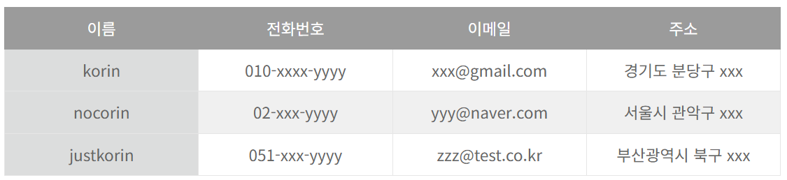

## 1장. 데이터베이스란?

**데이터베이스(Database)**

실체를 한마디로 정의하기엔 어렵지만, 최초의 데이터베이스와 유사한 형태를 띄는 것은 '주소록' 이다.       
말그대로 해당 정보들을 관리하기 위해 다른 항목들도 추가할 수 있을 것이고, PC에서 관리를 하게 된다면 ,로 구분된 csv 파일이나 Excel 같은 이차원표에 보관할 수도 있을 것이다.      
이러한 형태로 된 데이터 관리 방법은 매우 단순하지만, 이미 데이터베이스에 필요한 최소한의 기능을 갖추고 있는 것이다.

## 데이터베이스의 기본 기능

### 1. 데이터의 검색과 갱신

**[검색]**

데이터베이스의 용도로써 가장 중요한 기능이자 원하는 데이터를 찾는 기능(≒ 참조,추출)     
ex)구글 검색 엔진

**[넓은 의미로의 갱신]**

좁은 의미로는 수정만 가리킴.        
새로운 데이터를 등록하고, 기존 데이터들을 수정,제거할 수 있도록 조작하는 기능들.

 

이러한 데이터베이스들의 기능들을 조작할 때 중요한 것은 데이터를 어떤 포맷(형식) 으로 관리하는가, 검색이나 갱신에서 효율적인가 등의 문제가 발생하는데 이 때 하나의 데이터는 그 자체로 고유하여야 하는데, 이는 데이터베이스의 기초 규칙인 고유성이라고 한다.      
또한 방대한 데이터들을 검색하는 검색 성능을 어떻게 향상할 것인가 라는 주제는 데이터베이스에서 영원한 숙제 중 하나.

### 2. 동시성 제어(베타 제어)

비즈니스나 공공목적으롤 이용되는 데이터베이스에서 불특정다수의 사용자가 동시에 접근할 때에, 갱신의 무결성 관점을 바탕으로 갱신을 조절하기 위한 기능.

**[동작은 대략적으로 3개의 케이스.]**

- 최초로 파일을 연 사람이 파일을 열고 있을 때 그다음으로 파일을 열려고 한 사람은 파일을 열 수 없다.
- 최초로 파일을 연 사람이 파일을 열고 있을 때 그다음으로 파일을 열려고 한 사람에게는 파일이 읽기 전용(Read-Only)으로밖에 열리지 않는다.
-  어떤 사람도 문제없이 파일을 여는 것이 가능하고 나중에 수행된 쪽의 갱신이 반영된다. (Dirty Write)

위의 케이스들은 어느 사용자에게는 괜찮은 갱신 제어가 될 것이고, 다른 사용자에게는 불편한 갱신 제어가 될 것이다. 이러한 상황을 트레이드오프 관계라고 하며, 실제 데이터베이스에서는 전체의 균형을 생각하며 1,2번 케이스를 기준으로 수행되는 경우가 많다.

### 3. 장애 대응

좀처럼 부서지기 어렵고 부서졌다 하더라도 복원할 수 있도록 하는 것.      
데이터가 장애로 날라가버린다면 소프트웨어 버그가 아니더라도 시스템을 정지하지 않을 수 없음.     
그러므로 비지니스로 이용하는 진짜 데이터베이스라면 데이터 보호와 장애 대책에 이보다 더할 수 없을 정도로 예민해지자.

데이터 소실 문제에 대한 대표적인 대책으로는 2가지 방침이 있을 수 있다.

- 데이터 다중화
    - 데이터를 한 곳이 아니라 복수의 장소에 분산해서 유지하는 것으로, 데이터가 완전하게 소실되는 것을 막는 방법 => '예방책'
- 백업
    - 데이터 소실이 발생했을 때 데이터를 복원하는 방법 => '사후대책'

최근에 화재로 인한..큼큼 그걸 직접 체감해서 그런지 음음 매우 중요하다를 다시 깨닫게 되는 느낌.

### 4. 보안

데이터베이스에 보존된 데이터를 어떻게 숨길 것인가.      
하지만, 사용자 관점에서 보았을 때 마치 의도적으로 숨겨진 것처럼 데이터베이스의 존재를 의식하는 일은 거의 없다.      
실제로 데이터베이스는 사용자로부터 가능한 보이지 않게 설계되고 있기 때문.

이는 크게 2가지로 나뉜다.

- 사용자는 서버를 의식할 필요가 없다.
    - 클라이언트 기술(웹 브라우저, 테블릿, 모바일 등의 소프트웨어 제품) 중심으로 사용자에게 전달되기 때문에 서버의 기술(하드웨어군)은 그다지 의식되지 않는다.
- 데이터베이스는 기밀성이 높다.
    - 시스템을 구축하는 측에서는 '데이터베이스는 절대 사용자에게는 알려지지 않아야 한다' 라는 강한 의지로 시스템을 구축한다.
    단순하게 생각해보면, 데이터베이스에 들어있는 데이터들은 당연히 기밀성이 지극히 높다. 하나의 유저에 대한 데이터는 개인정보이므로 이를 악용하게 해서는 안되기 때문. 정보 유출의 위험성 감소를 위해서 실제 시스템 개발 엔지니어 또한 데이터베이스 접근 조건이 까다로워야 한다.

이러한 보안의 강도는 편리함이나 간편함 같은 사용자 편의성과 트레이드오프 관계가 있어서 그 균형 설계에 매우 어려운 지점이 된다.

## 데이터베이스의 종류

### 1. 계층형 데이터베이스

데이터를 계층 구조로 관리하는 데이터베이스.     
ex)조직도, 전체 구조도

### 2. 관계형 데이터베이스

2차원 표 형식으로 데이터를 관리하는 데이터베이스. 현재 가장 주류를 이룸.

### 3. 객체지향 데이터베이스와 XML 데이터베이스

각각 '객체' 와 'XML' 형식으로 데이터를 관리하는 데이터베이스.       
관계형을 무너뜨리지는 못하고 틈새시장에서 기반을 쌓고 있는 정도.

### 4. NoSQL 데이터베이스(Not only SQL)

최근 관계형 데이터베이스 이외의 데이터베이스로 주목을 받음.         
관계형 데이터베이스에 있는 기능 일부를 버려서 성능(처리 속도)을 높이고 있음.        
대량의 데이터를 고속으로 처리해야 하는 웹 서비스와 잘 맞아서 최근 자주 이용되고 있다.

---

### Reference

> [\[데이터베이스 첫걸음\]](https://www.yes24.com/product/goods/32613394)