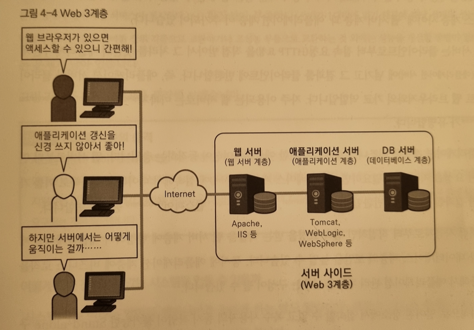
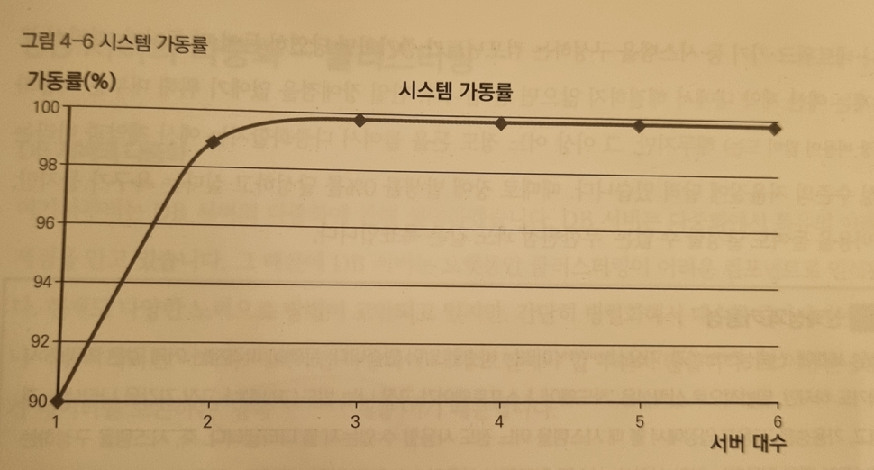
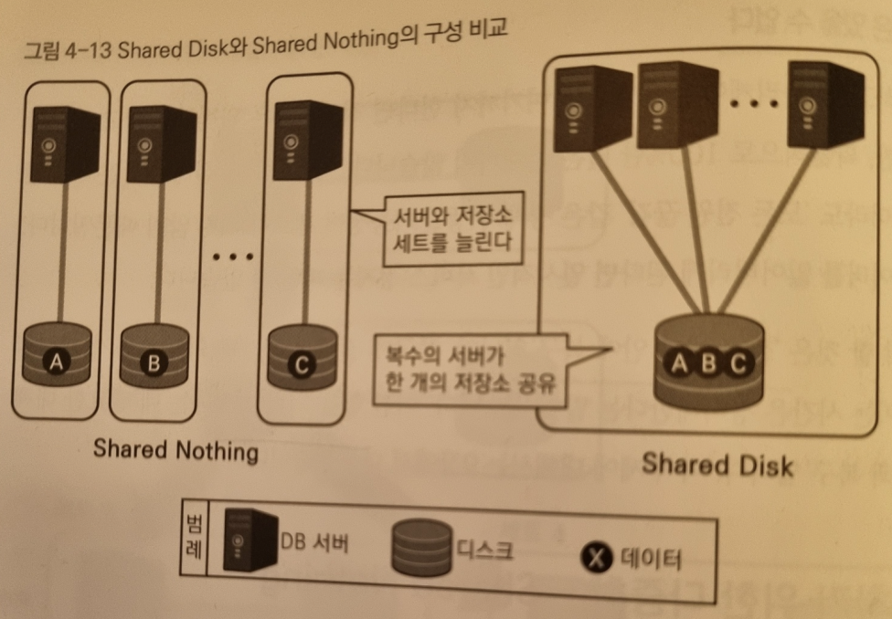

## 4장. 데이터베이스와 아키텍처 구성

### 아키텍처란 무엇인가, 아키텍처 설계의 필요성

'아키텍처'란 말은 다양한 의미가 있지만, 해당 책에서는 주로 '시스템을 만들기 위한 물리 레벨의 조합' 이란 의미로 사용한다.        
구체적으로는 '어떤 기능을 가진 서버를 준비하고 어떠한 저장소나 네트워크 기기와 조합해서 시스템 전체를 만들 것인가' 즉 하드웨어와 미들웨어의 구성을 가리킨다.        
이 구성을 시스템이 완수해야 할 목적과 비교하면서 결정해 가는 것이 바로 아키텍쳐 설계이다.       
어떤 점에서는 '물리 설계' 로 불러도 좋겠지만, 시스템의 '뼈대'를 생각하는 상위 설계란 함축적 의의가 아키텍처 설계에 있다.        
또한 아키텍처는 '그 시스템의 목적과 기능' 을 표현하는 의미도 내포한다. 이 때의 의미에서 뒤집어 생각해보면 그 시스템이 어떤 용도로 사용되고 무엇을 목적으로 하고 있는지를 어느 정도 추측할 수 있다. 이 때문에 시스템 개발 프로젝트 중간에 참여한 엔지니어는 반드시 아키텍처나 설계서를 보고 싶어한다.

### 아키텍처 설계의 어려움

실제로 아키텍처 설계는 매우 심도 있는 영역으로 이를 목표로 한다면 데이터베이스는 물론 서버, OS,기타 미들웨어, 저장소, 로드밸런서,방화벽 같은 네트워크 기기까지 폭넓은 지식이 필요하다. 때문에 책에서는 데이터베이스 관계된 영역에만 집중하여 정리하고 있다.

### 아키텍처 설계의 중요성

아키텍처라는 영역은 3장에서 설명한 돈의 영역과도 밀접한 관련이 있다. 모든 시스템은 예산 제약이라는 한계 속에서 만들어져 운영되기 때문에 고기능의 시스템을 만들려고 한다면 예산 초과로 좌절하기도 한다.      
정리하자면, 시스템에 요구되는 조건을 충족하기 위해 어떤 아키텍처가 적당할까를 생각하지 않고는 시스템 구축하는 것은 불가능하다.      
이런 의미에서 아키텍처나 설계란 것은 시스템 개발의 초반에 시행하는 일 중에서도 매우 중요한 일.      
아키텍처는 시스템 개발 후반이 되면 변경하기가 어려우므로 프로젝트의 성패는 초반에 결정되는 것이 일반적이다.

### 아티텍처의 역사

- Stand-alone(~1980년대)

    - 데이터베이스가 동작하는 머신(이하 데이터베이스 서버 또는 DB 서버)이 LAN이나 인터넷 등의 네트워크에 접속하지 않고 독립되어 동작하는 구성.

    - 이 구성에서는 데이터베이스의 미들웨어(DBMS) 와 애플리케이션의 소프트웨어는 같은 DB 서버에서 동작한다.

    - 따라서 데이터베이스를 사용하고 싶은 사용자는 DB 서버 가 설치된 장소까지 물리적으로 접근하여 서버 앞에 앉아서 데이터베이스를 사용하지 않으면 안된다. 서버가 네트워크에 접속되어 있지 않아서 물리적으로 떨어진 장소에서 엑세스하는 것도 불가능하다.

    - 나아가 물리적으로 서버를 이용했기 때문에, 복수 사용자가 동시에 작업할 수도 없었다.

    - 서버가 1대로 한정되어 있어 1대에 장애가 발생한다면 서비스가 정지한다는 것도 큰 단점이다.

    - 시스템이 제공시간에 장애 없이 서비스를 계속 지속할 수 있는 비율이 어느 정도인가를 나타내는 개념을 가용성이라하는데, 이 구성은 가용성이 낮다고 볼 수 있다.

    - 마지막으로 머신 자체의 성능을 올리는 것 이외에 개선 수단이 없으므로 이는 확장성이 부족하다고 표현할 수 있다.

    - 이러한 불편함과 단점들로 현대에서는 소규모 환경이나 테스트 환경을 제외하면 거의 볼 수 없게 되었다.

    - 물론 소규모 개인 프로젝트와 같은 것은 빠른 처리속도와 보안이 매우 높다(네트워크를 매개로 침입할 수 없어 usb 와 같은 메모리를 들고 가지 않는 한 서버가 바이러스에 감염되거나 공격받는 일은 일어나지 않음.)는 장점은 분명 존재하지만 말이다.

- 클라이언트/서버(1990년대~2000년)

    - 데이터베이스 서버 1대에 복수 사용자의 단말이 접속하는 2계층 구성. 줄여서 C/S , 클라 서버로 부르기도 함.

    - 위에서 보았던 방식에 네트워크가 추가로 연결된 개념으로 복수 사용자가 물리적으로 떨어진 장소에서 데이터베이스에 접속할 수 있게 된다. DB서버에서는 DBMS가 동작하고 클라이언트에서는 업무 애플리케이션이 동작하는 분업체제로 불 수 있다.

    - 이 구성은 주로 기업이나 조직 내에 닫힌 네트워크(LAN) 에서 이용되었다. 역으로 말하면 인터넷 등 외부 네트워크를 거쳐 데이터베이스 서버에 사용자가 접속하는 일은 없었다. 데이터베이스의 보안상 위험의 증가를 막기 위함이다.

    - 그러나 인터넷이 발달하면서, 인터넷을 통해 시스템을 이용하는 클라이언트/서버 구성은 문제점이 2가지 있다.

    - 한 가지는 위에서 말했듯 인터넷에서 직접 데이터베이스에 접속하는 것에 대한 보안 위험, 또 하나는 불특정 다수의 사용자가 사용하는 클라이언트에서의 애플리케이션 관리비용이 많이 드는 점이다.

    - 관리비용 문제란 역설적으로 어디서든지 인터넷을 이용하면 어떤 클라이언트 환경에서도 동작한다는 시스템의 편리성에 의해 발생한다.

    - 클라이언트/서버 시대에는 개인이 이용하는 PC에 애플리케이션을 설치해 동작하게 했다. (네이티브 애플리케이션) 사용자가 특정 기업이나 조직 구성원에 한정되어 있고 관리대상 PC도 적다면 문제는 없다.

    - 그러나 인터넷을 통해 전 세계 불특정 다수의 사용자가 이용하는 애플리케이션은 각종 환경에 대응해 애플리케이션을 작성해야 하고, 각각에 대해 버전 관리나 버그 수정 버전을 배포하는 데 비현실적인 비용이 필요하게 된다.

    - 이에 대응하기 위해 제시된 것이 밑에서 정리할 Web 3계층이라는 구성이다.

- Web 3계층(2000년대~현재)

    - 클라이언트/서버 2계층에서 더욱 발전하여 3계층이 된 현대의 상태.
    - 다음 3가지 계층의 조합으로 생각하는 모델이다.

        - 웹 서버 계층
        - 애플리케이션 계층 (추가!)
        - 데이터베이스 계층

이러한 구성은 웹 서버가 클라이언트로부터 접속 요청(HTTP 요청)을 직접 받아서 그 처리를 뒷단의 애플리케이션 계층(애플리케이션 서버) 에 넘기고 그 결과를 클라이언트에 반환하는 구성이다. 즉 애플리케이션 서버와 클라이언트 웹 브라우저와의 가교 역할인 셈.     
자주 이용되는 웹 서버로는 Apache, IIS 등이 있다.        
애플리케이션 계층은 비즈니스 로직을 구현한 애플리케이션이 동작하는 층이다. 웹 서버로부터 연계된 요청을 처리하고, 필요하면 데이터베이스 계층(DB 서버)에 접속해서 데이터를 추출하고 이를 가공한 결과를 웹 서버로 반환한다. Tomcat, WebLogic, WebSphere 등이 유명하다.

이처럼 사용자로부터 직접적인 접속 요청을 받는 역할을 웹 서버 계층에 한정하여 애플리케이션 계층과 데이터베이스 계층의 보안을 높일 수 있다. 동시에 애플리케이션 계층에 비즈니스 로직을 집중해서 애플리케이션 관리 비용을 낮추는 구성이 될 수 있다. 이러한 단점 보완으로 현재에서는 거의 표준이 되었다.

### 가용성과 확장성을 확보하기 위해

많은 단점들을 보완한 Web 3계층 구성이 나왔지만, 이또한 모든 문제를 해결해주지는 못한다.     
가용성 부분과 확장성 부분에 대한 단점들은 어떻게 해결할 수 있을지 정리해보자.

### 가용성을 높이는 2가지 전략

하드웨어 장애, 애플리케이션 버그, 운영 중에 오류를 놓친 사람의 문제 등 시스템 장애가 일어나는 원인은 다양하고 복잡하다. 따라서 아키텍처 설게에서 견고한 시스템을 만들기 위해 가장 중요한 점이 가용성이다.       
이 때의 접근 방법은 크게 2가지로 나눌 수 있다.

- 심장전략(고품질-소수전략 , 소수정예 노선) 
    - 시스템을 구성하는 각 컴포넌트의 신뢰성을 높여 장애 발생률을 낮게 억제해서 가용성을 높인다. 
- 신장전략(저품질-다수전략) 
    - 시스템을 구성하는 각 컴포넌트의 신뢰성을 계속해서 높이기보다는 '사물은 언젠가 망가진다' 란 체념을 전제로 여분을 준비해둔다. (컴포넌트를 병렬화함.) 이를 철저히 대비하는 것을 '물량작전' 이라고 부른다. 

과거에는 이 두 가지의 전략 중 어느 쪽이 더 효율적인가를 확실히 알지 못했기 때문에 양쪽 노선 모두를 추구했지만, 현재는 거의 '신장전략' 노선에 손을 들고 있다.

### 클러스터란

사물이나 사람의 집합을 가리키는 말. 시스템 세게에서는 동일한 기능의 컴포넌트를 복수 개 준비해 한 개의 기능을 실현한다라는 의미      
신장전략처럼 동일한 기능의 컴포넌트를 병렬화하는 것을 '클러스터링'이라고 부른다.        
또한 클러스터 구성으로 시스템의 가동률을 높이는 것을 여유도를 확보한다 또는 다중화라고 지칭한다.        
여기서 다중화는 시스템 세계에서 내구성이 더 높고 견고하다는 좋은 의미가 있다. 같은 기능을 가진 서버를 늘리면 늘릴수록 시스템 전체에서 장애 발생률이 낮아지기 때문에 이 점에서 컴포넌트 수가 많은 것이 맞는 것처럼 보인다.       
예를 들어 서버 고장률이 10%인 서버는 개수가 늘면 늘수록 동시에 고장나 장애가 발생할 확률은 줄어들기 때문이다.       
이것은 적어도 1대가 동작한다면 서비스를 게속할 수 있다고 간주한다 라는 로직에 기반을 둔 게산식이다.         
이를 역으로 100% 가에서 뺀다면 가동률의 그래프를 그릴 수 있는데 이것도.. 거지같지만 책에서 그래도 하나 찍어와봤움.

여기서 알 수 있듯이 가동률은 절대 100%가 될 수 없고, 서버 대수를 늘리면 늘릴 수록 가동률의 향상폭은 작아진다. 돈을 쓰면 쓸수록 1대분에서 얻을 수 있는 효과는 주는 것이다.       
이는 투자나 소비 행동에서도 보편적으로 보이는 현상이라고 함.

### 단일 장애점이란

다중화되어 있지 않아서 시스템 전체 서비스의 계속성에 영향을 주는 컴포넌트를 단일 장애점이라고 한다.     
단일 장애점의 신뢰성이 시스템 전체의 가용성을 결정한다. 단일 장애점을 없애기 위해 댑분 이중화는 해두지만, 그 이상 어느 정도 돈을 들여서 다중화할지는 예산 제약과 바라는 신뢰성 수준의 저울질에 달려 있다.

### DB 서버의 다중화

DB 서버는 다중화에서 특유의 어려운 문제점을 안고 있다. 때문에 DB 서버는 오랫동안 클러스터링이 어려운 컴포넌트로 인식되어 왔다.          
현재에도 간단히 병렬화해서 대수를 증가시키는 웹 서버나 애플리케이션 서버와 비교한다면 DB서버의 다중화에 대해서는 고민해야할 부분이 많다. 이러한 이유는 DB 서버가 데이터를 보존하는 영속계층 이기 때문이다.

### DB와 다른 서버의 차이

데이터베이스는 데이터를 장기간 보존하는 매체가 필요하다.        
웹 서버나 애플리케이션 서버는 한창 처리 중일 때는 일시적으로 데이터를 보존하기도 하지만, 처리가 끝난 후까지 계속 데이터를 보존할 필요는 없다. 데이터를 유지하는 매체의 신뢰성이나 다중화에 그다지 신경 쓸 필요가 없다는 것이다.     
하지만 데이터베이스는 대량의 데이터를 영구적으로 보존해야 하고 그에 따른 성능도 요구되기 때문에 일반적으로 서버 내부의 로컬 저장소나 매체 메모리로는 이런 요건을 충족시키지 못하기 때문에 전용의 외부 저장소를 사용한다.        
결국 DB 서버의 아키텍처는 저장소와 묶어서 생각해야 한다.        
얼핏 보면 아무 문제도 없어 보이지만, DB서버는 영속 계층의 사명이 부여 되어 다중화 문제를 결정적으로 어렵게 하고 있다.       
데이터는 항상 갱신되기 때문에 다중화를 유지하는 중에 '데이터 정합성'(데이터가 서로 모순 없이 일관되게 일치해야 함)도 중요하게 의식해야 하기 때문이다.

### 가장 기본적인 다중화

가장 기본적인 다중화로는 DB 서버만을 다중화하고 저장소는 하나만 두는 구성이다. 이 경우 데이터가 보존되는 저장소가 1개라서 정합성을 신경 쓸 필요가 없다. 이 구조는 데이터베이스가 저장소를 제대로 관리하고 있다.     
이 서버 2대가 동시에 동작하는 것을 허락할지에 따라 2가지로 나뉠 수 있다.

- Active-Active

    - 클러스터를 구성하는 컴포넌트를 동시에 가동한다.
    - 저장소를 공유하여 Active-Active 구성이 가능한 DBMS는 Oracle 과 DB2뿐이다.
    - Oracle은 RAC(Real Application Clusters) , DB2 pureScale 이라는 이름의 Active-Active 클러스터링이 가능하고, 다른 DBMS 에서는 Active-Standby 클러스터링만 대응하고 있다.
    - Active-Active 구성의 장점으로는 시스템 다운 시간이 짧고 성능이 좋다는 것이다.
    - 해당 구성의 경우, 복수의 DB 서버가 동시에 동작하고 있어서 한 대가 다운되어 동작 불능이 되어도 남은 서버가 처리를 계속해 시스템 전체가 정지하는 것을 방지할 수 있다. 이것은 웹서버,애플리케이션 서버 클러스터링 장점과 같다. 또한 DB 서버 대수가 증가하면 동시에 가동하는 CPU나 메모리도 증가하기 때문에 성능이 향상될 수 있다. 단 , 저장소가 병목(버틀넥)이 되기 때문에 생각한 만큼 비약적으로 향상하지는 않는다.

- Active-Standby 

    - 클러스터를 구성하는 컴포넌트 중 실제 가동하는 것은 Active , 남은 1대는 대기(Standby) 상태가 된다.
    - 보통 Standby 상태의 DB 서버는 사용되지 않다가 Active DB 서버에서 장애가 일어날 때만 사용된다. 이 때문에 전환될 때까지 시차가 생기고 그 사이 시스템은 서비스를 계속하는 것이 불가능한 상태인 다운 상태가 된다. (Standby 서버는 일정 간격 Active 서버가 다운되는 지 체크하기 위한 통신을 하고 있음. 이를 Heartbeat 라 부름.)
    - Active-Standby 구성은 다시 2가지로 나뉜다.
        - Cold-Standby
            - 평소에는 Standby DB 가 작동하지 않다가  Active DB 서버가 다운된 시점에 작동하는 구성이다.
        - Hot-Standby
            - 평소에도 Standby DB가 작동하는 구성이다.

Hot-Standby 쪽이 전환 시간은 짧지만, 그만큼 라이선슬료가 높게 설정되어 있다. 항상 2대의 DB 서버를 사용하지만 실제로 작동하는 것은  Active DB 서버 1대뿐이기 때문에 전환 시간을 줄이기 위해 라이선스료를 많이 지급한다는 점에서 Hot-Standby는 매우 사치스러운 구성일 수도 있을 것이다. 물론 Active-Active 구성보다는 그래도 싸지만..

### 리플리케이션이란

DB 서버와 저장소 세트를 복수로 준비하는 것.     
앞에서 설명한 Active-Active와 Active-Standby  클러스터 구성에서는 서버 부분은 다중화할 수 있어도 저장소 뿐은 다중화할 수 없어서 데이터를 다중화하지 않는 공통적인 단점이 있다. 즉 저장소가 부서질 경우 데이터를 잃게 된다.      
물론 저장소도 내부 컴포넌트가 다중화되어 있지만, 데이터 센터 전체가 천재지변으로 손상을 입는다면 끝이다. 이런 상황을 대응하기 위한 클러스터 구성이 리플리케이션(Replication)이다.

리플리케이션은 데이터베이스 서버와 저장소가 동시에 사용 불능일 때, 예를 들자면 지진이나 태풍 등으로 하드웨어가 설치된 시설이 파괴된 경우에 다른 1세트가 멀리 떨어진 지점에 놓여 있다면 서비스를 계속하다는 것이 가능하다는 점에서 매우 가용성이 높은 아키텍처라고 할 수 있다. 이 견고함 덕택에 재해대책으로 이용되는 경우도 있다.

### 리플리케이션에서 주의할 점

리플리케이션에서 중요한 점은 Active 측 저장소의 데이터는 항상 사용자로부터 갱신된다는 것이다. 이 때문에 Standby 측 데이터에도 갱신을 반영하여 최신화(동기화)하지 않으면 Active 측과의 데이터 정합성을 유지할 수 없다.       
때문에 리플리케이션에서는 Active 측 DB 서버에서 갱신된 데이터를 일정 주기로 Standby DB 서버에 써 내려 간다.         
이 때 Standby 측 갱신 주기를 얼마로 할 것인가와 성능 사이에 트레이드 오프가 생긴다. 엄밀히 말한다면 Standby 측 DB 서버에서도 기록이 성공한 것을 확인한 단계에서 Active 측의 갱신도 완료된 것으로 하는 것이 데이터 보호의 관점에서 바람직하지만, 이 확인 처리를 어느 정도 생략하면 성능을 향상할 수 있기 때문이다.       
또한, 리플리케이션 구성은 원친적으로는 차례로 손자나 증손자 세트를 만들 수 있다.        
그 형태를 따라서 이런 구성을 피라미드형이라고 부른다. 피라미드형 리플리케이션은 데이터가 오래되어도 참조만 하면 된다는 처리를 손자나 증손자 세트에 하기 때문에 편리하다. 이를 통해 부모에 걸리는 부하를 분산할 수 있다.     
이러한 방법들은 역시 그만큼 DB 서버의 라이선스료와 서버, 저장소의 비용이 들고 시스템을 구성하는 노력도 증가하지만 말이다.

### 100% 장애대책은 있을 수 없다.

클러스터도 구성하고, 리플리케이션도 했다면 완벽할까?
100%.. 어려운 숫자다 단언할 수 없다. 어짜피 발생할 수 있는 장애라면 빠르게 복구하는 것이 중요하다.
데이터의 백업과 복구는 9장에서 정리하겠다.

### 성능을 추구하기 위한 다중화

- Shared Disk 와 Shared Nothing

    앞서 말했던 Active-Active 구성의 DB는 저장소 부분이 병목되는 부분이 있다했었지.     
    이것은 복수의 서버가 1대의 디스크(저장소) 를 공유하도록 구성되었기 때문에 일어나는 문제로 이러한 복수의 서버가 1대의 디스크를 사용하는 구성을 Shared Disk 라고 부른다

    Shared Disk 타입의 Active-Active 구성은 DB 서버를 늘려도 무한으로 처리율이 향상되지 않고 어딘가에서 한계점에 도달한다. 이것은 저장소가 공유 자원이라서 쉽게 늘리기 어렵고 DB 서버 댓가 증가할수록 DB 서버 간의 정보공유를 위한 오버헤드가 크기 때문이다. 이 단점을 극복하기 위한 아키텍처로 고안된 것이 Shared Nothing 이다.

    Shared Nothing 은 문자 그대로 아무것도 공유하지 않는다란 의미로 네트워크 이외의 자원을 모두 분리하는 방식이다. 이 아키텍처는 서버와 저장소의 세트를 늘리면 병렬처리 때문에 선형적으로 성능이 향상되는 장점이 있다. 

    

    Shared Nothing 은 DB 서버와 저장소의 세트를 늘려서 저장소가 병목이 되는 것을 방지하고 있어서 이 세트에 비례해서 처리율이 증가한다는 이점을 얻을 수 있다. 이를 구글이 극적인 방식으로 유효성을 증명했는데 구글에서 개발한 Shared Nothing 구조를 Sharding 이라고 부르고 있다.

    또한 Shared Nothing 방식은 같은 구성의 DB 서버를 횡으로 나열하기 때문에 구조가 간단하며 원칙적으로 DB 서버 수에 비례해서 저장소가 늘어간다.

    하지만 단점도 분명히 존재한다. 저장소를 공유할 수 없다는 것은 결국 각각의 DB 서버가 동일한 1개의 데이터에 엑세스 할 수 없다라는 것을 의미하기 때문이다. 이런 문제에 대처하려면 DB 서버 하나가 다운되었을 때 다른 DB 서버가 이를 이어받아 계속 처리할 수 있게 하는 커버링 구성 등을 고려해야한다. (MySQL은 MySQL Cluster 라는 Shared Noting 타입의 클러스터 구성이 가능한데, 이 구성은 이어받는 기능이 있다.) 이런 문제의 대책까지 처음부터 고려해야 하는 것을 보면 아이디어는 간단해 보이지만 Shared Nothing 도 복잡한 구조이다.

아래의 그림에서는 지금까지 정리한 아키텍처 패턴을 도식화 했다.

---

### Reference

> [\[데이터베이스 첫걸음\]](https://www.yes24.com/product/goods/32613394)