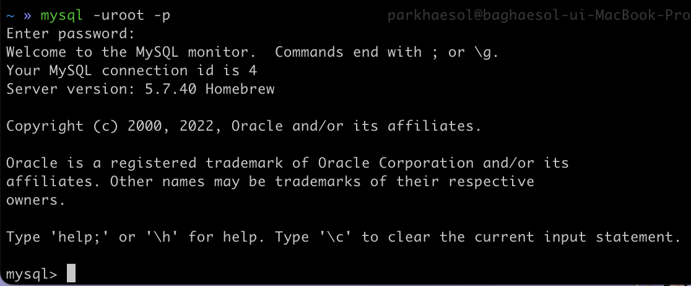
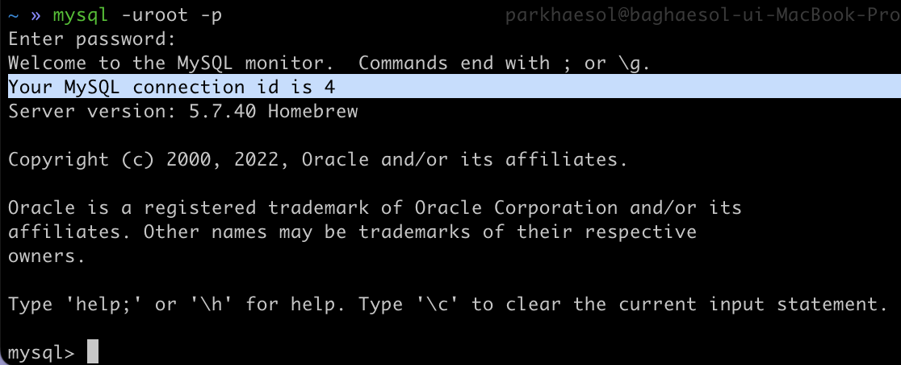
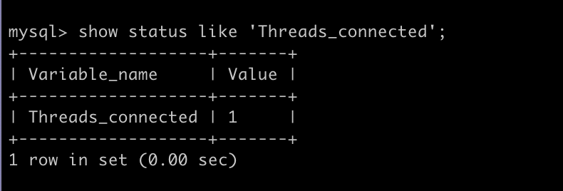
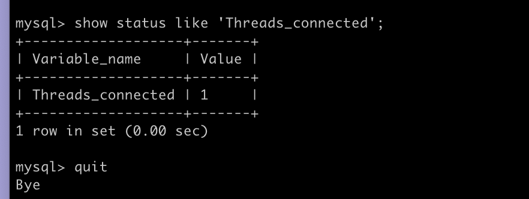
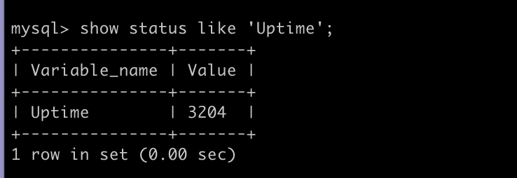
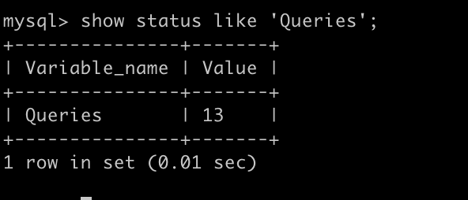
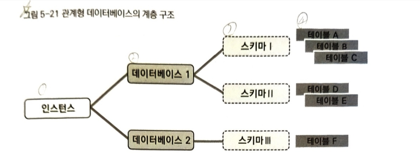
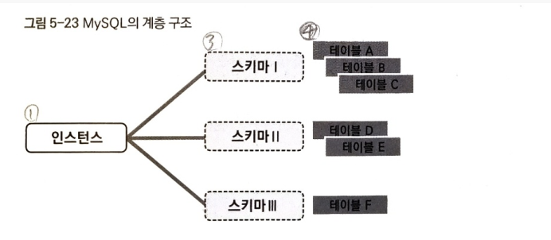

## 5장. DBMS 를 조작할 때 필요한 기본 지식

### 로그인의 의미

MYSQL 설치가 끝나면 처음으로 로그인을 해봅시다! 책에서는 커맨드 라인으로 설명이 되어 있지만, 나는 맥이므로 콘솔에서 로그인 해보았음.

```bash
mysql -uroot -p
```

해당 명령어는 -u 유저로 root 로그인을 한다는 명령어이다.        
mysql.server start 와는 쌩초보라 개념이 헷갈렸는데, mysql.server stop 와 같은 서버 명령어는 로그인과는 개념이 다르니 당장은 생각 하지 않아도 된다.



로그인에 성공하면 mysql> 과 같이 프롬프트가 뜨게 되며, 이 과정은 MYSQL 이라는 DBMS에 사용자가 로그인해서 조작할 수 있게 된 상태임을 의미한다. 이 프롬프트가 활성화 되어 있지 않으면 mysql 의 명령어를 받아줄 수 없다.

### 커넥션이란

로그인해서 프롬프트가 표시되었다는 것은 로그인 전과 후로 사용자와 MYSQL의 관계가 변화했다는 것을 의미한다. 이는 사용자와 MYSQL 이 접속되었다. 즉 연결되었다라는 뜻. 이를 시스템 세계에서는 커넥션이라 부른다.           
커넥션이 유지되는 한 사용자는 데이터베이스와 무언가를 주고 받을 수 있으며, 위의 로그인이라는 행위는 이를 호출하는 행위와 같다.



또한 위의 로그인 화면을 보면 커넥션이 성립되었음을 표시하는 문장이 있는데 여기서 connection id 는 MYSQL 이 나와의 커넥션에 붙인 번호이다. 동시에 복수의 사용자와 연결하는 것, 즉 병행 처리 수행이 가능하며, 이 때의 connection id 는 사용자 간의 구별을 위해 사용된다.

이 커넥션의 시작과 종료 사이에 DBMS와 나는 다양한 교환을 하게 되는데, 그 교환의 시작과 종료까지의 단위를 세션(session) 이라 한다. 커넥션과 세션은 매우 유사한 개념이지만, 정확하게는 커넥션이 확립된 후에 세션이 만들어진다.        
이 둘을 명확하게 구분짓지 않는 이유는 기본적으로는 커넥션과 세션은 1:1 로 대응되어서 커넥션이 성립되면 동시에 암묵적으로 세션도 시작되고, 세션을 끊으면 커넥션도 끊어지는 경우가 많기 때문이다.

커넥션의 상태를 조사하는 명령       
거의 모든 DBMS 에서는 커넥션의 상태나 수를 조사하기 위한 명령어(커맨드) 를 준비해 두고 있다. 

MYSQL 의 경우 show status 명령어를 사용한다.

```sql
-- 문장이 끝날 때에는 ; 을 붙여 사용
show status like 'Threads_connected';
```



지금은 나혼자 로그인되어 있기 때문에 value 가 1로 뜨게 되고, 다른이가 MYSQL 에 로그인 했다면 value 값이 증가한다.       
이처럼 복수의 사용자가 동시에 다른 사용자를 의식하지 않고 작업을 실행할 수 있다는 것이 데이터베이스를 이용하는 이점의 하나이다. 이 때 데이터 베이스가 어떻게 복수의 커넥션을 정합성(어떤 데이터들이 값이 서로 일치함.) 문제 없이 처리하는가의 문제는 7장에서 다룬다고 하니 참고!

### 로그오프

반대로 커넥션을 끊기 위해서 로그오프를 할 수 있는 명령어는 quit. 이후 엔터 누르면 간단하게 커넥션을 끊을 수 있다.



### SQL과 관리 명령의 차이

**관리 명령이란**

관계형 데이터베이스의 데이터를 조작하는 도구로 SQL 이라는 언어가 사용된다.      
하지만, 실제로 DBMS는 SQL 이외에도 다양한 용도의 명령어를 준비해 두고 있는데, 이를 관리 명령이라 책에선 부르고 있다.        
예를 들어 위에서 설명한 show status 와 같은 것을 들 수 있다. 아까는 연결되어 있는 커넥션의 수를 조사하기 위해 이 커맨드를 사용했지만, 이 외의 MYSQL 의 여러 정보 상태를 보기 위해 사용할 수 있다.

```sql
-- MYSQL 이 가동된 시점으로부터의 경과시간(초)
show status like 'Uptime';
```



```sql
-- MYSQL 이 실행한 SQL 문의 수
show status like 'Queries';
```



이렇듯, 관리 명령은 DBMS 가 정상적으로 동작하는지 감시하거나 DBMS 가 이상한 동작을 할 때 문제 해결을 위해 정보 수집을 하는 등의 용도로 사용한다. 해당 명령의 목록은 DBMS 의 메뉴얼에 기재되어 있고, 레퍼런스 문서도 있어서 이를 읽어보면 어떠한 정보를 어떤 명령어로 얻을 수 있는지 알 수 있음. 물론 DBMS 마다 관리 명령은 전부 다르다. SQL 이라는 언어와는 다른 점이니 참고 부탁!

### 관계형 데이터베이스의 계층

**데이터베이스는 계층으로 나뉘어 있다.**        
데이터베이스를 사용한다는 것은 DBMS 에 저장된 테이블을 SQL을 사용해서 조작하는 것이다.      
조작하기 전, 책에서는 DBMS 구조를 조금 자세히 들여다 보고 있다.

데이터베이스 내부의 테이블은 1개가 아닌 몇 개의 그룹으로 나뉘어서 관리되고 있다. PC에서 사용되는 폴더(디렉토리) 와 유사하다고 생각하면 된다. 

**폴더에 해당하는 스키마**

데이터베이스에서는 이 폴더에 해당하는 것을 스키마라고 부르며, '틀' 이라고 생각하면 조금 이해가 빠르다. 테이블은 실제로 몇 개의 스키마 속에 저장되는 형식을 취하고 있다. 스키마도 폴더처럼 사용자가 자유롭게 만들 수 있어서 용도별로 나누거나 보여주고 싶지 않은 사용자에게는 접근할 수 없도록 제한을 건 스키마를 만드는 등의 권한 관리를 수행하는 것도 가능하다.        
스키마의 상위에는 또 하나의 계층으로 '데이터베이스' 가 있다. 여기서의 데이터베이스는 2장에서 설명한 데이터를 관리하는 기능의 집합체가 아닌, 계층을 표시하는 의미이다.

**최상위에 있는 인스턴스**

데이터베이스 위인 최상위 계층에서는 인스턴스라는 개념이 존재한다. 이는 물리적인 개념으로, DBMS 가 동작할 때의 단위이다. OS에서는 프로세스라고도 부른다. DBMS 에 따라서는 이것을 서버 프로세스 또는 서버라고 부르는 경우도 있다. 여기에서 인스턴스는 메모리나 CPU 를 사용하는 존재로 OS에 존재하는 '실체'라는 의미이다. 자바와 같은 객체지향 언어에서 사용하는 경우와 같은 의미가 있다고 생각하면 된다. 

총 정리하자면, 1개의 인스턴스 아래에는 복수 개의 데이터베이스가 존재할 수 있고, 1개의 데이터베이스의 아래에는 복수의 스키마가 존재할 수 있으며, 1개의 스키마 아래에는 복수 개의 테이블이 존재하는 것이 가능하다. 깔끔한 트리 구조!

참고로, 최하위 계층인 4계층(테이블 계층) 에는 인덱스, 저장 프로시저와 같은 이외의 것들이 있다. 이런 데이터베이스에 보존된 것들을 총칭해서 오브젝트라고 한다. 테이블도 오브젝트의 일종이다.      
또한 인스턴스도 복수로 존재할 수 있으며, 이 경우 멀티 인스턴스라는 구성을 사용한다.

### 멀티 인스턴스와 가상화

데이터베이스의 계층 구조에서 인스턴스는 최상위 개념이다. 이 인스턴스를 한 개의 OS 에서 복수로 존재하게 하는 것은 원칙적으로는 가능하다. 또한 이를 멀티 인스턴스라고 부른다.     
다만 인스턴스는 OS에서 보면 메모리나 CPU 등의 물리 자원을 소비하는 프로세스이기 때문에 복수의 인스턴스를 존재하게 할 여력이 자원에 없다면 멀티 인스턴스를 만들려고 해도 만들 수 없어 원칙적으로 가능하다고 책에서 설명하고 있다.        
특히 CPU 파워가 부족하다면 처리가 늦어지는 정도지만, 메모리가 부족한 경우는 DBMS 가 일반적으로 기동 시에 최저 한계의 메모리 공간을 확보하려고 하기 때문에 인스턴스의 기동조차 하지 못하고 오류가 발생하는 경우도 있다.      
따라서 최근에는 멀티 인스턴스를 사용하는 예가 그렇게 많지 않다. 테스트 환경을 복수로 준비하고 싶지만, 물리 서버 대수가 부족한 정도이고 이것또한 가상화 환경을 사용하는 예로 대체되고 있다. 

---

계층 구조가 이해하기 어려운 이유가 있다. 위의 깔끔한 트리 구조는 원칙일뿐, 현실에서는 구현되는 것마다 조금씩 차이가 있다. 이 계층의 원칙을 충실히 지키는 DBMS는 PostgreSQL, SQL Server, DB2 고, 스키마와 데이터베이스 한 계층을 생략한 것이 MySQL, Oracle 이다. 

MySQL 은 데이터베이스와 스키마를 동일한 것으로 간주해서 계층 차이를 두지 않으므로 데이터베이스와 스키마는 MySQL 에서는 동의어이다. 그래서 3계층 구조라고 할 수 있다.        
또한 Oracle 또한 4계층 구조이나, '인스턴스 아래에 데이터베이스를 한 개만 만들 수 있다'는 독자적 제약이 있어서 실질적으로 데이터베이스를 의식하지는 않으며 3계층 구조로 바뀌지도 않는다. 실제로 사용해보면, 데이터베이스는 계층의 그림자가 얇아서 마치 인스턴스 바로 아래에 스키마 층이 존재하는 듯한 인상을 받는다.

- 4계층 : SQL Server, DB2, PostgreSQL



- 3계층: Oracle(4계층 구조라고 했는데.. 일단 책에서 이렇게 정리하고 있음. 실사용에 초점을 두는 듯), MySQL




**3계층 ? 4계층 ? 어느 쪽이 맞을까**

둘 중 어느 쪽이 맞는지를 묻는다면 답은 4계층이다. 이는 ANSI(안시, American National Standards Institute - 미국 내 산업 분야의 표준화 단체) 가 정한 표준 SQL 로 결정되어 있기 때문. 하지만 독자 노선의 3계층 사양에도 특별한 불편함은 없다. 3계층은 3계층 대로 잘 되고 있다. 어느 쪽이 나쁜 쪽인가를 따질 필요는 없지만, 구현에 대한 사양이 일치하지 않아서 DBMS 를 변경하려는 경우 쓸데 없는 부분에서 엔지니어에게 혼란이 올 수 있다. 덧붙여 이런 구현 사항은 개발사의 의향에 따라 추후 변경될 가능성도 존재한다. 

---

### Reference

> [\[데이터베이스 첫걸음\]](https://www.yes24.com/product/goods/32613394)