## 6장. SQL 문의 기본

여기서는 앞장에서 다뤘던 계층에서 스키마 계층은 데이터베이스와 같으므로 데이터베이스로 표기하니 참고! 

이제 본격적으로 언어의 문법 아닌 문법을 배울 시간!

https://dev.mysql.com/doc/index-other.html

이 링크에서 샘플 데이터들을 다운받고 관련 설명서까지 볼 수 있다.

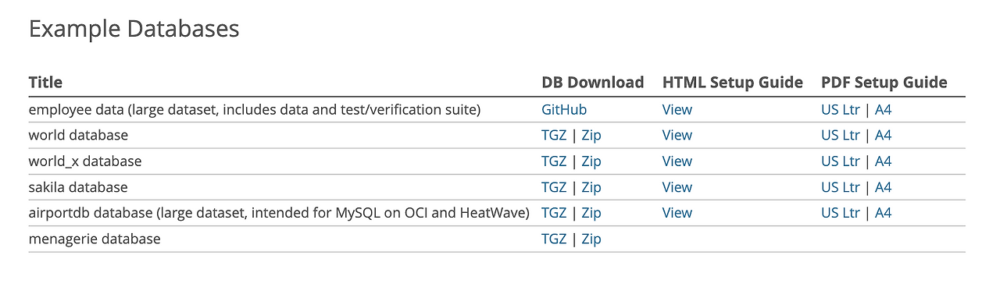

여기서 책과 동일한 world database 를 찾아서 Zip 파일로 다운받아주었다.      
다운로드 후에는 해당 파일 압축을 해제해주자.        
이후 로그인 커맨드를 통해 mysql 에 로그인 해주기.

```bash
mysql -u root -p
```

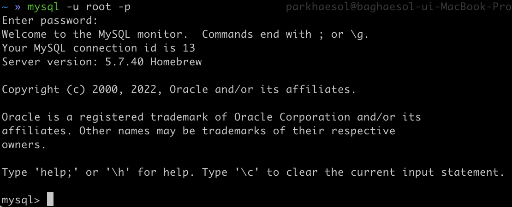

비밀번호 치고, 로그인 했으면 이렇게 다운 받은 경로의 데이터를 활성화 시켜주면 된다. (참고로 mysql> 표시는 로그인 활성화 상태임을 나타내는 거니 뒤에 부분만 복붙하면 된다.)

```bash
/* C:/temp/ 이 부분 실제 해당 샘플 데이터 다운 받은 경로로 바꿔주기. */
mysql> SOURCE C:/temp/world.sql;
```

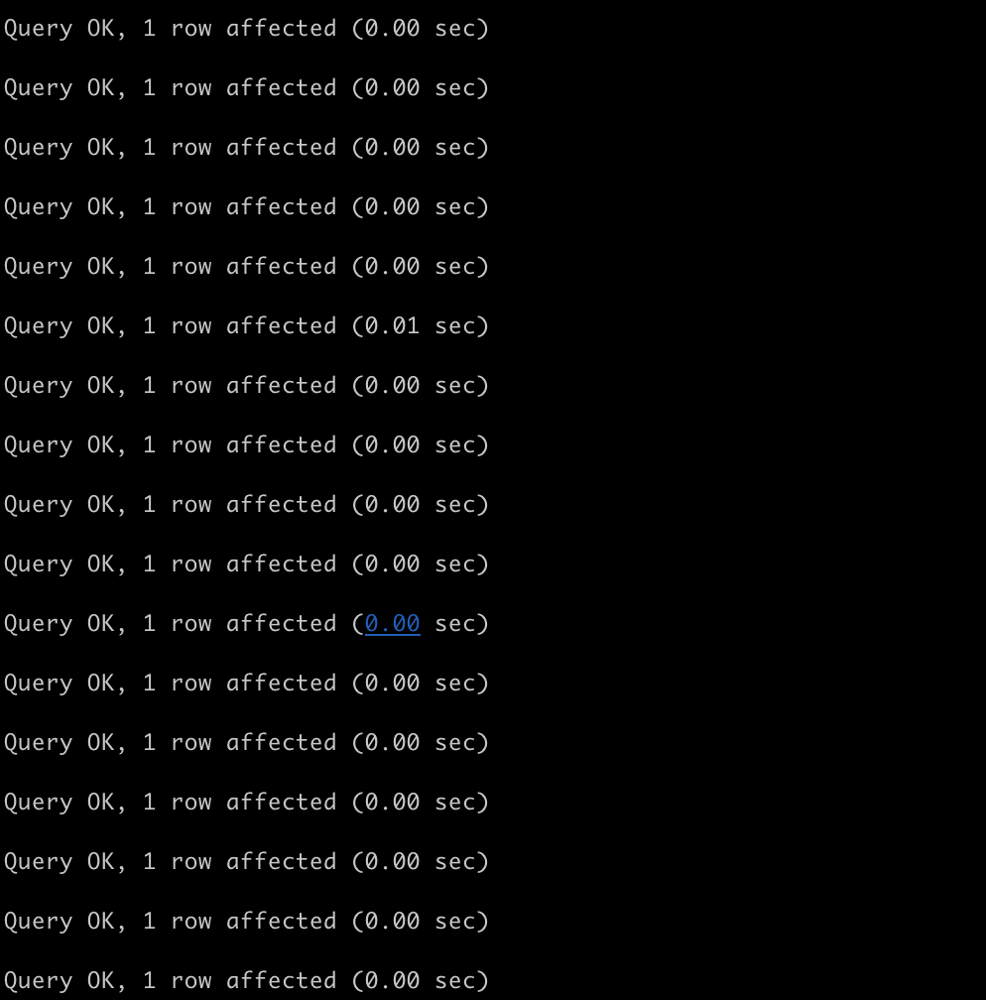

이제 해당 데이터가 깔렸는지 확인!

```bash
/* world 샘플 데이터베이스를 디폴트로 지정 */
mysql> USE world;
Database changed


/* world 데이터베이스에 있는 테이블 리스트들을 보기 */
mysql> SHOW TABLES;
```

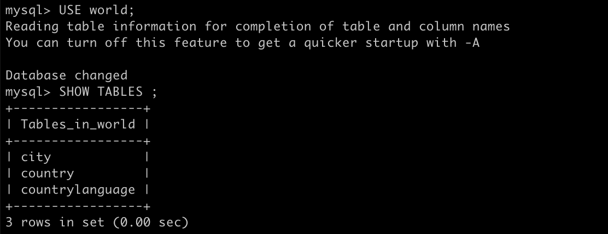

그러면 이렇게 3개의 테이블들이 있는 world 데이터베이스 불러오기 성공!       
자 이제 데이터도 깔렸으니 진짜 sql 문 써보러 갑시다!

참고로, sql 은 기본적으로 대소문자 구분을 하지는 않지만, 가독성면에서 명령어들은 대문자로, 나머지는 소문자로 쓰는 것을 권장한다.

```sql
/* city 테이블 데이터를 전부(*) 선택해줘. 뒤에 세미콜론(;) 꼭 붙일 것! */
mysql> SELECT * FROM city; -- 여기서 디폴트 데이터베이스를 world 로 붙였기 때문에 암묵적으로 적지 않아도 된다. 만약 적고 싶다면 world.city 로 표기
```


city 데이터를 전부 들고 왔다. 많아서 칼럼은 터미널에선 보이지도 않음...

```sql
/* city 데이터에서 countrycode 컬럼이 KOR 인것만 불러와주기. */
mysql> SELECT * FROM city WHERE countrycode='KOR';
```

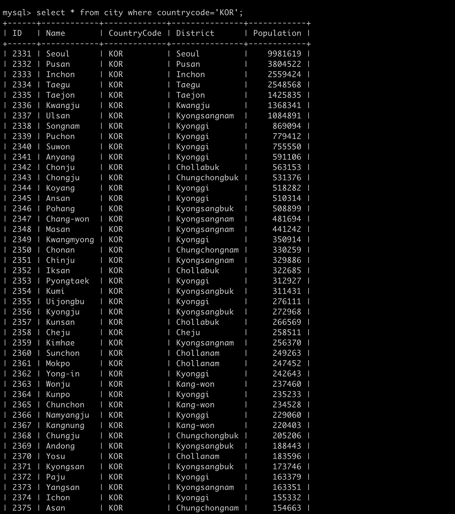

이제 칼럼 이름들이 보이네..! 위에에는 안보이던 칼럼명들이 보이네 sql 문 문법상으로 뽑아오는 걸 배우고 있으니 select , from, where  과 같은 용어에 집중해보자

여기서 select 는 내가 조회하고 싶은 데이터를 뜻하고(칼럼명 또는 *는 모두를 뜻함.) , from 은 불러오고 싶은 데이터가 있는 데이터 테이블을 말한다. where 은 조건문을 써서 특정 조건에 해당하는 데이터를 조회할 수 있다.

>SELECT 필드명 FROM 테이블명 WHERE 조건문

```sql
mysql> SELECT * FROM city WHERE district = 'Pusan' ;
```

얘는 그냥 연습 district 가 부산인것만 추출

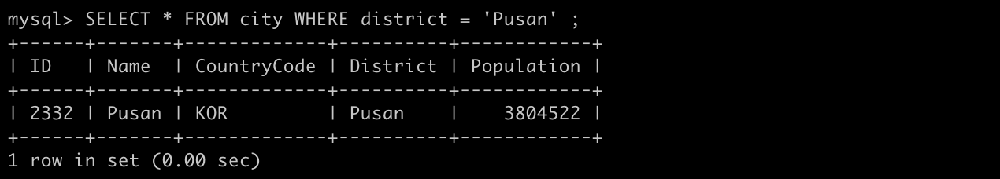

그 다음에, 부산에서 이름과 countrycode 만 추출하려면!

- 콤마(,) 로 구분하면 간단히 가능

```sql
SELECT name,countrycode FROM city WHERE district = 'Pusan' ;
```

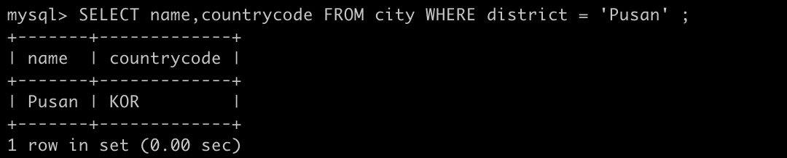

- AND,OR 문도 사용 가능

AND 는 조건 모두가 참이어야 하는 조건       
OR 은 조건 중 하나만 참이어도 되는 조건

```sql
/* district 가 Chollanam 이면서, population가 150000명 이상인 데이터의 name, population 을 보여줘  */
SELECT name,population FROM city WHERE district = 'Chollanam' AND population >= 150000 ;
/* district 가 Chollanam 이거나, population가 150000명 이상인 데이터의 name, population 을 보여줘  */
SELECT name,population FROM city WHERE district = 'Chollanam' OR population >= 150000 ;
```

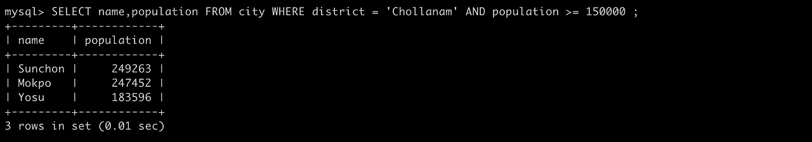

여기서 부등호와 등호는 비교 연산자이며, 비교 연산자의 종류는 아래 표 참조

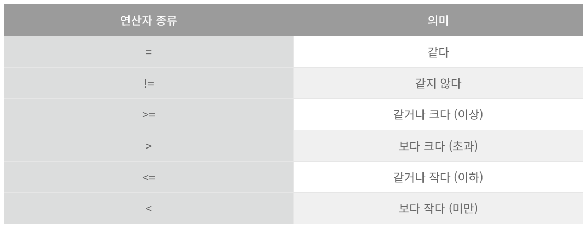

이 외에도 다양한 연산자가 있는데, 연산자는 우선순위가 존재하며, 여러 연산자를 혼합하여 사용할 때에는 내 의도대로 동작할 수 있도록 괄호를 사용하도록 하자! 책에서 우선순위를 표로 표기하는데 사실 외우지 않아도 되는 사실이니 그때 그때 사용할 때 MySQL 연산자 우선순위를 구글링하거나 괄호를 사용하는 습관을 들이면 될 듯.

- 중복행을 제거하여 조회하고 싶다면, DISTINCT 키워드를 사용하기

```sql
/* countrycode 가 KOR 인것 중에서 district 이름을 조회할건데, 중복을 제외(DISTINCT)하고 조회할게 */
SELECT DISTINCT district FROM city WHERE countrycode = 'KOR' ;
```

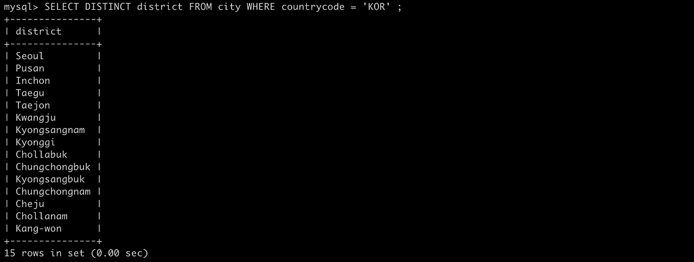

이제 SELECT 응용!

- 검색 결과 오름차순 정렬은 ORDER BY 사용

```sql
/* countrycode 가 'KOR' 이고, district 가 'Kyonggi' 인 데이터를 인구수대로 오름차순 해서 보여줘 */
SELECT * FROM city WHERE countrycode = 'KOR' AND district = 'Kyonggi' ORDER BY population ;
```

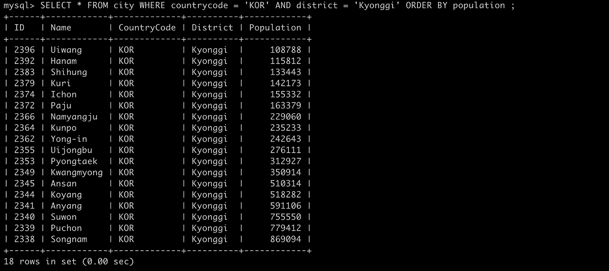

여기서 경기도 인 것을 선택하기 위해서 그냥 countrycode 조건을 걸지 않아도 되지만, AND 조건과 함께 써보려고 일부러 조건을 추가했다. 참고!

```sql
/* 내림차순 키워드 추가. */
SELECT * FROM city WHERE countrycode = 'KOR' AND district = 'Kyonggi' ORDER BY population DESC;
```

추가로, ORDER BY 뒤에 아무 키워드를 붙이지 않으면 암묵적으로 오름차순이 된다. (원래는 뒤에 ASC 키워드를 사용.)      
반대 내림차순은 DESC 키워드를 맨 뒤에 추가한다.

여기서 주의할 점 하나 더 ! 행의 순서를 확실히 정렬 하려면 행의 정렬키(ORDER BY 뒤에 적는 열명)를 유니크하게 정해야 한다.

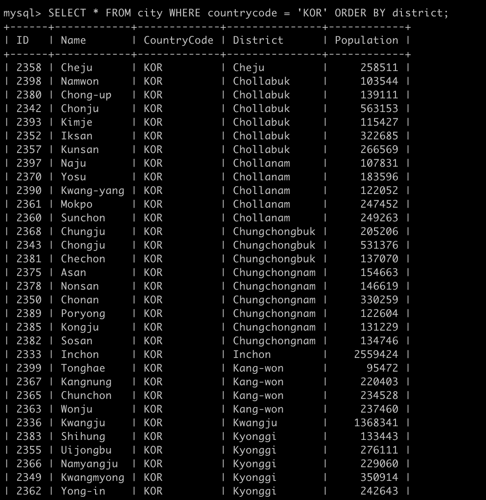
여기서는 티가 안나는데 나중에 데이터가 복잡해지면 내가 원하는 느낌의 데이터가 정확히 안나올 수 있다.
 
만약 정확하게 하려면 ORDER BY district 뒤에 콤마로 ,name 과 같은 방법으로 좀 더 정확성을 요할 수 있겠지만 인구수처럼 확실히 구분되는 데이터가 있다면 걔로 처음부터 그냥 정렬해버리는 것이 좋을 듯 하다.

- 실제 데이터의 행수를 카운트 하기 위해서는 COUNT 함수 사용.

```sql
/* countrycode 가 'KOR' 인 데이터의 행 수(COUNT(*))를 보여줘 */
SELECT COUNT(*) FROM city WHERE countrycode = 'KOR';
```

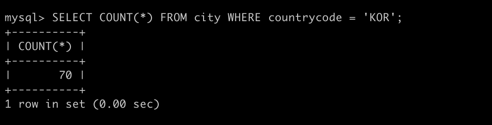

여기서 1 row in set (0.00 sec) 부분은 MySQL 의 커맨드라인 즉, 터미널에 나타나는 행의 갯수이고, 실제 DBMS 로부터 돌려받은 데이터의 행 갯수가 아니다. 헷갈리지 말자!

- 최소값, 최대값, 평균값 계산은 순서대로 MIN, MAX, AVG 함수를 사용한다.

```sql
/* countrycode 가 'KOR' 인 데이터에서 population 값의 순서대로 최소값, 최대값, 평균값을 보여줘. */
SELECT MIN(population) , MAX(population), AVG(population) FROM city WHERE countrycode = 'KOR' ;
```

- 데이터를 한 행에 집약하여 출력할 때에는 GROUP_CONCAT 사용.

```sql
/* countrycode 가 'KOR' 이고, district 가 'Chollabuk' 인 데이터를 한 행에 모아서(GROUP_CONCAT) name 을 보여줘. */  
SELECT GROUP_CONCAT(name) FROM city WHERE countrycode = 'KOR' AND district = 'Chollabuk';
```

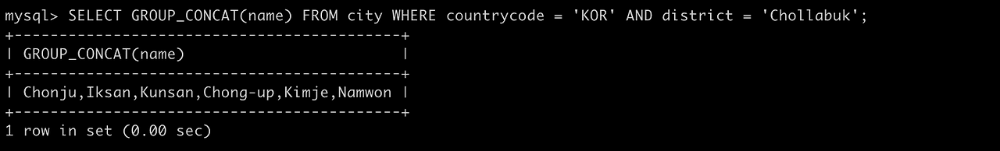

말그대로 문자열의 결합으로 생각하면 되고 문자열 + 문자열 을 콤마로 구분해서 결과로 돌라준다.        
한 가지 유의할 점은, 예상 외의 길이(시스템 변수상으로 상한선이 정해져있음.) 를 가진 결과를 돌려줄 때가 있으니 참고!         
또 얘는 sql 에서는 LIST 함수로 표현되어 있어 DBMS 상으로 다 다르다고 하네여 MySQL 에서는 GROUP_CONCAT 으로 쓰인다.

위에서 배웠던 DISTINCT 키워드를 사용해 중복을 회피할 수도 있다. 이 경우 다음과 같이 사용한다.

```sql
/* countrycode 가 'KOR' district 를 DISTINCT 키워드를 사용하여 중복을 제외하고 조회해줘. */
SELECT GROUP_CONCAT(DISTINCT district) FROM city WHERE countrycode = 'KOR' ;
```

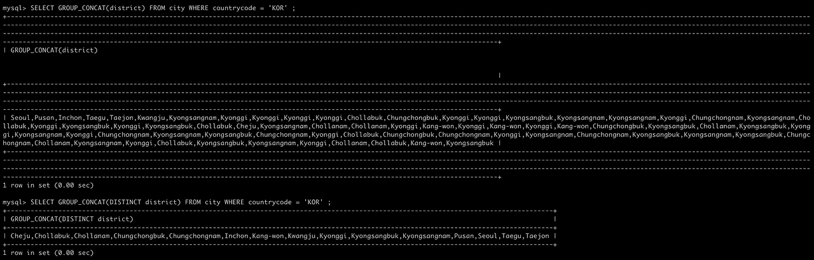

캡쳐에서 위는 DISTINCT 키워드를 쓰지 않아서 전부 합쳐서 나온 모습이고, 밑은 district 가 중복을 제외하고 하나씩 나온 모습!

위의 경우들에서 보았듯이 데이터에 대해 어떠한 조작이나 계산을 수행하는 도구를 '함수' 라 하고 sql 에서는 크게 2가지가 있다.      
여기서 좀 더 보충해서 내가 찾아봤음.

### 1. 집약함수(집계함수)

복수행이나 즉 열(colum, 세로 단위)끼리의 값에 대해 하나의 집계 결과값을 반환하는 함수. SELECT 구문에서만 사용된다.      
위의 4가지와 함께 SUM (합계를 구하는 함수) 5가지의 함수가 자주 쓰인다.

이러한 집약함수는 기본적으로 NULL (아무것도 아님. 적용불가) 을 제외하고 집계하는데, COUNT 함수만은 COUNT(*) 로 표기하여 NULL 을 포함한 전체 행을 집계한다. 또한 SUM, AVG 이외의 집약함수는 숫자 데이터 외에도 이용이 가능하다. -> 문자형태에서도 가능하다는 소리.

문자 데이터에서는 최대값, 최소값을 사전순으로 생각하면 된다.        
'A' 로 시작하는 것이 최소값, 'Z' 가 최대값이라는 소리.

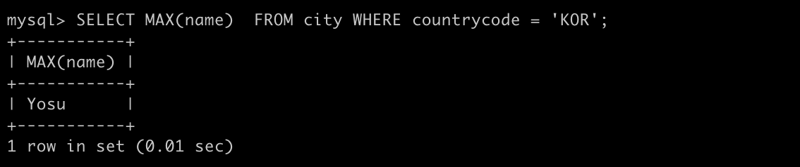

countrycode 에서 최대값은 Y 여서 Yosu 가 나오게 되는 것.

### 2. 단일 행의 값에 대해 조작이나 계산을 수행하는 함수

이 경우에는 하나의 행 안(row, 가로)에서의 값에 대한 연산을 수행한다. 

NULL 은..항상 나는 볼때마다 한번씩 걸리는 점인 것 같다. 다른 언어에서도 먼가.. 항상 한번씩 짚고 가는듯. 책에서 말한대로 여기서 짚고 넘어가겠음.

### NULL 

말그대로 불명. 정할 수 없는 값을 표현할 때 쓰는 단어이다. 0과는 다르다. 0은 0이라는 값으로써 존재한다.      
일반적인 숫자/문자와 같이 취급할 수 없음. 그렇기 때문에 사칙연산, 비교연산도 할 수 없다. null 은 어떤 연산을 해도 null 이다.

데이터에서는 이런 값이 존재할 가능성이 있어 열을 정의할 때는 'NOT NULL' 이 아닌 NULLABLE(NULL 값이 존재할 수 있음. 우리가 따로 정의하지 않는다면 이게 기본값) 로 정의하는 것이 편리하다. 어쩌면 사용에 따라 참 의미있게도 쓰인다.       
하지만 DBMS 에서는 그다지 null을 반기지 않는다. 책에서는 그 2가지 이유를 설명하고 있다.

    1. SQL 로 코딩 시 인간의 직감에 반하는 3개의 논리값 (true , false 이외에 null로 인한 unknown)을 고려해야 한다.

    2. 사칙연산 또는 SQL 함수의 인수에 NULL 이 포함되면 NULL 의 전파가 일어난다.

책에서도 IS NULL 이 아닌 =NULL 이라고 쓴다면 원하는 결과를 얻을 수 없다고 한다.     
위에서 말했듯이 null 이라는 애는 데이터가 존재하지 않는 것(unknown) 그 자체라서 = 과 같은 비교를 할 수 없는 값이기 때문이다.        
그래서 sql 에서는 IS NULL 이라는 구문을 쓰는데, MySQL 에서는 <=> 과 같은 독자적인 연산자로 비교할 수 있다.      
그래서 예상치 못한 null 로 인해서 값이 null 이 되어 다른 곳에도 값이 퍼져나가버리는 NULL 전파가 일어나지 않는다.        
또한 SQL 표준에서는 NULL 이 섞여 비교를 수행하는 A IS NOT DISTINCT FROM B 이 정의 되어 있어 이걸 구현한 DBMS 에서 동일한 결과를 얻을 수 있다.

- 테이블에 있는 데이터들을 내가 원하는대로 그룹별로 나눠서 조회하려면 GROU BY 사용.

```sql
/* countrycode 가 'KOR' 인 데이터들을 그룹별 분리 후, district 와 데이터들의 숫자를 세서(count(*)) 보여줘. */
 SELECT district, count(*) FROM city WHERE countrycode = 'KOR' GROUP BY district ;
```

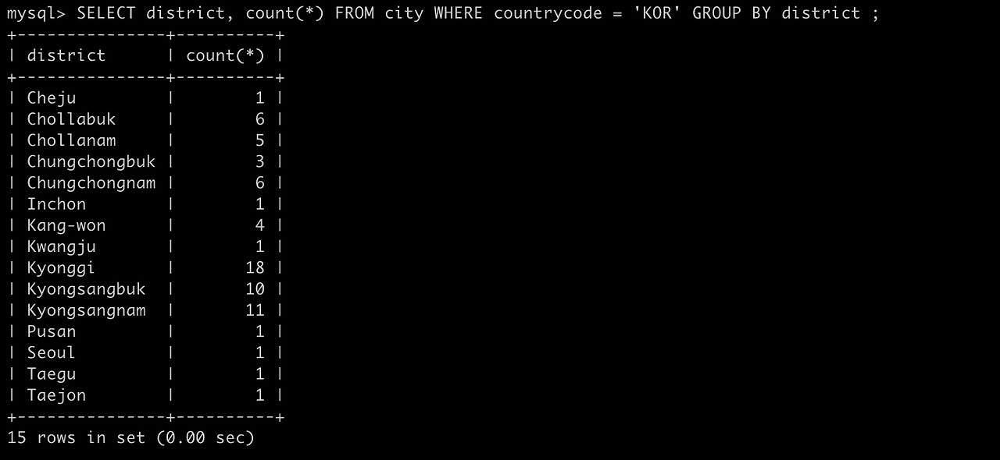

위에서 말한 집약함수를 내가 원하는 그룹대로 나누어 집약한 모습.     
위의 나는 district 로 그룹을 나누어주었는데 이 때 이를 집약 키 또는 그룹화 키로 부르며 ORDER BY 와 같이 뒤에 콤마로 구분해서 복수로도 지정해줄 수 있다.

- 더 나아가 그룹별로 정리한 데이터를 조건을 부여해서 조회하려면 HAVING 사용.

```sql
/* 위의 결과에서 count(*) 의 값이 6인 데이터만 조회해줘. */
SELECT district, count(*) FROM city WHERE countrycode = 'KOR' GROUP BY district HAVING count(*) = 6 ;
```

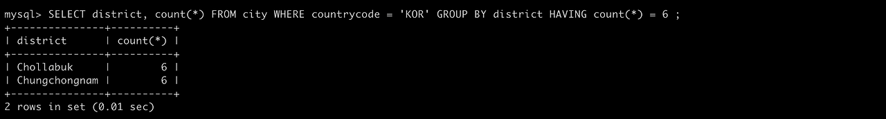

WHERE 문과 비슷하다고 생각하면 되고, 집약함수에서 조건문을 걸고 싶을 때 사용한다!

### 작성 순서 총정리

1. SELECT
2. FROM
3. WHERE
4. GROUP BY
5. HAVING
6. ORDER BY

### 참고 링크

https://rebro.kr/154

---

### Reference

> [\[데이터베이스 첫걸음\]](https://www.yes24.com/product/goods/32613394)