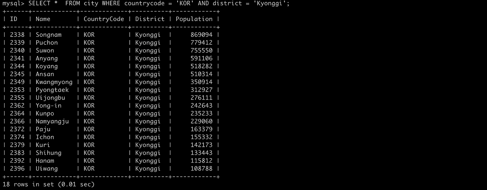
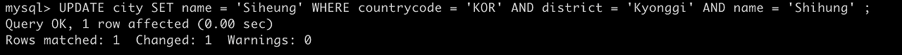
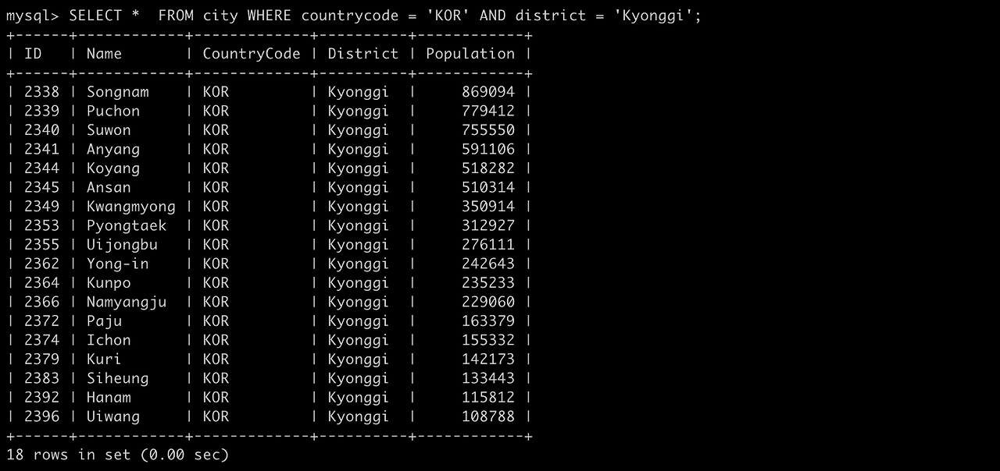
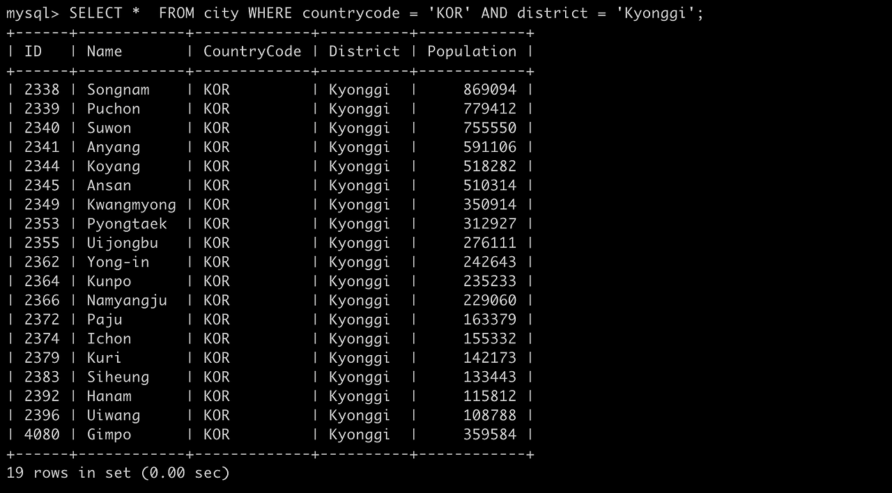
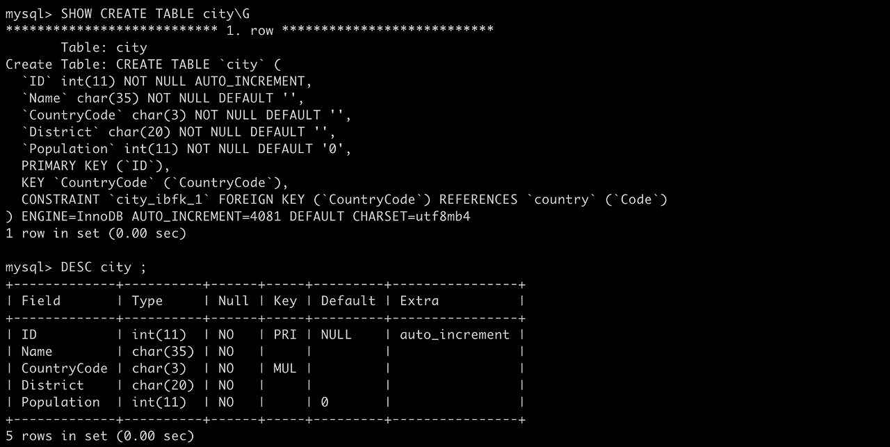
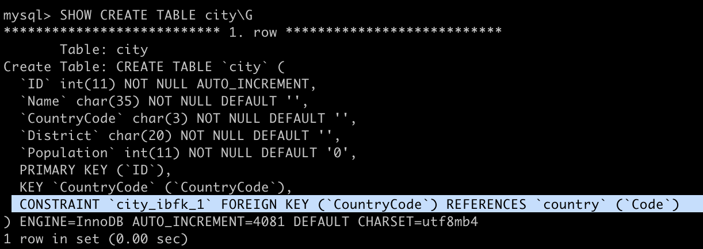
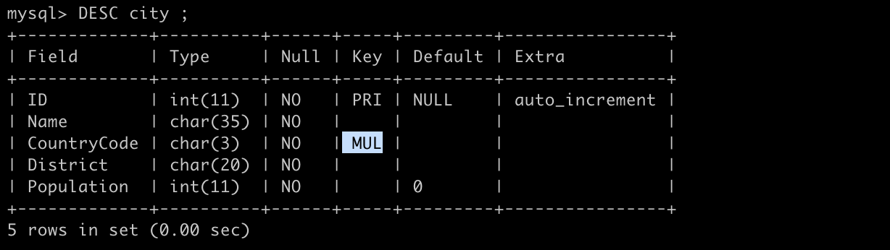
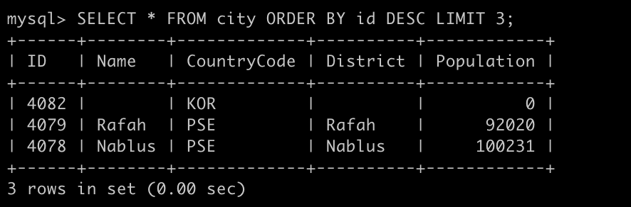
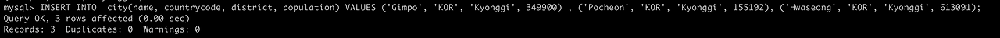

## 6장. SQL 문의 기본

- 데이터를 갱신할 때에는 UPDATE 구문 사용.

현재 한국 경기도의 도시명을 검색하면 시흥시가 Shihung 으로 나오는데 얘를 변경 해 볼 예정.

```sql
SELECT *  FROM city WHERE countrycode = 'KOR' AND district = 'Kyonggi';
```



```sql
/* countrycode 가 'KOR' 이면서, district 이고 'Kyonggi' , name 이 'Shihung' 인 행의 name 을 Siheung 으로 바꿔줘. */
UPDATE city SET name = 'Siheung' WHERE countrycode = 'KOR' AND district = 'Kyonggi' AND name = 'Shihung' ;
```



그럼 이렇게 결과가 뜨게 되고 다시 조회해보면, 



경기도 시흥시의 이름이 정상적으로 반영된 것을 확인할 수 있다.

기본 구문

```sql
UPDATE 테이블명 SET 열명 = 값 ;
```

SET 지정한 열 이외의 것은 변경되지 않으며, 지정한 테이블 전체 행에 대해 열에 동일한 값을 적용할 때는 UPDATE 구문을 잘 사용하지 않는다. 특정 조건에 부합하는 열의 값을 바꾸고 싶을 때 자주 사용되기 때문에 이 때 조건문을 뒤에 붙일 수 있다.

조건문

```sql
UPDATE 테이블명 SET 열명 = 값 WHERE 조건;
```

조건문은 SELECT 구문과 동일하게 WHERE 을 사용한다. 이 때 WHERE 구문에 부합하는 행 전체에 대해 UPDATE 를 수행하므로, 1행만을 갱신하려면 WHERE 뒤의 조건은 유니크해야한다. 해당 값이 유일하기 위해서는 AND를 많이 걸어서 조건을 까다롭게 정해도 되고, 값 자체가 유니크한 값을 조건으로 걸어도 된다.

위의 테이블에서 보면 내가 바꾸었던 방법처럼 AND 를 3개 걸어도 되고, 아니면 population 과 같은 것을 조건으로 걸면 된다.

또 한 행에 대하여 복수의 값을 갱신하려면 SET 으로 지정할 때 여러 값을 넣어주어도 된다.

```sql
/* population 도 바꾸고 싶다면 */
UPDATE city SET name = 'Siheung', population = 429390 WHERE countrycode = 'KOR' AND district = 'Kyonggi' AND name = 'Shihung' ;
```

이 때 또한 콤마로 구분하여 복수로 변경 가능.

- 데이터를 삽입할 때는 INSERT 구문 사용.

해당 데이터 테이블에 없는 김포시 삽입 

```sql
/* 김포시의 데이터를 삽입. 참고로 문자형 데이터는 '' 로 , 숫자형은 그냥 쓰면 됨. */
/* ID 는 DEFAULT 를 써서 디폴트 값으로 지정하게 해주었다. */
INSERT INTO city VALUES (DEFAULT, 'Gimpo' , 'KOR', 'Kyonggi' , 359584) ;
```


그럼 결과가 뜨게 되면서 조회해보면



김포가 추가로 표시되었다.

여기서 볼 수 있는 INSERT 구문의 기본 구문.

```sql
INSERT INTO 테이블명(열1,[열2,열3 ....]) VALUES (값1, [값2,값2 ...]) ;
```

열 값은 VALUES 뒤의 값 수와 일치한다면 생략할 수 있다. 다만 열 순서대로 값을 넣어야한다. 그래서 위는 해당 값을 생략해준 것!

자 여기서 한번 더 자세히 살펴보고 가기.         
INSERT 구문은 행 단위로 수행 되기 때문에 해당 되는 테이블의 정의를 정확히 알고 가야한다. 이 때 사용되는 명령어는 다음과 같다.

```sql
/* 테이블 정의 명령어 G앞에는 슬래시가 아닌 백슬래시임을 주의.*/
SHOW CREATE TABLE 테이블명\G

/* 단순히 열의 정보를 알고 싶은 경우 */
DESC 테이블명
```



해당 테이블에 대해 책에서 현재 알아야할 것들 3가지를 설명하고 있다.

1. 열(Colunm, 세로) 수는 5 -> 캡쳐본에서 Field 의 개수

2. ID 열과 Population 열의 데이터 형태는 int(정수형, 소수점을 포함하는 실수 제외) , 나머지는 char(문자형)       
여기서 int,char 뒤에 있는 괄호 (n) 형태가 있는데, int(n)는 화면 표시용 폭을 나타내는 것으로 실제 크기를 나타내지는 않는다.      
반면에 char(n) 은 열 속에 넣을 수 있는 최대 문자 길이를 지정한 것이다. 길이의 단위는 DBMS 나 버전에 따라 다르니 참고. 바이트 길이 일수도 있고, 문자 수일수도 있다. 여기서는 문자 수!

3. ID 열은 Primary Key(기본키)로 설정되어 있으며 auto_inncrement 설정이 붙어 있다.      
테이블의 행을 유일하게 특정할 수 있는 유니크한 값을 저장하는 열이여서 ID가 Primary Key 가 된 것.        
테이블 당 한개로 정의한다. 얘는 다른 애랑 겹치는 데이터 없이 유니크한 데이터니 UPDATE, 밑의 DELETE 작업을 수행할 때 편하다. 

또한 데이터 자체에 유니크한 정보가 있으면 해당 데이터를 Primary Key 로 설정하겠지만, 그런 정보가 없으면 기계적으로 유니크한 번호를 할당해주는 속성이 있는데, 그게 auto_inncrement 설정! 해당 설정을 통해서 ID 라는 Primary Key를 자동으로 추가했다.

이처럼 속성을 알게 된다면 , 편하게 쓸 수 있을터! 밑의 캡쳐본 2개와 함께 디폴트값에 대해 알아보자.





**DEFAULT**

해당 값이 입력되지 않을 때의 기본 값.       
해당 드래그된 부분을 살펴보면, CountryCode 가 Foreign Key 로 country 테이블의 Code 와 연결되어 있어 MUL(Multiple Key) 로 표시되는 것을 알 수 있는데, 책에서는 일단 자세히 설명하지 않고 있으니 나중을 믿어보고, 지금은 Foreign Key로 연결되어 있는 값은 비어 있을 수 없다고 생각하면 된다. 이 외의 나머지 값은 전부 적지 않게 되면, 기본 디폴트 값이 적용되어 수행된다. (Default 에서 비어있는 열들은 비어있는 그 자체의 '' 값이 들어가게 된다.)

디폴트 값을 넣고 싶을 때의 두 가지 방법

```sql
/* DEFAULT 값을 넣어주세요라고 직접정으로 명시하는 방법 (ID 열을 DEFAULT라고 직접 명시) */
INSERT INTO city VALUES (DEFAULT, 'Gimpo' , 'KOR', 'Kyonggi' , 359584) ;

/* 지정해야할 값들을 따로 리스트로 명시하여 적어주고, DEFAULT 값의 경우 적지 않는 방법 */
INSERT INTO city (name, countrycode, district, population) VALUES ('Gimpo', 'KOR', 'Kyonggi', 349900);
```

이렇게 적게 되면 둘의 결과값은 같다.

이 외에도 모두 디폴트값을 허용하고 있다고 하더라도, 데이터를 삽입할 때는 한 개의 열은 최소한으로 명시해주어야 한다.     
우리의 city 테이블은 CountryCode 가 디폴트를 허용하고 있지 않다고 하니 얘를 사용해서 넣어보겠다.

```sql
INSERT INTO city( countrycode ) VALUES ('KOR') ;

/* id 별로 내림차순 정리해서 보여줘. 다만 3개만 보여줘(LIMIT) */
SELECT * FROM city ORDER BY id DESC LIMIT 3;
```



맨 위에 보면 CountryCode 를 제외한 나머지가 디폴트 값으로 들어가서 저장된 모습을 확인할 수 있다. (문자열은 빈 값 , 숫자는 0)

이 외에도 INSERT 구문과 같이 사용하여 테이블 전체를 다른 테이블로 복사하는 구문이나,

```sql
/* citycopy table 생성. city 테이블과 같은 구조로 생성하기. (데이터는 없음.) */
CREATE TABLE citycopy LIKE city ;

/* city 테이블과 동일한 데이터 입력하기 */
INSERT INTO citycopy SELECT * FROM city
```


그럼 이렇게 동일한 데이터를 한번에 가져올 수 있다.

추가로 복수의 행을 한 번에 추가하고 싶다면 마찬가지로 VALUES 뒤에 콤마로 한번에 적어줄 수 있다. 얘는 MySQL 에서 복수행의 입력이라는 기능으로 사용이 가능하다. 

```sql
/* 마찬가지로 ID 값은 DEFAULT 여서 적어주지 않았음. */
INSERT INTO  city(name, countrycode, district, population) VALUES ('Gimpo', 'KOR', 'Kyonggi', 349900) , ('Pocheon', 'KOR', 'Kyonggi', 155192), ('Hwaseong', 'KOR', 'Kyonggi', 613091);
```




이렇게 한 번에 복수 행이 잘 수행된 모습을 확인할 수 있다.

