## 6장. SQL 문의 기본

- 데이터를 갱신할 때에는 UPDATE 구문 사용.

현재 한국 경기도의 도시명을 검색하면 시흥시가 Shihung 으로 나오는데 얘를 변경 해 볼 예정.

```sql
SELECT *  FROM city WHERE countrycode = 'KOR' AND district = 'Kyonggi';
```


```sql
/* countrycode 가 'KOR' 이면서, district 이고 'Kyonggi' , name 이 'Shihung' 인 행의 name 을 Siheung 으로 바꿔줘. */
UPDATE city SET name = 'Siheung' WHERE countrycode = 'KOR' AND district = 'Kyonggi' AND name = 'Shihung' ;
```


그럼 이렇게 결과가 뜨게 되고 다시 조회해보면, 


경기도 시흥시의 이름이 정상적으로 반영된 것을 확인할 수 있다.

**기본 구문**

```sql
UPDATE 테이블명 SET 열명 = 값 ;
```

SET 지정한 열 이외의 것은 변경되지 않으며, 지정한 테이블 전체 행에 대해 열에 동일한 값을 적용할 때는 UPDATE 구문을 잘 사용하지 않는다. 특정 조건에 부합하는 열의 값을 바꾸고 싶을 때 자주 사용되기 때문에 이 때 조건문을 뒤에 붙일 수 있다.

**조건문**

```sql
UPDATE 테이블명 SET 열명 = 값 WHERE 조건;
```

조건문은 SELECT 구문과 동일하게 WHERE 을 사용한다. 이 때 WHERE 구문에 부합하는 행 전체에 대해 UPDATE 를 수행하므로, 1행만을 갱신하려면 WHERE 뒤의 조건은 유니크해야한다. 해당 값이 유일하기 위해서는 AND를 많이 걸어서 조건을 까다롭게 정해도 되고, 값 자체가 유니크한 값을 조건으로 걸어도 된다.

위의 테이블에서 보면 내가 바꾸었던 방법처럼 AND 를 3개 걸어도 되고, 아니면 population 과 같은 것을 조건으로 걸면 된다.

또 한 행에 대하여 복수의 값을 갱신하려면 SET 으로 지정할 때 여러 값을 넣어주어도 된다.

```sql
/* population 도 바꾸고 싶다면 */
UPDATE city SET name = 'Siheung', population = 429390 WHERE countrycode = 'KOR' AND district = 'Kyonggi' AND name = 'Shihung' ;
```

이 때 또한 콤마로 구분하여 복수로 변경 가능.

- 데이터를 삽입할 때는 INSERT 구문 사용.

해당 데이터 테이블에 없는 김포시 삽입 

```sql
/* 김포시의 데이터를 삽입. 참고로 문자형 데이터는 '' 로 , 숫자형은 그냥 쓰면 됨. */
/* ID 는 DEFAULT 를 써서 디폴트 값으로 지정하게 해주었다. */
INSERT INTO city VALUES (DEFAULT, 'Gimpo' , 'KOR', 'Kyonggi' , 359584) ;
```


그럼 결과가 뜨게 되면서 조회해보면


김포가 추가로 표시되었다.

여기서 볼 수 있는 INSERT 구문의 기본 구문.

```sql
INSERT INTO 테이블명(열1,[열2,열3 ....]) VALUES (값1, [값2,값2 ...]) ;
```

열 값은 VALUES 뒤의 값 수와 일치한다면 생략할 수 있다. 다만 열 순서대로 값을 넣어야한다. 그래서 위는 해당 값을 생략해준 것!

자 여기서 한번 더 자세히 살펴보고 가기.         
INSERT 구문은 행 단위로 수행 되기 때문에 해당 되는 테이블의 정의를 정확히 알고 가야한다. 이 때 사용되는 명령어는 다음과 같다.

```sql
/* 테이블 정의 명령어 G앞에는 슬래시가 아닌 백슬래시임을 주의.*/
SHOW CREATE TABLE 테이블명\G

/* 단순히 열의 정보를 알고 싶은 경우 */
DESC 테이블명
```


해당 테이블에 대해 책에서 현재 알아야할 것들 3가지를 설명하고 있다.

1. 열(Colunm, 세로) 수는 5 -> 캡쳐본에서 Field 의 개수

2. ID 열과 Population 열의 데이터 형태는 int(정수형, 소수점을 포함하는 실수 제외) , 나머지는 char(문자형)       
여기서 int,char 뒤에 있는 괄호 (n) 형태가 있는데, int(n)는 화면 표시용 폭을 나타내는 것으로 실제 크기를 나타내지는 않는다.      
반면에 char(n) 은 열 속에 넣을 수 있는 최대 문자 길이를 지정한 것이다. 길이의 단위는 DBMS 나 버전에 따라 다르니 참고. 바이트 길이 일수도 있고, 문자 수일수도 있다. 여기서는 문자 수!

3. ID 열은 Primary Key(기본키)로 설정되어 있으며 auto_inncrement 설정이 붙어 있다.      
테이블의 행을 유일하게 특정할 수 있는 유니크한 값을 저장하는 열이여서 ID가 Primary Key 가 된 것.        
테이블 당 한개로 정의한다. 얘는 다른 애랑 겹치는 데이터 없이 유니크한 데이터니 UPDATE, 밑의 DELETE 작업을 수행할 때 편하다. 

또한 데이터 자체에 유니크한 정보가 있으면 해당 데이터를 Primary Key 로 설정하겠지만, 그런 정보가 없으면 기계적으로 유니크한 번호를 할당해주는 속성이 있는데, 그게 auto_inncrement 설정! 해당 설정을 통해서 ID 라는 Primary Key를 자동으로 추가했다.

이처럼 속성을 알게 된다면 , 편하게 쓸 수 있을터! 밑의 캡쳐본 2개와 함께 디폴트값에 대해 알아보자.


**DEFAULT**

해당 값이 입력되지 않을 때의 기본 값.       
해당 드래그된 부분을 살펴보면, CountryCode 가 Foreign Key 로 country 테이블의 Code 와 연결되어 있어 MUL(Multiple Key) 로 표시되는 것을 알 수 있는데, 책에서는 일단 자세히 설명하지 않고 있으니 나중을 믿어보고, 지금은 Foreign Key로 연결되어 있는 값은 비어 있을 수 없다고 생각하면 된다. 이 외의 나머지 값은 전부 적지 않게 되면, 기본 디폴트 값이 적용되어 수행된다. (Default 에서 비어있는 열들은 비어있는 그 자체의 '' 값이 들어가게 된다.)

디폴트 값을 넣고 싶을 때의 두 가지 방법

```sql
/* DEFAULT 값을 넣어주세요라고 직접정으로 명시하는 방법 (ID 열을 DEFAULT라고 직접 명시) */
INSERT INTO city VALUES (DEFAULT, 'Gimpo' , 'KOR', 'Kyonggi' , 359584) ;

/* 지정해야할 값들을 따로 리스트로 명시하여 적어주고, DEFAULT 값의 경우 적지 않는 방법 */
INSERT INTO city (name, countrycode, district, population) VALUES ('Gimpo', 'KOR', 'Kyonggi', 349900);
```

이렇게 적게 되면 둘의 결과값은 같다.

이 외에도 모두 디폴트값을 허용하고 있다고 하더라도, 데이터를 삽입할 때는 한 개의 열은 최소한으로 명시해주어야 한다.     
우리의 city 테이블은 CountryCode 가 디폴트를 허용하고 있지 않다고 하니 얘를 사용해서 넣어보겠다.

```sql
INSERT INTO city( countrycode ) VALUES ('KOR') ;

/* id 별로 내림차순 정리해서 보여줘. 다만 3개만 보여줘(LIMIT) */
SELECT * FROM city ORDER BY id DESC LIMIT 3;
```


맨 위에 보면 CountryCode 를 제외한 나머지가 디폴트 값으로 들어가서 저장된 모습을 확인할 수 있다. (문자열은 빈 값 , 숫자는 0)

이 외에도 INSERT 구문과 같이 사용하여 테이블 전체를 다른 테이블로 복사하는 구문이나,

```sql
/* citycopy table 생성. city 테이블과 같은 구조로 생성하기. (데이터는 없음.) */
CREATE TABLE citycopy LIKE city ;

/* city 테이블과 동일한 데이터 입력하기 */
INSERT INTO citycopy SELECT * FROM city
```


그럼 이렇게 동일한 데이터를 한번에 가져올 수 있다.

추가로 복수의 행을 한 번에 추가하고 싶다면 마찬가지로 VALUES 뒤에 콤마로 한번에 적어줄 수 있다. 얘는 MySQL 에서 복수행의 입력이라는 기능으로 사용이 가능하다. 

```sql
/* 마찬가지로 ID 값은 DEFAULT 여서 적어주지 않았음. */
INSERT INTO  city(name, countrycode, district, population) VALUES ('Gimpo', 'KOR', 'Kyonggi', 349900) , ('Pocheon', 'KOR', 'Kyonggi', 155192), ('Hwaseong', 'KOR', 'Kyonggi', 613091);
```


이렇게 한 번에 복수 행이 잘 수행된 모습을 확인할 수 있다.

- 데이터를 제거할 때에는 DELETE 구문 사용.

위에서 이것저것 추가했던 데이터들을 삭제해볼까나.

```sql
/* id 값으로 김포시 제거 */
DELETE FROM city WHERE id = 4080 ;
```


결과가 잘 떴으면 삭제 되었는지 확인!

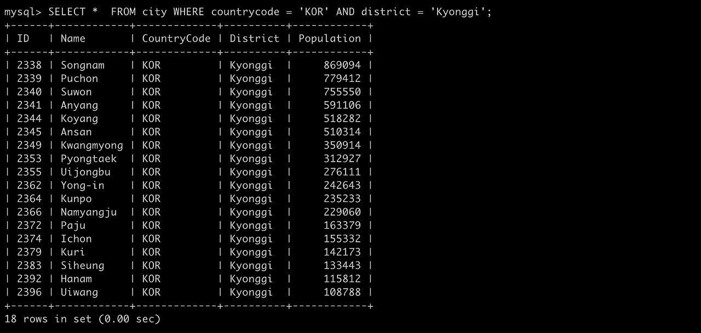

**기본 구문**

```sql
DELETE FROM 테이블명;
```

이렇게 되면 테이블 전체가 삭제되니 얘도 역시 조건을 걸어줘서 특정 행만 삭제해야한다. 이 때도 똑같이 WHERE 문 사용.

```sql
DELETE FROM 테이블명 WHERE 조건;
```

위에서 많이 설명했듯이 이 조건은 유니크해야하고, AND 로 조건을 지어주는 것 역시 가능.

**VIEW**

하나 이상의 기본 테이블이나 다른 뷰를 이용하여 생성되는 가상 테이블

말그대로 테이블에 있는 데이터를 실현하여 볼 수 있음. (SELECT 사용) 하지만 가상 테이블이기 때문에 데이터 저장 공간이 할당되지 않으며 (기억장치의 용량을 사용하지 않음) , 뷰를 제거해도 참조하는 데이터 테이블은 영향을 받지 않는다. 갱신 시에도 뷰 정의에 따른 갱신으로 한정할 수 있다.

결국 데이터 테이블에 영향을 가지지 않으면서 별도의 작업을 수행하게 한다는건데.. 왜 필요할까 찾아보니

필요한 열과 행만 사용자에게 보여줄 수 있어 사용자마다 특정 객체만 조회가 가능하다. 또한 복잡한 SELECT 문을 일일이 매번 기술하여 조회하지 않아도 된다.       
예를 들어 사원 정보 데이터 테이블이 있다면, 각 개인이 모든 사원 정보를 열람할 수 없고, 자신이 속한 팀의 테이블만 뷰를 통해서 조회를 할 수 있도록 하는 것!

- 뷰를 작성할 때는 CREATE VIEW 를 쓴다.

```sql
/* city 데이터테이블에서 countrycode = 'KOR' AND district = 'Kyonggi' 인 데이터들에 대한 citykyonggi 라는 view 를 생성할 건데, 
모든 열을 가져오지 않고 id,name,population 만 가져와서 만들어줘 */
CREATE VIEW citykyonggi AS SELECT id,name,population FROM city WHERE countrycode = 'KOR' AND district = 'Kyonggi';
```


이렇게 하면 뷰 완성! 참고로  AS 앞에 별칭처럼 해당 뷰의 이름을 정해줄 수 있다. 이미 같은 이름의 뷰명이 있으면 already exists 라는 오류가 뜨니 조심하자.

일단 작성한 뷰는 SQL SELECT 로 접근할 수 있고, 형태 또한 데이터테이블과 다르지 않다.

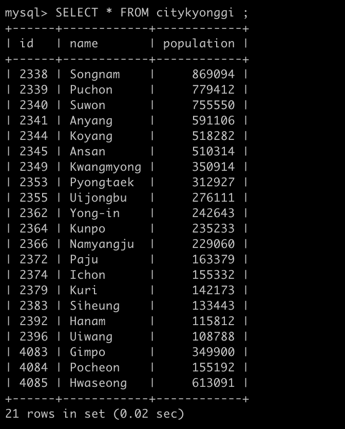

```sql
/* largecity 라는 뷰를 생성할건데, city 데이터테이블에서 population이 7백만보다 많은 뷰를 생성해줘. */
CREATE VIEW largecity AS SELECT * FROM city WHERE population > 7000000 WITH CHECK OPTION;
```


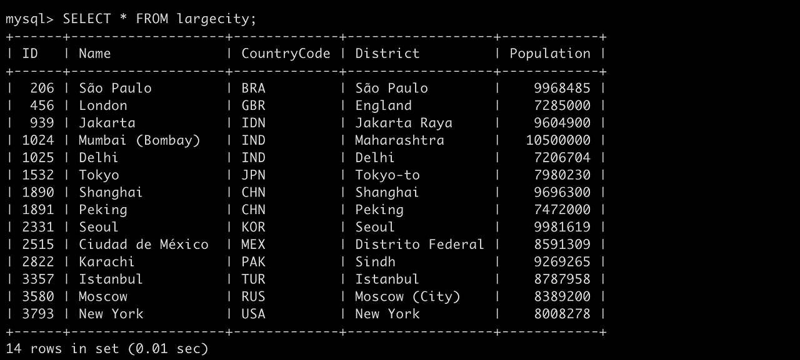

조회해보면 7백만 이상인 도시가 잘 조회된다. 

저기서 WITH CHECK OPTION 이라는 절 부연 설명.

**WITH CHECK OPTION**

WHERE문(조건문) 에 대한 칼럼에 대해서 조건에 부합하지 않는 행의 INSERT,UPDATE 등의 행동을 방지함.

```sql
/* Seoul의 인구수를 8백만으로 변경 */ 
UPDATE largecity SET population = 8000000 WHERE district = 'Seoul' ;
```


얘는 7백만 이상이라는 뷰의 조건문에서 참이기 떄문에 수행이 잘 되는 것을 볼 수 있다. 

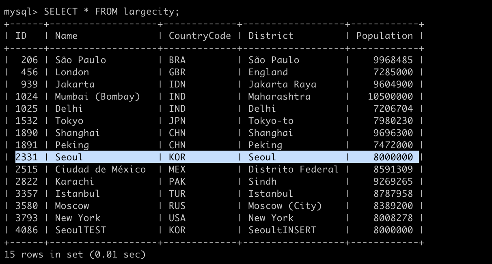

조회해보면 반영이 잘 된 것도 볼 수 있다. 그러면 7백만 이상이 아닌 값을 넣게 된다면 ?

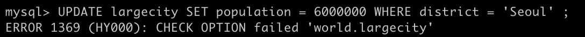

7백만 이하인 6백만을 넣어서 UPDATE 를 수행했더니 CHECK OPTION falid 라는 에러를 띄우면서 반영되지 않는다!

이제 INSERT

```sql
/*test 값 INSERT*/
INSERT INTO largecity VALUES (DEFAULT,'SeoulTEST', 'KOR','SeoultINSERT',8000000);
```

서울테스트라는 나라를 넣어주어씀 인구는 8백만.

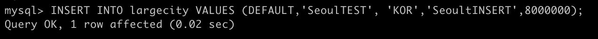

잘 들어가고

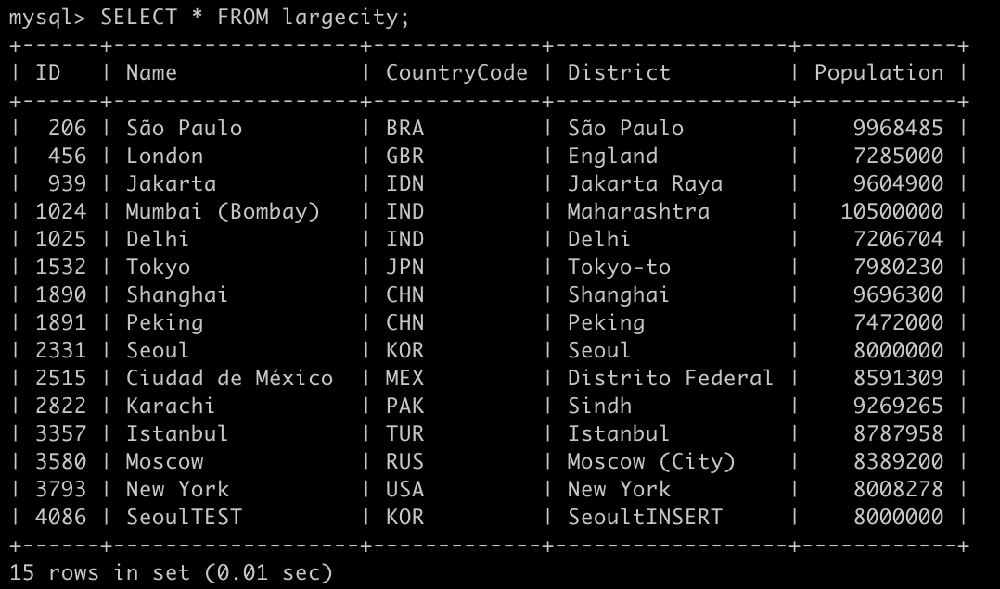

잘 반영도 된다. 

```sql
INSERT INTO largecity VALUES (DEFAULT,'SeoulTEST', 'KOR','SeoultINSERT',6000000);
```

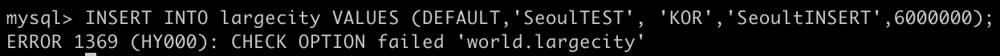

이번엔 6백만 인구의 서울테스트를 넣어보면 역시나 CHECK OPTION failed error 발생! 

**공식 문서 참고**

https://dev.mysql.com/doc/refman/8.0/en/view-check-option.html

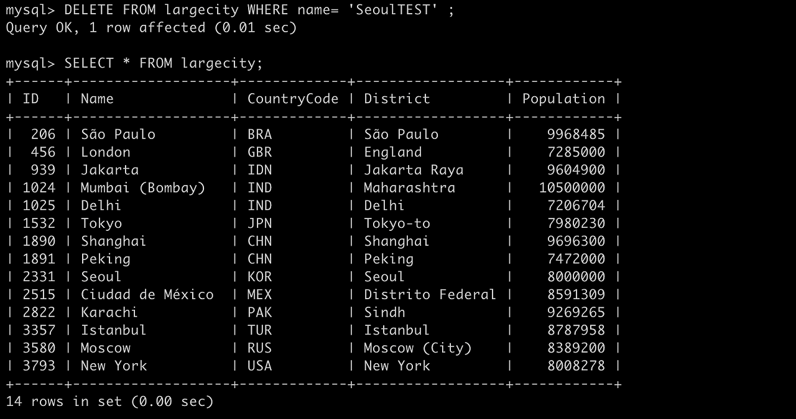

DELETE 로 test 지우고 다시 이제 책 진도에 따라 서브쿼리를 실행해보자!

**서브쿼리의 실행이란**

통상적으로 SELECT 문의 결과는 택한 열과 행으로 구성된 테이블 형식이다. 특수한 형태로 하나의 열과 하나의 행을로 구성된 테이블, 즉 단일값으로 구성된 경우가 있다. SQL 문에서는 이런 SELECT 문의 결과를 마치 데이터처럼 다루거나 수치처럼 취급해 조건문에 이용할 수 있다. 이런 쿼리를 메인 쿼리와 대비해 서브쿼리라 부른다. DBMS 마다 다를 수 있으니 참고!

```sql
 /* countrycode 가 'KOR' 인 citykorea 뷰 생성 */
CREATE VIEW citykorea AS SELECT id, name, district, population FROM city WHERE countrycode = 'KOR';

/* 평균 population보다 인구수가 많은 도시들을 세어줘. */
SELECT COUNT(*) FROM citykorea WHERE population > (SELECT AVG(population) FROM citykorea);
```

여기서 AVG(population) 이 서브쿼리 값이며, 이를 통해 하나의 조건 처럼 평균값보다 인구수가 높은 도시들을 세어서 나타낼 수 있다.

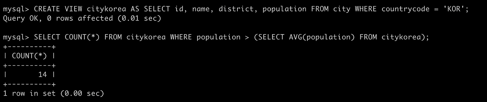

```sql
/* citykorea 데이터테이블에서 district,name, population만 SELECT 한 값을 c1이라고 부르고, 인구수 평균값(AVG(population)) 을 c2라 부름.
c2.district (평균값의 district)와 같은 c1.district 의 값을 district 별로 그룳별로(GROUP BY) 묶어서 조회할게.*/
SELECT district,name, population FROM citykorea AS c1 WHERE population > (SELECT AVG(population) FROM citykorea AS c2 WHERE c1.district = c2.district GROUP BY district);
```

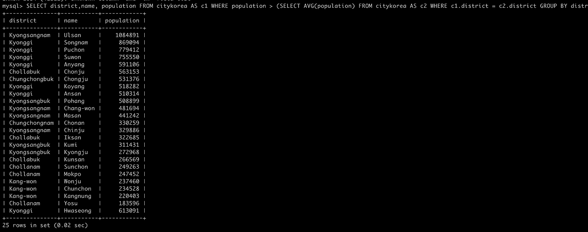

이렇게하면 행정구역안의 도시를 그룹별로 추리고, 그 다음 도시 인구 평균을 얻고, 인구 평균보다 큰 도시를 뽑아내야한다는 처리를 행정 구역마다 실행해야 하는데, 한번에 가능하게 할 수 있음! 정렬 옵션을 쓰려면 ORDER BY 쓰면 된다.      
자 이제 결합 하나만 남았다..! 어우..헷갈리는 개념인 것 같은데 지금까지는 하나의 단일 테이블 내에서 많은 것을 수행헀다면 이제는 복수 테이블간 말그대로의 결합을 말한다.

**결합이란**

2개 이상의 테이블을 대상으로 실행하는 것도 가능하다. 이를 결합이라 부르는데, 단순히 설명하면 하나의 테이블에 있는 열만으로는 데이터가 충족되지 않는 경우에 다른 테이블에서 열을 가져오는 조작. 결합 조건을 지정하여 가져오고, 결합에도 여러 가지 변형이 있는데 책에서는 내부결합, 외부결합을 다루고 있다.

countrylanguage 테이블에는 각 국가에서 사용하는 언어가 등록되어 있고, 한국에서 사용하는 언어를 조회해보면

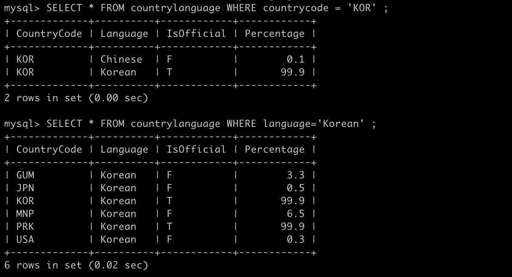

이렇게 각각 countrycode 와 language 로 조회하면 이러한 결과가 나온다.

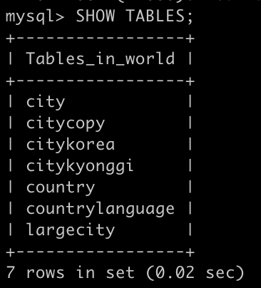

위의 조회한 결과가 countrycode 가 3글자로 되어 있어 잘 모르니까 country 테이블과 결합하여 한번 국가명을 검색해보자.

```sql
/* countrylanguage 테이블의 모든 컬럼에 country.name 값을 결합해서 가져올건데,countrylanguage.countrycode와 country.code가 같고, language 가 'Korean' 인 값으로 가져와줘. */
SELECT countrylanguage.*, country.name FROM countrylanguage INNER JOIN country ON countrylanguage.countrycode = country.code WHERE language = 'Korean' ;
```

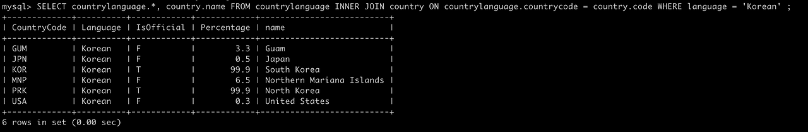

이렇게 가져오면 country의 name 값이 countrylanguage 와 결합하여 보여주게 되어 countrycode 가 GUM 인 나라는 Guam이라는 이름을 가진 나라라는 것을 확인 할 수 있다.

이렇듯 내부결합의 기본 형식은

```sql
SELECT 선택하고 싶은 열 리스트 FROM 첫 번째 테이블명 INNER JOIN 두 번째 테이블명 ON 결합 조건;
```

여기서 countrylanguage.* , coutry.name 이라고 적어주었듯이, 각 값이 어느 테이블 값인지 명확히 할 수 있다. 2개의 테이블에 똑같은 이름의 열이 있는 경우에는 데이터를 구분하기 위해 필수이고, 한쪽 테이블에만 존재하는 값이라면 생략해도 좋지만 잘 알아볼 수 있게 저렇게 적어주는 게 좋을 듯 함. (일단 책에서는 WHERE절 뒤에 있는 lanuage = 'Korean' 에서 country.language이라고 적지 않고 생략했음. language는 country 테이블에만 있는 값이기 때문)

또한 쿼리에도 있듯이 결합한 결과에 대해서는 보통의 단일 테이블 조작과 동일하게 WHERE, OREDER BY, LIMIT, GROUP BY, HAVING 등을 지정할 수 있다.

내부 결합에서는 2개의 테이블에서 결합 조건에 일치하는 것만을 얻어냈는데, 실무에서는 한 쪽 테이블을 기준으로 전체 행을 표시하고 다른 테이블은 값이 있으면 표시하고 싶은 경우가 자주 있다.        
예를 들어, 기준으로 삼을 테이블의 행수를 고정해 화면에 표시하고 싶을 때나 업무 흐름에서 우선은 기준이 되는 테이블에 데이터를 등록하고 세부사항은 다른 테이블에 순차적으로 저장하고 싶은 경우 등이다. 이럴 때 외부 결합을 이용한다.

외부 결합의 기본 형식은

```sql
SELECT 선택하고 싶은 열의 리스트 FROM 첫 번째 테이블명 LEFT OUTER JOIN 두 번째 테이블명 ON 결합 조건 ;
```

내부 결합과 비교하면  INNER -> LEFT OUTER 만 바뀐 형태. 이에 따라 LEFT, 즉 2개의 테이블 중 첫 번째 테이블의 전체 행이 표시되고, 두 번째 테이블의 행 데이터는 결합 조건과 일치할 때 그 값이 되고 일치하는 값이 없을 경우 'NULL' 이 된다.     
여기서는 왼쪽 테이블을 기준으로 했지만, 두 번째 테이블을 기준으로 삼는 것도 가능한데, 이 때는 'RIGHT OUTER JOIN' 이라고 쓴다.

책에서 설명한 예시대로 인공언어인 Esperanto 를 등록해보자.

```sql
INSERT INTO countrylanguage(countrycode, language) VALUES('abw', 'Esperanto');
```

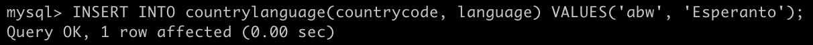

이후 외부 결합을 사용하여 이렇게 나타낼 수 있다.

```sql
/* countrylanguage.*, country.nam을 선택해서 보여줄건데,countrylanguage 테이블에 country를 결합할 때 countrylanguage.countrycode 가 country.code 와 같고, language = 'Esperanto' 인 데이터를 보여줘. 없으면 안보여주면 됨. */
SELECT countrylanguage.*, country.name FROM countrylanguage LEFT OUTER JOIN country ON countrylanguage.countrycode = country.code WHERE language = 'Esperanto';
```

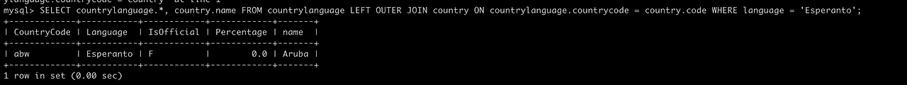

실행 창에는 이렇게 국가 Aruba 가 사용한다고 나오지만 , 0% 더미 값인 것을 확인할 수 있다.

**내부결합**

조건에 맞는 테이블의 행들만 결합하여 가져옴.

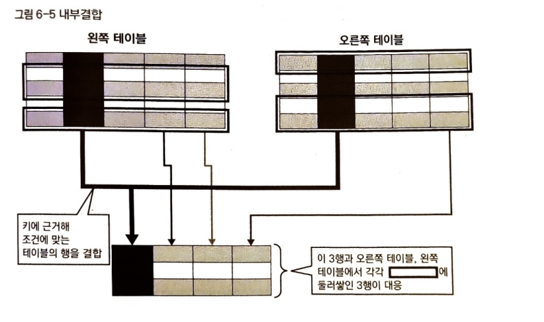

**외부결합**

결합 조건과 일치하는 것이 없으면 NULL 처리.

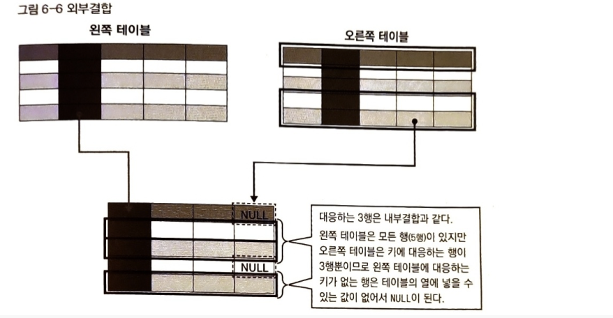

---

### Reference

> [\[데이터베이스 첫걸음\]](https://www.yes24.com/product/goods/32613394)