## 7장. 트랜잭션과 동시성 제어

### 트랜잭션이란

일반적인 DBMS 에서의 애플리케이션 로직을 구성할 떄 사용하는 트랜잭션이나 잠금 구조를 다루고 있다.       
앞 장 6장에서는 테이블 갱신을 수행하기 위해 'INSERT/DELETE/UPDATE' 를 사용했는데, 갱신은 단일 쿼리만으로 구성된 것이 아니고 복수 쿼리를 연속적으로 수행하는 경우가 대부분이다.      
또한, 갱신 전의 데이터로 SELECT 를 사용할 때 이를 포함해 복수 쿼리를 일관된 형태의 한덩어리로 다뤄야 한다.      
트랜잭션이란 이런 복수 쿼리를 한 단위로 묶은 것이다.

MYSQL 에서는 트랜잭션을 사용할 수 없는 단순한 구조의 'MyISAM'형 과 일반적인 DBMS와 똑같은 트랜잭션 구조를 사용할 수 있는 InnoDB형 2종류의 테이블을 이용할 수 있다.      
책에서는 트랜잭션을 사용하기 위해 InnoDB형 테이블을 작성한다.

이제 실제 트랜잭션을 다룰 수 있는 테이블을 작성 해보자!     
SHOW DATABASES; 명령어를 통해 데이터베이스 목록을 불러와주자.

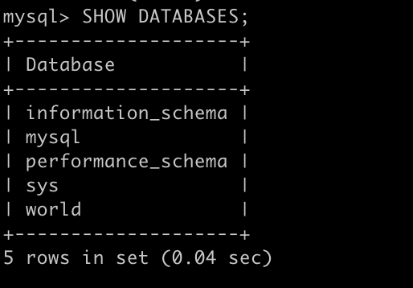

책에서 test 데이터베이스에 테이블 t1 을 생성했다.


```sql
// 디폴트로 UTF8 값을 줘서 한글을 사용할 수 있는(지금은 상관 없음) test 테이블을 생성.
CREATE DATABASE test default CHARACTER SET UTF8;
```

자 데이터베이스도 만들었겠다 이 데이터베이스 안에 테이블 하나 만들어보자.

```sql
// test 테이블 사용.
USE test;

// i1은 비어있지 않은 primart key 값인 행, v2는 길이열이 20인 문자행 생성. InnoDB 형인 테이블 t1을 생성
CREATE TABLE t1(i1 int not null primary key, v2 varchar(20)) engine = innodb ;
```

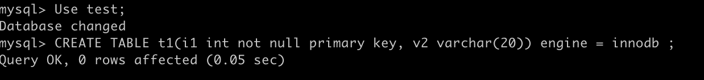

```sql
// 행을 추가해줌. (데이터를 하나 넣어줌.)
INSERT INTO t1 VALUES(1, "Firebird");

// 작성한 t1 테이블의 내용이 표시 된다. \G 는 ;과 같은 역할을 함.
SHOW CREATE TABLE t1\G
```

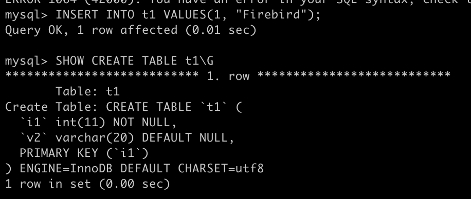

이렇게 만들어 줬으면 다른 터미널을 하나 더 켜서 MySQL 을 한번 더 접속해주자.        
복수로 실행할 수 있어서 각각 다른 클라이언트와 다른 커넥션을로 MySQL 서버에 인식된다.       

총 2개의 커넥션에서 조회하니 잘 된다!

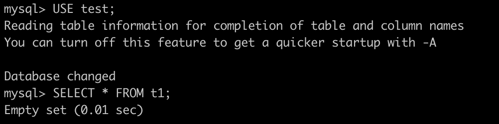

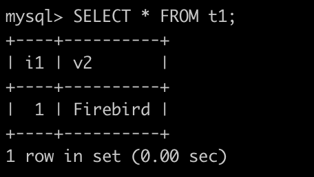

일단 이렇게 해서 트랜잭션을 다룰 수 있는 테이블을 작성해보았다.

복수의 커넥션이라기보다는 복수의 쿼리를 연속적으로 사용해 일관성 있는 형태의 한 단위로 취급하는 것이 트랜잭션!      
한 덩어리의 쿼리 처리 단위를 트랜잭션이라고 한다.

이 후에 더 자세히 복수의 커넥션에서 읽기, 쓰기를 하면서 또 실습해보자.

---

자 환경 세팅이 되었다면 다시 개념 설명!

### 트랜잭션 4가지 특성

트랜잭션은 4가지 특성으로 정의 되며 그 앞글자를 따서 'ACID 특성' 이라고 한다.

 

1. Atomicity (원자성)

데이터의 변경(INSERT/DELETE/UPDATE) 을 수반하는 일련의 데이터 조작이 전부 성공할지 전부 실패할지를 보증하는 구조다.     
만약 일련의 절차가 잘 진행되고 나면 트랜잭션에서는 모든 절차를 처리한 후에 COMMIT 을 실행해 처리를 확정한다.        
이 경우 각 데이터의 조작은 영구적으로 저장되어 결과가 손실되지 않는다.      
만약 처리 도중에 오류가 발생하는 경우는 ROLLBACK 을 실행하여 맨 처음의 직전 상태까지 되돌아갈 수 있다. 즉, 이전 상태로 돌아갈 수 있음을 의미.       
또한, 이렇게 서비스 시스템이 정상 동작하는 상황에서의 오류뿐만 아니라 클라이언트에서 서버로의 통신이 끊긴다거나 서버가 다운된 경우에도 COMMIT 된 것 이외에는 ROLLBACK 을 수행 해야 한다.

책에서는 부산-서울로 ktx 를 타고 가는 상황에 비유했다.      
과정은 총 4가지.        
그림에서 중요한 것은, 총 과정 중 하나의 과정만 에러가 났더라도 롤백을 통해 처음부터 다시 시작해야 한다는 것이다.

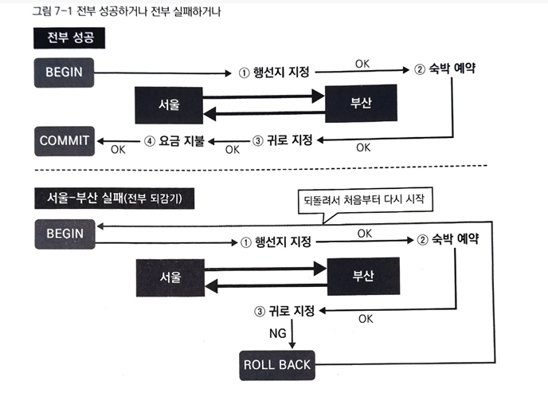

2. Consistency (일관성)

데이터베이스에서는 데이터베이스 오브젝트(테이블을 비롯해 데이터베이스 내에 정의할 수 있는 오브젝트) 에 대해 각종 정합성(일치하는 지에 대한) 제약을 추가할 수 있다.      
이는 일련의 데이터 조작 전후에 그 상태를 유지하는 것을 보증하는, 즉 일관성을 유지하기 위한 구조이다.        
예로, 시스템에 사용자를 등록할 떄 사용자를 임의로 식별하기 위해 일련번호(사용자 번호) 를 사용자에게 발급한다.       
이 때 이 번호에 유니크 제약(유일한 값인지의 제약)을 설정하면 중복된 사용자 번호를 저장할 수 없다. 이 것은 복수의 사용자가 동시에 사용자 번호를 취득하려는 경우에도 마찬가지이다.

3. Isolation (고립성 또는 격리성)

고립성(격리성) 이란 일련의 데이터 조작을 복수 사용자가 동시에 실행해도 각각의 처리가 모순 없이 실행 되는 것을 보증한다는 것이다.        
좀 더 자세히 설명하면, 중복으로 동일한 쿼리에 대해 동작을 수행했을 때, 중복으로 처리 되어 일치 하지 않는 경우를 막기 위해 후속 처리는 잠금 하여 블락 하는 것이다. 잠금 단위에는 테이블 전체,블록, 행 등이 있는데 MySQL 에서는 트랜잭션 처리를 할 때 주로 행 단위의 잠금 기능을 이용한다.

책에서는 싱글룸을 예약하는 프로세스를 예로 들어 설명했다.       
1번이 실행 될 때 2번은 잠금(COMIIT 또는 ROLLBACK, 여기서는 COMMIT)이 해제 될 때 하고, 3번이 UPDATE 되고 나면 다시 사용자 B의 1번이 실행 되는 것이다.

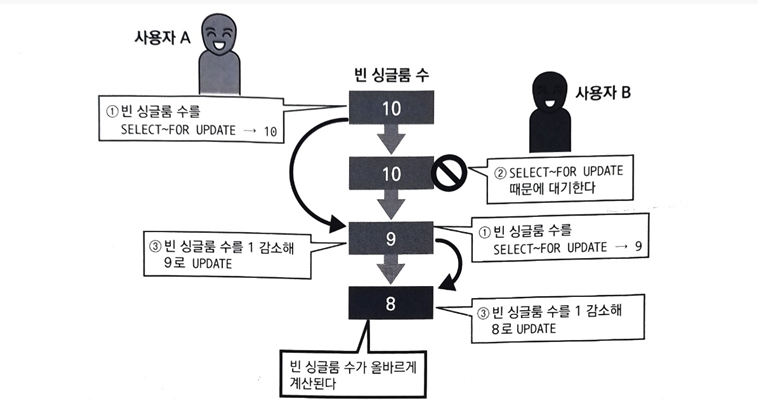

또한 InnoDB형의 테이블은 MVCC 라는 구조로 동작하기 때문에 위의 그림 예에서 사용자 B가 단순히 값을 참조하는 경우에는 SELECT에  FOR UPDATE 는 불필요 하며, 이 경우 읽기는 블록되지 않는다. 테이블을 갱신하는 사용자가 소수고 참조하는 사용자가 많은 경우에는 사용자의 동시성, 병렬성이 높아진다.

**MVCC 에 따른 MySQL 의 특성**

DBMS 의 주류가 된 Multi Versioning Concurrency Control 기술.        
MySQL은 MVCC 를 사용하기 때문에 다음과 같은 특성을 가짐.

1) 읽기를 수행할 경우 갱신 중이라도 블록되지 않는다. (읽기와 읽기도 서로 블록 되지 않는다.)
2) 읽기 내용은 격리 수준에 따라 내용이 바뀌는 경우가 있다.
3) 갱신 시 배타적 잠금을 얻는다. 잠금은 기본적으로 행 단위로 얻으며 트랜잭션이 종료할 때까지 유지한다. 격리 수준이나 InnoDB 의 설정에 따라 실제로 잠금 하는 행의 범위가 다른 경우가 있다.
4) 갱신과 갱신은 나중에 온 트랜잭션이 잠금을 획득하려고 할 때 블록된다. 일정 시간을 기다리며 그사이에 잠금을 획득할 수 없는 경우에는 잠금 타임아웃이 된다.
5) 갱신하는 경우 갱신 전의 데이터를 UNDO 로그로 '롤백 세그먼트' 라는 영역에 유지한다. 이 'UNDO 로그'는 용도가 2가진데, 첫 번째는 갱신하는 트랜잭션의 롤백 시 갱신 전으로 되돌리는 것이고, 두 번째는 복수의 트랜잭션으로부터 격리 수준에 따라 대응하는 갱신 데이터를 참조하는 데 이용한다.(같은 행을 갱신할 때마다 UNDO 로그가 작성되어 같은 행에 대한 복수 버전이 존재하며 이에 의해 1과 2를 실행한다.)

트랜잭션 A 읽기 / 트랜잭션 B 읽기 => 성공       
트랜잭션 A 읽기 / 트랜잭션 B 쓰기 => 성공       
트랜잭션 A 쓰기 / 트랜잭션 B 쓰기 => 실패

'복수의 트랜잭션이 순서대로 실행되는 경우와 같은 결과를 얻을 수 있는 상태'      
책에서는 이렇게 답하고 있는데, 병렬로 실행되는 처리를 생각하면 복잡하므로 좀 더 간단한 병렬로 실행되지 않는(직렬) 상태를 말하며,이와 같으면 모순 없을 보장할 수 없다고 한다.

그럼 결국 직렬화처럼 보이게 한다는 건데, DBMS 에서는 이것을 격리 수준으로 구현하고 제공하는 것이 '직렬화 가능' 이라는 사양이다.

하지만 직렬화 가능의 고립성에서는 항상 동시에 동작하는 트랜잭션이 1개의 이미지가 되어 성능면에서 실용적이지 않다.       
이 때문에 직렬화 가능으로부터 격리 수준을 완화해 직렬화 가능 이외에 자신이 아닌 다른 트랜잭션의 영향을 받는 것을 허용하는 4개의 단계를 ANSI 라는 규격 단체에서 정의했다.

1) 커밋되지 않은 읽기
2) 커밋된 읽기
3) 반복 읽기
4) 직렬화 가능

이 중에 4번의 직렬화 가능이 가장 엄격하며 숫자가 작아질수록 완화된 격리 수준이다.

하지만 완화된만큼 직렬화 가능 단계에서는 발생하지 않았던 현상이 생기겠지.       
현상은 총 3가지로 말할 수 있다.

1) 더티 읽기

어떤 트랜잭션이 커밋되기 전에 다른 트랜잭션에서 데이터를 읽어버리는 현상.

예를 들어 사용자 A가 하나의 값을 10에서 9로 변경하고 커밋하지도 않았는데, 사용자 B 가 9로 읽어버리는 상황이다.      
커밋을 하지 않고 확정되지 않은 상태에서 더럽혀진 데이터를 읽는 것에서 붙여진 이름이다.

2) 애매한 읽기 (DBMS 에서는 반복 불가능한 읽기라고도 한다.)

어떤 트랜잭션이 이전에 읽어 들인 데이터를 다시 읽어 들일 때 2회 이후의 결과가 1회 때와 다른 현상.

예를 들어 사용자 A 가 하나의 값을 10으로 읽고 그 이후에 사용자 B가 값을 9로 바꾸고 커밋했다면, A는 계속해서 값을 읽는다고 가정할 때, SELECT 2회 이후에는 최초 SELECT 의 값인 10은 보증되지 못한채로 9를 읽게 될 것이다.     
이러한 현상이 애매하다고 생각하고 붙여진 이름이다.

3) 팬텀 읽기

어떤 트랜잭션을 읽을 때 선택할 수 있는 데이터가 나타나거나 사라지는 현상.

예를 들어 사용자 A가 범위 검색을 수행해서 총 3행을 읽었다고 가정했을 때, 사용자 B가 그 데이터 범위에서 1행을 INSERT (추가) 도 하고, 커밋도 했다고 해보자.       
그렇다면 사용자 A 는 최초 1회의 3행과는 다르게 이후 반복적으로 범위 검색 시 4행이 선택 될 것이다.       
유령처럼 데이터가 나타나고 사라진다고 해서 붙여진 이름이다.

따라서 각 단계에 따라 3개의 현상이 순차적으로 적게 나타난다.

1) 커밋되지 않은 읽기
=> 더티 읽기, 애매한 읽기, 팬텀 읽기

2) 커밋된 읽기
=> 애매한 읽기, 팬텀 읽기

3) 반복 읽기
=> 팬텀 읽기

4) 직렬화 가능
=> 모두 해당 없음

4. Durability (지속성)

지속성은 일련의 데이터 조작(트랜잭션 조작) 을 완료(COMMIT) 하고 완료 통지를 사용자가 받는 시점에서 그 조작이 영구적이 되어 그 결과를 읽지 않는 것을 나타냄.     
이 것은 시스템이 정상일 때 뿐만이 아니라 데이터베이스나 OS의 이상 종료, 즉 시스템 장애도 견딜 수 있다는 말이다.     
MySQL 을 포함해 많은 데이터베이스의 구현에서는 트랜잭션 조작을 하드 디스크에 '로그' 로 기록하고, 시스템에 이상이 발생하면 그 로그를 사용해 이상 바생 전의 상태까지 복원하는 것으로 지속성을 실현하고 있다.

### 커넥션이란 

용어대로 애플리케이션과 데이터베이스의 연결을 뜻하는 것으로 애플리케이션에서 데이터베이스에 접속하고 종료하는 일련의 과정을 의미한다. (앞의 5장에서 말했던 데이터베이스와 연결 되었다는 말과 일맥상통한다.)

동시에 커넥션이 늘어날수록 데이터베이스를 연결하고 종료하는 일련의 과정이 늘어나기 때문에 시스템에 많은 부하를 준다.

### DDL

데이터 정의 언어.
DDL은 데이터를 저장하는 그릇인 스키마(데이터베이스) 또는 테이블 등을 작성하거나 제거한다.
DDL 로 구분된 명령에서는 앞선 장에서 썼던 CREATE(데이터베이스 테이블 생성) , DROP (CREATE 로 작성한 것을 제거), ALTER(CREATE 로 작성한 것을 변경) 등이 있다.

### DML 

데이터 조작 언어.       
DML은 테이블의 행을 검색하거나 변경하는 데 사용할 수 있다.      
우리가 익숙하게 다뤄왔던 SELECT, INSERT, UPDATE, DELETE 가 DML 에 해당!     
실무에서 가장 많이 사용하는 언어는 DML 이겠군.      
책에서도 가장 많이 사용하는 SQL 문은 DML 이라고 정의하고 있다.

### DCL

책에서는 DCL 도 설명하고 있는데, 이는 데이터 제어 언어를 뜻한다.    
데이터베이스에서 실행한 변경을 확정하거나 취소하는 데 사용한다.         
이번 장에서 설명한 COMMIT, ROLLBACK 등이 이에 해당한다.

자, 다시 돌아와서 위의 언어들로 작성된 데이터 저장은 커밋되기 전까지는 다른 커넥션에서 보이지 않는데, 이에 상관 없이 다른 커넥션에서 보이는 이유가 있다.

1) DDL 에 따른 암묵적인 커밋

MySQL, Oracle 에서는 CREATE TABLE 과 같은 DDL 실행 시 암묵적인 커밋이 동시에 발행된다.      
이 때문에 한 개의 커넥션에서 실행된 CREATE TABLE이 성공하면 그 이후에는 다른 커넥션에서도 참조할 수 있게 된다.

2) 오토커밋 설정

트랜잭션의 개시(BEGIN TRANSACTION, START TRANSACTION, SET TRANSACTION 등) 가 명시적으로 지정되지 않았을 때 트랜잭션을 구별하는 방법으로 다음과 같이 2가지 모드가 있다.

a. 하나의 SQL 문이 하나의 트랜잭션으로 구분된다. (오토 커밋 모드)       
b. 사용자가 COMMIT 또는 ROLLBACK 을 실행하기까지가 하나의 트랜잭션이 된다.

일반적인 DBMS 에서는 어느 모드도 선택할 수 있다. 기본 설정이 오토커밋 모드인 DBMS로는 MySQL, PostgreSQL, SQL Server 등이 있다.

이번 장의 실습에서는 1번이면서 동시에 2의 A인 즉 오토 커밋 모드였기 떄문에 다른 커낵션에도 INSERT 한 후 바로 테이블과 데이터를 확인할 수 있었던 것!

---

자 위에서는 트랜잭션을 다룰 수 있는 환경을 세팅했으니, 이제 복수 커넥션에서 읽기와 쓰기를 실습해보자!       
위에 정리했던 MVCC 에 따른 MySQL 특성과도 이어지는 내용임.

각 커넥션에서 읽기 , 쓰기를 통해 어떻게 보이는지 실습하는 것이다.            
자 아까 세팅했던 대로 터미널 (프롬프트) 2개 준비!           
헷갈리지 않게 프롬프트도 A B 로 구분 될 수 있게 세팅했다.

```bash
// mysql 이 아닌 Transaction A 또는 B 로 프롬프트 세팅하기. (B 는 A 부분 하나만 바꿔주면 된다.)
PROMPT Transaction A>
```

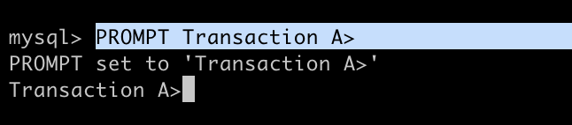

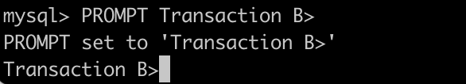

그럼 각각 이렇게 보일 것임.             
자 또 각 프롬프트에 세미콜론으로 구분지어서 복수의 명령을 실행하게 만들자.

```sql
// test 테이블에서 트랜잭션 실행
USE test; START TRANSACTION;
```

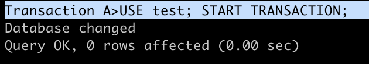

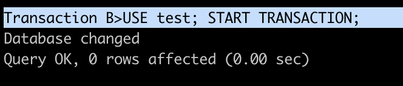

각 커넥션에서도 t1 테이블 조회해보기.

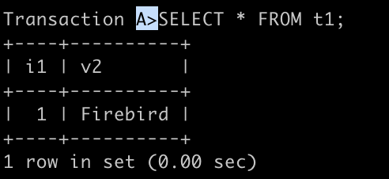

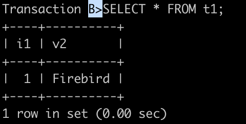

똑같다 이제 롤백 해보자!

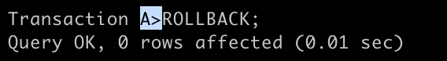

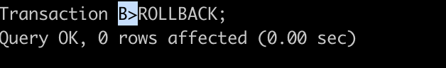

이제 각 시나리오에 맞게 각 커넥션에서 읽기와 쓰기를 하자!       
캡쳐 이미지로는 더 헷갈리니 코드창을 보고 맨 밑줄인 결과 값만 캡쳐하겠다.

```bash
// 각 커넥션에서 입력.
Transaction A> START TRANSACTION;
Transaction B> START TRANSACTION;


// B 에서 행을 추가하고 커밋 후, A 에서 데이터 보기.
Transaction B> INSERT INTO t1 VALUES(2,'MySQL'); COMMIT; START TRANSACTION;
Transaction A> SELECT * FROM t1;
```

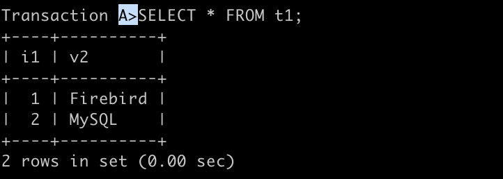

B에서 추가했는데 A 에서 보인다.

```bash
// B 에서 행을 추가하고 커밋 후, A 에서 데이터 보기.
Transaction B> INSERT INTO t1 VALUES(3,'PostgreSQL'); COMMIT; START TRANSACTION;

// B 에서 추가한 데이터가 A 에서도 조회됨.
Transaction A> SELECT * FROM t1;

// A 롤백.
Transaction A> ROLLBACK;

(4번 데이터 저장, 트랜잭션 명령어를 수행하지 않았으므로, B에서만 보이게 되고, A에서는 보이지 않음. )
Transaction B> INSERT INTO t1 VALUES(4,'Oracle'); 
Transaction A> SELECT * FROM t1;

// B 롤백.
Transaction B> ROLLBACK;
```

```bash
// B 에서 넣은 숫자 값이랑 같은 5번 데이터를 A에도 넣으려 시도하고 50초 정도 기다려보자.
Transaction B>INSERT INTO t1 VALUES(5,"JavaDB");

Transaction A>INSERT INTO t1 VALUES(5,"hsDB");
```

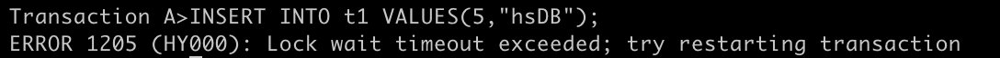

```bash
Transaction A> ROLLBACK;
Transaction B> ROLLBACK;
```

격리 수준 바꿔서 실습해보기..!

```bash
// A 격리수준을 반복 읽기.
Transaction A> SET TRANSACTION ISOLATION LEVEL REPEATABLE READ; START TRANSACTION;
// B 격리수준을 커밋된 읽기로 변경.
Transaction B> SET TRANSACTION ISOLATION LEVEL READ COMMITTED; START TRANSACTION;


// C 트랜잭션 시작.
Transaction C>USE test; START TRANSACTION;
// C MySQL 값 UPDATE 함.
Transaction C>UPDATE t1 SET v2='MySQL' WHERE i1 = 1; COMMIT;START TRANSACTION;

// A,B 결과를 확인한다. (둘 다 1, MySQL 로 조회.)
Transaction A>SELECT * FROM t1 WHERE i1= 1;
Transaction B>SELECT * FROM t1 WHERE i1= 1;

// 다시 C 에서 UPDATE 수행 후 커밋, 트랜잭션 순차적으로 실행.
Transaction C>UPDATE t1 SET v2='PostgreSQL' WHERE i1 = 1; COMMIT;START TRANSACTION;


//트랜잭션 없이 C 값 UPDATE.
Transaction C>UPDATE t1 SET v2='Oracle' WHERE i1 = 1;


// 각각 1의 값 조회
Transaction A>SELECT * FROM t1 WHERE i1 = 1; // MySQL, MySQL,MySQL...
Transaction B>SELECT * FROM t1 WHERE i1 = 1; // MySQL, PostgreSQL,PostgreSQL..
Transaction C>SELECT * FROM t1 WHERE i1 = 1; //Oracle


// 롤백 실행.
// 전부 PostgreSQL로 조회
Transaction A> ROLLBACK; 
Transaction B> ROLLBACK;
Transaction C> ROLLBACK;
```

실습 한 번 해보고 각 격리 수준별 뱉어내는 외관 값이 다른 것에 대해 자세히 책에서 설명하고 있다.
MySQL 격리 수준의 기본 값은 '반복 읽기' 이다.

**반복 읽기 (Transaction A 결과)**

최초 쿼리를 실행한 시점에 커밋된 데이터를 읽어 들임.        
이 시점에서는 커밋된 읽기와 같다. 같은 쿼리를 복수 회 실행하면 최초 읽은 내용의 결과 세트가 반환된다.       
복수 회의 쿼리 실행 사이에 다른 트랜잭션이 커밋했어도 그 내용은 반영 되지 않는다.

**커밋된 읽기(Transaction B 결과)**

쿼리를 실행한 시점에서 커밋된 데이터를 읽어 들임.       
같은 쿼리를 복수 회 실행하면 그 사이에 다른 트랜잭션에서 커밋할 때가 있는데, 이 경우 최신 쿼리의 실행 개시 시점에서 커밋된 데이터를 읽는다.

**갱신을 수행하는 트랜잭션 자신(Transaction C 결과)**

갱신 (UPDATE) 을 수행하는 트랜잭션 자신은 트랜잭션 격리 수준이나 COMMIT/ROLLBACK 에 상관 없이 자신이 수행헀던 갱신을 즉시 볼 수 있다.

여기에서 커밋되지 않은 읽기는 실습으로 다루지 않고 있는데, 이 격리 수준이 별로 필요가 없어서 사용하는 사례가 적기도 하지만 다른 이유도 있단다.          
지금은 MVCC 가 주류를 이루고 있지만, Oracle 이나 Firebird 가 구현된 시점에서는 주류가 아니었다. 그 당시 많은 데이터베이스가 잠금을 어떤 단위로 획득하는 방식에서 트랜잰셕의 고립성을 담보하고 있었기 때문. 이 경우 읽기의 시점에 따라 블록 되는 경우가 있었다. 커밋되지 않은 읽기의 경우 부정확해도 그 순간의 읽기를 블록하지 않기 때문에 매우 편리했다.

다만, MVCC 를 이용하면 읽기가 블록되는 경우가 없어서 이러한 편리성을 가진 커밋되지 않은 읽기가 필요하지 않아졌기 때문!

---

잠금 타임아웃과 교착 상태를 시험하는 것으로 넘어가자..!

### 잠금 화면 상태 만들기

```sql
// A 에 잠금 타임아웃 설정.
Transaction A>SET INNODB_LOCK_WAIT_TIMEOUT = 5;

//트랜잭션 실행.
Transaction A>START TRANSACTION;
Transaction B>START TRANSACTION;

// 실행 후 5초 정도 기다리기.
Transaction B>INSERT INTO t1 VALUES(6,"Oracle");
Transaction A>INSERT INTO t1 VALUES(6,"Oracleeee");

// A에서 에러 뜸.
ERROR 1205 (HY000): Lock wait timeout exceeded; try restarting transaction
```

### 잠금 타임아웃이란

'갱신' 과 '참조' 는 서로를 블록하지 않지만, '갱신'과 '갱신'이 부딪히는 경우에는 나중에 온 갱신이 잠금 대기 상태가 된다.     
잠금을 건 쪽이 언제 잠금을 풀지 알 수 없어서 잠금 해제를 기다리고 있는 쪽에서는 잠금을 기다리거나 기다리지 않거나, 기다린다면 어느 정도 기다릴지를(초수 지정이나 무한으로 기다린다.) 설정할 수 있다.

MySQL 같은 경우는 'innodb_lock_wait_timeout' 이란 시스템 변수로 다음과 같이 설정할 수 있다.     
다만 기다리지 않는 설정은 없어서 유효값은 1초 이상이어야 한다.

```sql
mysql > set innodb_lock_wait_timeout = 1;
```

이 때 잠금 대기로 타임아웃이 발생하는 경우 DBMS 로부터 롤백되는 단위가 다를 때가 있는데, 해당 트랜잭션 전체를 롤백하는 경우와 쿼리만 롤백하는 것이다.       
MySQL 에서는 잠금 대기로 타임아웃이 발생하면 롤백되는 것은 기본으로 오류가 발생한 쿼리이다.     
트랜잭션 전체를 롤백하고 싶다면 다음과 같은 방법이 존재한다.

- 타임아웃 오류 후 명시적으로 ROLLBACK 을 실행한다.
- innodb_lock_wait_timeout 시스템 변수를 설정한다.

이번에는 실습으로 교착 상태 만들기.

```sql
// A에 테이블 a,b 생성.
Transaction A>CREATE TABLE a(i1 INT NOT NULL PRIMARY KEY, v2 VARCHAR(20)) ENGINE = innodb;
Transaction A>CREATE TABLE b(i1 INT NOT NULL PRIMARY KEY, v2 VARCHAR(20)) ENGINE = innodb;

// A 타임아웃 및 트랜잭션 수행.
Transaction A>SET INNODB_LOCK_WAIT_TIMEOUT = 50; START TRANSACTION;

// A , B 에 데이터 행 추가.
Transaction A>INSERT INTO a VALUES(1,'Firebird');
Transaction B>INSERT INTO b VALUES(1,'MySQL');

Transaction A>INSERT INTO b VALUES(1,'Firebird');
Transaction B>INSERT INTO a VALUES(1,'MySQL');
// B 에러 발생.
ERROR 1213 (40001): Deadlock found when trying to get lock; try restarting transaction
```

### 교착 상태란

예를 들어 트랜잭션 A가 테이블 a의 잠금을 얻고 트랜잭션 B가 테이블 b의 잠금을 얻었다고 가정했을 때,      
이 잠금을 유지한 채 서로 잠금을 건 자원에 잠금이 필요한 처리(INSERT/UPDATE/DELETE) 를 실행하면 아무리 기다려도 상황이 바뀌지 않는 상태가 된다. 이를 교착 상태라 한다.

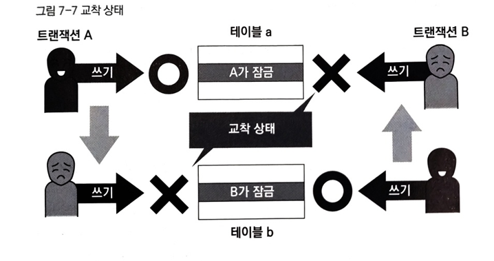

잠금 타임아웃의 경우에는 일정 시간을 기다리면 타임아웃이 해제 되어 개선될 수 있지만, 교착 상태의 경우 상황이 개선될 수 없다. 이 때문에 일반적인 DBMS 에서는 교착 상태를 독자적으로 검출해 교착 상태를 보고한다.             
MySQL 에서도 교착 상태가 일어나면 이를 즉시 인식해 시스템에 영향이 작은 쪽의 트랜잭션을 트랜잭션 개시 시점까지 롤백하게 된다.

교착 상태의 경우 일반적인 데이터베이스에서 발생할 가능성이 있으며, 모두 제거할 수는 없다. 따라서 애플리케이션 쪽에서는 항상 교착 상태를 일으켜 롤백되는 경우에 트랜잭션을 재실행할 수 있는 구조로 만들어야 한다.

대책으로는 아래의 사항이 있다.

### DBMS 전반적인 대책

- 트랜잭션을 자주 커밋한다. 자주 커밋할 수록 트랜잭션은 작은 단위가 되어 교착 상태의 가능성을 낮춘다.
- 정해진 순서로 테이블 또는 행에 엑세스하게 한다. 순서가 애초에 꼬이지 않게 하여 복잡한 상태를 만들지 않는다.
- 필요 없는 경우에는 읽기 잠금 획득 (SELECT ~ FOR UPDATE 등) 의 사용을 피한다.
- 쿼리에 의한 잠금 범위를 더 좁히거나 잠금 정도를 더 작은 것으로 한다. 
- 한 테이블의 복수 행을 복수의 연결에서 순서 변경 없이 갱신하면 교착 상태가 발생하기 쉬우므로 동시에 많은 연결에서 갱신 때문에 교착 상태가 자주 발생한다면, 테이블 단위의 잠금을 획득해 갱신을 직렬화하면 동시성은 떨어지지만 교착 상태는 회피할 수 있어서 전체적으로 봤을 때 좋을 수도 있다.

### MySQL(InnoDB) 의 대책

- 테이블에 적절한 인덱스를 추가해 쿼리가 이를 이용하게 한다. 인덱스가 사용되지 않는 경우에는 필요한 행의 잠금이 아닌 스캔한 행 전체에 대해 잠금이 걸리게 된다.

교착 상태는 클라이언트에서 롤백된 트랜잭션의 오류, 서버에서 오류 로그나 명령으로 확인할 수 있다. 이러한 상황이 일어날 수 있다고 자각하고 트러블을 해결하는 것이 좋다는 것이 책의 의견이다!

**해서는 안되는 트랜잭션 처리**

- 오토커밋을 주의하라

    - 간단한 실행 및 테스트는 편하지만, 큰 동작을 수행하는 경우 커밋 부하가 매우 높음. 적절히 사용해야 할 것.

- 긴 트랜잭션

    - 긴 트랜잭션은 데이터베이스 트랜잭션의 동시성이나 자원의 유효성을 저하한다.

- 대량 처리를 한 개의 트랜잭션이 실행한다.
    - 신규 테이블에 데이터를 로드할 때는 1만 건당 커밋해보기. (잘게 쪼개기)

- 아무것도 하지 않는 트랜잭션을 유의한다.

- 트랜잭션 중에 대화 처리를 넣는다.

- 처리 능력 이상의 트랜잭션 수

    - 하드웨어 성능에도 좌우되는 항목. MySQL 에서는 데이터베이스 서버의 커넥션 수 상한을 설정하는 'max_connections' 라는 시스템 변수가 있어서 이걸로 조절 가능

---

### Reference

> [\[데이터베이스 첫걸음\]](https://www.yes24.com/product/goods/32613394)