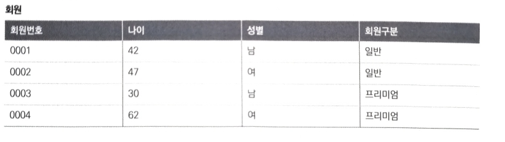
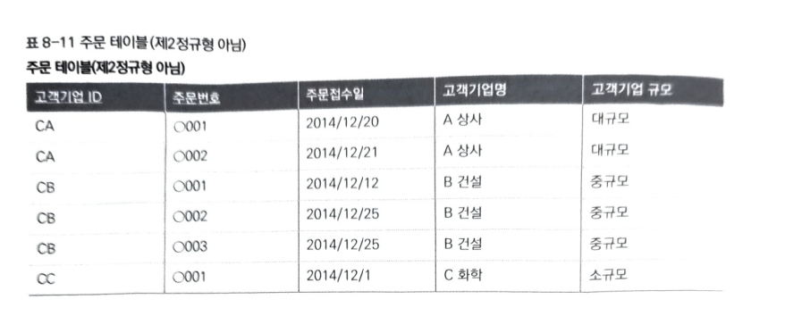
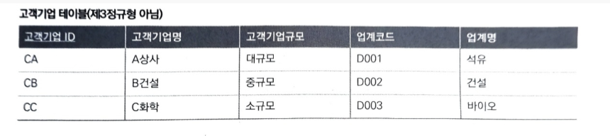
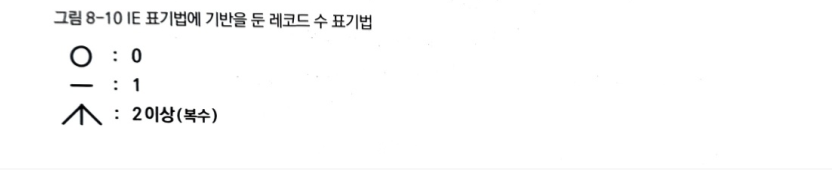

## 8장. 테이블 설계의 기초

관계형 데이터베이스에서는 테이블에 데이터를 저장하고 관리한다. 다양한 데이터를 작성하려면, 어떠한 기준에 따라 작성해야 하는데 이를 '테이블 설계' 라 한다.       
이 때 중요한 것이 '집합' 과 '함수' 이다.        
해당 장에서는 집합, 함수의 각 개념을 다루고 있다.

### 데이터를 관리하는 그릇, 테이블

관계형 데이터에서 데이터를 관리하고 저장하기 위한 그릇은 '테이블' 뿐이고, 다른 곳은 없다.       
즉, 전체 데이터가 테이블에 포함되고 저장된다는 것을 의미한다.       
실제 업무를 하게 되면 수백 개에서 천 개가 넘는 데이터 테이블을 관리할 수도 있을텐데, 어떠한 기준 없이 테이블을 작성한다면 데이터가 어디에 들어가 있는지도 모를테고 장기적으로 운용이 불가할 것이다.     
실제로 허술한 테이블 설계로 인해 데이터에 모순이 생기는 문제가 끊이지 않고 일어나고 있다.

### 관계형 데이터베이스가 주류가 된 이유

시스템에서는 데이터베이스에 저장된데이터가 전부라서 이 것이 잘못된 경우에는 이에 기반을 둔 모든 처리 결과가 부정확해진다.       
따라서 데이터의 정합성은 매우 높은 단계로 요구 된다. 데이터의 정합성을 높이기 위한 설계 노하우가 매우 발달한 관계형 데이터베이스가 표준 데이터베이스로 자리 잡은 이유이기도 하다.

이번 장에서는 노하우의 핵심이 되는 '테이블' 이란 데이터 구조의 본질을 먼저 학습하게 된다.       
추가로, 본질을 바탕으로 한 설계 기법인 정규형과 지원 도구인 ER 다이어그램 기술을 배워볼 수 있다.

### 테이블 설계는 논리의 세계

테이블 설계를 논리 설계란 말로 부르는 경우가 있다.      
2장에서 언급한 아키텍쳐 설계를 물리 설계의 일부로 부른 것과 쌍을 이루는 말이다.     
여기서 논리/물리의 구분은 하드웨어와 관련이 있느냐 없느냐의 관점이다. 시스템 세계에서는 하드웨어의 세계를 '물리' , 소프트웨어의 세계를 '논리' 로 부른다.        
테이블 설계는 서버나 스토리지 같은 물리층과 관계없이 독립적으로 작성하는 것이 가능해서 논리의 세계에서 결정된다라고 간주한다.

### 테이블이란

기초부터 돌아가서, 테이블이란 하나의 2차원 표와 같다고 했었다. 테이블과 표는 매우 닮아서 양쪽 모두 열과 행으로 된 데이터 구조이다.      
하지만 실제 관계형 데이터베이스에 있어 테이블은 단순히 '형식적으로 행과 열을 가지고 있으면 된다.' 는 정도가 아니라 좀 더 내용을 동반한 조건이 필요하다.     
그 것은 바로 '테이블은 공통적인 요소의 집합이다.'  이라는 조건을 가져야 한다. 쉽게 표현하자면 테이블은 관련성 없는 것들이 이것저것 모이면 안된다는 뜻으로 해석할 수 있다.

한 줄로 정의하자면, 테이블이란 각각의 행이 어떤 공통적인 특징을 가진 집합이어야 한다.       
공통된 데이터를 가지게 되면, 각 행이 무엇을 나타내는지 한 눈에 알 수 있고 무엇의 집합인지도 알 수 있게 된다.        
이 것이 테이블 설계의 제 1 규칙이다. '테이블명은 반드시 복수형이나 집합명사로 표현해야 한다.' 라고 표현한다. (들어가는 데이터들이 공통의 집합이기 때문에 테이블명은 그 하나하나를 포괄하는 것으로 정해야 한다.)     
미국의 경우 복수와 단수가 철저하게 나눠져 있기 때문에 많이 와닿지 않을 수 있지만, 채소라면 Vegetables 와 같은 예를 들 수 있다.

### 테이블은 현실 세계를 반영한다.

위 규칙의 또 한 가지 의미는 테이블은 현실 세계를 베낀 상이다라는 것이다.        
우리는 현실을 여러 개념이나 집합으로 구별해 인식하고 있다. 예를 들어, '가늘고 길며 흰색과 녹색이고 냄비에 넣으면 맛있는 것' 을 파라고 하고 있고, '빨갛고 둥글며 먹으면 시큼하면서도 약간 달게 느껴지는 것' 을 토마토라는 이름을 붙여 이를 공통점인 '채소' 라는 집합(개념)으로 분류하고 있다.

이 분류는 사람의 인식 능력 고유한 속성이지만, 관계형 데이터베이스의 테이블에도 사람이 만든 개념이나 집합에 대응하는 형식으로 존재하지 않으면 안된다. 따라서 현실 세계에서 이름이 붙지 않은 잡다한 모음은 관계형 데이터베이스의 세계에도 존재하지 않는 것이다.

### 테이블 설계는 간단하다 ?

사실 위에서 말한 개념들과 규칙에 충실하기만 한다면 어려울 게 없다.      
물론 테이블 수가 증가하거나 테이블 간 관계성이 복잡해진다면 기술적으로 복잡한 부분이 증가한다. 하지만 기본 방침만 잘 따른다면 초보자도 비교적 괜찮은 테이블 설계를 할 수 있다.      
하지만 책에서는 모두가 요령이 좋지는 않으므로 좀 더 이 규칙을 바탕으로 한 테이블 설계의 일반 원칙을 소개하고 있다.      
또 반대로 절대로 해서는 안되는 설계 패턴(안티 패턴)도 추가로 말해주고 있다.

### 사물과 사물의 집합은 계층이 다르다

계속 책에서 테이블이란 공통점을 가진 사물의 집합을 나타낸 것이다 라는 제 1 규칙을 강조하고 있다.      
머리에 계속 집어 넣자.. 무엇이든 상자 같은 표를 만드는 것도 당연히 안티 패턴에 속한다.      
또 한 가지의 안티 패턴은 '사물과 집합의 계층성' 을 무시하는 경우에 일어난다.        
예를 들어 채소의 한 종류들인 완두콩, 토마토, 옥수수 와 같은 것들은 테이블에서 하나의 행이 될 수는 있지만 테이블 그 자체는 될 수 없다. (테이블명으로 예를 들면 좀 더 와닿을 듯.)     
이 계층성을 무시하게 되면 새로운 채소를 추가할 때마다 새로운 테이블을 만들어야 하고, (양배추 테이블, 배추 테이블 등등..) 이에 대응해 애플리케이션의 코드도 바꿔야 해서 시스템 확장성은 거의 0이 되게 된다.      
무엇을 가져야 집합이라고 간주할 것인가는 현실 세계의 문맥에 의해서 바뀌는 것으로 토마토라는 것을 토마토의 집합으로 생각하는 것도 가능하다. 이 때 '토마토' 테이블을 만드는 것은 전혀 이상하지 않다. 그렇게 되면 각 열의 데이터들은 무게나 색깔 정도가 될 수 있겠지.      
그렇지만 단순히 토마토 라는 계층성이 뚜렷한 개념을 테이블로 만드는 것은 어렵지 않다. 그렇다면 이런 예시는 어떨까 ? 



책에서 나타낸 회원 테이블이다. 이 서비스에서는 '일반' 과 '프리미엄' 회원으로 나누어 프리미엄 회원에는 등급이 높은 서비스를 제공한다고 가정한다.     
기술적으로는 위 테이블 외에도 같은 방식으로 '남성'/ '여성' 회원 테이블로 나누는 것도 , '일반'/ '프리미엄' 테이블로 나누는 것도가능하다.         
이렇듯 같은 회원 테이블의 집합을 나누는 방법에 따라 여러 가능성이 있다.     
정보가 더 많다면 테이블을 나누는 방법이 거의 무한으로 존재할 것이다.

이처럼 테이블의 구성 패턴은 자의적인 구분을 고려한다면 얼마든지 늘릴 수 있다. 관계형 데이터베이스가 인간의 인식을 반영하는 거울이라는 것은 역으로 자의적으로 개념을 만들어서 집합을 나누는 인간의 자유로운 사고도 반영한다는 것이 된다.         
이 것이 바로 데이터베이스 설계의 어려움이다. '인간 인식을 반영한다' 라는 것은 무절제한 자유도와 패턴을 허용하는 것이기도 하다.

### 가장 상위의 개념 집합으로 정리한다.

이런 경우 기본 규칙은 '가장 상위의 개념 집합'으로 정리하는 것이다.      
즉 만약 위의 회원 테이블을 정리한다면, 일반과 프리미엄의 테이블을 나눌 것이 아니라 '열' 로 표현하는 것이다. 이렇게 하는 이유는 이 테이블이 가장 애플리케이션에 대한 유연성이 있기 때문이다.         
일반 회원과 프리미엄 회원을 나누어 선택하려면 우리가 배운 SQL문인 WHERE 절로 열을 제어하면 간단히 조회할 수 있기 때문이다.      
또한 다른 조건도 WHERE 문을 사용하면 구현이 가능하다. 이처럼 WHERE 절에 조건으로 입력하는 값을 변경하는 기능을 포함하는 것은 DBMS 와 프로그래밍 언어의 기능에 따라 간단히 구현할 수 있다. 이에 비해 테이블명을 바꾸는 것은 애플리케이션에 영향이 매우 크다.

### 열이란 개체의 속성이다.

채소로 계속 예를 들면 열은 각 채소의 속성(성질, 특징) 이다.     
회원 테이블 또한 나이나 성별은 각 회원의 고유 속성이다.     
객체 지향 언어에 이미 친숙한 사람이 알기 쉽게 표현한다면, 테이블은 클래스에 해당하고, 거기서 실체화된 인스턴스는 각 행에 해당한다.      
다만, 객체지향 언어의 클래스와는 달리 테이블은 테이블 정의에서 메소드를 가지고 있지 않아서 자신이 주체적으로 액션을 일으키지 않으며, 단지 조작을 받는 수동적인 존재이다. 즉 테이블이란 '메소드를 뺀 클래스' 이다.       
실제로 마냥 엉뚱한 생각은 아닌 것이, 실제 테이블을 객체 지향 언어의 클래스로 보려는 발상은 어느정도 존재한다. 실무에 거의 쓰이지는 않겠지만 개념을 알고 있는 사람들이 대비를 해보면 좀 더 데이터 구조인 테이블을 깊게 이해할 수도 있다.

### 현실 세계에 같은 사람은 2명 있지 않다.

테이블을 클래스, 각 행을 인스턴스로 본다면 테이블에 있는 '기본키' 의 중요성도 쉽게 이해할 수 있다.      
테이블 설계 원칙의 하나로 '반드시 기본 키를 설정할 것' 이란 원칙이 있다. 이 것은 한 개 테이블의 내용에는 중복 행을 허용하지 않는다라는 의미가 된다.     
물론 한 개나 두 개의 열에서 똑같은 행은 존재할 수 있다. 회원 테이블에서의 예시에서는 나이나 성별이 일치하는 회원이 있을 수 있고, 동성동명인 사람도 찾다보면 있을 수도 있다. 하지만 전체 열이 전부 다 똑같은 경우라면 ? 이럴 때는 어느 행이 현실 세계의 어느 인물과 매칭 되는 지 알 수 없게 된다.

이름이 가나다이고 성별이 여자, 나이가 35살인 사람이 실제로 2명 존재한다면 ? 이 가나다가 저 가나다 인지 어떻게 구분할 수 있을까.     
이 것은 데이터베이스에 보관된 자신의 데이터를 찾을 수 없거나 타인의 데이터 까지 볼 수 있음을 의미하므로, 이런 중복 행을 허용하는 것은 심각한 서비스 장애와 직결된다.        
이런 사태를 피하고자 관계형 데이터베이스의 테이블에서는 반드시 레코드를 1행으로 특정할 수 있는 정보가 필요하다.     
이 것이 바로 기본키 열이다. 기본키는 한 개의 테이블에서 반드시 한 개만 존재해야 한다. 회원 테이블에서는 회원 ID 나 회원번호 같은 절대로 중복하지 않는 숫자나 문자열에 의한 기본키를 할당하는 것이 일반적이다. 

### 기본키 할당은 관리의 기본

데이터베이스 사용 여부와 관계 없이 데이터를 고유하게 식별할 수 있는 기본키를 할당하는 것은 데이터 관리의 기본이다.      
시스템과는 상관 없이 여러 서비스를 이용하면서 우리는 이 ID 를 무의식 중에 이용하고 있다.        
예를 들어 건강보험증 번호, 휴대폰 번호 등은 관계형 데이터베이스에서 기본키라고 할 수 있다.

### 기본키는 중복되면 안된다.

이러한 기본키로 사용하는 열은 중복이 발생하지 않는 값을 할당해야 한다. 즉, 유니크해야 한다.         
이런 점에서 현실 세계에서 사용하는 이름과 같은 정보는 부적절한 경우가 많다. 동성동명인 경우도 있지만, 이름이 바뀌는 경우도 있기 때문이다. 이 결함은 중복이 없는(유일성이 유지되는) 이름의 집합에서도 내포하고 있다.     
예를 들어, 대한민국의 시/도 행정구역은 전체 15개로 중복 없는 이름이 선택 되어 있지만, 미래에 행정 구역의 이름이 바뀌지 않는다는 보장은 없다. 서울이라는 이름도 고려 시대에는 존재하지 않았고 부산 광역시는 예전에 부산 직할시로 불려져 왔다.        
이름이라는 것은 우리 생각보다 유동적이고 불안정하다.

### 기본키의 값이 바뀌면 왜 곤란한가

기본키의 값이 바뀌면 곤란한 이유로는 대표적으로 2가지가 있을 수 있다.

1. 변경 후 값의 유일성을 보증할 수 없다.
2. 과거 데이터와의 결합(매칭) 이 어렵다.

에를 들어 'A' 란 이름에서 'A1' 으로 개명한 사람이 있다고 가정해보자. 이 인물의 데이터를 관리하는 테이블의 기본키가 이름이라면 이름 개명과 동시에 기본키도 같이 변경 되어야 한다.        
하지만 이미 'A1' 이라는 일름의 사람이 등록 되어 있다면 변경할 수 없다. 또 과거에 'A' 란 이름으로 SELECT 문에서 선택한 데이터에서는 'A1' 이란 이름으로는 해당하는 데이터를 발견할 수 없다. 이처럼 이름이라는 것은 장기로 볼 때 정합적인 데이터 관리를 수행하기에는 부적합한 기본키이다.

결국 데이터 관리는 등록한 그 시점에서만 정합성이 있어야 하는 것이 아닌 장기적으로 정합성을 얻는 노력을 해야 하는 것이다.        
테이블 설계는 데이터가 정적이지 않고 동적임을 전제로 생각해야 한다.

### 기본키 열로 NULL 은 불가

기본키가 레코드를 고유하게 식별할 수 있는 열이란 것은 기본키열에는 NULL 이 존재해서는 안된다는 뜻도 있다.       
NULL 은 6장에서 설명했던 것처럼 어떤 레코드의 특정 열에 대해 값이 불명확하거나 값을 정하는 것이 가능하지 않은 경우에 사용되는 표시이다.        
영어로는 없음, 빔이란 의미가 있는데 때때로 착각하는게  NULL 이라는 것이 없다 그 자체의 표시이다. 없다라고 해서 아예 빈 것이 아니라 표시로써 존재한다.       
관계형 데이터베이스에서는 기본키 열에서  NULL 사용이 금지 되어 있어서 거의 모든 DBMS 에서는 기본키로  NULL 을 설정하려 해도 오류가 발생한다. 우리가 실습 해보았던 MySQL 도 마찬가지이다.        
MySQL 에  NULL 값을 집어넣으려 하면 아래와 같은 에러가 발생한다.

```bash
ERROR 1048 (23000): Column 'Primary_Key' cannot be null
```

말 그대로 Primary_Key (기본키) 에는  null 일 수 없다라고 뜨게 됨.       
만약 기본키가 NULL 레코드를 허용해 버리면 그 레코드에 대해 현실 세계와 연결하는 것이 불가능하기 때문이다.       
이는 기본키가 중복되는 것과 같은 상태를 허용하는 것과 같다.

### 정규형이란

이제 구체적으로 각 테이블이 어떤 열을 가져야 하는 지를 생각해보자.      
테에블은 앞에서도 본 것처럼 순수하게 기술적으로 본다면 매우 자의적으로 열을 정의하거나 테이블을 나누는 것이 가능하다.       
이 상태를 내버려 두면 설계자 이외 누구도 의미를 이해할 수 없는 카오스 같은 테이블이 세상에 넘쳐 흐르게 되므로 관계형 데이터베이스 세계에서는 오래전부터 '테이블은 이렇게 정의해야 한다' 는 이론이 구축 되었다. 그 기본이 되는 것이 '정규형' 이다.           
정규형은 자세한 부분까지 학습하려면 매우 복잡해서 다양한 지식이 필요하지만, 실무에서 이용하는 수준에서는 그렇게 어려운 부분까지 이해할 필요가 없다고 책에서 설명하고 있다.

### 정규형은 제 3정규형까지 이해하면 충분하다.

'정규형' 이 익숙한 단어는 아닌데, 제대로 된 형태 정도의 의미가 있다.        
즉, '데이터의 갱신이 발생한 경우에도 부정합이 발생하기 어려운 테이블의 형태' 라는 뜻이다.       
관계형 데이터베이스에서는 정규형에 레벨이 설정되어 있으며 일반적으로는 제1정규형부터 제5정규형까지가 있다.      
이를 전부 이해할 필요는 없고 제3정규형까지만 파악하면 실무에서 충분하다고 책에서 말하고 있다.       
또한 제1정규형은 어떤 의미에서 당연한 것을 말하기 때문에 제2정규형과 제3정규형을 이해하는 것이 중요하다.

### 제1정규형(1NF)

**테이블 셀에 복합적인 값을 포함하지 않는다.**      
라는 비교적 간단한 의미이기도 하고, 관계형 데이터베이스에서는 이 정의에 반하는 테이블을 작성하는 것이 기술적으로 불가능하다.        
복합적인 값이란 예를 들면 '배열' 이다. 배열이란 리스트 형태로 (사과,귤) 이나 (가나다, 라마바) 와 같은 복수의 값을 하나로 정리한 데이터 형이다. 이러한 데이터를 넣는 것을 관계형 데이터베이스에서는 금지하고 있다.       
단일 값, 즉 이 이상 나누는 것이 가능하지 않은 값을 '스칼라 값' 이라고 한다. 제1정규형이란 스칼라 값 이외의 값을 포함하지 않는 테이블이라고 말할 수도 있다.      
만약 그렇다면 이러한 배열 값을 분리해서 열로 관리할 수 있는가?      
예를 들어 피보양자가 1명,2명 , 3명까지 있는 사람이 있어 각 열을 3개까지 만들었다면.. 4명이 생기는 사람이 생길 경우에는 열을 추가해야 한다. 테이블 정의를 도중에서 변경하는 것은 애플리케이션에 대한 영향이 매우 크기 때문에 나중에 테이블 정의를 변경할 위험이 있는 설계는 바람직하지 않다. 

### 테이블은 함수다

제1정규형의 정의는 이와 같습니다. 근데 왜 관계형 데이터베이스에서는 복합적인 값을 셀에 넣으면 안될까 ?          
이 문제는 앞의 기본키 설명과 이어진다. 만약 복합적인 값을 허용하면 기본키가 있는 행의 값을 고유하게 특정할 수 없기 때문이다.        
이것은 단적으로 기본키의 정의에 반하는 것이다. 제1정규형도 역시 '레코드의 단일성을 보증한다' 라는 데이터 정합성의 관점에서 나온 규칙이다.

그리고 이는 다음에 살펴볼 제2,3정규형에서도 동일하게 들어맞는다.            
기본키를 특정하면 어떤 레코드의 열 값 전체가 고유하게 특정된다 라는 것은 바꿔 말하면 기본키와 그 외의 열 사이에는 함수적이 관계가 있다 라는 뜻이다.

### 함수란

**입력 값과 출력 값의 대응표.**

입력 값이 존재하면 그 입력 값에 대응하는 출력 값이 나오는 형태. 물건에 비유하자면 돈을 넣고 원하는 음료를 선택하면 음료가 나오는 자동 판매기, 데이터로 보면 환율 통화별 대응표나 시차 계산표 등이 있겠다.           
환율 대응표에서 기본키인 교환국 통화를 입력하면, 금액이 고유하게 결정되어 출력된다.             
이렇게 예시를 들면 테이블은 함수다라는 말이 조금 이해가 되려나.. 함수라는 개념을 수식으로만 접했다면 당장에 와닿지 않을 수 있지만, 개발을 조금 해보았다거나 입력 값에 의해 출력 값이 결정되는 형태라고 생각하면 조금 더 쉽지 않을까..!

이처럼 기본키와 다른 열 사이에 성립하는 함수적인 유일성을 관계형 데이터베이스에서는 함수 종속성이라고 하며, 다음과 같이 중괄호로 감싸서 화살표로 연결해 표현한다.

```
// 회원 ID 가 기본키, 이름이 열
{회원 ID} -> {이름}
{회원 ID, 주문번호} -> {상품 이름}

// 피보양자 열에는 복합 값이 포함 되어 있어 함수 종속성이 성립하지 않음.
{회원 ID} -> {피보양자}
```

실제로는 기본키가 복수의 열로 결정되는 경우도 있어서 그럴 때는 2번째 예시처럼 중괄호에서 2개의 값을 쉼표로 구분해 나타낸다.         
또한 열 값이 복합 값이 포함 되어 있다면, (실제로는 등록 되지도 않음.) 함수 종속성이 성립하지 않는다.

### 제2정규형(2NF)

**기본키를 구성하는 열의 일부에만 함수 종속이 존재하는 것.**

위의 예시처럼 회원 ID 나 주문번호는 그 자체로 둘 다 중복하지 않는 값이다.       
하지만 만약 이러한 표에서 {고객기업ID} , {주문번호} 가 기본키라면?



여기서 두 개의 {고객기업ID} , {주문번호} 기본 키가 있어야만 특정 기업의 주문을 알 수가 있다. 지금 보면 각 1개의 키는 중복되는 값이 있기 때문에 1개로는 특정할 수 없다.      
이 테이블은 전체의 셀이 스칼라 값으로 구성되어 있어서 의심할 여지 없이 제1정규형을 충족하고 있지만, 제2정규형은 아니다.

```
{고객기업 ID} -> {고객 기업명}
{고객기업 ID} -> {고객 규모}
```

기업의 이름은 기업 ID 만 안다면 고유하게 특정할 수 있다. 기업의 규모도 마찬가지 이다. 이 두 열에 한정해서 본다면 {주문번호} 열은 쓸데 없는 정보일 뿐이다.       
주문번호만 안다고 한들 어떤 기업에서의 주문인지는 전혀 파악할 수 없기 때문이다.

이와 같은 부분함수 종속이 존재할 경우 해당 키와 종속하는 열만 다른 테이블로 만들어 외부로 꺼내야 한다.      
여기서는 고객기업 ID 를 기본키로 한 주문번호/주문접수일이 있는 테이블과 마찬가지로 고객기업 ID 를 기본키로 한 고객기업명/고객기업 규모 있는 테이블 총 2가지로 나누어야 한다.        
이렇게 나눈 테이블은 둘 다 제2정규형을 충족하고 있다.       
그 증거로 열이 기본키만으로도 함수 종속을 가지고 있으며, 기본키의 일부에만 종속하는 열은 없다.

### 제2정규형은 왜 필요한가

위의 나누기 전의 예시인 그림에서의 비정규형 테이블을 사용할 때 가장 곤란한 점은 고객 정보를 어느 정도 알고 있지 않으면 주문을 등록할 수 없다는 거다.        
예를 들어서 'ㅇ출판' 이라는 신규 회사가 있다.           
처음으로 시작하는 거래처라서 이 회사의 규모를 잘 알 지 못한다. 그렇다면 당연히 '고객기업 규모' 의 열에 값을 넣을 수 없다.           
이 열에 NULL 을 허가하든지 값을 모르는 경우 의미 없는 더미 값을 넣는 수단도 있겠지만, 어느 쪽도 권장할 수 없다.         
또한 같은 고객 기업의 행이 복수 행 존재하므로 이 경우 일부가 잘못 등록 될 위험이 있다.

이런 갱신 시의 데이터 부정합을 '갱신 이상' 이라고 한다. 비정규형  테이블은 대체로 이 갱신 이상의 위험이 높은 테이블이다. 그 이유는 테이블이 올바른 집합 단위에 기초를 두고 있지 않기 때문이다.

### 제3정규형(3NF)

**기본키 이외의 키 간에 발생하는 함수 종속**



이 표는 위 테이블에서 기업이 속하는 업계의 정보를 덧붙인 테이블이다.

이 테이블은 제1,2 정규형을 모두 만족하지만 갱신 이상이 존재한다. 예를 들어, 앞으로 관리하고 싶은 업계는 석유, 건설, 바이오 외에도 시스템 또는 유통 등 다양하다고 해도 지금은 이 테이블에 해당 업계를 등록할 수 있는 방법이 없다.                
이 테이블이 '기업' 이라는 단위의 집합을 반영하고 있어서 '유통' 이라는 업계에 속한 기업과 거래를 하지 않은 이상 해당 업계의 레코드를 만들 수 없기 때문이다.          
이와 같은 사태가 발생한 이유는 이 테이블에도 한 개의 함수 종족, 즉 '추이함수 종속' 을 가져 왔기 때문이다.           
기본키 이외의 키 간에 발생하는 함수 종속으로 여기서는 다음과 같이 종속성이 해당한다.

```
{업계코드} -> {업계명}
```

추이함수 종속에 추이라는 이름이 붙은 것은 다음처럼 기본키에서 볼 때 2단계의 함수 종속이 존재하기 때문이다.

```
{고객 기업 ID} -> {업계코드} -> {업계명}
```

이와 같은 함수 종속도 제2정규형과 동일하게 테이블을 나누어 외부로 빼놓아야 한다.

업계코드와 업계명을 따로 뺀다면, 아직 거래가 없는 '유통' 과 같은 업계일지라도 추가가 가능하다.      
이렇듯 제1,2,3 정규형을 배워놓으면 실무에서는 90% 무리 없게 사용이 가능하다. 

### 너무 많아진 테이블을 어떻게 할까

위에서 봤듯이, 정규화를 지키려면 테이블을 여러 개로 나누어야 한다. 특별히 테이블 수를 늘리는 것이 정규화의 목적은 아니고, 어디까지나 '갱신 이상' 의 위험을 없애는 것이 목적이지만, 결과적으로는 테이블 수는 증가한다. 복잡한 업무 시스템이라면 테이블 수는 수백 개에 달한다.

이렇게 되면 일반적인 인간의 능력으로는 전체 테이블의 관계성을 파악하기 어렵다.          
이런 테이블 간의 관련성을 한 눈에 알 수 있게 고안된 기술이 ER 다이어그램이다. Entity 란 테이블 ,Relationship 이란 테이블 간의 관계를 의미한다. 이를 표시하는 데 그래픽으로 이하기 쉽도록 해주는 기술이 ER 다이어그램인 것이다.

### IE 표기법이란

ER 다이어그램의 표기법에는 몇 가지 종류가 있는데, 이 책에서는 IE(Information Engineering) 란 표기법을 선택했다.         
이 것은 ER 다이어그램을 그리는 방법으로느 대중적인 데다가 알기 쉽고 직관적으로 이해하기 쉬운 이점이 있어서 ER 다이어그램을 처음 배울 때 적합하다. 또한 다른 ER 다이어그램 표기법도 다소 차이는 있지만, 기본적으로는 IE 와 공통점이 많아서 한 표기법을 기억하면 후에 다른 표기법도 대략 이해할 수 있다.

### 엔터티란

엔티티는 간단히 설명하면 테이블과 같고, 사각형으로 표시한다.            
기본적으로 열과 같은 위의 사각형에는 PK(Primary Key) 를 기재한다. 실제로 기본키가 아닌 열은 매우 수가 많으므로 업무적으로 중요한 의미를 가진 열만을 택해서 작성한다. 표와 같은 기본 다이어그램이지만, 훌륭한 엔터티 다이어그램이다. 애초에 복잡한 정보를 간략화하기 위한 기술이라서 그것을 간단히 읽어서 해석할 수 없다면 주객전도가 된다.

또한 여기서는 FK (Foreign Key)라는 데이터도 기재할 수 있는데, 외래키는 다른 테이블에서도 같은 의미로 사용되는 열을 의미한다.            
외래키는 하나의 테이블에만 존재할 수 없으며, 외래키 제약이라고도 부른다. 외래키야 말로 이 ER 다이어그램의 핵심이라고 책에서는 설명하고 있다.

### 릴레이션십이란

테이블을 엔터티의 사각형으로 대체한 것만으로는 대단할 수 있다고 할 수 없다.             
아직 엔터티 간의 관련성이 묘사되어 있지 않기 때문에 이 것은 이른바 서로 간에 무관계한 엔터티를 나열만한 ER 다이어그램에 지나지 않는다.          
위에서 말한 외래키를 좀 더 설명하자면, 외래키가 존재하는 테이블은 해당 열이 다른 테이블의 기본키 열(또는 기본키 열의 일부)을 참조하는 것을 말한다.          
이 관련성을 '릴레이션십' 이라고 한다. 1:N 관계라고 하는 테이블은 A 테이블의 1개의 열에 대해 B 테이블의 복수의 데이터가 대응하고 있다는 뜻이다. 이를 '귀속 관계' 라고 보아도 무방하다.           
일대다의 릴레이션십에서는 이런 포함 간계로 인식 되는 경우가 적지 않다.(기업과 사원, 시도별 행정구역과 시읍면 등을 예로 들 수 있다.)



위는 IE 표기법에 따른 레코드 수를 표기할 수 있는 기호들이다. 통칭 '새의 다리' 표기법으로 불리는데, 이 것은 '복수' 를 나타내는 특징적인 세 발의 표시가 새의 다리와 닮아서 붙여진 이름이라고 한다.            
이러한 표기법으로 릴레이션십을 표기한 ER 다이어그램을 보면 테이블 간의 포함 관계나 귀속 관계를 파악하기가 쉽다. 그리고 이러한 테이블 간의 관계를 파악함으로써 단지 복수의 테이블이 독립적으로 존재한다고 생각하는 걸 넘어 데이터의 흐름이나 테이블의 열이 가지는 의미를 쉽게 이해할 수 있다.

### 마지막으로 책에서는 2가지 핵심을 다시 한 번 강조하고 있다.

- 테이블은 집합이다.
- 테이블은 함수이다.

이 2가지만 머리 속에 들어간다면 정규화/RE다이어그램은 충분히 이해할 수 있다.        
다른 것들은 모두 이 2가지를 머리 속에서 집어넣고 보조적인 도구를 쓴 셈이다.

---

### Reference

> [\[데이터베이스 첫걸음\]](https://www.yes24.com/product/goods/32613394)