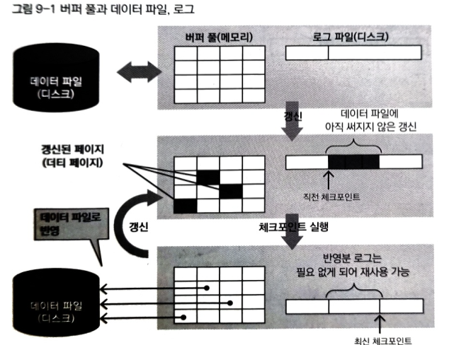
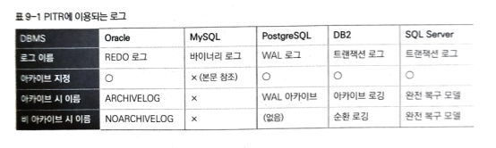

## 9장. 백업과 복구

이번 장에서는 일반적인 DBMS 에 저장한 데이터의 보존을 수행하는 백업과 복구(복원) 구조를 다룬다. DBMS 에서는 커밋된 데이터를 영속화하며, 영속화를 담보하면서 실용적인 속도로 커밋할 수 있게 다양한 노력이 행해지고 있다.         
첫 장에서는 5만건을 실행하다 중간에 멈추고, 강제 종료 후 다시 시작하고 있다.        
그러면 사람마다 다르겠지만, 책에서는 4만건을 실행하고 멈췄고 그 결과는 저장 되어 있다.      
보통 강제 종료에는 태스크 매니저를 이용한다. 하지만 MySQL 서버는 애플리케이션이 아니고 서비스로 실행되기 때문에 애플리케이션 탭상에서는 나타나지 않는다. 

### 서비스란

Windows 에서 사용자와 상호작용하지 않고 동작하는 것으로 Windows  동작 중에는 계속 백그라운에서 동작한다. (이 구조는 유닉스/리눅스의 '데몬' 과 같다.)            
이 때문에 강제 종료(관리자 건하 필요) 하려면, 프로세스 탭을 선택해 이미지명 (mysqld.exe) 을 지정하든지 서비스 탭을 선택해 서비스 이름 (MySQL57)을 지정해야 한다.        
MySQL 은 프로세스를 지정해 강제 종료할 수 있지만, DBMS의 아키텍쳐에 따라 한 개의 프로세스를 강제로 종료(KILL)하는 것만으로는 전체 프로세스가 종료 되지 않는 경우가 있다.        
이 것은 DBMS 자체가 복수의 프로세스가 협력하는 형태로 동작하는 아키텍쳐를 체택한 경우인데, 이와 같은 구조를 '멀티 프로세스 구성' 이라고 부른다. 이에 비해 MySQL 서버 같은 1개의 프로세스 속에 복수의 스레드가 동작하는 구성을 '멀티 스레드 구조' 라고 한다.

---

### DBMS의 3가지 구조

7장에서 트랜잭션에는 ACID 라는 특성이 있는 것을 다뤘다.         
ACID 의 'D'는 지속성으로, 일련의 데이터 동작(트랜잭션 동작)을 완료(COMMIT) 하고 완료 통지를 사용자가 받은 시점에서는 그 동작이 '영속화' 되어 결과를 잃어버리지 않는 것을 나타낸다.          
이는 시스템이 정상일 때뿐만 아니라 데이터베이스 서버나 OS의 비정상적 종료 등의 시스템 장애에 견딜 수 있다는 걸 의미한다.

DBMS 에서 데이터를 보존하는 기억장치는 대부분 하드디스크이다.           
하드디스크에서 지속성을 실현하려면 쓰기를 전부 ' 동기화 쓰기' 로 하면 좋겠지만, 데이터베이스의 쓰기는 기억장치의 임의 장소에 무작위로 액세스해서 쓰기를 수행하기 때문에 동기화 쓰기는 느려서 성능 면에서 실용적이지 않다.               
그래서 지속성과 성능이 양립하도록 일반적으로 DBMS 에서는 아래와 같은 구조를 사용한다.

### 로그 선행 쓰기

데이터 파일 변경을 직접 수행하지 않고, 우선 로그로 변경 내용을 기술한 로그 레코드를 써서 동기화하는 구조다.             
MySQL에서는 이 로그를 InnoDB 로그 라고 부른다. WAL에는 다음과 같은 이점이 있다.

1. 디스크에 연속해서 쓰기 때문에 무작위로 쓰는 것보다 성능이 좋다.
2. 디스크에 쓰는 용량과 횟수를 줄일 수 있다.
3. 데이터베이스 버퍼를 이용해 데이터베이스의 데이터 파일로의 변경을 효율성 높게 수행한다.

### 참고 링크

https://eyeballs.tistory.com/514

### 데이터베이스 버퍼

커밋 시에는 WAL 에 변경 내용을 쓰기 때문에 데이터 파일의 변경 내용은 트랜잭션이 커밋되면서 동시에 동기화할 필요가 없다.         
그렇다고 트랜잭션마다 버퍼를 취해 비동기적인 쓰기를 하면 로그와 데이터 파일 간 일관성을 유지하기가 어렵다.          
그래서 일반적인 DBMS에서는 '데이터베이스 버퍼' 를 준비해 데이터 파일로의 입력을 데이터베이스 버퍼 경유로 일원화해서 단순화하고 있다.            
이 때문에 효율적으로 데이터의 일관성을 유지할 수 있게 된다. MySQL 의 경우 갱신의 흐름은 다음과 같다.

1. 갱신 대상의 데이터를 포함한 페이지가 버퍼풀에 있는 지를 확인하고 없다면 데이터 파일로부터 읽어 들인다.
2. 버퍼 풀의 해당 페이지에서 갱신을 수행한다.
3. 2의 갱신 내용이 커밋과 함께 로그에 기록된다. 버퍼 풀에 갱신 되었지만, 아직 데이터 파일에 써지지 않은 페이지는 버퍼 풀 내에서 더티 페이지(메모리로 읽어서 갱신된 페이지를 가리킴.)로 다룬다.
4. 데이터 페이지는 나중에 적당한 타이밍에 정리 되어 데이터 파일로 써진다. (이 것을 체크포인트라고 부름.)
5. 4의 체크포인트 이전 로그 파일은 불필요해진다. 또한 갱신과 더불어 1부터 순서가 반복된다.

보통은 데이터 갱신 시 이 사이클을 반복한다. 즉, WAL 과 버퍼풀에 갱신을 반영해가며 데이터 파일보다 앞질러가는 형태가 되며, 체크 포인트에서 데이터 파일이 수정사항을 따라잡고 WAL 과 버퍼풀이 선행해서 수정하기를 반복한다.



책에서 그림으로 설명하는걸 보니 어느정도 버퍼 풀과 로그를 적당히 사용하여 효율적으로 데이터에 저장하게 되어 부하를 줄이는 느낌으로 생각했다!

### 크래시 복구

WAL과 데이터베이스 버퍼, 데이터베이스 파일 3가지 연계 플레이로 지속성을 담보하면서 현실적인 성능으로 DBMS 가 동작하고 있다. 그럼 일단 크래시 (서버의 비정상적 종료) 가 발생한 경우에는 어떻게 복구할까?

1. WAL : 마지막으로 커밋된 트랜잭션의 갱신 정보를 가진다.
2. 데이터베이스 버퍼 : 크래시로 내용이 전부 소실된다.
3. 데이터베이스 파일 : 최후 체크포인트까지의 갱신 정보를 가진다.

크래시 이후 MySQL 서버를 재시작하면 3과 1의 체크포인트 이후 갱신 정보를 사용해 데이터베이스 파일을 크래시 때까지 커밋된 최신 상태로 수정한다.           
이 동작을 롤 포워드라고 한다.           
즉, 메모리상의 갱신을 잃어버렸지만, 로그는 크래시 직전까지 남아있어서 이를 기반으로 데이터 파일을 갱신하게 된다.

MySQL 서버를 재시작하는 것으로 복구할 수 있는 구조가 놀랍긴 하지만, 이와 같은 구조도 논리적인 파괴(DDL 문에 따른 테이블의 파기 등) 나 물리적인 파손(디스크 장치의 고장 등) 에는 대응할 수 없다. 이와 같은 파손이나 파괴에 대응하려면 정상적으로 동작하고 있을 때 주기적으로 백업하고 이를 이용해 복원/복구를 진행하는 것이 좋다.

---

### 그럼 백업과 복구는 어떤 흐름으로 진행될까?

### PITR(Point-in-time Recovery)이란

데이터베이스의 데이터를 다양한 장애에서 지키려면 데이터베이스가 정상적으로 동작할 때 백업하고, 장애가 발생하면 백업을 복원한다.         
이렇게 하면 데이터베이스를 백업 시점의 상태로 되돌릴 수 있다.       
하지만 단순히 백업 시점으로 되돌릴뿐 백업 후에 데이터베이스에서 수행한 갱신은 반영 되지 않는다.

일반적인 DBMS 에서는 데이터베이스에 실행된 갱신을 기록한 로그를 보존해서 그것을 복원한 데이트베이스에 순차 반영해 백업 이후의 임의의 시점으로 복원할 수 있다. 이처럼 임의의 시점에서의 데이터 변경을 포함한 복언을 PITR 이라고 부른다. PITR 에 이용되는 로그의 이름과 특성은 DBMS마다 다르다.



책에서의 표를 보면 모르는 단어들이 많은데, 그 중 아카이브 지정이란 PITR 에 이용하는 로그는 대부분 앞에서 설명한 WAL 을 이용한다.                
이 때문에 WAL 을 크래시 복구에만 이용한다면 체크포인트 이전의 로그는 불필요하게 되어 해당 디스크 영역은 삭제하거나 재이용할 수 있다. (다시 이용되는 경우가 대부분) 하지만 이렇게 되면 PITR 을 수행하고 싶을 때 필요한 로그가 없는 상태가 된다.          
따라서 크래시 복구용으로는 불필요한 로그도 PITR 용으로 보존이 필요할 수 있으며, 이를 위한 모드가 아카이브 지정이다.

### 바이너리 로그란

MySQL 에서 PITR 에는 바이너리 로그를 이용하는데, 앞으 로그 선행 쓰기에 나왔던 InnoDB 로그는 이용하지 않는걸까?          
실은 InnoDB 로그는 InnoDB 전용 크래시 복구에만 이용 되고, PITR 에는 MySQL 전체 즉,  InnoDB 에만 한정하지 않고 이용하는 바이너리 로그를 채용한다.            
정리하자면, MySQL 에서는 PITR 에는 '바이너리 로그' 를 크래시 복구에는 InnoDB 로그를 이용한다고 정리할 수 있겠다.

---

### 백업의 3가지 관점

장애가 발생하면 데이터베이스의 데이터는 이용할 수 없다.         
이런 사태에 신속히 대응하기 위해 데이터베이스가 정상적인 상태일 때 현재 이용하는 데이터를 복제해서 어딘가 다른 장소에 옮겨 두어야 한다.         
이 옮겨진 데이터를 백업 데이터라고 하며 이 데이터를 얻어내는 과정을 백업이라고 한다.            
장애가 발생하면 신속하게 백업한 데이터에서 데이터베이스의 데이터를 이용할 수 있는 상황까지 복구한다. 이를 복원이라한다.

백업 수행의 3가지 관점은 아래와 같다.

1. 핫 백업과 콜드 백업

    핫 백업 (주로 데이터베이스의 기능으로 백업 데이터를 얻음.)      
    온라인 백업이라고도 하며, 백업 대상의 데이터베이스를 정지하지 않고, 가동한 채로 백업 데이터를 얻는다.       
    백업 중에도 DB 가동이 가능하다.
    
    어떤 도구를 사용하는지, 획득 수단은 무엇인지에 따라 차이가 있다. MySQL 에서는 트랜잭션의 구조를 이용하기도 하고 특수한 로그를 지정하거나 OS 또는 하드웨어의 스냅샷을 이용해 해당 시점의 스냅샷을 백업 데이터로 취득하는 방법이 있다.        
    또한 MySQL은 핫 백업 시에 mysqlddump 이라는 커맨드라인 클라이언트 유틸리티를 이용할 수 있다.mysqlddump 는 MySQL Installer 로 MySQL 을 설치할 때 함께 설치된다.

    콜드 백업(주로 OS 기능으로 백업 데이터를 얻는다.)           
    오프라인 백업이라고도 하며, 백업 대상의 데이터베이스를 정지한 후 백업 데이터를 얻는다.
    백업 중에는 DB 접근이 불가하다.         
    데이터베이스 정지 중에는 일반적으로 데이터 저장 파일을 OS 로 다루는 상태가 되므로 이를 백업해 백업 데이터를 얻는다.     
    MySQL 에서는 MySQL 서버를 셧다운해서 데이터 디렉토리에 있는 디렉터리와 파일을 전부 OS 명령으로 복사한다.

2. 논리 백업과 물리 백업

    논리 백업
    SQL 기반의 텍스트 형식으로 백업 데이터가 기록 된다.     
    오픈 소스 데이터베이스에서는 논리 백업을 다루는 독가 준비 되어 있으며 이를 주로 이용하는 도구도 다수 있다.      
    논리 백업의 장점으로는 텍스트를 변경해 백업된 내용 일부를 수정할 수 있다. 이식성 또한 우수하다.
    동일한 DBMS 의 다른 버전이나 다른 DBMS 에서도 복원할 수 있다.       
    하지만, 크기가 크기 때문에 바이너리와 텍스트 상호교환에 들어가기 위한 백업과 동작 속도가 느리다는 단점이 있다.

    물리 백업
    데이터 영역을 그대로 덤프하는 이미지로 바이너리 형식(이진법 형식)으로 기록 된다.        
    클로즈드 소스 데이터베이스에서 이용하는 경우가 많다.        
    최소 크기로 데이터를 얻을 수 있는 장점이 있어서 백업과 복원에 속도가 빠르다.        
    하지만 복원 단위는 도구에 따라 다르며 일부 데이터의 교환이나 적용 등이 불가하다.        
    플랫폼에 의존된 바이너리는 동일한 DBMS 라도 호환이 되지 않는다.

3. 풀 백업과 부분(중분/차등) 백업

    백업 시 대상과 이에 따른 데이터 양을 중심으로 본다면 풀백업과 부분 백업으로 구분할 수 있다.     
    풀백업          
    전체 백업이라고도 하며, 데이터베이스 전체 데이터를 매일 백업하는 방식이다.      
    이는 백업 데이터가 한군데에 모여 있어서 복원 처리가 단순하다.          
    다만 전체를 백업하기 때문에 시간이 많이 든다. 갱신량이 적어도 매일 데이터베이스 전체를 백업하므로, 백업 데이터를 저장하는 데 충분한 용량이 필요하다.

    부분백업            
    우선 풀 백업을 한 후에 갱신된 데이터를 백업한다.        
    갱신한 데이터만을 대상으로 하기 때문에 백업 시간이 작게 소요 되고, 용량이 작아도 문제가 없다.           
    복원에는 풀 백업과 부분 백업이 필요해서 절차가 복잡해지는 단점이 있다.          

    부분백업_차등 백업      
    최근에 풀백업한 이후에 갱신된 데이터를 백업함.

    부분백업_중분백업       
    최근 백업한 이후(풀 백업에 한정되지 않고)에 갱신된 데이터를 백업함.     
    차등 백업보다 당연히 양은 적지만, 이도 복원 시 모든 증분 백업을 차례로 적용해야 해서 절차가 복잡해진다.

기본적으로 풀 백업만으로 복원하는 것은 백업 시점이다. 하지만 MySQL 은 앞에서 말했던 바이너리 로그를 출력할 수 있다.             
그래서 바이너리 로그를 증분 백업으로 보존하고 이를 사용해 풀백업 시점 이후 임의 시점까지 복원하는 것이 가능하다. 이를 '롤 포워드 리커버리' 라고 한다. 기본적으로 롤 포워드와 같은 처리로, 바이너리 로그를 사용하는 것만 다르다.

정리하자면, 현재의 데이터베이스는 아래와 같이 표현할 수 있다.

```
현재의 데이터베이스 = 풀 백업한 데이터 + 풀 백업 후 얻은 모든 증분 백업
```

현재의 데이터베이스는 이 2가지를 사용하여 복구할 수 있다는 의미로 정리할 수 있겠다.

이와 같은 관점으로 접근하게 되면 각 데이터베이스가 제공하는 방법의 장단점을 쉽게 이해할 수 있다. 또한, 적용하려는 시스템에 대해 어떤 방법으로 백업하고 복원하는 것이 적절한지를 판단하는 자료가 된다.

---

### 데이터베이스 관리 시 주의점

백업 파일들은 떨어진 곳에 각각 보관하는 것이 중요하다.          
하나의 디스크에 보관하는 것은 절대로 하면 안된다. (얘가 어떻게든 소실 되면 백업 데이터와 사용 중인 데이터베이스를 동시에 전부 잃는 것이다.) 그러니 데이터베이스와 백업 데이터를 다른 디스크 장치로 나누어서 보관하자.

더불어 장치를 지리적으로 떨어진 장소에 둔다면 서버와 디스크가 설지된 장소 자체의 물리적인 장애(천재지변 등)에서 데이터를 지키는 것도 가능하다.          
또한 장애가 일어났다면 신속하게 복구해야 한다. 그러기 위해서는 현재 사용하는 DBMS 에 어떠한 대책이 있으며 어떤 방법을 이용하는 것이 좋은지를 고민해야 한다.     
그리고 백업과 복구에 걸리는 시간과 부하를 측정해 이를 차질 없이 운영해야 한다.

---

### Reference

> [\[데이터베이스 첫걸음\]](https://www.yes24.com/product/goods/32613394)