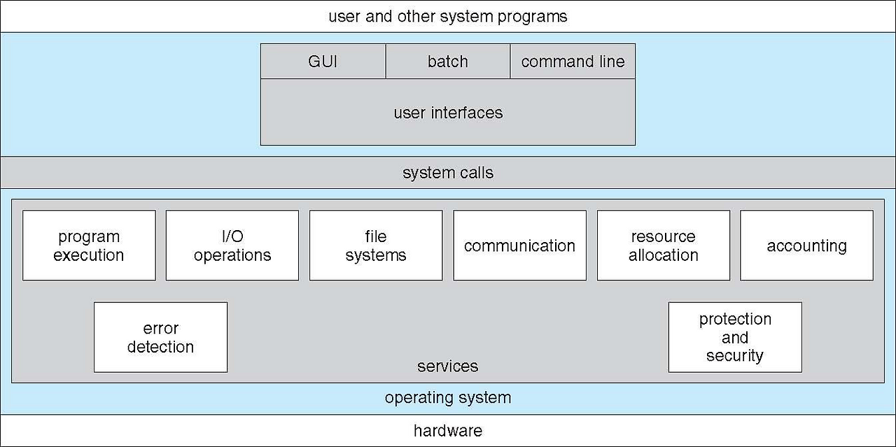
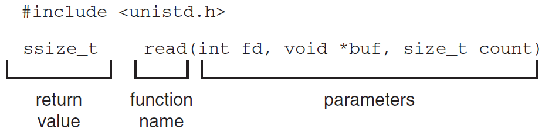
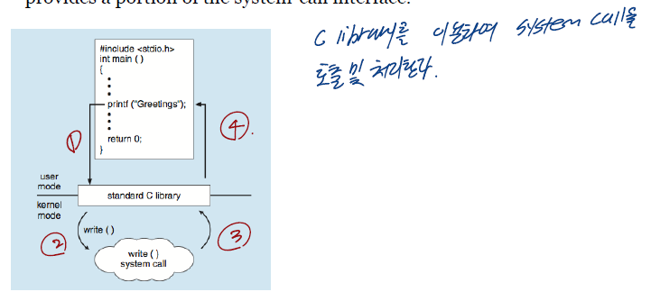

## 1. 운영체제 제공 서비스(Operating System Service)

프로그램의 실행을 위해서 운영체제는 다음과 같은 서비스를 제공합니다.

- 유저 인터페이스(User Interface)
- 프로그램의 실행(Program execution)
- 입출력 연산(I/O operation)
- 파일 시스템 조작(File-system manipulation)
- 에러 탐색(Error detection)
- 자원 할당(Resource allocation)
- 로깅(Logging)
- 보호 및 보안(Protection and security)

아래 그림은 운영체제가 제공하는 서비스의 전체적인 모습입니다.

---

### 1. 1 유저와 운영체제간의 인터페이스(User and Operating-System Interface)

사용자들이 운영체제와 통신하기 위해서 대표적으로 다음과 같은 방법들이 존재합니다.

- CLI(Command Line Interface) : 쉘(shells)로 알려진 sh, bash, csh, tcsh, zsh 등이 존재함
- GUI(Graphical User Interface) : Windows, MacOS 등
- Touch-Screen Interface : Android UI, iPhone UI 등

---

### 1. 2 시스템 콜(System Calls)

System Calls

- System Calls이란 응용 프로그램이 운영체제와 통신하기 위한 방법입니다.
- OS API(Application Program Interface) : System Calls

위의 그림을 보시면 read 함수를 통해서 시스템 콜을 호출하고 커널 모드로 들어가서 파일을 읽을 수 있습니다.

위의 그림을 보시면 사용자 응용프로그램에서 open() 함수를 통해서 시스템 콜을 호출하고 커널 모드로 들어가서 해당하는 파일을 여는 과정입니다.

---

표준 C 라이브러리

C 라이브러리를 통해서 시스템 콜 인터페이스의 일부를 제공합니다.

---

### Reference

> [\[인프런\] 운영체제 공룡책 강의](https://www.inflearn.com/course/%EC%9A%B4%EC%98%81%EC%B2%B4%EC%A0%9C-%EA%B3%B5%EB%A3%A1%EC%B1%85-%EC%A0%84%EA%B3%B5%EA%B0%95%EC%9D%98/dashboard)