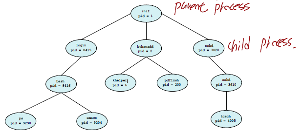
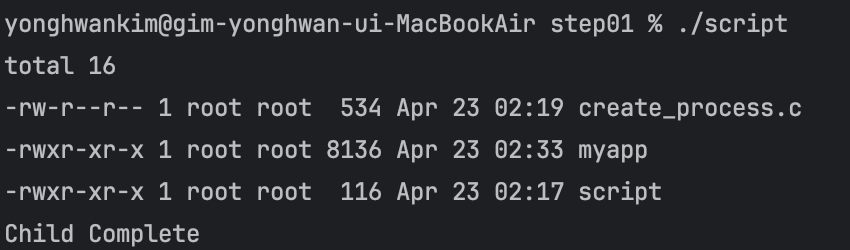
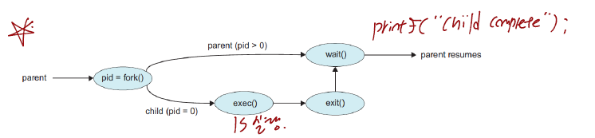
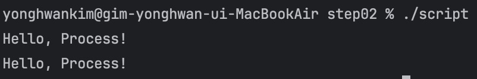
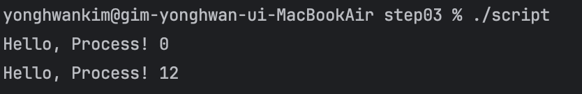
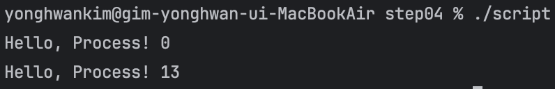

## 1. 프로세스들의 연산들(Operations on Processes)

### 1.1 부모 프로세스(Parent Process)와 자식 프로세스(Child Process)

운영체제는 다음과 같은 기능을 수행합니다.

- 프로세스의 생성
- 프로세스의 종료

하나의 프로세스는 여려개의 새로운 프로세스들을 생성할 수 있습니다.

- 기존에 생성한 프로세스 : 부모 프로세스(Parent Process)
- 기존에 생성한 프로세스에 의해 새롭게 생성된 프로세스 : 자식 프로세스(Child Process)

아래의 그림은 프로세스들의 트리를 나타냅니다.



---

### 1.2 부모 프로세스(Parent Process)와 자식 프로세스(Child Process)의 실행관계

프로세스 실행에 대한 두가지 가능성

1. 부모 프로세스와 자식 프로세스는 동시에 실행
2. 부모 프로세스는 자식 프로세스가 종료될때가지 기다림

프로세스 주소 공간에 대한 두가지 가능성

1. 자식 프로세스는 부모 프로세스와 동일한 프로그램을 수행
2. 자식 프로세스는 부모 프로세스와는 다르게 새로운 프로그램을 수행

다음 코드는 부모 프로세스와 자식 프로세스에 대한 예제입니다.

```c
#include <stdio.h>
#include <unistd.h>
#include <wait.h>

int main()
{
    pid_t pid;

    // 자식 프로세스 생성
    pid = fork();
    if(pid<0)   // 에러 발생
    {
        fprintf(stderr, "Fork Failed");
        return 1;
    }
    else if(pid==0) // 자식 프로세스인 경우
    {
        execlp("/bin/ls", "ls", "-l", NULL);
    }
    else    // 부모 프로세스인 경우
    {
        wait(NULL); // 자식 프로세스가 종료될때까지 대기
        printf("Child Complete\n");
    }

    return 0;
}
```



위의 코드는 부모 프로세스가 자식 프로세스를 생성하고 부모 프로세스는 자식 프로세스가 종료될때까지 기다렸다가 "Child Complete" 문자열을 출력하는 코드입니다. fork() 함수를 호출하면 부모 프로세스는 자식 프로세스 번호를 반환받고 wait() 함수로 인하여 대기합니다. 자식 프로세스가 생성되고 자식 프로세스는 fork() 함수 이후의 문장을 수행합니다. pid 변수는 자식 프로세스이기 때문에 0이 저장됩니다. 그리고 자식 프로세스의 "ls -l" 명령어를 수행하고 부모 프로세스가 대기를 풀고 출력문을 수행합니다.

위 코드의 수행과정을 그림으로 표현하면 아래와 같습니다.



위 c 파일을 컴파일하고 실행하기 위해서 docker를 사용하였습니다. 따라서 다음과 같이 script 파일을 생성하고 해당 파일안에 다음과 같은 명령어를 입력하여 실행결과를 확인하였습니다.

```bash
docker run --rm -v "$PWD":/usr/src/myapp -w /usr/src/myapp gcc:4.9 sh -c "gcc -o myapp create_process.c && ./myapp"
```

---

### 1.3 프로세스의 종료(Terminated)

- 프로세스의 종료는 마지막 문장을 실행할 때 종료됩니다.
- exit() 시스템 콜 : 운영체제가 강제 종료합니다.
- 운영체제는 프로세스가 종료되면 자원을 해제합니다.
    - 메모리, 파일, I/O 버퍼 등

---

### 1.4 좀비(Zombie) 프로세스와 고아(Orphan) 프로세스

좀비 프로세스(Zombie Process)

- 실행이 종료되었지만 아직 삭제되지 않은 프로세스들

고아 프로세스(Orphan Process)

- 부모프로세스가 자식 프로세스보다 먼저 종료된 프로세스

---

### 1.5 fork() System call

- 새로운 프로세스는 fork() 시스템 콜에 의해 생성됨
- 자식 프로세스는 부모 프로세스의 복사본으로 구성됨
- 두 프로세스는 fork() 함수 호출 이후 명령문을 실행함
- 부모 프로세스와 자식 프로세스의 차이점
    - 부모 프로세스는 fork() 호출로 자식 프로세스의 프로세스 번호를 반환받음
    - 자식 프로세스는 부모 프로세스에게 프로세스 번호 0를 반환받음

다음 코드는 fork() 시스템 콜의 예제입니다.

```c
#include <stdio.h>
#include <unistd.h>

int main()
{
    pid_t pid;

    pid = fork();
    printf("Hello, Process!\n");
    wait(NULL);
    return 0;
}
```



부모 프로세스가 fork() 함수 호출로 자식 프로세스를 호출합니다. 부모 프로세스는 wait(NULL)을 호출하여 자식 프로세스가 종료될때까지 대기하고 자식 자식 프로세스 -> 부모 프로세스 순으로 "Hello, Process!"를 출력합니다.

아래의 예제는 부모 프로세스와 자식 프로세스의 프로세스 번호를 출력하는 예제입니다.

```c
#include <stdio.h>
#include <unistd.h>

int main()
{
    pid_t pid;

    pid = fork();
    printf("Hello, Process! %d\n",pid);
    wait(NULL);
    return 0;
}
```



부모 프로세스는 fork()를 호출하면 자식 프로세스가 생성되고 반환값으로 자식 프로세스의 번호 12를 반환받습니다. 자식 프로세스는 fork() 함수 이후에 호출되기 때문에 pid는 0인 상태로 출력됩니다.

위 예제를 통하여 부모 프로세스는 fork() 함수를 호출하여 자식 프로세스를 생성하면 반환값으로 자식 프로세스의 번호를 반환받고 자식 프로세스는 fork() 이후에 실행되기 때문에 프로세스 번호는 0인 것을 알수 있습니다.

---

### 1.6 fork() system call 이후의 수행

부모 프로세스가 자식 프로세스를 수행한 다음 부모 프로세스의 수행은 대표적으로 2가지가 존재합니다.

- 부모 프로세스는 자식 프로세스를 상관하지 않고 계속 수행
- 부모 프로세스는 자식 프로세스가 종료될 때까지 대기

다음 예제는 부모 프로세스가 자식 프로세스가 종료될때까지 대기하는 예제입니다.

```c
#include <stdio.h>
#include <unistd.h>
#include <wait.h>

int main()
{
    pid_t pid;

    pid = fork();
    
    if(pid>0)
    {
        wait(NULL);
    }
    printf("Hello, Process! %d\n", pid);
    return 0;
}
```



부모 프로세스가 fork() 함수 실행후 반환받은 pid는 13으로 양수이기 때문에 자식 프로세스의 실행이 종료될때까지 대기합니다. 자식 프로세스는 fork() 이후에 실행되기 때문에 pid=0으로 출력되고 종료됩니다. 부모 프로세스는 자식 프로세스가 종료되면 출력문을 통하여 자식 프로세스의 번호 13을 출력하고 프로그램을 종료합니다.

---

### Reference

> [\[인프런\] 운영체제 공룡책 강의](https://www.inflearn.com/course/%EC%9A%B4%EC%98%81%EC%B2%B4%EC%A0%9C-%EA%B3%B5%EB%A3%A1%EC%B1%85-%EC%A0%84%EA%B3%B5%EA%B0%95%EC%9D%98/dashboard)