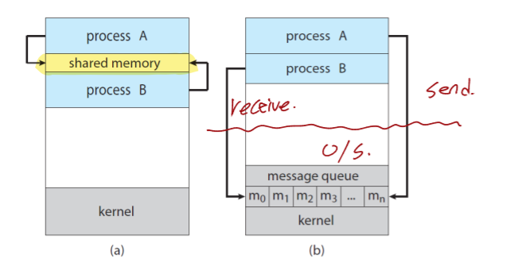
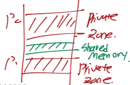
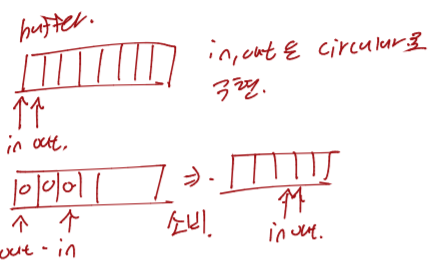
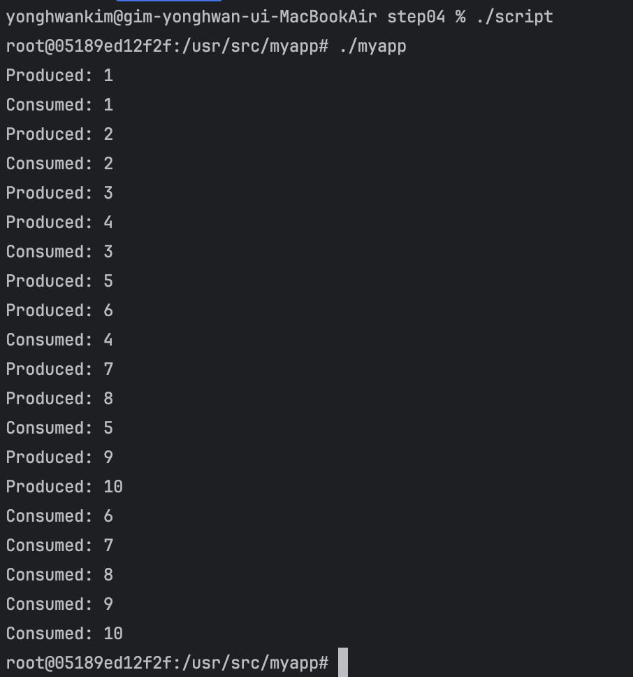
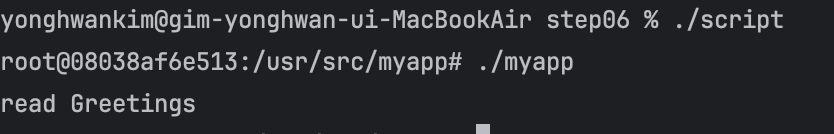
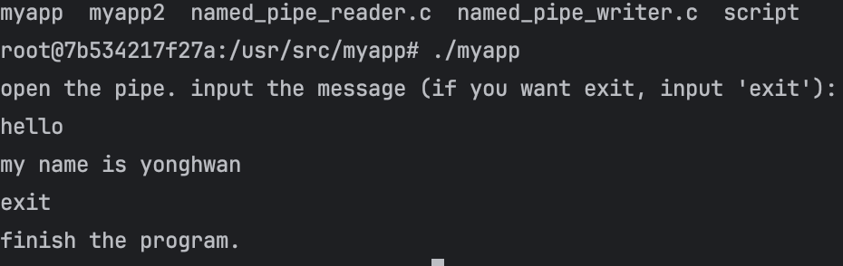
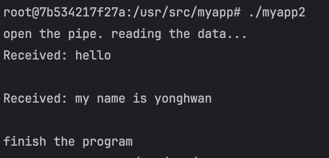
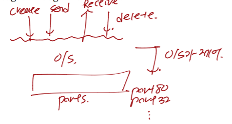

## 1. 프로세스간 통신(Interprocess Communication, IPC)

프로세스들은 프로세스들끼리 독립적으로 실행하거나 또는 상호협력적으로 통신하며 동시에 실행됩니다. 프로세스들끼리 독립적으로 실행된다는 의미는 프로세스간 데이터를 공유하지 않음을 의미합니다. 반대로 상호협력적으로 통신하며 수행하는 프로세스들은 데이터를 공유할 수 있으며 한 프로세스가 다른 프로세스들에게 영향을 줄 수 있음을 의미합니다.

---

IPC(Integer-Process Communication)이란 무엇인가?

IPC는 프로세스들간의 통신하는 방법을 의미합니다. 이 방법을 통하여 프로세스들은 데이터를 공유할 수 있으며, 한 프로세스에서 다른 프로세스로 데이터를 전송하거나 수신할 수 있습니다.

IPC 주요 모델

1. 공유 메모리(shared memory)
2. 메시지 송수신(message passing)

다음 그림 (a)는 공유 메모리(shared memory)를 사용하는 방법이고 (b)는 메시지 송수신(message passing)을 사용하는 방법입니다. 공유 메모리 방법 같은 경우에는 메모리 위에 프로세스들간에 데이터를 공유할 수 있는 공유 메모리 영역을 사용하는 방법입니다. 메시지 송수신 방법은 메모리 위에 메시지 큐를 놓고 프로세스들이 전송할 데이터를 메시지 큐에 전송하고 프로세스들이 수신할 데이터를 메시지 큐를 통해 받는 방법입니다.



---

## 2. 공유 메모리(Shared Memory)

### 2.1 생산자-소비자 문제(Producer-Consumer Problem)

생산자-소비자 문제는 멀티 프로세싱(또는 멀티 스레딩) 환경에서 발생하는 고전적인 동기화 문제중 하나입니다. 이 문제는 다수의 프로세스(또는 스레드, 이후 설명에는 프로세스로 통일)가 공유 자원에 접근할때 발생합니다. 그중에서 생산자-소비자 문제는 일종의 협력 작업을 수행하는 프로세스간, 데이터를 안전하게 전달하는 방법에 대한 문제입니다.

생산자-소비자 문제에서 소개되는 역할은 다음과 같습니다.

- 생산자(Producer) : 데이터를 생성하고 공유 자원에 추가하는 역할
- 소비자(Consumer) : 공유 자원에 추가된 데이터를 꺼내서 사용하는 역할
- 버퍼(Buffer) : 공유 자원이며, 생산자가 만든 데이터를 임시로 보관하는 역할

위와 같은 역할을 기반으로 생산자는 데이터를 계속 생산하여 버퍼에 저장하고 소비자는 버퍼에 저장된 데이터를 계속 꺼내서 사용합니다. 생산자가 데이터를 넣고, 소비자가 데이터를 꺼내는 작업을 동기화하여 충돌이나 데이터 손실이 발생하지 않도록 해야 합니다.

생산자-소비자 문제의 수행과정       
다음 수행과정에서 버퍼는 공유 메모리 모델을 사용하여 수행할 수 있습니다.

1. 생산자는 데이터를 생산하여 버퍼에 넣습니다.
2. 소비자는 버퍼에 데이터를 꺼내서 사용합니다.
3. 생산자는 버퍼가 가득차면 대기합니다.
4. 소비자는 버퍼가 비어있으면 대기합니다.



생산자-소비자 문제 추상적 코드

```c
#define BUFFER_SIZE 10

typedef struct{
	...
} item;

item buffer[BUFFER_SIZE];
int in = 0;
int out = 0;
```

위 코드를 그림으로 표현하면 아래와 같습니다. 버퍼에서 in, out 인덱스는 0번째를 가리키고 있다가 생산자 역할을 하는 프로세스가 데이터를 생산하여 버퍼에 저장하게 되면 in 인덱스를 1씩 증가시켜서 다음에 생상된 데이터를 저장할 위치를 가리킵니다. 생산자는 이러한 생산을 반복하다가 버퍼가 가득차게 되면 버퍼에 빈공간이 생길때까지 대기하게 됩니다. 반대로 소비자는 out 인덱스를 이용하여 버퍼에 저장된 데이터를 꺼내서 사용하게 됩니다. 이러한 소비를 하게 되면 out 인덱스 또한 1씩 증가시켜서 다음에 사용할 데이터를 가리킵니다. 이러한 소비 행위를 반복하다가 더이상 데이터가 없다면 데이터가 생산될때까지 반복하게 됩니다.



공유 메모리를 사용한 생산자 프로세스

```c
item next_produced;

while(true){
	/* produce an item in next_produced */
    
    while(((in+1) % BUFFER_SIZE) == out)
    {
    	/* do nothing*/
    }
    buffer[in] = next_produced;
    in = (in + 1) % BUFFER_SIZE;
}
```

- 생산자는 데이터를 버퍼에 저장할 수 없다면 빈 공간이 생길때까지 대기합니다.
- 버퍼의 in 인덱스 위치에 생상된 데이터를 저장합니다.
- 버퍼에 데이터를 저장하면 in 인덱스를 1씩 증가시키고 현재 in 인덱스가 버퍼의 마지막 자리에 위치한다면 0번째로 이동시킵니다. 이는 버퍼가 순환 큐임을 알 수 있습니다.

공유 메모리를 사용한 소비자 프로세스

```c
item next_consumed;

while(true){
    while(in==out)
    {
    	/* do nothing*/
    }
    
    next_consumed = buffer[out];
    out = (out+1) % BUFFER_SIZE;
    
    /* consume the item in next_consumed*/
}
```

- 소비자는 버퍼에 소비할 데이터가 존재 할 때까지 대기합니다.
- 버퍼에서 out 인덱스에 저장된 데이터를 꺼내서 사용합니다.
- out 인덱스를 1 증가시켜서 다음에 사용할 곳의 인덱스를 저장합니다. 단, out 인덱스가 버퍼의 끝자리에 존재하면 0번째로 이동시킵니다.

---

### 2.2 생산자-소비자 문제(Producer-Consumer Problem) 구현

이번에는 2.1에서 소개한 생산자-소비자 문제를 공유 메모리 방식으 구현해봅니다. 구현하는 프로그램에서 생산자 프로세스는 10개의 아이템을 생성하고 종료합니다. 소비자 프로세스 또한 생산자 프로세스가 생선한 아이템을 10개 소비하게 되면 종료합니다. 코드는 다음과 같습니다.

우선 C언어에서 사용할 상수를 정의합니다. 

```c
#define BUFFER_SIZE 5 // shared memory buffer size
#define SHM_KEY 12345 // shared memory key
#define MAX_ITEMS 10
```

SHM_KEY는 공유 메모리를 식별할 값입니다. 이 키 값을 이용하여 공유 메모리를 식별하고 여러 프로세스가 동일한 공유 메모리 영역에 접근할 수 있도록 합니다. MAX_ITEMS 상수는 생산자 프로세스와 소비자 프로세스가 각각 생산하고 소비할 개수입니다.

```c
typedef struct {
    int buffer[BUFFER_SIZE]; // the buffer to store the data
    int in; // index to write the data
    int out; // index to read the data
} SharedData;
```

공유 메모리 영역에 저장될 구조체입니다. 즉, 공유 메모리에 버퍼와 버퍼의 생성된 아이템이 저장될 위치와 소비할 위치가 하나의 구조체로써 저장됩니다.

```c
int main() {
    int shm_id;
    SharedData* shared_data;

    // create the shared memory
    shm_id = shmget(SHM_KEY, sizeof(SharedData), IPC_CREAT | 0666);
    if (shm_id < 0) {
        perror("shmget");
        exit(1);
    }
    // ...
 }
 ```

shmget 함수를 이용하여 공유 메모리 영역을 생성합니다. 매개변수별 설명은 다음과 같습니다.

- Key : 공유 메모리 식별 키, 해당 키를 이용하여 여러 프로세스들이 동일한 공유 메모리 영역에 접근이 가능합니다.
- Size : 공유 메모리 영역의 크기를 의미합니다. 우리는 SharedData 구조체를 저장하기 때문에 해당 구조체의 크기만큼 전달합니다.
- SharedMemoryFlag : 공유 메모리 생성시 사용하는 플래그입니다. 1개 이상의 옵션을 논리적으로 OR처리하여 구성합니다.
    - IPC_CREAT : 공유 메모리 영역이 아직 존재하지 않는 경우 새로 작성합니다. 8진수로 001000 값을 가지고 있습니다.
    - 0666 : 파일 권한을 의미합니다. 각 숫자는 소유자, 그룹, 기타 사용자의 읽기, 쓰기, 실행 권한을 8진수로 표현한 것입니다. 즉, 모든 사용자에게 읽기, 쓰기 권한을 부여합니다.

shmget 함수를 호출하여 공유 메모리 영역을 생성하게 되면 공유 메모리의 아이디를 반환합니다. 이 아이디(shm_id)값이 음수라면 공유 메모리 영역 생성이 실패한 것이기 때문에 에러를 출력하고 프로그램을 종료하도록 합니다.

```c
// connect the shared memory
shared_data = (SharedData *)shmat(shm_id, NULL, 0);
if (shared_data == (SharedData *)(-1)) {
    perror("shmat");
    exit(1);
}

shared_data->in = 0;
shared_data->out = 0;
```

다음으로 shmat(shared memory attach) 함수를 호출하여 공유 메모리 영역에 연결합니다. 연결하기 위해서 공유 메모리를 식별하는 아이디 값(shm_id)을 전달합니다. 우리의 생성자 프로세스는 공유 메모리의 buffer 영역에 아이템을 저장하기 위해서 쓰기 권한과 읽기 권한이 모두 필요하기 때문에 3번째 매개변수에 0을 전달합니다. shmat 함수의 매개변수는 다음과 같습니다.

- SharedMemoryID : 공유 메모리를 식별하는 아이디 값
- SharedMemoryAddress : 공유 메모리를 특정 주소에 연결하고자 할때 원하는 주소를 전달합니다. NULL을 전달하는 경우 시스템이 자유롭게 메모리를 할당하도록 허용합니다.
- SharedMemoryFlag : 공유 메모리에 대한 옵션 값입니다. 0이거나 특정 플래그 옵션을 OR 로 묶어서 전달할 수 있습니다. 0을 전달하면 공유 메모리에 읽기와 쓰기 권한을 부여합니다. 일반적으로 SHM_RDONLY 플래그를 사용하여 읽기 전용으로 할 수도 있습니다.

공유 메모리에 연결이 완료되면 shared_data 포인터 변수는 공유 메모리의 영역을 가리키고 있습니다. 따라서 그 다음에는 shared_data 구조체의 in, out 인덱스 변수에 대하여 0으로 초기화합니다.

다음 코드를 구현하여 생성자 프로세스를 구현합니다.

```c
// create the producer process
if (fork() == 0) {
    int next_produced = 0;
    int i;
    for(i = 0; i < MAX_ITEMS; i++) {
        // create the data
        next_produced++;

        while (((shared_data->in + 1) % BUFFER_SIZE) == shared_data->out) {
            // wait until fulling the buffer
        }

        // write the data in the buffer
        shared_data->buffer[shared_data->in] = next_produced;
        shared_data->in = (shared_data->in + 1) % BUFFER_SIZE;

        printf("Produced: %d\n", next_produced);

        sleep(1);
    }
    exit(0);
}
```

fork() 함수를 호출하게 되면 자식 프로세스가 생성됩니다. 해당 자식 프로세스가 생성자 프로세스가 됩니다. 부모 프로세스의 입장에서 fork() 호출하고 반환된 값은 자식 프로세스의 id값이기 때문에 부모 프로세스는 조건문을 빠져나갑니다. 그 다음에 fork() 함수로 생성된 자식 프로세스 입장에서는 반환된 값은 0이기 때문에 조건문을 만족하여 별도의 프로세스로써 생성자 역할을 수행합니다.     
전체적인 흐름은 next_produced의 값을 1씩 계속 증가시키고 shared_data 구조체의 buffer의 in 인덱스 위치에 생성된 아이템을 저장합니다. 그리고 in 인덱스를 1씩 증가시킵니다. 이러한 과정이 총 10번이 반복되도록 합니다. 만약 반복문 수행중 in + 1의 위치가 out의 위치와 동일하게 되면 버퍼의 아이템이 가득찼다는 것을 의미하기 때문에 while 반복문을 통하여 대기합니다. 그리고 생성자 프로세스는 10개의 아이템을 생성하게 되면 exit 함수를 호출하고 종료합니다.

다음은 소비자 프로세스의 코드 구현입니다.

```c
// create the consumer process
if (fork() == 0) {
    int i;
    for (i = 0; i < MAX_ITEMS; i++) {
        while (shared_data->in == shared_data->out) {
            // wait until empty the buffer
        }

        // read the data in buffer
        int item = shared_data->buffer[shared_data->out];
        shared_data->out = (shared_data->out + 1) % BUFFER_SIZE;

        printf("Consumed: %d\n", item);

        sleep(2);
    }
    exit(0);
}
```

소비자 프로세스 또한 부모 프로세스의 입장에서 fork() 함수를 호출하여 자식 프로세스인 소비자 프로세스를 생성합니다. 그리고 나서 소비자 프로세스는 생성자 프로세스와 동일하게 10개의 아이템을 소비하게 될때까지 버퍼의 아이템을 가져와서 사용합니다. 소비자 프로세스는 수행하다가 in 인덱스와 out 인덱스가 동일하게 되면 대기합니다. 이는 더이상 버퍼에 소비할 아이템이 없음을 의미합니다. 생산자 프로세스가 버퍼에 아이템을 저장할때까지 while문을 통하여 대기합니다. 10개의 아이템을 전부 소비한 소비자 프로세스는 exit 함수를 호출하고 종료합니다.

```c
{
    // wait for Child Process to end
    wait(NULL);
    wait(NULL);

    // destroy shared memory
    shmctl(shm_id, IPC_RMID, NULL);

    return 0;
}
```

생성자 프로세스와 소비자 프로세스를 생성한 부모 프로세스 입장에서는 wait 함수를 호출하여 생성자 프로세스와 소비자 프로세스가 전부 종료될때까지 대기합니다. 전부 종료된다면 shmctl 함수를 호출하여 공유 메모리 영역을 해제합니다. 매개변수는 다음과 같습니다.

- SharedMemoryID : 공유 메모리를 식별한 아이디 값
- Command : 공유 메모리에 명령할 플래그 값입니다. IPC_RMID는 시스템에서 SharedMemoryID 매개변수로 설정된 공유 메모리 ID를 제거하고 이와 연관된 공유 메모리 세그먼트 및 데이터 구조를 제거합니다.
- Buffer : 함수 실행시 보조적인 데이터 전달시 사용됩니다. NULL 전달시 기본값으로 동작하도록 전달합니다.

전체 소스코드는 다음과 같습니다.

```c
#include <stdio.h>
#include <stdlib.h>
#include <unistd.h>
#include <sys/types.h>
#include <sys/ipc.h>
#include <sys/shm.h>

#define BUFFER_SIZE 5 // shared memory buffer size
#define SHM_KEY 12345 // shared memory key
#define MAX_ITEMS 10

typedef struct {
    int buffer[BUFFER_SIZE]; // the buffer to store the data
    int in; // index to write the data
    int out; // index to read the data
} SharedData;

int main() {
    int shm_id;
    SharedData* shared_data;

    // create the shared memory
    shm_id = shmget(SHM_KEY, sizeof(SharedData), IPC_CREAT | 0666);
    if (shm_id < 0) {
        perror("shmget");
        exit(1);
    }

    // connect the shared memory
    shared_data = (SharedData *)shmat(shm_id, NULL, 0);
    if (shared_data == (SharedData *)(-1)) {
        perror("shmat");
        exit(1);
    }

    shared_data->in = 0;
    shared_data->out = 0;

    // create the producer process
    if (fork() == 0) {
        int next_produced = 0;
        int i;
        for(i = 0; i < MAX_ITEMS; i++) {
            // create the data
            next_produced++;

            while (((shared_data->in + 1) % BUFFER_SIZE) == shared_data->out) {
                // wait until fulling the buffer
            }

            // write the data in the buffer
            shared_data->buffer[shared_data->in] = next_produced;
            shared_data->in = (shared_data->in + 1) % BUFFER_SIZE;

            printf("Produced: %d\n", next_produced);

            sleep(1);
        }
        exit(0);
    }

    // create the consumer process
    if (fork() == 0) {
        int i;
        for (i = 0; i < MAX_ITEMS; i++) {
            while (shared_data->in == shared_data->out) {
                // wait until empty the buffer
            }

            // read the data in buffer
            int item = shared_data->buffer[shared_data->out];
            shared_data->out = (shared_data->out + 1) % BUFFER_SIZE;

            printf("Consumed: %d\n", item);

            sleep(2);
        }
        exit(0);
    }

    // wait for Child Process to end
    wait(NULL);
    wait(NULL);

    // destroy shared memory
    shmctl(shm_id, IPC_RMID, NULL);

    return 0;
}
```

위 코드를 실행한 결과는 다음과 같습니다. 다음 스크립트를 실행하기 위해서는 docker가 필요합니다.

```bash
$ docker run -it --rm -v "$PWD":/usr/src/myapp -w /usr/src/myapp gcc:4.9 sh -c "gcc -o myapp shm_producer_consumer.c -lrt -pthread & bash"
root# ./myapp
```

위 실행 결과를 보면 Producer 프로세스가 아이템을 생성하여 공유 메모리 영역의 버퍼에 저장하면 대기하고 있던 소비자 프로세스가 버퍼의 아이템을 사용(출력)하는 것을 볼수 있습니다.



위와 같은 예제를 통하여 프로세스의 통신 방법 중 하나인 공유 메모리 방식으로 생산자-소비자 문제를 C언어 기반으로 구현해볼 수 있었습니다. 하지만 위와 같은 예제도 문제점이 존재합니다. 그것은 while 반복문을 통하여 동기화를 비슷하게 따라했다는 점입니다. 지금 예제 같은 경우에는 생산자와 소비자 프로세스가 각각 1개씩 이기 때문에 잘 작동하지만, 만약 생산자와 소비자 프로세스가 많아지면 많아질수록 동기화 문제가 발생하여 사용자가 예상하지 못한 결과가 발생할 것입니다. 이와 같은 문제를 해결하기 위해서 추후 뮤텍스(Mutex)와 세마포어(Semaphore)와 같은 기술을 사용하여 프로세스간에 동기화할 수 있도록 하는 방법이 존재합니다. 하지만, 프로세스간에 동기화 문제는 추후의 다른 문제점이고 지금은 프로세스간에 통신하기 위해서 공유 메모리 방식을 위와 같이 사용한 것에 집중하면 좋을것 같습니다.

---

## 3. 메시지 전송(Message Passing)

### 3.1 메시지 전송 개념

프로세스간에 데이터 전송 및 읽기와 같은 통신을 하기 위한 두번째 방법으로 메시지 전송 방법이 존재합니다. 메시지 전송 방법을 구현하기 위한 방법은 메시지 큐(Message Queue), 파이프(Pipes), 소켓(Socket), 원격 프로시저 콜(Remote Procedure Call) 방법이 존재합니다.

운영체제는 메시지 전송 기능을 통해서 각각의 프로세들이 서로 통신하기 위한 API들을 제공합니다. 메시지 전송 API는 다음과 같습니다.

- send(message, destination) or send(message)
- receive(message, host) or receive(message)

위와 같은 API를 기반으로 메시지 큐, 파이프, 소켓, 원격 프로시저 콜과 같은 구현체가 존재할 수 있습니다. 각 구현체는 각자의 방법으로 프로세스간 통신을 수행하게 합니다. 즉, 정리하면 메시지 전송(Message Passing)은 인터페이스, 메시지 큐, 파이프, 소켓, 원격 프로시저 콜은 메시지 전송 인터페이스를 기반으로 구현한 구현체입니다.

---

### 3.2 메시지 큐 기반 생산자-소비자 문제 구현

메시지 큐를 이용하여 메시지 전송하는 방식은 메모리 위에 메시지 큐를 생성한 다음에 프로세스들은 생성한 메시지를 다른 프로세스에게 전송할때 메시지 큐에 전달합니다. 수신하는 프로세스는 메시지 큐로부터 메시지를 받아서 사용합니다. 메시지 큐는 이름 그대로 Queue를 사용하기 때문에 메시지들은 기본적은 FIFO(First-In-FIrst-Out) 방식으로 저장되고 삭제됩니다. 따라서 기본적으로 먼저 들어온 메시지가 먼저 빠져나갑니다. 하지만 메시지 큐의 구현 방식에 따라서 특정한 메시지를 먼저 수신하도록 할 수도 있습니다.

다음 예제는 메시지 큐를 이용하여 생산자-소비자 문제를 C언어로 구현한 예제입니다.

```c
#define QUEUE_NAME "/my_queue"
#define MAX_MESSAGES 10
#define MAX_MSG_SIZE 256
```

QUEUE_NAME 상수는 메시지 큐의 이름입니다. MAX_MESSAGES는 메시지 큐에 저장할 수 있는 메시지의 최대 개수를 의미합니다. 마지막으로 MAX_MSG_SIZE는 메시지의 크기를 의미합니다.

```c
void producer(mqd_t mq);
void consumer(mqd_t mq);

int main(){
    mqd_t mq;
    pid_t pid;

    // create the message queue
    struct mq_attr attr;
    attr.mq_flags = 0;
    attr.mq_maxmsg = MAX_MESSAGES;
    attr.mq_msgsize = MAX_MSG_SIZE;
    attr.mq_curmsgs = 0;
    // ...
}
```

main 함수 내에서 mqd_t 변수는 메시지 큐를 가리키는 변수입니다. pid_t는 프로세스 아이디를 담는 변수입니다. 메시지 큐를 생성하기전에 mq_attr 구조체를 정의합니다. 해당 구조체에는 플래그, 최대 메시지 개수, 메시지 사이즈, 현재 메시지의 개수를 초기화합니다.

```c
mq = mq_open(QUEUE_NAME, O_CREAT | O_RDWR, 0666, &attr);
if (mq == -1){
    perror("mq_open");
    return 1;
}
```

mq_open 함수를 호출하여 메시지 큐를 생성합니다. 매개변수에 큐 이름과 메시지 큐에 대한 플래그, 권한, 메시지 큐 구조 정보를 전달합니다.

```c
// create process
pid = fork();
if (pid == -1){
    perror("fork");
    exit(EXIT_FAILURE);
} else if(pid == 0){
    // start the consumer process (child process)
    consumer(mq);
    exit(EXIT_SUCCESS);
} else{
    // start the producer process (parent process)
    producer(mq);
}
```

fork() 함수를 호출하여 자식 프로세스를 생성합니다. 해당 자식 프로세스는 소비자 프로세스로써 수행합니다. 다 수행하게 되면 exit 함수를 호출하며 종료합니다.

```c
{
    wait(NULL);

    // close the message queue
    if(mq_close(mq) == -1){
        perror("mq_close");
        exit(EXIT_FAILURE);
    }

    // unlink the message queue
    if(mq_unlink(QUEUE_NAME) == -1){
        perror("mq_unlink");
        exit(EXIT_FAILURE);
    }

    return 0;
}
```

wait() 함수를 호출하여 자식 프로세스(소비자 프로세스)가 종료될때까지 부모 프로세스(메인겸 생산자 프로세스)는 대기합니다. 자식 프로세스가 수행을 종료하면 mq_close, mq_unlink 함수를 호출하여 메시지를 닫고 삭제합니다.

```c
void producer(mqd_t mq){
    int i;
    for(i = 0; i < MAX_MESSAGES; i++){
        char msg[MAX_MSG_SIZE];
        sprintf(msg, "Message %d", i);
        printf("Sending message: %s\n", msg);

        // send the message
        if(mq_send(mq, msg, strlen(msg), 0) == -1){
            perror("mq_send");
            exit(EXIT_FAILURE);
        }

        printf("Produced: %s\n", msg);
        sleep(1);
    }
}
```

생산자 프로세스가 수행하는 함수는 다음과 같습니다. 총 10개의 메시지를 보낼때까지 반복하고 mq_send 함수를 호출하여 메시지 큐에 메시지를 전송합니다.

```c
void consumer(mqd_t mq){
    int i;
    for(i = 0; i < MAX_MESSAGES; i++){
        char buffer[MAX_MSG_SIZE];
        // init buffer array before receving the message
        memset(buffer, 0, MAX_MSG_SIZE);

        // receive the message
        if(mq_receive(mq, buffer, MAX_MSG_SIZE, NULL) == -1){
            perror("mq_receive");
            exit(EXIT_FAILURE);
        }
        printf("Received: %s\n", buffer);
        sleep(2);
    }
}
```

fork() 함수로 생성된 자식 프로세스는 소비자 프로세스로써 수행합니다. 10개의 메시지를 받을때까지 반복합니다. mq_receive 함수를 호출함으로써 버퍼에 메시지를 저장하고 출력합니다.

전체 소스코드는 다음과 같습니다.

```c
#include <stdio.h>
#include <stdlib.h>
#include <unistd.h>
#include <fcntl.h>
#include <sys/stat.h>
#include <mqueue.h>
#include <string.h>

#define QUEUE_NAME "/my_queue"
#define MAX_MESSAGES 10
#define MAX_MSG_SIZE 256

void producer(mqd_t mq);
void consumer(mqd_t mq);

int main(){
    mqd_t mq;
    pid_t pid;

    // create the message queue
    struct mq_attr attr;
    attr.mq_flags = 0;
    attr.mq_maxmsg = MAX_MESSAGES;
    attr.mq_msgsize = MAX_MSG_SIZE;
    attr.mq_curmsgs = 0;

    mq = mq_open(QUEUE_NAME, O_CREAT | O_RDWR, 0666, &attr);
    if (mq == -1){
        perror("mq_open");
        return 1;
    }

    // create process
    pid = fork();
    if (pid == -1){
        perror("fork");
        exit(EXIT_FAILURE);
    } else if(pid == 0){
        // start the consumer process (child process)
        consumer(mq);
        exit(EXIT_SUCCESS);
    } else{
        // start the producer process (parent process)
        producer(mq);
    }

    wait(NULL);

    // close the message queue
    if(mq_close(mq) == -1){
        perror("mq_close");
        exit(EXIT_FAILURE);
    }

    // unlink the message queue
    if(mq_unlink(QUEUE_NAME) == -1){
        perror("mq_unlink");
        exit(EXIT_FAILURE);
    }

    return 0;
}

void producer(mqd_t mq){
    int i;
    for(i = 0; i < MAX_MESSAGES; i++){
        char msg[MAX_MSG_SIZE];
        sprintf(msg, "Message %d", i);
        printf("Sending message: %s\n", msg);

        // send the message
        if(mq_send(mq, msg, strlen(msg), 0) == -1){
            perror("mq_send");
            exit(EXIT_FAILURE);
        }

        printf("Produced: %s\n", msg);
        sleep(1);
    }
}


void consumer(mqd_t mq){
    int i;
    for(i = 0; i < MAX_MESSAGES; i++){
        char buffer[MAX_MSG_SIZE];
        // init buffer array before receving the message
        memset(buffer, 0, MAX_MSG_SIZE);

        // receive the message
        if(mq_receive(mq, buffer, MAX_MSG_SIZE, NULL) == -1){
            perror("mq_receive");
            exit(EXIT_FAILURE);
        }
        printf("Received: %s\n", buffer);
        sleep(2);
    }
}
```

실행 결과는 다음과 같습니다.

```bash
$ docker run -it --rm -v "$PWD":/usr/src/myapp -w /usr/src/myapp gcc:4.9 sh -c "gcc -o myapp mq_producer_consumer.c -lrt & bash"
root # ./myapp
```

```bash
yonghwankim@gim-yonghwan-ui-MacBookAir step05 % ./script
root@1b17ef6a2396:/usr/src/myapp# ./myapp 
Sending message: Message 0
Produced: Message 0
Received: Message 0
Sending message: Message 1
Produced: Message 1
Sending message: Message 2
Produced: Message 2
Received: Message 1
Sending message: Message 3
Produced: Message 3
Received: Message 2
Sending message: Message 4
Produced: Message 4
Sending message: Message 5
Produced: Message 5
Received: Message 3
Sending message: Message 6
Produced: Message 6
Sending message: Message 7
Produced: Message 7
Received: Message 4
Sending message: Message 8
Produced: Message 8
Sending message: Message 9
Produced: Message 9
Received: Message 5
Received: Message 6
Received: Message 7
Received: Message 8
Received: Message 9
root@1b17ef6a2396:/usr/src/myapp#
```

위 결과를 보면 생산자 프로세스는 메시지 큐에 메시지를 전송하고 수신자 프로세스는 메시지 큐에서 메시지를 읽은 다음에 출력하는 것을 볼 수 있습니다.       
위와 같은 예제를 통하여 메시지 큐를 기반으로 프로세스간의 통신을 하기 위해서 메시지 전송을 할 수 있습니다.

---

### 3.3 파이프(Pipes)

파이프는 단방향 또는 양방향 채널을 생성하여 2개 이상의 프로세스들이 서로 통신할 수 있도록 하는 IPC 기술의 한 종류입니다. 즉, 파이프는 단방향 또는 양방향으로 프로세스간에 데이터를 전송할 수 있는 가상 통신 채널입니다. 파이프는 Linux, macOS, Windows를 포함한 대부분의 모던 운영체제에서 시스템 콜(System Call)을 사용하여 구현이 가능합니다. 

파이프의 장점

1. 단순함(Simplicity) : 파이프는 프로세스가 서로 통신할 수 있는 간단하고 직관적인 방법입니다.
2. 효율성(Efficiency) : 파이프는 프로세스들이 데이터를 빠르고 최소한의 오버헤드를 가지고 전송이 가능하기 때문에 통신하는데 효율적입니다.
3. 신뢰성(Reliability) : 파이프는 프로세스들이 데이터 전송 과정에서 에러를 탐색할 수 있고 데이터를 정확하게 전달되는데 보장할 수 있기 때문에 프로세스들이 통신하는데 신뢰성 있는 방법입니다.
4. 유연성(Flexibility) : 파이프는 단방향 및 양방향 통신을 포함한 다양항 통신 프로토콜을 기반으로 구현할 수 있습니다.

파이프의 단점

1. 제한된 용량(Limited capacity) : 파이프는 제한된 용량을 가지기 때문에 프로세스간에 한번에 전송할 수 있는 데이터의 개수가 제한될 수 있습니다. 예를 들어 버퍼의 개수가 10개로 제한되어 있다면, 한 프로세스가 한번에 전송할 수 있는 최대 데이터 개수는 10개입니다.
2. 단방향성(Unidirectional) : 단방향 파이프에서는 오직 하나의 프로세스만이 한 시점에 데이터를 전송할 수 있습니다. 예를 들어 프로세스 A가 단방향 파이프를 이용하여 데이터를 전송하고자 할때 프로세스 B 또한 단방향 파이프를 이용하여 전송하려고 하면 이미 프로세스 A의 데이터 전송에 문제가 있을 수 있습니다. 이러한 동시성이 있는 상황에서는 파이프는 단점이 될 수 있습니다.
3. 동기화(Synchronization) : 양방향 파이프에서 프로세스들이 정확한 순서로 데이터 전송이 되기 위해서는 데이터 전송 순서가 동기화되어야 합니다.
4. 제한된 확장성(Limited scalability) : 파이프는 동일 컴퓨터 내의 소수 프로세스간에 통신으로 제한되어 있어, 대규모 분산 시스템에서는 단점이 될 수 있습니다.
5. 전체적으로 파이프는 같은 컴퓨터 위에서 프로세스간에 간단하고 효율적인 통신을 하기 위한 유용한 IPC 기술입니다. 그러나 대규모 분산 시스템이나 양방향 통신이 필요한 상황에는 적합치 않을 수 있습니다.

파이프의 한계

1. 통신 채널로서 파이프는 한 방향으로만 작동합니다.
2. 파이프는 전파(broadcst)를 지원하지 않습니다. 즉, 하나의 프로세스가 동시에 여러 프로세스에게 메시지를 보내는 것을 지원하지 않습니다.
3. 파이프의 read end를 어떤 방식으로든 읽을 수 있습니다. 파이프의 write end에 어떤 프로세스와 연결 되었는지는 중요하지 않습니다. 따라서 이것은 매우 안전하지 않은 통신입니다.
4. 적절한 방향의 파이프를 만들기 위해서는 일부 배관(plumbing, end 폐쇄)이 필요합니다.
5. 추가적으로 파이프의 개수가 고정되어 있고 증가될 수 없습니다. 만약 데이터의 개수가 파이프의 크기보다 더 크게 전송한다면 데이터를 잃어버릴 것입니다.
6. 또다른 한계점으로 파이프는 오직 관계된 프로세스간에만 통신할 수 있다는 점입니다. 그리고 관계되지 않은 프로세스간이나 프로세스와 외부의 기기(device) 간에도  통신할 수 없습니다.

파이프 구현시 고려할점

1. 파이프를 단방향(unidirectional)으로 통신할 것인가, 양방향(bidirectional)으로 통신할 것인가?
2. 파이프를 양방향으로 통신하는 경우 반이중(half-duplex) 방식인가, 전이중(full-duplex) 방식인가?
    - 반이중(half-duplex) 방식 : 한쪽 방향으로만 통신하는 파이프
    - 전이중(full-duplex) 방식 : 파이프 2개를 사용하여 송수신하는 방식
3. 통신하는 프로세스 사이에서 관계가 존재해야 하는가? 예를 들어 통신하는 두 프로세스간의 관계가 부모-자식 프로세스 관계인 경우가 있습니다.
4. 파이프가 네트워크를 통해 통신하는가?

파이프의 종류

1. 익명 파이프(Ordinary pipes)
2. 명명 파이프(Named pipes)

익명 파이프 특징

- 두 프로세스가 생산자-소비자 방식으로 통신합니다.
    - 생산자가 파이프 중 하나에 정보를 생산합니다. (write end)
    - 소비자가 파이프 중 다른 하나에 정보를 소비합니다. (read end)
- 익명 파이프는 단방향 통신을 수행합니다. 단방향으로만 통신이 가능하기 때문에 데이터는 부모 프로세스에서 자식프로세스 또는 그 반대로만 전송됩니다. 만약 양방향 통신을 사용하고 싶다면 2개의 파이프를 사용해햐 합니다.


위 그림을 보면 부모 프로세스인 Parent에서 fd 배열의 1번째 위치에 데이터를 작성하고 자식 프로세스인 Child가 파이프의 읽기 단(fd[0])을 통하여 데이터를 읽는 것을 볼 수 있습니다.  반대로 자식 프로세스가 데이터를 전송하고 싶은 경우 파이프의 쓰기 단(fd[1])에 데이터를 작성하고, 부모 프로세스가 파이프의 읽기 단(fd[0])을 통하여 데이터를 읽는 것을 볼 수 있습니다.

익명 파이프 예제 구현

```c
#include <stdio.h>
#include <string.h>
#include <unistd.h>
#include <sys/types.h>

#define BUFFER_SIZE 25
#define READ_END 0
#define WRITE_END 1

int main()
{
    char write_msg[BUFFER_SIZE] = "Greetings";
    char read_msg[BUFFER_SIZE];
    int fd[2];
    pid_t pid;

    // pipe 생성
    pipe(fd);

    pid = fork();   // 새로운 프로세스 생성

    if(pid>0)   // 부모 프로세스(parent process)
    {
        close(fd[READ_END]);    // parent는 read할 필요없기 때문에 해제

        // pipe에 메시지 작성
        write(fd[WRITE_END], write_msg, strlen(write_msg)+1);
        close(fd[WRITE_END]);
    }
    else if(pid==0) // 자식 프로세스(child process)
    {
        close(fd[WRITE_END]);
        
        // pipe 메시지 읽기
        read(fd[READ_END], read_msg, BUFFER_SIZE);
        printf("read %s\n",read_msg);
        close(fd[READ_END]);
    }
    
    wait(NULL);

    return 0;
}
```

실행 결과는 다음과 같습니다.

```bash
$ docker run -it --rm -v "$PWD":/usr/src/myapp -w /usr/src/myapp gcc:4.9 sh -c "gcc -o myapp ordinary_pipe.c -lrt & bash"
root # ./myapp
```



위 실행 결과를 보면 부모 프로세스가 파이프의 쓰기 단(fd[1])에 "Greetings" 문자열을 작성하고 자식 프로세스가 파이프의 읽기 단(fd[0])을 통하여 read_msg 변수에 값을 저장한 다음에 출력한 것을 볼 수 있습니다.

명명 파이프 예제 구현

부모-자식 프로세스 관계가 아닌 서로 다른 프로세스간에 파이프를 통하여 통신하기 위해서 명명 파이프를 구현합니다. 다음 코드는 파이프를 생성하고 메시지를 작성하는 프로세스 코드입니다.

```c
#include <stdio.h>
#include <stdlib.h>
#include <unistd.h>
#include <fcntl.h>
#include <sys/stat.h>

#define FIFO_NAME "/tmp/my_fifo"

int main(){
    int fifo_fd;
    char buf[256];
    size_t num_bytes;

    // create named pipe
    mkfifo(FIFO_NAME, 0666);

    fifo_fd = open(FIFO_NAME, O_RDWR);
    if(fifo_fd == -1){
        perror("open");
        exit(1);
    }

    printf("open the pipe. input the message (if you want exit, input 'exit'): \n");

    // read the user input and then write to the pipe
    while(fgets(buf, sizeof(buf), stdin) != NULL){
        // 'exit' is the exit command
        if(strcmp(buf, "exit\n") == 0){
            break;
        }

        // write to the pipe
        num_bytes = write(fifo_fd, buf, sizeof(buf));
        if(num_bytes == -1){
            perror("write");
            exit(1);
        }
    }

    // close the pipe
    if(close(fifo_fd) == -1){
        perror("close");
        exit(1);
    }

    // remove the named pipe
    if(unlink(FIFO_NAME) == -1){
        perror("unlink");
        exit(1);
    }

    printf("finish the program.\n");
    return 0;
}
```

위 코드 중에서 FIFO_NAME 상수를 통하여 특정 위치에 파이프 파일을 생성하고 파이프를 연다음에 메시지 입력받기를 대기하고 있는 것을 볼수 있습니다. 사용자는 "exit" 메시지를 입력하면 프로그램이 종료됩니다.

이번에는 반대로 파이프로부터 데이터를 읽는 프로세스에 대한 코드입니다.

```c
#include <stdio.h>
#include <stdlib.h>
#include <unistd.h>
#include <fcntl.h>
#include <sys/stat.h>

#define FIFO_NAME "/tmp/my_fifo"

int main(){
    int fifo_fd;
    char buf[256];
    size_t num_bytes;

    // open the pipe (readonly mode)
    fifo_fd = open(FIFO_NAME, O_RDONLY);
    if(fifo_fd == -1){
        perror("open");
        exit(1);
    }

    printf("open the pipe. reading the data...\n");

    // read the data from pipe
    while((num_bytes = read(fifo_fd, buf, sizeof(buf))) > 0){
        buf[num_bytes] = '\0';
        printf("Received: %s\n", buf);
    }

    if(num_bytes == -1){
        perror("read");
        exit(1);
    }

    // close the pipe
    if(close(fifo_fd) == -1){
        perror("close");
        exit(1);
    }

    printf("finish the program\n");
    return 0;
}
```

동일하게 FIFO_NAME 상수를 통하여 특정한 파이프를 선택한 다음에 해당 파이프로부터 데이터를 읽는 것을 볼 수 있습니다.

실행 결과

다음 실행 결과는 myapp 프로세스를 실행한 결과입니다. 다음 결과처럼 myapp 프로세스는 여러개의 메시지를 작성하여 파이프에 저장한 것을 볼 수 있습니다.

```bash
$ docker run -it --rm -v "$PWD":/usr/src/myapp -w /usr/src/myapp gcc:4.9 sh -c "gcc -o myapp named_pipe_writer.c -lrt & gcc -o myapp2 named_pipe_reader.c -lrt & bash"
root # ./myapp
```



반대로 myapp2 프로세스는 파이프로부터 데이터를 읽은 다음에 출력하는 것을 볼 수 있습니다.

```bash
root # ./myapp2
```



위와 같은 예제를 통하여 익명 파이프를 이용하여 부모-자식 프로세스 관계의 두 프로세스간에 데이터 송수신을 해볼수도 있었고 반대로 명명 파이프 방식을 통하여 두 프로세스간에 관계를 이루지 않고 별도의 프로세스간에 데이터 송수신을 하는 것을 해볼 수 있었습니다.

---

### 3.4 통신 연결(Communication Links)

두 프로세스 P와 Q가 통신하기를 원한다면 통신 연결이 존재해야 합니다.    
만약 두 프로세스 P와 Q가 통신하기를 원한다면 생산자는 send, 소비자는 receive 메시지를 사용하기만 하면 됩니다. 통신 연결을 구현하는 방법들은 다음과 같습니다.

- 직접통신 또는 간접통신
- 동기화(synchronous)와 비동기화(asynchronous) 통신
- 자동(automatic) 또는 명시적(explicit) 버퍼링

---

직접 통신(direct communication)

직접 통신은 통신을 원하는 각각의 프로세스들은 명시적으로 송신자 또는 수신자 이름을 명시하여 통신하는 방법입니다.

직접 통신 주요 기능

- send(P, message) : 프로세스 P에게 메시지를 전송
- receive(Q, message) : 프로세스 Q로부터 메시지를 수신

직접 통신 방식 특징

- 통신 링크가 자동 생성됩니다.
- 링크는 명시적으로 두개의 프로세스만이 연관되어 있습니다.
- 두 프로세스 사이에는  하나의 링크만이 존재합니다.

---

간접 통신(indirect communication)

간접 통신은 메시지를 메일박스(mailboxes) 또는 포트(ports)라고 부르는 공간에 전송되거나 수신되는 방법입니다.     
메일박스나 포트는 추상적인 객체로 볼수 있고 생산자에 의해서 메일박스 포트라는 공간에 메시지가 들어갈 수 있고 소비자에 의해서 메일박스 또는 포트라는 공간으로부터 메시지를 꺼낼 수 있습니다.

간접 통신 주요 기능

- send(A, message) : 포트 A에 메시지를 전송
- receive(A, message) : 포트 A로부터 메시지를 수신

간접 통신 특징

- 포트를 사용할때만 P와 Q 사이에 링크가 생성됩니다.
- 링크는 2개 이상의 프로세스와 연관이 있을 수 있습니다.
- 포트가 여러개 있을 수 있습니다.

---

운영체제가 허용하는 프로세스 기능

- 새로운 포트 생성
- 포트를 통한 메시지 송수신
- 포트 삭제



다음은 통신 링크가 동기화 또는 비동기화 방식으로 수행시 프로세스들간에 송신과 수신은 어떻게 수행되는지 정리한 것입니다.

- Blocking send : 송신자(sender)는 수신자(receiver)가 메지지가 수신될때까지 대기합니다.
- Blocking receive : 수신자(receiver)는 송신자(sender)로부터 메지지가 수신 받을 때까지 대기합니다.
- Non-blocking send : 송신자(sender)는 메시지를 수신자(receiver)에게 송신하고 다른 일을 수행합니다.
- Non-blocking receive : 수신자(receiver)는 송신자(sender)로부터 메시자가 송신되었는지 수시로 검사합니다.

---

### Reference

> [\[인프런\] 운영체제 공룡책 강의](https://www.inflearn.com/course/%EC%9A%B4%EC%98%81%EC%B2%B4%EC%A0%9C-%EA%B3%B5%EB%A3%A1%EC%B1%85-%EC%A0%84%EA%B3%B5%EA%B0%95%EC%9D%98/dashboard)