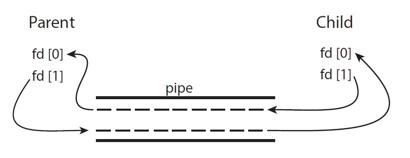
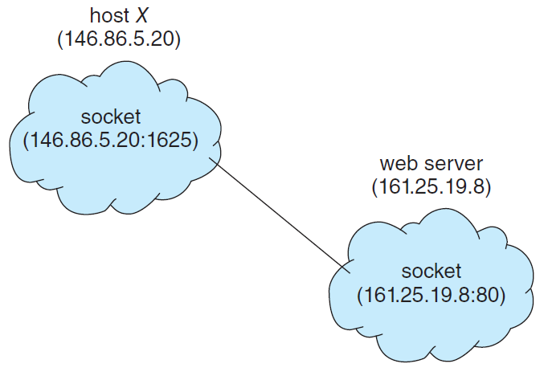

## 개요

이전글에서는 IPC의 주요한 모델 2가지인 Shared Memory 방법과 Messaging Passing 방법에 대해서 알아보았습니다. 이번글에서는 프로세스간 통신을 위해서 Shared Memory 방법과 Messaging Passing 방법을 활용한 예제를 소개하겠습니다.

## 1. IPC(Inter-Process Coummunication)의 예제

- Shared Memory 방식 : POSIX(Portable Operating System Interface) Shared Memory
    - POSIX : 서로 다른 UNIX OS의 공통 API를 정리하여 이식성 높은 유닉스 응용 프로그램을 개발하기 위한 목적으로 IEEE가 책정한 애플리케이션 인터페이스 규격
- Message Passing 방식 : Pipes
    - UNIX 시스템의 초기 IPC 메커니즘 중 하나

### 1.1 POSIX Shared Memory

아래의 예제는 POSIX Shared Memory API를 보여주는 생산자 프로세스입니다.

```c
#include <stdio.h>
#include <stdlib.h>
#include <string.h>
#include <fcntl.h>
#include <unistd.h>
#include <sys/shm.h>
#include <sys/stat.h>
#include <sys/mman.h>


int main()
{
    const int SIZE = 4096;                      // shared memory의 크기
    const char* name = "OS";                    // shared memory의 이름
    const char* message_0 = "Hello, ";
    const char* message_1 = "Shared Memory!\n";
    
    int shm_fd; // shared memory의 file 설명자
    char* ptr;  // shared memory의 pointer

    // shared memory 객체 생성
    shm_fd = shm_open(name, O_CREAT | O_RDWR, 0666);
    
    // shared memory의 크기 설정
    ftruncate(shm_fd, SIZE);

    // shared memory 객체에 매핑
    ptr = (char*) mmap(0, SIZE, PROT_READ | PROT_WRITE, MAP_SHARED, shm_fd, 0);

    // shared memory에 메시지 작성
    sprintf(ptr, "%s", message_0);
    ptr += strlen(message_0);
    sprintf(ptr, "%s", message_1);
    ptr += strlen(message_1);

    return 0;
}
```

```bash
$ gcc 3.16_shm_producer.c -lrt -o shared_producer.out
$ ./shared_producer.out
```

위와 같이 실행하면 겉으로 보기에는 아무 변화도 없을 것입니다. 하지만 shared_producer.out 실행 프로그램을 실행한 순간 공유 메모리에 메시지를 저장하였습니다.

생산자가 메시지를 생산하였기 때문에 아래의 소비자 프로세스를 구현하여 메시지를 읽습니다.

```c
#include <stdio.h>
#include <stdlib.h>
#include <string.h>
#include <fcntl.h>
#include <unistd.h>
#include <sys/shm.h>
#include <sys/stat.h>
#include <sys/mman.h>


int main()
{
    const int SIZE = 4096;                      // shared memory의 크기
    const char* name = "OS";                    // shared memory의 이름
    
    int shm_fd; // shared memory의 file 설명자
    char* ptr;  // shared memory의 pointer

    // shared memory 객체 생성
    shm_fd = shm_open(name, O_RDONLY, 0666);
    
    // shared memory 객체에 매핑
    ptr = (char*) mmap(0, SIZE, PROT_READ, MAP_SHARED, shm_fd, 0);

    // shared memory 객체 읽기
    printf("%s", (char*)ptr);

    // shared memory 제거
    shm_unlink(name);

    return 0;
}
```

```bash
$ gcc 3.17_shm_customer.c -lrt -o shared_customer.out
$ ./shared_customer.out

output
Hello, Shared Memory!
```

위와 같이 shared_customer.out 실행 프로그램을 수행하면 메시지를 읽을 수 있습니다. 다시한번 프로그램을 수행시키면 더이상 읽을 수 있는 메시지가 없어서 Segmentation fault 메시지를 받습니다. 메시지를 다시 읽기 위해서는 생산자 프로그램이 수행되어야 합니다.

### 1.2 Pipes

- 파이프(Pipe)는 초기 UNIX 시스템의 최초의 IPC 메커니즘 중 하나임
- 파이프는 두 프로세스가 통신할 수 있도록 하는 통로 역할을 수행함

**파이프(Pipe)를 구현하는데 고려할 4가지**

1. 파이프가 단방향(unidirectional) 또는 양방향(bidirectional) 통신을 할 것인가?
2. 양방향(bidirectional) 통신의 경우 반이중(half-duplex)인가 전이중(full-duplex)인가?
    - half-duplex : 한쪽 방향으로만 통신하는 파이프
    - full-duplex : 파이프 2개를 사용하여 송수신
3. 통신하는 프로세스 사이에서 관계(relationship)가 존재해야 하는가?
    - 예를 들어 부모(parent)-자식(child) 프로세스 관계
4. 파이프가 네트워크를 통해 통신하는가?

**파이프의 종류**

1. 익명 파이프(Ordinary pipes)
    - 익명 파이프는 생성된 프로세스의 외부에서 접근할 수 없음
    - 일반적으로 부모 프로세스는 파이프를 생성하여 생성한 자식 프로세스와 통신하기 위하여 사용됩니다.
2. 명명 파이프(Named pipes)
    - 명명 파이프는 부모-자식 프로세스 관계없이 접근이 가능함

**익명 파이프(Ordinary pipes)**

- 두 프로세스가 생산자-소비자 방식으로 통신함
    - 생산자(producer)가 파이프 중 하나에 정보를 생산합니다. (write end)
    - 소비자가 파이프 중 다른 하나에 정보를 소비합니다. (read end)
- 단방향(unidirectional) : 한쪽 방향으로만 통신이 가능함
- 만약 양방향 통신을 사용하고 싶다면 2개의 파이프를 사용해야함



**UNIX 시스템의 익명 파이프 구성**

- pipe(int fd[]) : pipe 배열
- fd[0] : 파이프의 수신 통로 (read용)
- fd[1] : 파이프의 송신 통로 (write용)

아래의 예제는 UNIX 시스템에서 익명 파이프를 구현한 예제입니다.

```c
#include <stdio.h>
#include <string.h>
#include <unistd.h>
#include <sys/types.h>

#define BUFFER_SIZE 25
#define READ_END 0
#define WRITE_END 1

int main()
{
    char write_msg[BUFFER_SIZE] = "Greetings";
    char read_msg[BUFFER_SIZE];
    int fd[2];
    pid_t pid;

    // pipe 생성
    pipe(fd);

    pid = fork();   // 새로운 프로세스 생성

    if(pid>0)   // 부모 프로세스(parent process)
    {
        close(fd[READ_END]);    // parent는 read할 필요없기 때문에 해제

        // pipe에 메시지 작성
        write(fd[WRITE_END], write_msg, strlen(write_msg)+1);
        close(fd[WRITE_END]);
    }
    else if(pid==0) // 자식 프로세스(child process)
    {
        close(fd[WRITE_END]);
        
        // pipe 메시지 읽기
        read(fd[READ_END], read_msg, BUFFER_SIZE);
        printf("read %s\n",read_msg);
        close(fd[READ_END]);
    }

    return 0;
}
```

```bash
$ gcc 3.21_ordinary_pipe.c -lrt -o ordinary_pipe.out
$ ./oridnary_pipe.out

output
read Greetings
```

## 2. 클라이언트(Client)-서버(Server) 시스템의 통신

### 2.1 소켓(Socket)

- 소켓은 IP Address와 Port Number가 결합된 식별자



위의 그림을 보면 web server의 ip 주소는 161.25.19.8이고 port 넘버는 80인 것을 볼 수 있습니다. 그리고 host x의 ip 주소는 146.86.5.20이고 포트넘버는 1625인 것을 알 수 있습니다. host x가 web server와 통신하기 위해서는 web server의 ip 주소와 port 넘버를 알아야 합니다.

**JAVA Socket API**

자바는 소켓에 대한 쉬운 인터페이스를 제공합니다. 자바는 Socket의 3가지 다른 타입을 제공합니다.

- Socket class : connection-oriented (TCP)
- DatagramSocket class : connectionless (UDP)
- MulticastSocket class : multiple recipients (특정한 수신자에게만 전파)

아래의 예제는 자바 언어 기반의 Socket 클래스를 사용한 예제입니다.

```java
import java.net.*;
import java.io.*;

public class DateServer{
    public static void main(String[] args) throws Exception{
        ServerSocket server = new ServerSocket(6013);

        // now listen for connections
        while(true)
        {
            Socket client = server.accept();
            PrintWriter pout = new PrintWriter(client.getOutputStream(), true);

            // socket에 Date 정보 작성
            pout.println(new java.util.Date().toString());

            // client socket 해제
            client.close();
        }
    }
}
```

```java
import java.net.*;
import java.io.*;

public class DateClient{
    public static void main(String[] args) throws Exception{
        // make connection to server socket
        Socket socket = new Socket("127.0.0.1", 6013);

        InputStream in = socket.getInputStream();
        BufferedReader br = new BufferedReader(new InputStreamReader(in));

        // read date from the socket
        String line = null;
        while((line=br.readLine())!=null)
        {
            System.out.println(line);
        }

        // close the socket connections
        socket.close();
    }
}
```

```bash
$ javac DateServer.java
$ javac DateClient.java

terminal 1
$ java DateServer

terminal 2
$ java DateClient
output
Tue Dec 28 12:12:26 KST 2021
```

### 2.2 RPC(Remote Procedure Call)

- 원격 서비스의 가장 일반적인 형태 중 하나
- 네트워크 연결이 있는 시스템간에 사용하기 위해 procedure call 메커니즘을 추상화하는 방법으로 설계됨
- 클라이언트는 로컬에서 프로시저를 호출하는 것처럼 원격 호스트에서 프로시저를 호출함
- 즉, 정리하면 RPC는 별도의 원격 제어를 위한 코딩없이 다른 주소 공간에서 함수나 프로시저를 실행할 수 있게하는 프로시저간 통신기술임

---

### Reference

> [\[인프런\] 운영체제 공룡책 강의](https://www.inflearn.com/course/%EC%9A%B4%EC%98%81%EC%B2%B4%EC%A0%9C-%EA%B3%B5%EB%A3%A1%EC%B1%85-%EC%A0%84%EA%B3%B5%EA%B0%95%EC%9D%98/dashboard)