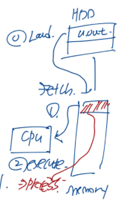
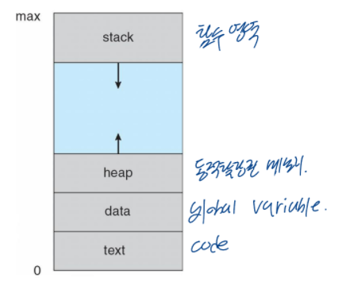
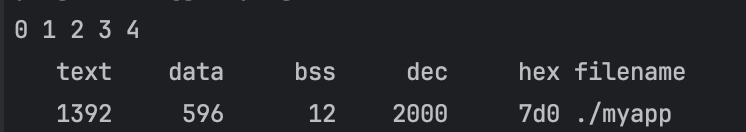
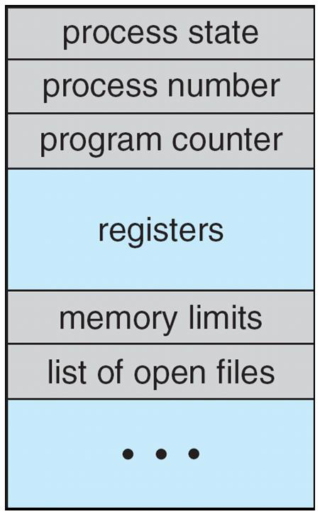
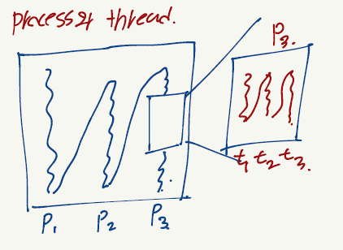
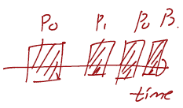
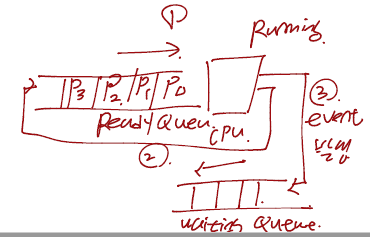
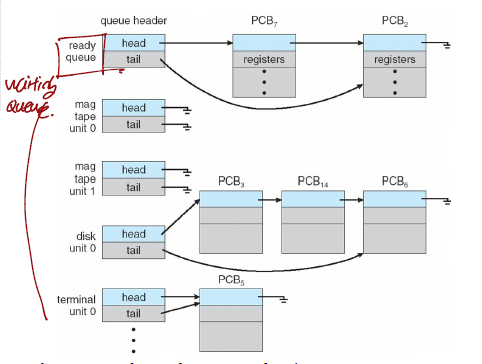
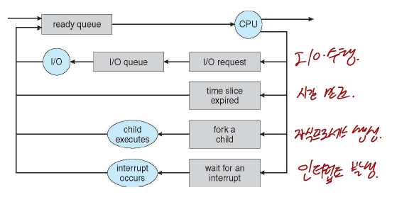
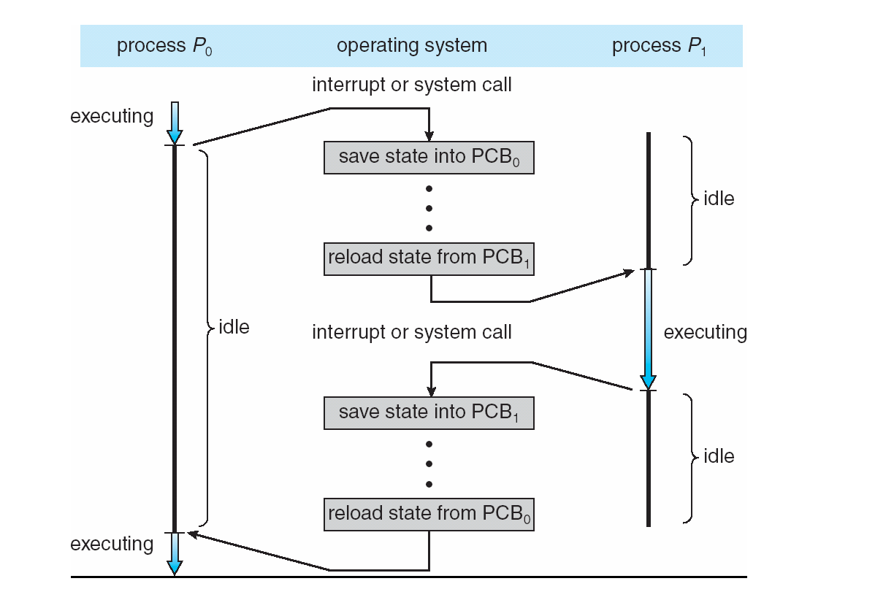

## 1. 프로세스의 개념(Process Concept)

### 1.1 프로세스란 무엇인가?

- 실행중인 프로그램
- 프로세스는 운영체제에서 프로그램을 실행하는 작업 단위를 의미함
- 프로세스는 프로세스를 실행하기 위한 작업의 최소 단위인 테스크(Task)를 완료하기 위해서 다음과 같은 자원(resources)가 필요함
    - CPU의 점유
    - 메모리(memory)
    - 파일(files)
    - 입/출력 장치(I/O devices)



위 그림을 보면 HDD와 같은 보조 기억 장치에 저장된 프로그램을 메모리로 로드합니다. 그리고 나서 CPU가 메모리 위에 있는 프로그램의 명령어들을 CPU의 내부 레지스터로 가져온 다음에 실행합니다. 

위 그림을 기반으로 프로세스를 정의한다면 메모리 위에 적재된 프로그램을 프로세스라 정의할 수 있습니다.

---

### 1.2 프로세스의 구조(Process Structure)

- Text Section : 실행가능한 코드를 저장하는 공간
- Data Section : 전역 변수를 저장하는 공간
- Heap Section : 프로그램 실행동안 동적으로 할당되는 변수가 저장되는 공간
- Stack Section : 함수가 실행되는 동안 지역변수가 저장되는 임시 공간, 대표적으로 함수 매개변수, 리턴 주소, 지역 변수 등이 포함됨



```c
#include <stdio.h>
#include <stdlib.h>

int x;
int y = 15;

int main(int argc, char *argv[])
{
    int *values;
    int i;

    values = (int *) malloc(sizeof(int)*5);

    for(i=0; i<5; i++)
    {
        values[i] = i;
    }

    for(i=0; i<5; i++)
    {
        printf("%d ", values[i]);
    }
    printf("\n");
    return 0;
}
```

- Stack Section : main, values, i
- Heap Section : (int *) malloc(sizeof(int)*5)
- Data Section
    - uninitialized data : x
    - initialized data : y
- Text Section : 코드 텍스트

아래의 그림은 위 코드를 컴파일하고 영역간의 사이즈를 출력한 결과입니다.



위 결과를 통하여 Text Section 1392, Data Section이 596을 차지하는 것을 알 수 있습니다.

---

### 1.3 프로세스의 상태(Process State)

- New : 프로세스가 생성된 상태
- Running : 프로세스가 수행되는 상태
- Waiting : 프로세스 이벤트가 발생되어 입/출력 완료를 기다리는 상태
- Ready : 프로세스가 프로세서에 의해 실행되기를 기다리는 상태(언제라도 실행 가능)
- Terminated : 프로세스 실행 종료 상태


---

### 1.4 프로세스 제어 블록(Process Control Block, PCB)

운영체제에서 각각의 프로세스는 PCB로 표현됩니다. PCB는 하나의 프로세스에 연관된 정보들을 포함합니다. 즉, PCB는 프로세스에 관한 정보 블록입니다. PCB에 포함된 정보들은 다음과 같습니다.

- 프로세스 상태(Process State) : new, ready, running, waiting, terminated 상태 중 하나에 해당됨
- 프로그램 카운터(Program Counter) : 메모리의 다음 명령어 주소를 저장함
- CPU 레지스터(CPU registers) : IR(Instruction Register), DR(Data Register), PC(Program Counter)와 같은 저장공간이 포함됨
- CPU 스케줄링 정보(CPU-scheduling information) : 프로세스 실행 순서를 정하는 정보
- 메모리 관리 정보(Memory-management information)
- 통계 정보(Accounting Information) : 프로세스의 실행, 시간 제한, 실행 ID 등에 사용되는 CPU양의 정보
- 입/출력 상태 정보(I/O status information)



---

### 1.5 프로세스(Process)와 쓰레드(Thread)의 구분

프로세스(Process)

- 한개 이상의 쓰레드를 포함하는 실행중인 프로그램
- 각 프로세스간에는 자원이 독립적으로 할당됨
- 현대의 운영체제는 멀티프로세싱으로 발전함, 따라서 운영체제의 핵심 기능은 멀티프로세싱(Multiprocessing)을 제공하는 것입니다.

쓰레드(Thread)

- 프로세스 안에 또다른 작은 프로세스를 의미하며 CPU가 프로세스를 실행시키기 위한 최소 작업 단위입니다.
- 한 프로세스 안에 포함된 쓰레드들은 프로세스의 자원을 공유합니다.



---

## 2. 프로세스의 스케줄링(Process Scheduling)

### 2.1 멀티프로그래밍(Multiprogramming)과 시분할 시스템(Time Sharing System)의 목적

멀티프로그래밍(Multiprogramming)의 목적

- 동시에 여러 프로세스를 실행하는 것
- CPU 효율 극대화

시분할 시스템(Time Sharing System)의 목적

- CPU Core가 빈번하게 프로세스들 사이에서 변경하여 사용자가 각각의 프로그램을 동시에 수행되는 것처럼 하기 위해서임



---

### 2.2 스케줄링 큐(Scheduling Queues)

- 프로세스들이 Ready 상태이고 CPU Core 위에서 실행하기 위해서 기다리다면 프로세스들은 Ready Queue에 삽입됩니다.
- 특정한 이벤트가 발생되기를 기다리는 프로세스들은 Wait Queue에 위치합니다.
- Ready Queue 또는 Wait Queue와 같은 큐들은 일반적으로 PCB들의 연결리스트에서 구현됩니다.



아래 그림은 Ready Queue와 Wait Queue들을 표현한 것입니다



아래 그림은 프로세스 스케줄링을 일반적으로 나타내는 대기열 다이얼그램 그림입니다.



---

### 2.3 문맥 교환(Context Switch)란 무엇인가?

- 프로세스에서 문맥(Context)이란 마지막에 수행했던 명령어 위치입니다.
- 프로세스의 문맥(Context)은 PCB에 표시됨
- 인터럽트가 발생했을 때 운영체제는 현재 수행중인 프로세스의 문맥을 저장, 그리고 후에 다시 그 프로세스를 수행할 때 저장했던 문맥을 복구합니다.
- Context Switch
    - CPU Core를 다른 프로세스에게 양도하는 것
    - 현재 프로세스의 상태를 저장함
    - Context Switch하게되면 다른 Process Context를 복원함

아래 그림은 프로세스 P0와 P1의 Context Switch를 표현한 것입니다.



위의 그림과 같이 프로그램을 실행하다가 인터럽트 또는 시스템 콜이 발생하면 현재 프로세스의 상태를 PCB에 저장합니다. 그리고 다른 프로세스를 수행하기 위해서 또 다른 PCB에서 문맥(상태)을 복원하여 수행합니다.

---

### Reference

> [\[인프런\] 운영체제 공룡책 강의](https://www.inflearn.com/course/%EC%9A%B4%EC%98%81%EC%B2%B4%EC%A0%9C-%EA%B3%B5%EB%A3%A1%EC%B1%85-%EC%A0%84%EA%B3%B5%EA%B0%95%EC%9D%98/dashboard)