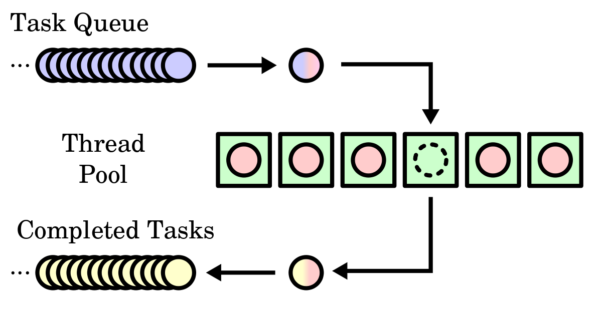
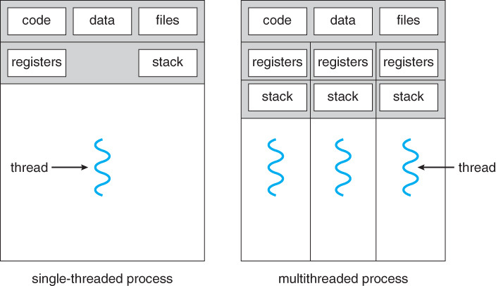
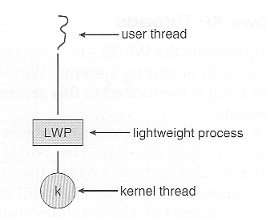

>학습목표
>1. 다중 쓰레드 프로그램에서 고려해야 할 쓰레드 관련 문제들이 무엇인지 학습

## 4. 쓰레드와 관련된 문제들(Threading Issues)

다중 쓰레드 프로그램을 사용할때 고려해야할 점들은 다음과 같습니다.

- 쓰레드의 fork() 및 exec() 시스템 호출 문제
- 쓰레드의 취소(Cancellation)
- 쓰레드의 신호 처리(Signal Handling)
- 쓰레드 풀(Thread pool)
- 쓰레드별 데이터(Thread-Specific Data)
- 스케줄러 활성화(Scheduler Activation)

---

### 4.1 쓰레드의 fork() 및 exec() 시스템 콜 호출

**fork()**

fork() 시스템 콜을 호출하면 새로운 프로세스 공간을 별도로 생성하고, fork() 시스템 콜을 호출한 부모 프로세스 공간의 데이터들을 모두 복사합니다.

위 설명은 프로세스(단일 쓰레드)가 fork()를 수행할때 결과입니다. 문제는 다중 쓰레드 프로세스의 환경에서 한 쓰레드가 fork()를 수행하면 어떻게 되는가? 입니다. 두가지 케이스로 나뉩니다.

1. 부모 프로세스가 사용하는 모든 쓰레드를 복사함
2. 부모 프로세스에서 fork()를 호출한 쓰레드만 복사함

위 두 버전의 fork() 중 어느 것을 선택할 것인지는 응용 프로그램에게 달려 있습니다.

**exec()**

exec() 시스템 콜 호출은 유닉스,리눅스 시스템 콜 중 하나입니다. exec() 시스템 콜을 호출한 현재 프로세스 공간의 TEXT, DATA, BSS 영역을 새로운 프로세스의 이미지로 대체합니다. 따라서 exec() 시스템 콜을 호출하면 별도의 프로세스 공간을 생성하지 않고 exec()의 매개변수로 지정한 프로세스로 대체합니다.

---

**만약 어떤 프로세스안의 쓰레드가 fork()를 호출한 다음 exec()를 호출한다면 어떻게 설계하는게 좋은가?**

case 1 : 부모 프로세스가 사용하는 모든 쓰레드를 복사함

- 결과 : 모든 쓰레드를 복사하고 exec() 호출하여 새로운 프로세스로 대체됨

case 2 : 부모 프로세스에서 fork()를 호출한 쓰레드만 복사함

- 결과 : fork()를 호출한 쓰레드만 복사된 다음 exec()를 호출하여 새로운 프로세스로 대체됨

위와 같은 경우에는 case1보다는 case2를 선택하는 것이 적절하다고 생각합니다. 하지만 위의 예시와는 다르게 fork()를 호출한 다음 exec()를 호출하지 않는다면 새로운 프로세스는 모든 쓰레드를 복사해야 할 수도 있습니다. 

정리하면 위와 같이 다중 쓰레드 프로세스를 설계할때 fork()와 exec() 시스템 콜을 사용해야 할 일이 있다면 fork()할때 부모 프로세스의 모든 쓰레드를 복사할지 말지에 대해서 고려해야 합니다.

---

### 4.2 쓰레드 취소(Thread Cancellation)

쓰레드 취소란 쓰레드가 끝나기 전에 그것을 강제 종료시키는 행위를 의미합니다. 예를 들어 여러 쓰레드들이 데이터베이스를 병렬로 검색하고 있다가 원하는 결과를 찾았다면 나머지 쓰레드들은 취소되어도 됩니다. 이와 같은 나머지 쓰레드들과 같이 취소되어야 할 쓰레드를 목적 쓰레드(target thread)라 부릅니다.

**목적 쓰레드 취소의 두가지 방식**

1. 비동기식 취소(asynchronous cancellation) : 한 쓰레드가 즉시 목적 쓰레드를 강제 종료
2. 지연 취소(deterred cancellation) : 목적 쓰레드가 주기적으로 자신이 강제 종료되어야 할 시기를 점검함.

위와 같이 비동기식 취소는 즉시 강제 종료되는데 반해 지연 취소 방식은 목적 쓰레드가 질서 정연하게 강제 종료될 수 있는 기회가 만들어집니다.

---

**왜 목적 쓰레드의 비동기식 취소 방식은 문제가 되는가?**

첫번째는 목적 쓰레드에게 할당된 자원때문입니다. 왜냐하면 목적 쓰레드들이 갑자기 강제 종료가 된다면 할당된 자원들이 올바르게 해제되지 않을 수 있기 때문입니다.

두번째는 목적 쓰레드가 다른 쓰레드와 공유하는 자료 구조를 갱신하는 도중에 취소 요청이 올때 문제가 발생할 수 있습니다. 이러한 경우 갱신되어야할 자료가 올바르게 갱신되지 않을 수 있습니다. 

위와 같이 비동기식 취소 방식으로 목적 쓰레드들을 취소한다면 시스템 자원을 다 사용 가능한 상태로 만들지 못할 수 도 있기 때문에 목적 쓰레드의 비동기식 취소 방식은 문제가 될 수 있습니다.

---

**목적 쓰레드의 지연 취소 방식의 권장 이유**

지연 취소 방식의 경우 한 쓰레드가 목적 쓰레드가 취소 에정이라고 표시하지만 실제 취소는 목적 쓰레드가 취소 여부를 결정하기 위하여 플래그를 검사한 이후에야 일어납니다.

위와 같이 수행되면 쓰레드들은 자신이 취소되어도 안전하다고 판단되는 시점에 취소 여부를 검사할 수 있습니다.

Pthread 쓰레드 라이브러리에서는 이러한 지점을 취소점(cancellation point)이라고 부릅니다.

---

### 4.3 쓰레드의 신호 처리(Signal Handling)

다중 쓰레드 프로세스를 사용할 때 고려해야할 점은 신호(동기식 신호/비동기식 신호)가 발생하면 어느 쓰레드에게 신호를 전달해야하는가를 고려해야합니다.

**신호(Signal)란 무엇인가?**

신호는 운영체제에서 프로세스에게 어떤 사건이 일어났음을 알려주기 위해 사용되는 것입니다. 신호의 종류에는 동기식 신호와 비동기식 신호로 나뉠 수 있습니다.

- 동기식 신호 : 실행중인 프로그램이 불법적인 메모리 접근, 0으로 나누기 등의 행위를 하였을때 발생함. 동기식 힌호는 신호를 발생시킨 연산을 수행한 동일한 프로세스에게 전달됨.
- 비동기식 신호 : 프로세스 외부로부터 신호가 발생하여 프로세스에게 신호를 순서를 무시하고 전달하는 신호입니다. 
    - 대표적인 예시는 Ctrl+C와 같은 키를 눌러서 프로세스를 강제로 종료시키는 신호 또는 타이머 만료 등이 있습니다.

**신호 처리기의 종류**

1. 디폴트 신호 처리기 : 모든 신호마다 커널에 의해 실행되는 처리기
2. 사용자 정의 신호 처리기 : 특정 신호에 사용자가 정의한 방식으로 처리되는 처리기
    - 신호는 다른 방식으로 처리될 수 있음
    - 불법적인 메모리 접근 같은 신호는 강제 종료시켜 처리할 수 있음

**왜 다중 쓰레드 프로세스는 신호 처리를 고려해야 하는가?**

단일 쓰레드 프로세스의 신호 처리는 간단합니다. 신호가 들어오거나 단일 쓰레드에서 발생하면 신호는 항상 단일 쓰레드에게 전달하면 되기 때문입니다.  그러나 다중 쓰레드 프로세스에서 신호가 발생하면 여러 쓰레드를 가지고 있는 다중 쓰레드 프로그램에서의 신호 처리는 더욱 복잡합니다. 문제는 어느 쓰레드에게 신호를 전달해야 하는가? 입니다.

**다중 쓰레드 프로세스에서 신호 발생시 전달 쓰레드 선택의 경우**

1. 신호가 적용될 쓰레드에게 전달 (단일)
2. 모든 쓰레드에게 전달
3. 몇몇 쓰레드들에게만 선택적으로 전달
4. 특정 쓰레드가 모든 신호를 전달받도록 지정

동기식 신호 - 신호가 적용될 쓰레드에게 전달     
비동기식 신호 - 모든 쓰레드에게 전달

다중 쓰레드 UNIX는 몇몇 쓰레드들에게만 선택적으로 전달이 가능함

Windows는 신호를 명시적으로 지원하지는 않지만 비동기식 프로시저 호출(Asynchronous Procedure Call, APC)를 사용해서 대리 실행합니다.

**비동기식 프로시저 호출이란 무엇인가?**

사용자 쓰레드들이 특정 사건의 발생을 전달받을때 호출될 함수를 지정할 수 있게하는 것입니다.

정리하면 다중 쓰레드 프로세스에서 동기식 신호를 받을 때는 신호를 야기한 쓰레드에게만 전달하고 프로세스 외부로부터 오는 비동기식 신호는 모든 쓰레드에게 전달합니다. 하지만 다중 쓰레드 UNIX는 비동기식 신호를 몇몇 쓰레드에게 선택적으로 전달 할 수 있습니다. Windows 같은 경우는 비동기식 프로시저 호출(APC)를 사용하여 특정 쓰레드에게만 전달합니다.

따라서 다중 쓰레드 프로그램을 설계할때 신호를 받았을때 어느 쓰레드(단일/전부/선택적)에게 전달할 것인지, 신호를 전달받으면 어떻게 처리(무시/강제종료)할 것인지 고려해야 합니다.

---

### 4.4 쓰레드 풀(Thread pool)

웹 서버는 클라이언트로부터 요청을 받을때마다 새로운 쓰레드를 만들어 줍니다. 이것은 프로세스를 생성하는 것보다는 더 좋은 방법이지만 다중 쓰레드 서버는 여러 문제를 가지고 있습니다.

첫번째 문제는 서비스를 수행할때마다 쓰레드를 생성하는데 소요되는 시간입니다. 두번째 문제는 모든 요청마다 새 쓰레드를 생성하여 서비스한다면 시스템에서 동시에 실행할 수 있는 최대 쓰레드의 한계수를 정해야 합니다. 쓰레드의 개수를 무한정 만들면 CPU 시간, 메모리 공간같은 시스템 자원이 고갈될 것입니다. 이러한 문제를 해결하기 위해서 사용되는 방법 중 하나가 쓰레드 풀(Thread pool)입니다.

**쓰레드 풀이란 무엇인가?**

쓰레드 풀의 방식은 프로세스를 생성할 때 아예 일정한 수의 쓰레드들을 미리 풀(pool)로 만들어 두는 것입니다. 풀(pool)의 느낌은 풀장의 풀처럼 어느 공간에 미리 생성된 쓰레드들이 풀에 있다가 요청이 들어오면 풀에 있는 쓰레드 하나가 서비스를 하고 다시 풀에 복귀하는 개념입니다. 만약 풀에 쓰레드가 없다면 서버는 풀에 쓰레드가 생길때까지 대기하여야 합니다.



**쓰레드 풀의 장점**

1. 새 쓰레드를 만들어 주기보다 기존 쓰레드로 서비스해 주는 것이 빠름
2. 쓰레드 풀은 임의 시각에 존재할 쓰레드 개수에 제한을 둠. 이러한 제한은 많은 수의 쓰레드를 병렬 처리할 수 없는 시스템에 도움을 줌

**Java언어 기반 쓰레드 풀 예제**

```java
public class ThreadPool implements Runnable {
	private String threadName;

	public ThreadPool(String threadName) {
		this.threadName = threadName;
	}

	@Override
	public void run() {
		System.out.println(Thread.currentThread().getName()+"의"+threadName+"이 시작되었습니다.");
		try {
			Thread.sleep(2000);
		} catch (InterruptedException e) {
			e.printStackTrace();
		}
		System.out.println(Thread.currentThread().getName()+"가 종료되었습니다.");
	}

	@Override
	public String toString() {
		return this.threadName;
	}

}


public class Driver {

	public static void main(String[] args) throws InterruptedException {
		// 5개의 pool을 고정함
		ExecutorService pool = Executors.newFixedThreadPool(5);
		
		IntStream.range(1, 10).forEach(i->{
			Runnable thread = new ThreadPool("SleepThread"+i);
			pool.execute(thread);
		});
		
		// ExecutorService 종료
		pool.shutdown();
		
		// ExecutorService가 종료될때까지 대기
		while(!pool.isTerminated())
		{
			
		}
		
		System.out.println("모든 Thread가 종료되었습니다.");
		
	}

}
```

```bash
pool-1-thread-1의SleepThread1이 시작되었습니다.
pool-1-thread-3의SleepThread3이 시작되었습니다.
pool-1-thread-2의SleepThread2이 시작되었습니다.
pool-1-thread-5의SleepThread5이 시작되었습니다.
pool-1-thread-4의SleepThread4이 시작되었습니다.
pool-1-thread-3가 종료되었습니다.
pool-1-thread-3의SleepThread6이 시작되었습니다.
pool-1-thread-1가 종료되었습니다.
pool-1-thread-1의SleepThread7이 시작되었습니다.
pool-1-thread-2가 종료되었습니다.
pool-1-thread-4가 종료되었습니다.
pool-1-thread-5가 종료되었습니다.
pool-1-thread-4의SleepThread9이 시작되었습니다.
pool-1-thread-2의SleepThread8이 시작되었습니다.
pool-1-thread-1가 종료되었습니다.
pool-1-thread-3가 종료되었습니다.
pool-1-thread-4가 종료되었습니다.
pool-1-thread-2가 종료되었습니다.
모든 Thread가 종료되었습니다.
```

---

### 4.5 쓰레드별 데이터(Thread-Specific Data)

다중 쓰레드 프로그래밍의 큰 장점중 하나로는 프로세스의 자원을 각각의 쓰레드들이 공유한다는 점입니다. 그러나 경우에 따라서는 쓰레드만이 가지고 있는 자원을 가져야 할 때도 있습니다. 쓰레드만이 가지고 있는 자원을 쓰레드별 데이터라고 합니다. 



---

### 4.6 스케줄러 활성화(Scheduler Actication)

다중 쓰레드 프로그램을 설계할때 고려할 문제중 하나로 쓰레드 라이브러리와 커널간의 통신 문제가 있습니다. 이 통신 문제는 다대다 및 두 수준 모델에서 반드시 고려해야할 문제입니다. 이러한 통신의 조정은 응용 프로그램이 성능을 위하여 커널 쓰레드의 수를 동적으로 조절하는 것을 가능하게 합니다.

다대다 또는 두 수준 모델을 구현하는 많은 시스템들은 사용자와 커널 쓰레드 사이에 중간 자료 구조를 배치합니다. 이 자료 구조를 통상 경량 프로세스 또는 LWP(Lightweight Process)라고 부릅니다.



LWP(경량 프로세스)는 사용자 쓰레드와 커널 쓰레드를 연결해주는 커널에서 응용 프로그램에 제공하는 자료구조입니다. 응용 프로그램의 입장에서 보면 LWP는 사용자 쓰레드를 수행하기 위하여 스케줄링의 대상이 되는 가상 처리기(Virtual Processor)처럼 보일 것입니다.

사용자 쓰레드와 커널 쓰레드가 연결되면 입/출력이 완료되기를 기다리는 동안 커널 쓰레드가 봉쇄되면 LWP, 사용자 쓰레드도 같이 봉쇄된다.

응용 프로그램은 효율적으로 실행되기 위하여 임의 개수의 LWP를 필요로 할 수도 있습니다. 예를 들어 서로 다른 5개의 파일 읽기 요청이 발생하였을 때 모든 LWP가 입/출력 완료를 기다리면서 커널 안에서 대기 할 수 있기 때문에 5개의 LWP가 필요합니다. 만약 프로세스가 4개의 LWP만을 가지고 있다면 다섯번째 요청은 하나의 LWP라도 커널에서 복귀할때까지 대기하여야 합니다.

**스케줄러 활성화란 무엇인가?**

사용자 쓰레드 라이브러리와 커널 쓰레드간의 통신을 하는 방법입니다. 스케줄러 활성화를 사용하는 이유는 커널은 커널 쓰레드 레벨에 대해 알고 있지만 응용 프로그램은 커널 스레드 레벨에 대해 부족한 정보를 가지고 있습니다. 반대로 커널도 시스템 콜로만 알수 있고 사용자 쓰레드 레벨에 대한 부족한 정보를 가지고 있습니다. 그래서 응용 프로그램과 커널 사이에 정보를 원할히 교환할 할 수 있는 방법이 필요한데 이 방법이 스케줄러 활성화 방법입니다.

**스케줄러 활성화 방법**

1. 커널은 응용 프로그램에게 가상 처리기(LWP)의 집합을 제공함
L2. WP의 집합을 받은 응용 프로그램은 사용자 쓰레드를 사용이 가능한 가상 처리기로 스케줄링함
3. 사용자 쓰레드가 수행 도중 커널은 응용 프로그램에게 특정 사건에 대한 메시지를 보냄 (upcall)
    - upcall은 커널이 응용 프로그램에게 특정 사건에 대한 메시지를 보내는 행위를 의미함 (반대로 응용 프로그램이 커널에게 메시지를 보내는 것을 system call이라고 함)
    - upcall은 쓰레드 라이브러리에 존재하는 upcall 처리기에 의해 처리됨
    - upcall 처리기는 가상 처리기에서 실행됨
4. 응용 프로그램은 커널로부터 새로운 가상 처리기를 할당받음.
5. 가상 처리기 위에서 upcall 처리기를 실행함
6. upcall 처리기는 봉쇄 쓰레드의 상태 저장 및 봉쇄 쓰레드가 실행중이던 가상 처리기를 반환
7. upcall 처리기는 실행 가능한 다른 커널 쓰레드를 스케줄링

예를 들어 upcall을 일으키는 특정 사건을 예시로 든다면 upcall은 사용자 쓰레드가 봉쇄(입/출력같은 이벤트)하려고 할때 발생할 수 있습니다. 이때 upcall을 처리하는 과정은 다음과 같습니다.

1. 사용자 쓰레드가 봉쇄되려고 할때 커널은 쓰레드가 봉쇄하려고 한다는 사실과 그 쓰레드의 식별자를 알려주는 upcall을 수행함
2. 커널은 새로운 가상 처리기(LWP)를 응용 프로그램에게 할당함
3. 응용 프로그램은 새로 할당 받은 가상 처리기에서 upcall처리기를 올려두고 수행함
4. upcall 처리기는 봉쇄 쓰레드의 상태를 저장하고 봉쇄 쓰레드가 실행중이던 가상 처리기를 반환함
5. upcall 처리기는 새로운 가상 처리기에서 실행 가능한 다른 커널 쓰레드를 스케줄링함
6. 봉쇄 쓰레드가 기다리던 사건이 발생하면 커널은 이전에 봉쇄되었던 사용자 쓰레드가 이제 실행 가능하다는 사실을 알려주는 또 다른 upcall을 쓰레드 라이브러리에게 전송함
7. 또 다른 upcall을 처리하기 위해서 커널은 새로운 가상 처리기를 할당한 다음 사용자 쓰레드를 하나 할당하여 새로운 가상 처리기에서 upcall 처리기를 실행함
8. 봉쇄가 풀린 쓰레드를 실행 가능 상태로 표시한 후에 응용 프로그램은 사용 가능한 가상 처리기 상에서 다른 실행 가능한 쓰레드를 실행합니다.

---

### Reference

> [\[인프런\] 운영체제 공룡책 강의](https://www.inflearn.com/course/%EC%9A%B4%EC%98%81%EC%B2%B4%EC%A0%9C-%EA%B3%B5%EB%A3%A1%EC%B1%85-%EC%A0%84%EA%B3%B5%EA%B0%95%EC%9D%98/dashboard)