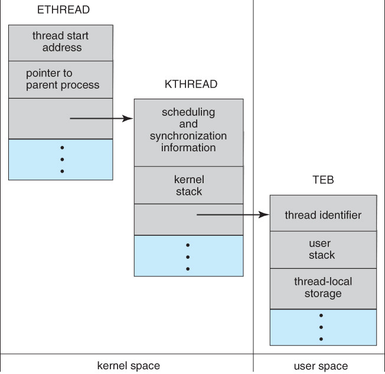
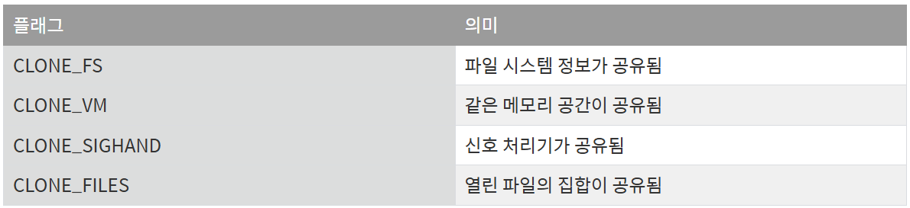

>학습목표
>1. Windows XP에서 쓰레드를 어떻게 구현하는지 학습
>2. Linux에서 쓰레드를 어떻게 구현하는지 학습

### 5.1 Windows XP Thread

쓰레드의 일반적인 구성요소는 다음과 같습니다.

- 쓰레드 ID : 각각의 쓰레드를 유일하게 식별
- 레지스터 집합 : 처리기의 상태를 나타냄
- 사용자 스택 : 사용자 모드에서 실행할 때 저장공간
- 커널 스택 : 커널 모드에서 실행할 때 저장공간
- 쓰레드별 데이터 : 각각의 쓰레드만이 갖고 있는 저장 영역

**쓰레드의 자료구조**

- ETHREAD : 실행 쓰레드 블록(executive thread block)
- KTHREAD : 커널 쓰레드 블록(kernel thread block)
- TEB : 쓰레드 환경 블록(thread environment block)

**ETHREAD**

ETHREAD의 주요 내용으로는 그 쓰레드가 속한 프로세스를 가리키는 포인터와 그 쓰레드가 실행을 시작해얗 할 루틴의 주소 등이 있습니다. 이외에도 ETHREAD는 KTHREAD에 대한 포인터도 가지고 있습니다.

**KTHREAD**

쓰레드의 스케줄링 및 동기화 정보를 가지고 있습니다. 그리고 커널 스택과 TEB에 대한 포인터를 가지고 있습니다.

**TEB**

사용자 모드에서 실행될 때 접근되는 사용자 공간 자료 구조이다. 쓰레드 ID, 유저 스택, 쓰레드별 데이터를 갖고 있습니다.

아래의 그림은 Windows XP 쓰레드의 자료구조입니다. ETHREAD와 KTHREAD는 모두 커널 영역 안에 존재하고 커널만이 접근할 수 있습니다.

---

### 5.2 Linux Thread

Linux는 fork() 시스템 콜을 이용하여 프로세스를 복제하거나 clone() 시스템 콜을 이용하여 쓰레드를 생성할 수 있는 기능을 제공합니다. 그러나 Linux는 프로세스와 쓰레드를 구별하지 않습니다. Linux는 프로그램 내의 흐름을 나타내기 위하여 프로세스나 쓰레드보다 테스크라는 용어를 사용합니다. clone() 시스템 콜이 호출될 때, 플래그의 집합이 전달되고 이 플래그들이 부모와 자식 테스크간의 얼마만큼의 공유를 허용하는지 결정합니다. 그 중 일부 플래그들이 아래에 나열되어 있습니다.

Linux 커널이 테스크를 표현하는 방식 때문에 다양한 공유 수준이 가능합니다. 시스템의 테스크마다 고유한 커널 자료구조가 존재합니다. 이 자료 구조는 테스크의 자료를 저장하는 것이 아니라 저료가 저장되어 있는 다른 자료 구조를 가리키는 포인터를 포합합니다.

---

### Reference

> [\[인프런\] 운영체제 공룡책 강의](https://www.inflearn.com/course/%EC%9A%B4%EC%98%81%EC%B2%B4%EC%A0%9C-%EA%B3%B5%EB%A3%A1%EC%B1%85-%EC%A0%84%EA%B3%B5%EA%B0%95%EC%9D%98/dashboard)