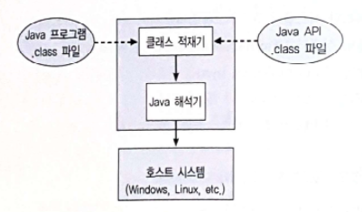

>학습목표
>1. POSIX Pthread 라이브러리를 활용하여 실습
>2. Java 쓰레드 라이브러리를 활용하여 실습

## 3. 쓰레드 라이브러리(Thread Library)

쓰레드 라이브러리는 프로그래머에게 쓰레드를 생성하고 관리하기 위한 API를 제공합니다.

**쓰레드 라이브러리 구현 방법**

- 커널 지원없이 사용자 공간에서만 라이브러리를 제공
- 운영체제에 의해 지원되는 커널 수준 라이브러리를 구현

**대표적인 쓰레드 라이브러리**

- POSIX Pthread
- Windows
- Java

### 3.1 Pthread

Pthread는 POSIX(IEEE 1003.1c)가 쓰레드 생성과 동기화를 위해 제정한 표준 API입니다. Solaris, Linux, Mac OS 및 Tru64 UUNIX를 포함한 많은 시스템들이 Pthread 명세를 구현하고 있습니다.

아래의 예제는 Pthread API를 사용하는 다중 쓰레드 C 프로그램입니다.

```c
// the data shared by the threads
int sum;

// thread call this function
// java api에서는 run method
void * runner(void* param);

int main(int argc, char* argv[])
{
    pthread_t tid; // thread identifier
    pthread_attr_t attr;    // thread attributes

    if(argc!=2)
    {
        fprintf(stderr, "usage: a.out <integer value>\n");
        return -1;
    }
    if(atoi(argv[1])<0)
    {
        fprintf(stderr,"%d must be >= 0\n",atoi(argv[1]));
        return -1;
    }

    pthread_attr_init(&attr);    // attr 초기화
    pthread_create(&tid, &attr, runner, argv[1]);   // 쓰레드 생성
    pthread_join(tid, NULL);    // tid 쓰레드 대기

    printf("sum = %d\n", sum);
}

void *runner(void* param)
{
    int i, upper = atoi(param);
    sum = 0;
    for(i=0; i<=upper; i++)
    {
        sum += i;
    }
    pthread_exit(0);
}
```

```bash
~ $ gcc -pthread 4.11_pthread.c
~ $ ./a.out 5

Output
sum = 15
```

위 코드에서 쓰레드는 2개가 생성됩니다. 하나는 main() 함수를 실행하는 쓰레드이고 다른 하나는 runner를 실행하는 쓰레드입니다. main() 함수는 runner() 함수를 실행하는 두번째 쓰레드를 생성합니다. 여기서 주목할 점은 두 쓰레드 모두 sum이라는 전역변수를 공유한다는 점입니다.

- pthread_t tid : 생성할 쓰레드를 위한 식별자 선언, 각각의 쓰레드는 스택의 크기와 스케줄링 정보를 포함한 속성의 집합을 소유
- pthread_attr_t attr : 쓰레드를 위한 속성을 나타냄
- pthread_attr_init(&attr) : attr이 가리키는 주소에 속성을 지정함, 여기서 default 속성을 지정함
- pthread_create(&tid, &attr, runner, argv[1]) : 식별자, 속성, 실행할 함수, 실행할 함수의 매개변수를 지정하여 쓰레드를 생성함

main 함수를 실행하는 부모 쓰레드는 pthread_join() 함수를 호출하여 자식 쓰레드가 종료되기를 기다립니다. 자식 쓰레드가 runner 함수를 마치고 복귀하면 부모 쓰레드는 공유 데이터인 sum의 값을 출력하고 실행을 종료합니다.

### 3.2 Java 쓰레드 (Java Thread)

모든 Java 프로그램은 적어도 하나의 단일 제어 쓰레드를 포함하고 있습니다. 단지 main() 메서드로만 이루어진 단순한 Java 프로그램조차 JVM 내의 하나의 단일 쓰레드로 수행됩니다. main 메서드를 실행하는 단일 쓰레드를 넘어서 추가적인 쓰레드를 생성하는 방법은 아래와 같습니다.

**Java언어 기반 쓰레드 생성 방법**

- Thread 클래스를 상속받아 run() 메서드를 오버라이드 하는 방법
- Runnable 인터페이스를 구현하는 클래스를 정의하고 run 메서드를 구현하는 방법
Thread 객체를 생성하는 것은 구체적으로 새 쓰레드를 생성하는 것이 아닙니다. 오히려 새로운 쓰레드를 실제로 생성하는 것은 start() 메서드입니다. 새로운 객체를 위해 start() 메서드를 호출하면 다음과 같은 두 가지 작업을 수행합니다.

1. 메모리가 할당되고, JVM 내에 새로운 쓰레드가 초기화됨
2. run() 메서드를 호출하면 쓰레드가 JVM에 의해 수행될 자격을 갖게 합니다.

- 주의사항으로는 run() 메서드를 직접 호출하지 않는 것입니다. start() 메서드를 호출하여야 합니다. 그러면, start() 메서드가 우리를 대신하여 run() 메서드를 호출할 것입니다.

### 3.2.1 Thread 클래스 상속 방법

```java
public class MyThread1 extends Thread{

	@Override
	public void run() {
		try 
		{
			while(true)
			{
				System.out.println("Hello, Thread!");
				Thread.sleep(500);
			}
		}
		catch(InterruptedException ie) {
			System.out.println("I'm interruptedException");
		}
	}
	
	public static void main(String[] args)
	{
		MyThread1 thread = new MyThread1();
		thread.start();
		System.out.println("Hello, my child");
	}
	
}
```

```bash
Hello, my child
Hello, Thread!
Hello, Thread!
Hello, Thread!
Hello, Thread!
Hello, Thread!
Hello, Thread!
... 0.5마다 "Hello, Thread!" 출력
```

### 3.2.2 Runnable 인터페이스 구현 방법

```java
public class MyThread2 implements Runnable{

	@Override
	public void run() {
		try 
		{
			while(true)
			{
				System.out.println("Hello, Runnable!");
				Thread.sleep(500);
			}
		}
		catch(InterruptedException ie) {
			System.out.println("I'm interruptedException");
		}
	}
	
	public static void main(String[] args)
	{
		Thread thread = new Thread(new MyThread2());
		thread.start();
		System.out.println("Hello, My Runnable Child");
	}
	
}
```

```bash
Hello, My Runnable Child
Hello, Runnable!
Hello, Runnable!
Hello, Runnable!
... 0.5마다 "Hello, Runnable!" 출력
```

### 3.3 JVM(Java Virtual Machine)과 호스트 운영체제

JVM의 전형적인 구현은 호스트 운영체제 위에서 구현됩니다. 아래의 그림은 운영체제 위에 JVM이 올라간 모습입니다.



위 구조는 JVM이  하부의 운영체제 구현이 세세한 내용을 감추도록 하고, Java 프로그램이 JVM을 지원하는 어떠한 플랫폼에서도 작동할 수 있도록 하는 일관되고 추상적인 환경을 제공합니다.

Java 쓰레드는 사용자 수준 쓰레드로 간주되며, JVM은 이러한 쓰레드 관리를 수행합니다. JVM은 운영체제에 따라서 다중 쓰레드 모델을 다르게 매핑시킵니다. 예를 들어 Windows 계열에서는 다중 쓰레드 모델로 일대일 모델을 사용하는데 JVM의 각각의 쓰레드들은 각각의 커널 쓰레드로 매핑됩니다. 반대로 다대다 모델을 사용하는 운영체제에서는 쓰레드들이 다대다 모델에 맞게 매핑될 수 있습니다.

정리하면 JVM에서 관리하는 Java 쓰레드 라이브러리로 생성한 쓰레드들은 각 운영체제에서 사용하는 다중 쓰레드 모델에 맞추어서 매핑되도록 수행합니다.

---

### Reference

> [\[인프런\] 운영체제 공룡책 강의](https://www.inflearn.com/course/%EC%9A%B4%EC%98%81%EC%B2%B4%EC%A0%9C-%EA%B3%B5%EB%A3%A1%EC%B1%85-%EC%A0%84%EA%B3%B5%EA%B0%95%EC%9D%98/dashboard)