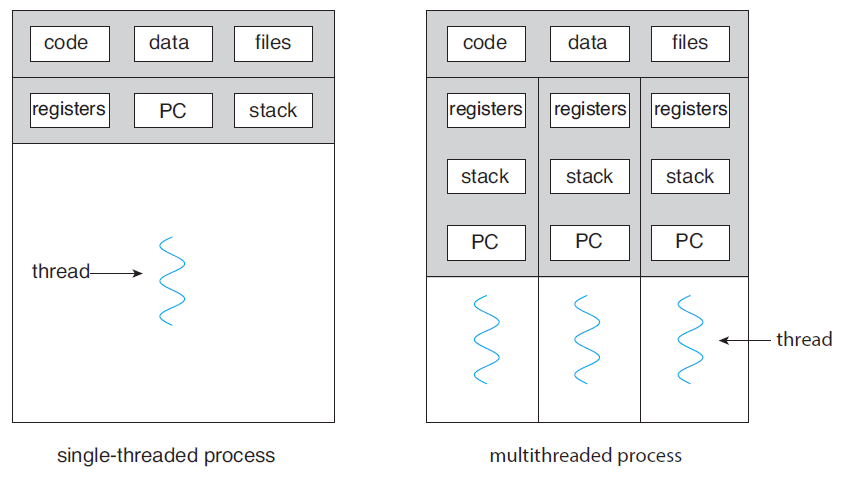

>학습목표
>1. 다중 쓰레드 컴퓨터 시스템의 기초를 이루는 CPU 이용의 기본 단위인 쓰레드를 학습함
>2. 쓰레드의 사용 이유와 장점에 대해서 학습함

## 1. 쓰레드(Thread)란 무엇인가?

쓰레드는 CPU 이용의 기본 단위입니다. 쓰레드는 다른 말로 경량(lightweight) 프로세스라고 불립니다. 일반적인 프로세스는 하나의 제어 쓰레드를 가지고 있습니다. 이와 같은 프로세스를 중량(heavyweight) 프로세스라고 부릅니다. 일반적으로 하나의 제어 쓰레드를 가지고 있는 중량 프로세스는 한번에 한가지의 작업만을 수행합니다. 하지만 만약에 하나의 프로세스에 여러개의 쓰레드가 존재한다면, 프로세스는 동시에 하나 이상의 작업들을 수행할 수 있을 것입니다. 즉, 정리하면 쓰레드는 한 프로세스안에서 동시에 여러 작업들을 수행할 수 있게 해주는 프로세스 안의 작은 프로세스(경량 프로세스 또는 쓰레드)입니다.

아래의 그림은 단일 쓰레드 프로세스와 다중 쓰레드 프로세스의 차이점을 보여주고 있습니다.

위 그림에서 왼쪽은 단일 쓰레드 프로세스이고 오른쪽은 다중 쓰레드 프로세스인 것을 볼 수 있습니다. 오른쪽의 다중 쓰레드 프로세스 그림에서 각각의 쓰레드들은 쓰레드 ID, 프로그램 카운터(Program Counter, PC), 레지스터 집합(Register Set), 스택(Stack)으로 구성된 것을 볼 수 있습니다. 그리고 쓰레드는 같은 프로세스에 속한 다른 쓰레드와 코드(code), 데이터(data) 영역, 열린 파일이나 신호와 같은 운영체제의 자원들을 공유합니다.

### 1.1 쓰레드의 사용 이유(Motivation)

쓰레드의 사용 이유로 예를 들어 성적 계산기라는 프로그램이 있다고 가정합니다. 성적 계산기는 학생의 국어, 수학, 영어 성적의 평균과 최대값, 최소값을 출력하는 프로그램입니다. 일반적인 중량 프로세스라면 평균, 최대값, 최소값을 계산하는 기능을 한개씩 순차적으로 수행하고 출력할 것입니다. 하지만 여기서 쓰레드를 사용한다면 쓰레드 3개를 생성하여 각각의 쓰레드가 평균, 최대값, 최소값 계산 기능을 맡아서 출력한다면 더욱 빠른 결과를 얻을 것입니다. 이와 같이 쓰레드는 하나의 커다란 목적을 위해서 분할해서 수행할 수 있도록 도와주는 경량 프로세스입니다.

현대의 데스크톱 PC에서 동작하는 많은 소프트웨어 응용 프로그램은 다중 쓰레드를 이용합니다. 예를 들어 브라우저는 이미지 또는 텍스트를 표시하는 하나의 쓰레드와 네트워크로부터 자료를 가져오는 또 다른 쓰레드를 가질 수 있습니다.

쓰레드는 원격 프로시저 호출(Remote Procedure Call, RPC)에서도 매우 중요한 역할을 담당합니다. RPC는 IPC(Interprocess communication)를 마치 일반적인 함수나 프로시저 호출을 하듯 할 수 있게 해줍니다. 이러한 RPC 서버들은 대부분 다중 쓰레드 시스템으로 구현됩니다.

### 1.2 쓰레드의 장점

쓰레드의 장점은 대표적으로 4가지로 분류할 수 있습니다.

- 응답성(Responsiveness)
- 자원 공유(Resource Sharing)
- 경제성(Economy)
- 다중 처리기 구조의 활용(Utilization of multiprocessor architectures)

**응답성(Responsiveness)**

대화형 응용 프로그램을 다중 쓰레드화하면 응용 프로그램이 긴 작업을 수행하더라도 프로그램의 수행이 계속되는 것을 허용함으로써, 사용자에 대한 응답성을 증가시킵니다. 예를 들어 웹 브라우저는 한 쓰레드가 이미지 파일을 적재하고 있는 동안, 다른 스레드에서 사용자와의 상호 작용이 가능합니다.

**자원 공유(Resource Sharing)**

한 프로세스 들어있는 1개 이상의 쓰레드들은 본인이 속한 프로세스의 자원(code,data,files)들과 메모리를 공유가 가능합니다. 코드(code)와 자료(data) 공유의 장점은 하나의 응용 프로그램이 같은 주소 공간 내에서 여러 개의 다른 작업을 하는 쓰레드를 가질 수 있다는 장점이 있습니다. 예를 들어 1~100까지의 합계를 계산하는 sum이라는 함수가 있다고 가정합니다. sum 함수의 코드는 코드 영역에 존재하고 전역 변수로 sumValue라는 전역변수를 0으로 초기화합니다. 그리고 10개의 스레드는 각각 sum 함수를 수행하고 sumValue에 1~10, 11~20, ..., 91~100까지 값을 누적시킬 수 있습니다. 10개의 스레드가 종료되면 sumValue에는 5050이 저장될 것입니다.

**경제성(Economy)**

프로세스 생성을 위해서 메모리와 자원을 할당하는 것은 비용이 많이 듭니다.    
쓰레드는 프로세스 자원을 공유하기 때문에 쓰레드를 생성하고 문맥 교환(Context Switching)하는 것이 더 비용이 쌉니다.

**다중 처리기 구조의 활용(Utilization of multiprocessor architectures)**

다중 처리기 구조에서는 각각의 쓰레드가 다른 처리기에서 병렬로 수행될 수 있습니다. 단일 쓰레드 프로세스는 CPU가 아무리 많더라도 한 CPU에서만 실행되지만 다중 CPU에서 다중 쓰레딩을 수행하면 병렬성이 증가됩니다. 즉, 정리하면 CPU가 2개 이상이더라도 단일 쓰레드 프로세스를 사용 시 하나의 CPU에서만 수행됩니다.

---

### Reference

> [\[인프런\] 운영체제 공룡책 강의](https://www.inflearn.com/course/%EC%9A%B4%EC%98%81%EC%B2%B4%EC%A0%9C-%EA%B3%B5%EB%A3%A1%EC%B1%85-%EC%A0%84%EA%B3%B5%EA%B0%95%EC%9D%98/dashboard)