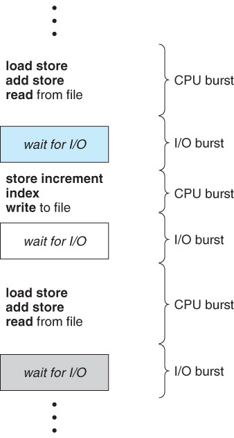
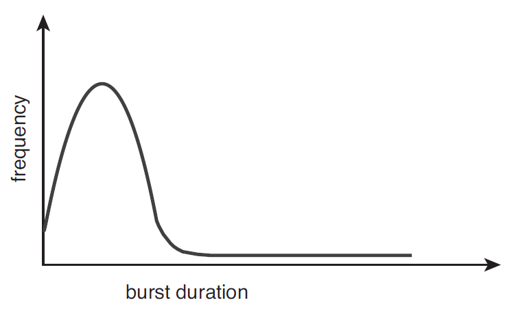

>학습목표
>1. CPU 스케줄링이 무엇인지 학습
>2. CPU-I/O Brust Cycle이 무엇인지 학습
>3. CPU Scheduler가 무엇인지 학습
>4. 선점 스케줄링이 무엇인지 학습
>5. 디스패처(Dispatcher)가 무엇인지 학습
>6. 스케줄링 기준에 대해서 학습

## 1. 기본 개념

### 1.1 CPU 스케줄링이란 무엇인가?

하나의 CPU는 한순간에 오직 하나의 프로세스만을 실행할 수 있습니다. 메모리 위에 올라가 있는 나머지 프로세스는 CPU가 자유 상태가 될때까지 기다려야합니다. 만약 CPU가 어떤 한 프로세스의 실행을 마치고 다른 프로세스를 실행한다면 어떤 프로세스를 선택할 것인가? CPU 스케줄링은 CPU가 다음에 수행할 프로세스의 실행 순서를 정하는 것을 의미합니다.

---

### 1.2 CPU-입/출력 버스트 사이클(CPU-I/O Burst Cycle)

프로세스 실행은 CPU 실행과 입/출력 대기의 사이클로 구성됩니다. 프로세스들은 CPU가 프로세스를 실행하는 상태와 입/출력을 위한 상태를 교대로 왔다갔다 합니다. 

위의 그림을 보면 CPU brust 상태는 프로세스의 명령어를 수행하는 상태이고 I/O burst 상태는 프로세스가 사용자로부터 입력받기를 기다리거나 명령어 수행 결과를 출력하는 상태입니다. I/O burst 상태에서 CPU는 대기하게 됩니다. 하지만 이 CPU가 대기하는 것은 굉장한 낭비입니다. 이러한 I/O burst 상태에서 다른 프로세스를 수행한다면 CPU의 효율은 더 커질 것입니다.

일반적으로 입/출력 중심의 프로그램은 짧은 CPU burst를 가질 것입니다. 반대로 CPU 지향 프로그램은 긴 CPU burst를 가질 것입니다. 아래 그림은 burst 지속 시간에 따른 입/출력의 빈도수를 표현한 그래프입니다.

---

### 1.3 CPU 스케줄러(CPU Scheduler)란 무엇인가?

CPU가 유휴 상태가 될 때마다, 운영체제는 준비 완료 큐에 있는 프로세스들 중에서 하나를 선택해 실행해야 합니다. 선택 절차는 단기(short term) 스케줄러(또는, CPU 스케줄러)에 의해 수행된다. 스케줄러는 실행 준비(ready)가 되어 있는 메모리 내의 프로세스들 중에서 선택하여, 이들 중 하나에게 CPU를 할당합니다.

준비 완료 큐는 일반적인 FIFO(First-In-First-Out) 방식의 큐도 되고 우선순위를 부여한 우선순위 큐가 될 수도 있다.

정리하면 CPU 스케줄러는 실행 준비가 되어 있는 프로세들 중에서 하나를 선택하여 CPU에게 할당해주는 역할을 수행합니다.

---

### 1.4 선점 스케줄링(Preemptive Scheduling)과 비선점 스케줄링(Non-Preemptive Scheduling)

**비선점 스케줄링은 무엇인가?**

비선점 스케줄링은 CPU가 현재 실행중인 프로세스가 완료될때까지 다른 프로세스들은 대기하는 스케줄링을 의미합니다. 오직 현재 실행중인 프로세스가 종료되거나 입/출력을 위하여 대기 상태(wating state)로 들어가는 경우에만 다른 프로세스들이 실행할 수 있습니다.

**선점 스케줄링은 무엇인가?**

선점 스케줄링은 CPU가 현재 프로세스를 실행중일때 스케줄러에 의해 현재 프로세스의 CPU 제어권을 다른 프로세스한테 넘기는 스케줄링을 의미합니다. 실행중인 프로세스가 다른 프로세스에게 CPU 제어권을 선점당하면 Running 상태에서 Ready 상태로 변하고 입/출력을 위하여 대기 중인 상태에서 다른 프로세스가 CPU를 선점하면 Ready 상태로 전환됩니다.

**프로세스의 4가지 상황에 따른 CPU 스케줄링 결정**

1. 한 프로세스가 실행 상태에서 대기 상태로 전환 될 때(예를 들어, 입/출력 요청 등)
2. 프로세스가 실행 상태에서 준비 완료 상태로 전환 될 때(예를 들어 다른 프로세스의 인터럽트 발생)
3. 프로세스가 대기 상태에서 준비 완료 상태로 전환 될 때(예를 들어, 입/출력의 종료)
4. 프로세스가 종료할 때

1,4번 상황에서만 스케줄링이 발생한 경우 비선점 스케줄링입니다. 2,3번 상황에서 스케줄링이 발생한 경우 비선점 스케줄링을 할수도 있고 선점 스케줄링을 할 수 있습니다.

---

### 1.5 디스패처(Dispatcher)란 무엇인가?
CPU 스케줄링 기능에 포함된 또 하나의 요소는 디스패처(dispatcher)입니다. 디스패처는 CPU의 제어를 단기 스케줄러가 선택한 프로세스에게 주는 모듈이며 다음과 같은 작업을 포함합니다.

- 문맥을 교환하는 일 (Context Switching)
- 사용자 모드로 전환하는 일
- 프로그램을 다시 시작하기 위해 사용자 프로그램의 적절한 위치로 이동(jump)하는 일

디스패처는 모든 프로세스의 문맥 교환 시 호출되므로, 가능한 한 빨리 수행되어야 합니다. 

**디스패치 지연(dispatch latency)란 무엇인가?**

디스패처가 하나의 프로세스를 정지하고 다른 프로세스의 수행을 시작하는 데까지 소요되는 시간을 의미합니다.

---

## 2. 스케줄링 기준(Scheduling Criteria)

서로 다른 CPU 스케줄링 알고리즘들은 다른 특성을 가지고 있으며 한 부류의 프로세스들을 다른 부류보다 더 선호할 수 있습니다. 특정 상황에서 어떠한 알고리즘을 선택하려면, 다양한 알고리즘들의 서로 다른 특성을 반드시 고려해야 합니다.

CPU 스케줄링 알고리즘을 비교하기 위한 여러 기준은 다음과 같습니다.

- CPU 이용률(CPU Utilization) : CPU 이용률은 0에서 100%까지 이릅니다. 실제 시스템에서는 40%~90%까지의 범위를 가져야 합니다.
- 처리량(Throughput) : 처리량은 단위 시간당 완료된 프로세스의 개수입니다. 긴 프로세스의 경우에는 이 비율은 시간 당 한 프로세스가 될 수도 있고, 짧은 트랜잭션인 경우 처리량은 초 당 10개의 프로세스가 될 수도 있습니다.
- 총처리 시간(Turnaround Time) : 총처리 시간은 프로세스의 제출 시간과 완료 시간의 간격입니다. 즉, 메모리에 들어가기 위해 기다리며 소비한 시간과 준비 완료 큐에서 대기한 시간, CPU에서 실행하는 시간, 입/출력 시간을 합한 시간입니다.
- 대기 시간(Wating Time) : 대기 시간은 준비 완료 큐에서 대기하면서 보낸 시간의 합입니다.
- 응답 시간(Response Time) : 응답 시간은 하나의 요구를 제출한 후 첫번째 응답이 나올 때까지의 시간입니다.

위와 같은 기준을 통하여 CPU 이용률과 처리량을 최대화하고 총처리 시간, 대기시간, 응답시간을 최소화하는 것이 바람직합니다. 

---

### Reference

> [\[인프런\] 운영체제 공룡책 강의](https://www.inflearn.com/course/%EC%9A%B4%EC%98%81%EC%B2%B4%EC%A0%9C-%EA%B3%B5%EB%A3%A1%EC%B1%85-%EC%A0%84%EA%B3%B5%EA%B0%95%EC%9D%98/dashboard)