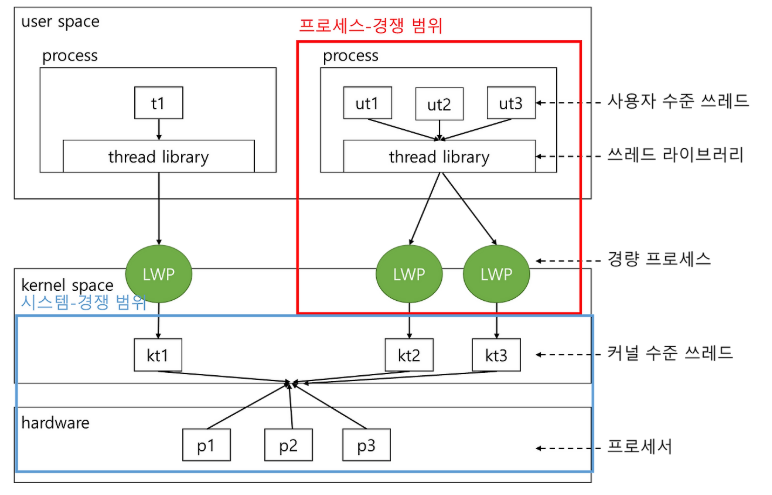

>학습목표
>1. 경쟁범위에 대해서 학습
>2. C언어 기반 Pthread 스케줄링 예제 학습

## 1. 경쟁범위(Contention Scope)

- 프로세스-경쟁 범위(process-contention scope, PCS)
- 시스템-경쟁 범위(system-contention scope, SCS)

사용자 수준과 커널 수준 쓰레드의 차이 중 하나는 그들이 어떻게 스케줄되느냐에 있습니다. 다대일과 다대다 모델을 구현하는 시스템에서는 쓰레드 라이브러리가 사용자 수준 쓰레드를 가용한 LWP(Light Weight Process) 상에서 스케줄링합니다. 이 구조는 동일한 프로세스에 속한 쓰레드들 사이에서 CPU를 경쟁하기 때문에 프로세스-경쟁-범위(process-contention scope, PCS)로 알려져 있습니다. 즉, 정리하면 사용자 수준 쓰레드는 쓰레드 라이브러리가 사용이 가능한 LWP에 사용자 수준 쓰레드를 스케줄링하는 것이고 프로세스-경쟁-범위(PCS)는 동일한 프로세스 범위에서 프로세스에 속한 쓰레드들이 CPU를 할당받기 위해 경쟁하는 곳입니다.

우리가 쓰레드 라이브러리가 사용자 수준 스레드를 가용한 LWP 상에서 스케줄한다고 말하는 경우, 쓰레드가 실제로 CPU 상에서 실행하는 것은 아닙니다. 실제로 CPU 상에서 실행되기 위해서는 운영체제가 커널 쓰레드를 물리적인 CPU로 스케줄하는 것을 필요로 합니다. 따라서 CPU 상에 어느 커널 쓰레드를 스케줄할 것인지 결정하기 위해서는 커널은 시스템-경쟁 범위(system-contention scope, SCS)를 사용합니다. SCS 스케줄링에서의 CPU에 대한 경쟁은 모든 프로세스의 모든 쓰레드 사이에서 일어납니다. 

프로세스-경쟁 범위와 시스템-경쟁 범위를 그림으로 표현하면 다음과 같습니다.



## 2. C 언어 기반 Pthread 스케줄링 예제

POSIX Pthread API는 쓰레드를 생성하면서 PCS 또는 SCS를 지정할 수 있습니다. Pthread는 다음과 같은 범위 값을 구분합니다.

- PTHREAD_SCOPE_PROCESS : PCS 스케줄링을 사용하여 쓰레드를 스케줄링
- PTHREAD_SCOPE_SYSTEM : SCS 스케줄링을 사용하여 쓰레드를 스케줄링

다대다 모델을 구현하는 시스템에서는 PTHREAD_SCOPE_PROCESS 정책이 사용자 수준 쓰레드를 사용이 가능한 LWP로 스케줄링합니다. LWP의 개수는 쓰레드 라이브러리에 의해 유지되고 스케줄러 액티베이션 기법이 사용될 수 있습니다. 다대다 시스템에서 PTHREAD_SCOPE_SYSTEM 스케줄링 정책은 각 사용자 수준 쓰레드에 맞게 LWP를 생성하고 바인드하게 될 것이고 결과적으로 일대일 모델을 사용하게 됩니다.

Pthread IPC는 경쟁 범위 정책의 정보를 얻어내고 설정하기 위하여 다음과 같은 두 함수를 제공합니다.

- pthread_attr_setscope(pthread_attr_t *attr, int scope)
- pthread_attr_getscope(pthread_attr_t *attr, int *scope)

```c
#include <pthread.h>
#include <stdio.h>
#define NUM_THREADS 5

int sum = 0;

void* runner(void* param);

int main(int argc, char* argv[])
{
    int i, scope;
    pthread_t tid[NUM_THREADS];
    pthread_attr_t attr;

    // 기본 속성 초기화
    pthread_attr_init(&attr);

    // 경재 범위 정책 확인
    if(pthread_attr_getscope(&attr, &scope) != 0)
    {
        fprintf(stderr, "Unable to get scheduling scope\n");
    }
    else
    {
        if(scope==PTHREAD_SCOPE_PROCESS)
        {
            printf("PTHREAD SCOPE PROCESS\n");
        }
        else if(scope==PTHREAD_SCOPE_SYSTEM)
        {
            printf("PTHREAD_SCOPE_SYSTEM\n");
        }
        else
        {
            fprintf(stderr, "Illegal scope value.\n");
        }
    }
    // PCS(프로세스 경쟁 범위) or SCS(시스템 경쟁 범위) 스케줄링 알고리즘 설정
    pthread_attr_setscope(&attr, PTHREAD_SCOPE_SYSTEM);

    // 쓰레드 생성
    for(i=0; i<NUM_THREADS; i++)
    {
        pthread_create(&tid[i], &attr, runner, NULL);
    }

    // 각각의 쓰레드 대기
    for(i=0; i<NUM_THREADS; i++)
    {
        pthread_join(tid[i],NULL);
    }
    printf("sum = %d\n",sum);
}

// each thread will begin control in the function
void* runner(void* param)
{
    sum += 5;

    pthread_exit(0);
}
```

```bash
PTHREAD_SCOPE_SYSTEM
sum = 25
```

- pthread_attr_setscope(&attr, PTHREAD_SCOPE_SYSTEM) : 경쟁 범위를 SCS로 설정합니다.
- pthread_attr_getscope(&attr, &scope) : 경쟁 범위의 현재 값을 scope int 변수에 저장합니다. 만일 
오류가 발생하면 함수는 0이 아닌 값을 반환한다.

어떤 시스템에서는 오직 특정 경쟁 범위 값만이 허용된다는 것을 주의해야합니다. 예를 들어 Linux와 MAC OS X 시스템은 PTHREAD_SCOPE_SYSTEM만을 허용합니다.

---

### Reference

> [\[인프런\] 운영체제 공룡책 강의](https://www.inflearn.com/course/%EC%9A%B4%EC%98%81%EC%B2%B4%EC%A0%9C-%EA%B3%B5%EB%A3%A1%EC%B1%85-%EC%A0%84%EA%B3%B5%EA%B0%95%EC%9D%98/dashboard)