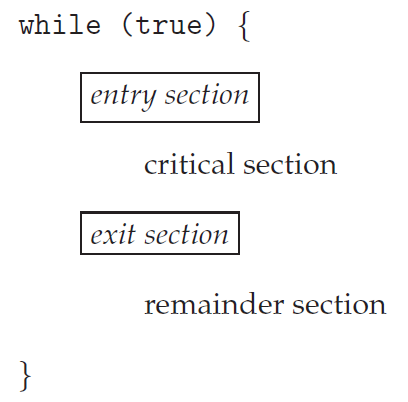
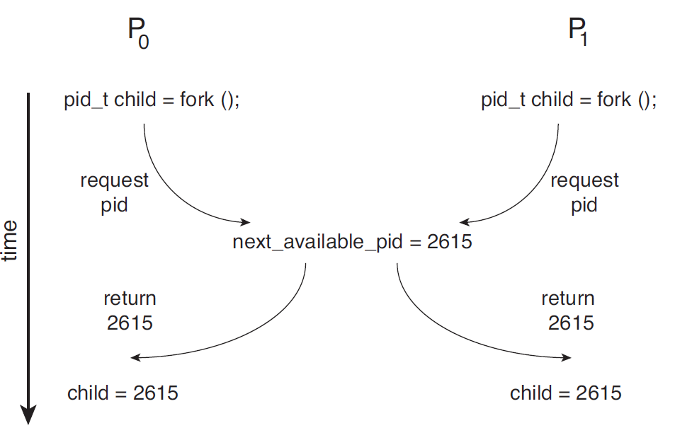

## 1. 임계 구역(Critical-Section)

**임계 구역의 개념 및 특징**

- 어떤 한 프로세스가 임계 구역으로 정해진 구역에서 실행중이면 다른 프로세스들은 해당 임계 구역의 코드들을 실행하지 못하는 구역을 임계 구역이라고 합니다.
- 임계 구역에서는 다른 프로세스와 공유자원의 값을 변경하거나, 테이블을 갱신하거나 파일을 쓰거나 하는 등의 작업을 수행합니다.
- 두개 이상의 프로세스가 임계구역에 존재할 수 없습니다.

## 2. 코드들의 구역 종류

- 진입 구역(Entry-Section) : 임계 구역에 들어가기 위해서 허락을 요청하는 코드 구역
- 임계 구역(Critical-Section) : 다른 프로세스와 공유하는 자원을 갱신하거나 접근하는 구역
- 퇴출 구역(Exit-Section) : 임계 구역에서 나오는 구역
- 나머지 구역(Remainder-Section) : 진입->임계->퇴출 구역을 제외한 나머지 구역

전형적인 프로세스의 일반적인 구조는 다음과 같습니다.

## 3. 임게 구역 해결안에 대한 3가지 요구 조건

임계 구역 문제에 대한 해결안은 다음의 3가지 요구 조건을 충족해야 합니다. 일반적으로 상호 배제를 만족하게 되면 교착상태(DeadLock)과 기아(Starvation) 문제가 발생합니다.

1. 상호 배제(Mutual Exclusion) : 프로세스 P가 자기의 임게 구역에서 실행된다면, 다른 프로세스들은 그들 자신의 임계 구역에서 실행될 수 없다.
2. 진행(Progress, 교착상태(DeadLock) 회피) : 자기의 임계 구역에서  실행되는 프로세스가 없고 다른 프로세스들의 임계 구역으로 진입하려고 하는 프로세스들이 존재한다면, 그 프로세스는 무한정 기다리면 안되고 적절한 시기에 진입을 시켜야 합니다.
3. 한정된 대기(Bounded Waiting, 기아(Starvation) 회피) : 프로세스가 자기의 임계 구역에 진입하려는 요청을 한 순간부터 그 요청이 허용될 때까지 다른 프로세스들이 그들 자신의 임계 구역에 진입하도록 허용되는 횟수에 제한이 있어야 합니다.

**경쟁 상태(Race Condition)에 대한 예제**

다음 그림과 같이 운영체제의 커널 영역에서 경쟁 상태가 발생 할 수 있습니다. 대표적인 예제로 프로세스의 fork() 호출이 있습니다. 한 프로세스가 fork() 호출시 자식 프로세스가 생성되고 그 자식 프로세스의 pid(프로세스 번호)를 반환합니다. 그러나 자식 프로세스의 pid를 반환하고 숫자를 증가시키려고 하는 순간 다른 프로세스가 fork()를 호출하여 동일한 pid 번호를 가진 자식 프로세스를 생성하는 가능성이 있습니다. 결국 프로세스 번호가 같은 자식 프로세스가 2개 생겨난 것입니다. 이는 두 자식 프로세스가 충돌이 발생할 것입니다.

## 4. 단일 CPU 코어 환경에서의 해결 방법

**공유 자원을 수정하는 동안 발생하는 인터럽트 방지**

- 예를 들어 count++와 같은 명령어를 수행한다면 기계어 레벨 수준에서 LOAD, ADD, STORE 명령어를 수행하는 동안에는 인터럽트를 못하게 시도합니다.
- 하지만 임계 구역에 실행하는 동안에는 공유자원을 무결성있게 만드는 대신에 멀티 프로세서 환경(CPU 코어가 2개 이상)에서는 실현이 불가능합니다. 멀티 프로세서 환경에서는 시스템 성능의 저하로 이어집니다.

## 5. 선점형 커널과 비선점형 커널을 이용한 방법

**비선점형 커널의 개념 및 특징**

- 비선점형 커널은 어떤 프로세스가 커널모드에 진입을 하게 되면 그 프로세스는 자발적으로 커널 모드를 종료할때까지는 경쟁상태로부터 자유로운 모드입니다.
- 예를 들어 어떤 한 프로세스가 count++을 수행할때 비선점형 커널 모드로 수행하게 되면 count++을 다 마칠 때까지는 문맥 교환(Context Switching)이 발생하지 않습니다.
- 비선점형 커널의 단점은 비선점형이기 때문에 성능이 좋지 않습니다.

**선점형 커널의 개념 및 특징**

- 선점형 커널은 어떤 프로세스가 커널 모드에서 수행중일때 다른 프로세스가 선점하는 것을 하용하는 모드입니다.
- 선점형 커널 모드는 다루기 어렵고 동기화 문제가 발생할 수 있습니다.
- 비선저형 커널보다 더욱 반응적이고 성능이 좋습니다.

---

### Reference

> [\[인프런\] 운영체제 공룡책 강의](https://www.inflearn.com/course/%EC%9A%B4%EC%98%81%EC%B2%B4%EC%A0%9C-%EA%B3%B5%EB%A3%A1%EC%B1%85-%EC%A0%84%EA%B3%B5%EA%B0%95%EC%9D%98/dashboard)