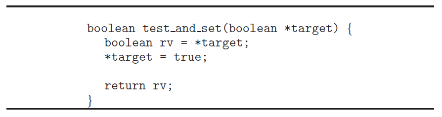
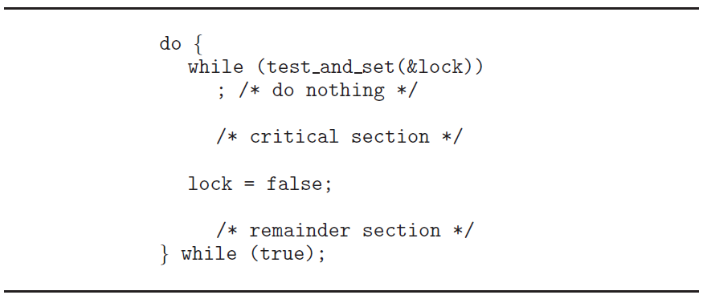
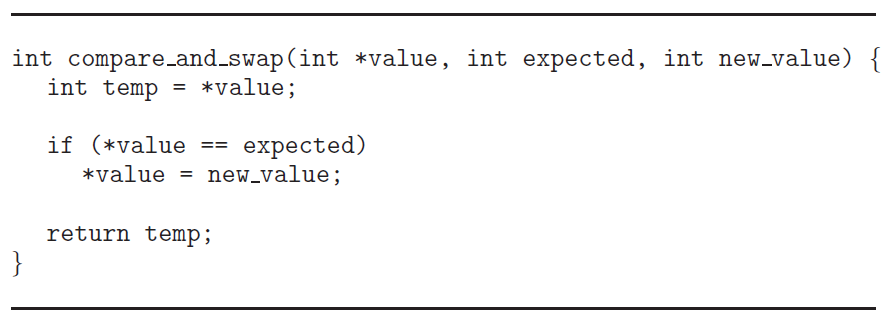
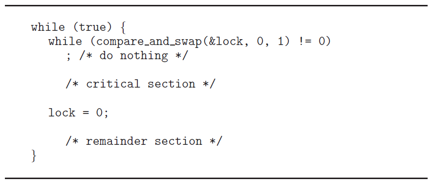

>학습목표
>1. 동기화를 위한 하드웨어 기반 해결안을 소개
>2. 하드웨어 명령어 자체를 원자성있게 설계하여 상호배제를 만족시키는것에 학습
>3. TestAndSet() 명령어와 waiting 배열을 통한 상호배제 구현과 한정된 대기 조건 만족 알고리즘 분석
>4. Java 언어 기반 Atomic Variable 예제 실습

이전글에서는 피터슨의 해결안을 소개하였습니다. 하지만 피터슨의 해결안은 소프트웨어 기반이기 때문에 동기화를 보장해주지는 않습니다. 왜냐하면 아무리 소프트웨어적으로 완벽하다고 하더라도 기계어 레벨에서는 다른 프로세스에게 선점되어 데이터의 불일치가 발생할 수 있기 때문입니다. 이러한 문제를 해결하기 위해서 하드웨어 기반 해결안을 제시합니다.

## 1. 동기화를 위한 하드웨어 기반 해결안

- 하드웨어 명령어들은 하드웨어 기반으로 임계 구역 문제를 해결하기 위한 지원을 합니다.
- 하드웨어 명령어들을 사용하여 직접적으로 동기화를 할 수 있습니다.

하드웨어 기반의 해결안은 하드웨어 명령어를 원자성(Atomicity)있게 설계하여 동기화를 제공하는 방법입니다. 예를 들어 'a++'과 같은 명령어는 소프트웨어적으로는 한줄짜리 명령어이지만 하드웨어에서는 load와 store라는 하드웨어 명령어들이 여러 단계로 구성되어 있습니다. 이러한 여러 단계의 어셈블리 명령어를 한 단계의 하드웨어 명령어로 설계하여 동기화를 제공하는 것입니다. 

## 2. 원자성(Atomicity)란 무엇인가?

- 원자성이란 더이상 쪼갤 수 없는 물리적인 단위라는 의미로써 인터럽트가 불가능한 연산 단위입니다.
- 현대 컴퓨터 시슴템들은 atomic instructions라는 특별한 하드웨어 명령어를 제공합니다. atomic instructions 수행 중에는 다른 프롯세스가 인터럽트하여 선점할 수 없습니다.
- atomic instructions 종류
    - test_and_modify : 단어의 내용을 수정
    - test_and_swap   : 두 단어의 내용을 교환

**test_and_set() 명령어 (test_and_modify)**



- boolean *target : test_and_set 함수의 매개변수, 포인터이기 때문에 target 변수는 주소를 가리킴
- boolean rv = *target : target이 가리키고 있는 곳의 값을 rv에 저장함
- *target = true : target이 가리키고 있는 곳의 값을 true로 저장
- return rv : 설정한 rv 변수의 값을 반환

**test_and_set()의 피터슨 해결안 적용**



- lock==true, 다른 프로세스가 임계구역을 사용중 : 반환된 rv도 true이므로 while문을 수행하며 계속 대기합니다.
- lock==false, 다른 프로세스가 임계구역을 사용하지 않음 : 반환된 rv는 false이고 lock=true로 저장되어 while문을 빠져나와 임계구역의 공유자원을 사용합니다.
- test_and_set() 함수에 lock을 넣게 되면 lock 변수는 true가 됩니다.

**compare_and_swap() 명령어**



- 위의 그림의 내용은 value 변수가 expected 변수와 같으면 new_value로 교환하는 내용입니다.

**compare_and_swap() 명령어를 사용한 상호 배제 구현**



- lock==1, 다른 프로세스가 임계구역을 사용 중 : temp=1로 저장되어 while문을 수행하며 계속 대기함
- lock==0, 다른 프로세스가 임계구역을 사용하지 않음 : temp=0로 저장되고 lock=1로 저장되어 while문을 탈출하여 임계구역의 공유자원에 접근함

## 3. Atomic Variable

- 현실적으로 compare_and_swap() 명령어는 atomic variable과 같은 다른 도구들의 구성을 위해 사용됩니다.
- atomic variable은 Integer와 Boolean과 같은 기본적인 데이터 타입 위에서 아토믹 연산을 제공합니다.
- atomic variable은 경쟁 상태에 있는 단일 변수가 있는 상황에서 상호 배제를 보장하기 위해 사용됩니다.

## 4. TestAndSet() 명령어를 이용한 상호 배제 및 한정된 대기 조건 만족하는 알고리즘

compare_and_swap() 명령어를 이용한 상호 배제 구현은 아쉽게도 한정된 대기(Bounded-Waiting, No Starvation) 조건을 만족시키지 못합니다. 이 문제를 해결하기 위하여 다음과 같이 TestAndSet() 명령어를 이용하여 알고리즘을 설계합니다.

```c
do{
    /* Entry Section */
    waiting[i] = True;	// True : 임계구역을 사용하기 위해 대기중
    key = True;
    
    while(waiting[i]==True && key==True)
    {
    	key = TestAndSet(&lock);
    }
    // False : 
    // 1. 임계구역에 들어왔기 때문에 더이상 대기 하지 않음
    // 2. 애초부터 임계구역을 사용하지 않기 때문에 False로 저장됨
    waiting[i] = False;
    
    /* Critical Section */
    
    /* Exit Section */
    j = (i+1) % n;	// j : i번째 프로세스의 다음 프로세스
    
    // 반복문 탈출 조건 
    // 1. 순회를 계속하여 i번재 프로세스로 되돌아 온경우 (j == i )
    // 2. 다른 프로세스가 임계구역을 사용하기 위해 대기하는 경우 (waiting[j]==True)
    while((j != i) && waiting[j]==False)
    {
    	j = (j+1) % n;	// 다음 프로세스로 이동
    }
    
    if(j == i)	// 다른 프로세스가 임계구역을 사용하기 위해 대기하고 있지 않은 경우
    {
    	lock = False;
    }
    else	// 다른 프로세스가 임계구역을 사용하기 위해 대기하고 있는 경우
    {
    	// j번째 프로세스는 while문을 탈출하여 임계구역을 사용하게됨
        // lock==true, 다른 프로세스가 임계구역을 여전히 사용중이므로 lock은 여전히 True이다.
    	waiting[j] = False;
    }    
}while(True);
```

위 알고리즘을 통하여 한정된 대기 조건을 만족시키기 위해서 한 프로세스가 임계구역을 떠날때에는 waiting 배열을 순회하면서 (i+1, i+2, ..., n-1, 0, ..., i-1)을 순회하면서 다른 프로세스가 임계구역을 사용하기 위해 대기하는지 검사합니다. 

waiting 배열을 순회하면서 waiting[j]==true인 프로세스가 존재하면 false로 변경해주고 임계구역에 들어가게 해줍니다. 따라서 임계 구역에 들어가고자 하는 프로세스는 최대 n-1회만 양보하면 들어갈 수 있기 때문에 한정된 대기 조건을 만족하게 됩니다.

## 5. 원자성 변수(Atomic Variable)를 활용한 피터슨 해결안 구현

다음 소스코드는 Java API가 제공하는 원자성 변수를 활용하여 생산자-소비자 문제의 동기화 문제를 해결하는 예제입니다.

```java
public class Producer implements Runnable{
	
	@Override
	public void run() {
		
		for(int k = 0; k < 10000; k++)
		{
			// entry section
			Driver.flag[0].set(true);
			Driver.turn = 1;
			
			while(Driver.flag[1].get() && Driver.turn == 1)
			{
				
			}
			
			// critical section
			Driver.sum++;
			
			// exit section
			Driver.flag[0].set(false);
			
			// remainder section
		}
		
	}

}
```

```java
public class Consumer implements Runnable{
	
	@Override
	public void run() {
		
		for(int k = 0; k < 10000; k++)
		{
			// entry section
			Driver.flag[1].set(true);
			Driver.turn = 0;
			
			while(Driver.flag[0].get() && Driver.turn == 0)
			{
				
			}
			
			// critical section
			Driver.sum--;
			
			// exit section
			Driver.flag[1].set(false);
			
			// remainder section
		}
		
	}

}
```

```java
import java.util.concurrent.atomic.AtomicBoolean;

public class Driver {
	static int sum = 0;
	
	static AtomicBoolean[] flag = new AtomicBoolean[2];
	static {
		for(int i=0;i<flag.length;i++)
		{
			flag[i] = new AtomicBoolean();
		}
	}
	static int turn = 0;
	
	public static void main(String[] args)
	{
		Thread producer = new Thread(new Producer());
		Thread consumer = new Thread(new Consumer());
		
		producer.start();
		consumer.start();
		
		try {
			producer.join();
			consumer.join();
		} catch (InterruptedException e) {
			e.printStackTrace();
		}
		
		System.out.println("sum = " + sum);
	}
}
```

```bash
sum = 0
```

## 정리하며

- 소프트웨어적 방법으로 피터슨의 해결안이 존재하지만 해당 알고리즘은 상호배제, 진행, 한정된 대기의 요주 조건을중점으로 소프트웨어를 설계하는데 필요한 복잡성을 잘 설명한다. 하지만 상호배제를 보장하지 못한다.
- 임계구역 문제를 해결하기 위해 하드웨어적인 방법을 사용합니다. 현대 기계들은 원자적으로 실행되는 TestAndSet()과 Compare_and_Swap() 명령어를 제공하여 상호배제를 구현합니다.
- Compare_and_Swap() 명령어를 이용하여 상호배제 조건을 만족시킬 수 있지만 한정된 대기 조건을 만족시키지 못합니다.
- TestAndSet() 명령어와 waiting 배열을 통한 상호배제와 한정된 대기 조건을 만족시킬 수 있습니다.

---

### Reference

> [\[인프런\] 운영체제 공룡책 강의](https://www.inflearn.com/course/%EC%9A%B4%EC%98%81%EC%B2%B4%EC%A0%9C-%EA%B3%B5%EB%A3%A1%EC%B1%85-%EC%A0%84%EA%B3%B5%EA%B0%95%EC%9D%98/dashboard)