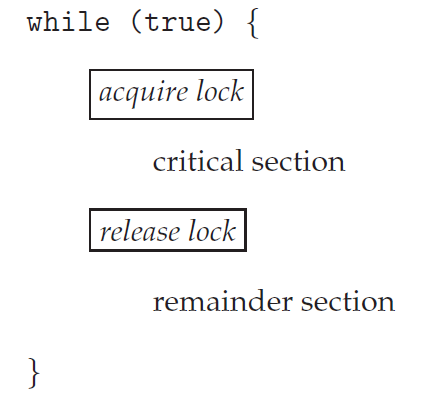
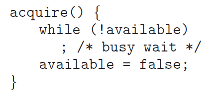
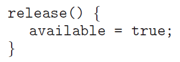

>학습목표
>1. 세마포어가 무엇인지 학습
>2. 세마포어의 사용방법에 대해서 학습
>3. 세마포어의 구현에 대해서 학습
>4. 세마포어를 사용할때의 교착상태와 기아에 대해서 학습

임계 영역 문제를 해결하기 위한 고수준 소프트웨어 도구들의 종류

1. 뮤텍스 락(Mutex Locks)
    - 동기화를 위한 가장 간단한 도구
    - 세마포어와는 다르게 하나의 쓰레드만을 제어할 수 있습니다.
    - 바이너리 세마포어라고 부를 수 있습니다.
2. 세마포어(Semaphore)
    - 뮤텍스 락보다 더욱 강력하고, 편리하고, 효율적인 도구
    - 뮤텍스락과는 다르게 n개의 쓰레드를 제어할 수 있습니다.
3. 모니터(Monitor)
    - 뮤텍스락과 세마포어의 단점을 극복한 동기화 도구

## 1. Mutex Lock은 무엇인가?

- Mutex Lock은 세마포어 값이 0 또는 1을 가지는 이진 세마포어(Binary Semaphore)입니다.
- Mutex Lock은 다른 프로세스로부터 임계구역을 보호하고 경쟁 상태(race condition)을 예방합니다.
- Mutex Lock을 이용하는 프로세스들은 임계구역 입장 전 Lock을 얻어야 하고 임계 구역을 나가게 되면 Lock을 해제하여야 합니다.

**Mutex Lock의 두 연산과 변수**

- acquire() : Lock을 얻는 연산
- release() : Lock을 방출하는 연산
- available : lock을 얻을 수 있는지 없는지 나타내는 Boolean 변수
    - available = true   : 임계 영역 입장이 가능함
    - available = false : 임계 영역 입장이 불가능함. 바쁜 대기(Busy Waiting)을 수행함

**Mutex Locks을 사용한 임계 영역 문제 해결**



- Entry Section : acquire lock 연산을 수행하여 lock을 얻어 임계 영역에 들어가고자 합니다.
- Exit Section   : release lock 연산을 수행하여 임계 영역에서 작업을 마치고 lock을 반납합니다.

**acquire() 연산과 release() 연산의 정의**





- acquire() 연산과 release() 연산은 다른 쓰레드들이 선점할 수 없도록 원자적(atomically)으로 수행되어야 합니다.
- acquire() 연산과 release() 연산은 compare_and_swap 연산을 기반으로 구현할 수 있습니다.

**바쁜 대기(Busy Waiting)란 무엇인가?**

- 바쁜 대기란 한 프로세스가 자신의 임계 구역에 있으면, 자신의 임계 구역에 진입하려는 다른 프로세스가 진입 코드를 계속 반복 수행(무한루프)하는 것을 의미합니다.
- 바쁜 대기는 다른 프로세스들이 생산적으로 사용할 수 있는  CPU 코어를 낭비하게 됩니다.
- 프로세스가 lock을 기다리는 동안 회전하기 때문에 이런 유형의 세마포어를 스핀락(spinlock)이라고 부르기도 합니다.

**스핀락(Spinlock)**

- 바쁜 대기(Busy Waiting) 방식을 이용한 뮤텍스 락의 잠금 유형입니다.
- 프로세스는 lock을 얻을때까지 대기하는 동안 반복문을 반복합니다.
- 스핀락의 장점
    - lock을 얻기 위해 대기하는 동안 문맥 교환(Context Switch)가 요구되지 않습니다. 왜나하면 문맥 교환은 상단한 시간이 소요될 수 있기 때문입니다.
    - 스핀락은 멀티코어 시스템의 특정한 상황에서 락킹(locking)을 위한 선호되는 선택이 될 수 있습니다.
    - 하나의 쓰레드가 하나의 CPU 코어에서 스핀을 하는 반면 다른 쓰레드는 다른 CPU코어에서 임계 영역의 작업을 수행할 수 있습니다.

**mutex lcok 예제**

mutex lock을 사용하기 위해서 pthread 라이브러리에서 사용할 수 있습니다.

```c
#include <stdio.h>
#include <pthread.h>

int sum = 0;    // a shared variable

pthread_mutex_t mutex;

void* counter(void* param)
{
    for(int k=0; k<10000; k++)
    {
        /* entry section */
        pthread_mutex_lock(&mutex);

        /* critical section */
        sum++;

        /* exit section */
        pthread_mutex_unlock(&mutex);

        /* remainder section */
    }
    pthread_exit(0);
}

int main()
{
    pthread_t tid1, tid2;
    pthread_mutex_init(&mutex, NULL);
    pthread_create(&tid1, NULL, counter, NULL);
    pthread_create(&tid2, NULL, counter, NULL);
    pthread_join(tid1, NULL);
    pthread_join(tid2, NULL);
    printf("sum = %d\n", sum);  // 20000
}
```

- pthread_mutex_t mutex : 뮤텍스 락에서 lock 역할을 수행합니다.
- pthread_mutex_lock(&mutex) : mutex라는 이름의 lock을 얻기 위해 시도합니다. 다른 쓰레드가 이미 임계 영역에서 작업중이면 바쁜 대기를 수행합니다.
- pthread_mutext_unlock(&mutex) : 쓰레드가 임계영역을 다 사용하였다면 lock을 해제합니다.

## 2. 세마포어가 무엇인가?

- 세마포어도 뮤텍스락과 마찬가지로 여러 스레드가 동시에 공유자원에 접근하는 것을 막기 위한 동기화 도구입니다.
- 세마포어의 사용 이유
    - 하드웨어 기반의 해결안(test_and_set, compare_and_set)은 사용하기가 복잡하기 때문입니다.

**세마포어의 연산**

- wait()    : 쓰레드가 임계구역에 들어가기 위해 호출하는 연산, 다른 쓰레드가 임계구역에 작업중이면 대기합니다.
- signal() : 쓰레드가 임계구역에 작업을 마치고 세마포어를 해제하는 연산입니다.

**wait()과 signal()의 정의**

```c
wait(S){
    while(S <= 0) // 이용가능한 세마포어가 없는 경우
        ; // busy wait
    S--;
}

signal(S){
    S++;
}
```

- wait()과 signal() 연산의 주목할 점은 두 연산이 수행할 때 세마포어의 값을 수정하는 동안 다른 쓰레드가 선점할 수 없다는 점입니다.
- wait()과 signal() 연산은 원자적(atomically)하게 수행됩니다.

**세마포어의 구현**

```c
typedef struct{
    int value;
    struct process *list;
}semaphore;
```

wait() 연산은 다음과 같이 구현할 수 있습니다.

```c
wait(semaphore *S){
    S->value--;
    if(S->value < 0){
    	s->list.add(P); // 현재 프로세스를 리스트에 넣음
        block();
    }
}
```

signal() 연산은 다음과 같이 구현할 수 있습니다.

```c
signal(semaphore *S){
    S->value++;
    if(S->value <= 0){
    	S->list.poll();
        wakeup(P);
    }
}
```

- block() : 자기를 호출한 프로세스를 중지시킴, 중지시긴 프로세스는 대기큐(waiting queue)에 들어가게됩니다.
- wakeup(P) : 봉쇄된 프로세스 P의 실행을 재개시킴, 재개된 프로세스는 준비큐(ready queue)에 들어가게됩니다.

## 3. 세마포어의 예제

```c
#include <stdio.h>
#include <pthread.h>
#include <semaphore.h>

int sum = 0;    // a shared variable

sem_t sem;

void* counter(void* param)
{
    for(int k=0; k<10000; k++)
    {
        /* entry section */
        sem_wait(&sem);

        /* critical section */
        sum++;

        /* exit section */
        sem_post(&sem);

        /* remainder section */
    }
    pthread_exit(0);
}

int main()
{
    pthread_t tid1, tid2;
    sem_init(&sem, 0, 1);
    pthread_create(&tid1, NULL, counter, NULL);
    pthread_create(&tid2, NULL, counter, NULL);
    pthread_join(tid1, NULL);
    pthread_join(tid2, NULL);
    printf("sum = %d\n", sum);  // 20000
}
```

위 예제는 바이너리 세마포어로써 mutex lock의 예제와 동일합니다.

```c
#include <stdio.h>
#include <pthread.h>
#include <semaphore.h>

int sum = 0;    // a shared variable

sem_t sem;

void* counter(void* param)
{
    for(int k=0; k<10000; k++)
    {
        /* entry section */
        sem_wait(&sem);

        /* critical section */
        sum++;

        /* exit section */
        sem_post(&sem);

        /* remainder section */
    }
    pthread_exit(0);
}

int main()
{
    pthread_t tid[5];
    sem_init(&sem, 0, 5);
    
    for(int i=0; i<5; i++)
    {
        pthread_create(&tid[i], NULL, counter, NULL);
    }

    for(int i=0; i<5; i++)
    {
        pthread_join(tid[i], NULL);
    }

    printf("sum = %d\n", sum);  // not 50000, synchronization error
}
```

위 예제는 세마포어 초기값을 5로 설정한 예제입니다. 5로 설정해서 여러개의 프로세스들이 동시에 임계구역에 들어갈 수 있기 때문에 동기화 오류가 발생합니다. 하지만 5개의 쓰레드가 하나의 공유자원인 sum에 접근하여 값을 변경하는 것이 아닌 5개의 공간을 가지는 sum 배열을 가지고 각각의 쓰레드가 하나의 공간을 맡아서 수행한다면 동기화 오류를 고칠 수 있을 것입니다. 그래서 위의 예제와 같은 경우에는 5개의 세마포어가 아니라 1개의 세마포어로 바꾸는 것이 하나의 sum 변수에 대한 올바른 의도라고 생각합니다.

---

### Reference

> [\[인프런\] 운영체제 공룡책 강의](https://www.inflearn.com/course/%EC%9A%B4%EC%98%81%EC%B2%B4%EC%A0%9C-%EA%B3%B5%EB%A3%A1%EC%B1%85-%EC%A0%84%EA%B3%B5%EA%B0%95%EC%9D%98/dashboard)