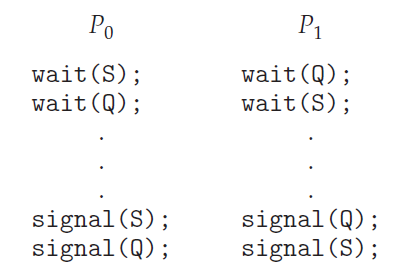

## 1. Liveness

- 임계 영역 문제를 해결하기 위한 3가지 기준
1. 상호 배제(Mutual Exclusion) 만족 : 어떤 한 프로세스가 임계 영역 안의 공유 자원에 접근하여 작업을 수행하는 도중에는 다른 프로세스는 선점을 할 수 없다는 조건을 만족해야 합니다.
2. 진행(Progress) : 교착상태(Deadlock)이 발생하지 않아야 합니다. 교착상태란 두개 이상의 프로세스가 서로 다른 프로레스가 가진 lock을 해제할때까지 계속 대기하는 현상을 말합니다.
3. 한정된 대기(Bounded-waiting) : 기아(Starvation) 현상이 없어야 합니다. 기아 현상이란 프로세스가 다른 프로세스에게 계속 우선순위가 선점되어 실행되지 않고 대기하는 현상을 말합니다.

- 세마포어와 모니터 동기화 도구는 상호 배제 조건을 만족하지만 진행(Progress)와 한정된 대기(Bounded-wating)을 만족시키지는 않습니다.
- Liveness는 진행과 한정된 대기 조건을 만족시키 위해서 사용하는 방법입니다.
- 하지만 교착상태와 우선순위 역젼현상 같은 경우에 liveness 실패로 이어지게 할 수 있습니다.

## 2. 교착상태(Deadlock)

- 두개의 프로세스가 서로 lock(또는 세마포어)을 원하게 되어 진행되지 않는 상태를 교착상태라고 합니다.
- 교착상태는 대기 프로세스 한개의 의해서 발생할 수 있습니다.

- P0는 세마포어 S와 Q 순서로 얻어야만 임계 영역에 진입할 수 있습니다.
- P1는 세마포어 Q와 S 순서로 얻어야만 임계 영역에 진입할 수 있습니다.
- 예를 들어 P0이 세마포어 S를 얻고 wait(Q)를 호출하기 전에 P1이 세마포어 Q를 얻고 세마 포어 S를 얻기 위해 대기한다고 가정합니다.
- 이때 P0이 원하는 세마포어 Q는 P1이 갖고 있고 P1이 원하는 세마포어 S는 P0가 갖고 있게 되어 서로 대기하는 상황이 만들어집니다. 이러한 상황을 교착상태라고 합니다. 
- 정리하면 두개 이상의 세마포어를 가져야 임계 영역에 도달하는 경우에 어떤 한 프로세스가 A라는 세마포어를 가지고 B라는 세마포어를 가지기 전에 A 세마포어를 원하는 다른 프로세스가 B 세마포어를 가지게 된다면 교착상태가 발생합니다.

## 3. 우선순위 역전(Priority Inversion)

- 높은 우선순위를 가진 프로세스들이 낮은 우선순위를 가지는 프로세스를 선점했음에도 낮은 우선순위를 가진 프로세스가 임계 영역에 들어가기 위한 세마포어를 가진채로 대기하게 되어 높은 우선순위 프로세스도 대기해야 하는 상황을 의미합니다.
- 우선순위 역전 현상은 대표적으로 두가지 상황이 발생할 수 있습니다.
    - 상황 1 : 높은 우선순위를 가진 프로세들이 커널 데이터를 읽거나 수정해야 할 필요가 있을때 현재 그 커널 데이터가 낮은 우선 순위를 가진 프로세들에 의해서 접근하고 있어서 낮은 우선순위를 가진 프로세스가 선점당해 대기하게 되도 높은 우선순위를 가진 프로세스가 낮은 우선순위를 가진 프로세스가 가진 세마포어를 얻지 못하여 진입하지 못하고 대기하여 우선순위 역전 현상이 발생합니다.
    - 상황 2 : 높은 우선순위인 "상" 프로세스가 낮은 우선순위를 가진 "하" 프로세스에 의해서 우선순위 역전 현상이 발생하여 대기하고 있는 상태에서 중간에 중간 우선순위를 가진 "중" 프로세스가 "하" 프로세스를 선점하고 자기 작업을 수행합니다. 이때 선점당한 "하" 프로세스는 자기 작업과 세마포어를 반납하지 못하고 대기해야 합니다. 그리고 마침내 "중" 프로세스가 끝나게 되고 다시 "하" 프로세스가 재개하게 됩니다. 하지만 만약에 이러한 "중" 프로세스가 100, 1000개라면 "하" 프로세스는 계속 선점당하여 대기하게 되고 우선순위 역전현상 때문에 대기하게 되는 "상" 프로세스도 마찬가지로 계속 대기해하는 상황이 발생합니다.
- 우선순위 역전 현상을 해결하기 위해서는 우선순위-상속(Priority-Inheritance) 프로토콜을 구현하여 우선순위 역전현상을 회피해야 합니다.

**우선순위-상속(Priority-Inheritance) 프로토콜이란 무엇인가?**

- 낮은 우선순위를 가진 프로세스를 높은 우선순위로 변경하여 프로세스가 가진 세마포어를 해제하는 방식입니다.

---

### Reference

> [\[인프런\] 운영체제 공룡책 강의](https://www.inflearn.com/course/%EC%9A%B4%EC%98%81%EC%B2%B4%EC%A0%9C-%EA%B3%B5%EB%A3%A1%EC%B1%85-%EC%A0%84%EA%B3%B5%EA%B0%95%EC%9D%98/dashboard)