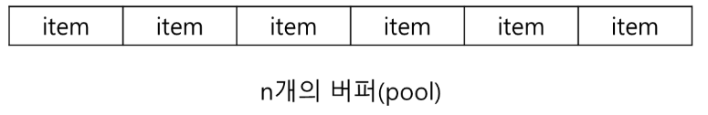

## 동시성 제어 문제들의 고전적인 예제들

- 유한 버퍼 문제(Bounded-Buffer Problem)
    - 생산자-소비자(Producer-Consumer Problem)
- 독자-저자 문제(Readers-Writers Problem)
- 식사하는 철학자 문제(Dining-Philosophers Problem)

## 1. 유한 버퍼 문제(Bounded-Buffer Problem)

- 생산자-소비자 문제로도 불립니다.
- 각각에 하나의 아이템을 저장할 수 있는 n개의 버퍼로 구성되어 있습니다.



- 생산자의 목적은 소비자를 위해서 버퍼를 가득 채우는 것이 목표입니다.
- 소비자의 목적은 아이템을 소비하여 버퍼를 비우는 것이 목표입니다.

### 공유 데이터 구조

- mutex : 이진 세마포어
    - 버퍼 공간에 접근하는 동안 다른 프로세스가 접근하지 못하게 상호 배제를 제공합니다.
    - mutex = 1 초기화, mutex = 0 : 접근 불가능, mutex = 1 : 접근 가능함
- empty : 비어있는 버퍼의 개수를 의미하는 세마포어
    - empty = 0 : 버퍼가 가득찼다는 의미
    - empty = n : 버퍼가 비어있다는 의미
- full : 차있는 버퍼의 개수를 의미하는 세마포어
    - full = 0 : 버퍼가 비어있다는 의미
    - full = n : 버퍼가 가득찼다는 의미

```c
int n;
semaphore mutex = 1;
sepaphore empty = n;
semaphore full = 0
```

### 생산자 프로세스의 구조

```c
while(true){
	...
    // produce an item in next producer
    ...
    wait(empty);
    wait(mutex);
    ...
    // add next producer to buffer
    ...
    signal(mutex);
    signal(full);
}
```

- empty의 lock은 여러 생산자 프로세스가 가질 수 있음
- 그러나 mutex lock은 이진 세마포어이기 때문에 버퍼에 접근할 수 있는 프로세스는 단 하나 뿐이다.
- empty = 0 : 버퍼가 가득찼다는 의미이므로 생산자 프로세스는 대기해야 합니다.

### 소비자 프로세스의 구조

```c
while(true){
    wait(full);
    wait(mutex);
	...
    // remove an item from buffer to next consumer
    ...
    
    signal(mutex);
    signal(empty);
    ...
    // consume the item in next consumer
    ...
 }
 ```

- full lock을 가질수 있는 프로세스는 여러개이다.
- 그러나 mutex lock은 이진 세마포어이기 때문에 버퍼에 접근할 수 있는 프로세스는 단 하나 뿐이다.
- full = 0 : 버퍼가 비어있다는 의미이므로 소비자 프로세스는 대기해야 합니다.

## 2. 독자-저자 문제(Readers-Writers Problem)

- 여러개의 프로세스들이 동시에 수행됩니다.
- Readers 프로세스들은 공유 데이터를 읽기만 합니다.
- Writers 프로세스들은 공유 데이터를 읽기 / 쓰기를 수행합니다.
    - 예를 들어 데이터베이스는 여러개의 프로세스들에 의해서 공유됩니다.
    - 어떤 프로세는 SELECT만 수행하는 프로세스가 있을 수 있습니다. 이러한 프로세스는 Reader 프로세스로 간주합니다.
    - 어떤 프로세스는 UPDATE만 수행하는 프로세스가 있을 수 있습니다. 이러한 프로세스는 Writer 프로세스로 간주합니다.
- 두개 이상의 프로세스가 접근하는 경우는 다음과 같이 나뉠수 있습니다.
    - Case 1 : 두개 이상의 Reader 프로세스들이 동시에 공유 데이터에 접근한다면 문제는 발생하지 않을 것입니다.
    - Case 2 : 만약 1개의 Writer 프로세스와 또다른 프로세스(Reader 또는 Writer 프로세스)가 동시에 데이터베이스에 접근한다면 데이터 불일치가 발생할 것입니다.

### Reader-Writer Problem의 문제 유형

- 모든 문제들은 우선순위와 관련있습니다.
- 첫번째 Reader-Writers Problem
    - Reader 프로세스가 임계 영역에서 데이터를 읽는 상태에서 Writer 프로세스가 대기하고 있다고 해서 Reader 프로세스가 대기해야할 필요는 없습니다.
    - 즉, Reader 프로세스든 Writer 프로세스든 기회는 공정히 가져야 한다는 의미입니다.
- 두번째 Reader-Writers Problem
    - 만약 Writer 프로세스가 임계 영역에서 데이터에 접근 중인 상태라면 새로운 Reader 프로세스들은 접근해서는 안됩니다.
- 2가지 변형 모두 기아(Starvation) 현상이 발생할 수 있습니다.
    - 첫번째 케이스는 공유 자원에 접근하고자 하는 Reader 프로세스가 100만개가 존재하고 Writer 프로세스가 1개라면 Reader 프로세스들은 Wrtier 프로세스를 위해 대기를 안해도 되므로 Writer 프로세스는 후순위로 밀리게 될 것입니다.
    - 두번째 케이스는 반대로 Writer 프로세스가 100만개가 존재하고 소수의 Reader 프로세스들은 계속 대기만 해야 할 것입니다.

### Reader-Writer 문제의 해결안

**Reader 프로세스 자료구조**

```c
semaphore rw_mutex = 1; // 이진 세마포어
semaphore mutex = 1;    // 이진 세마포어
int read_count = 0;
```

- mutex : read_count를 갱신할때 다른 Reader 프로세스의 접근을 막기 위한 상호 배제에 사용되는 lock입니다.
- rw_mutex : 다른 writer의 접근을 막기 위한 상호 배제에 사용됨
    - Reader 프로세스와 Writer 프로세스가 둘다 참조합니다.
- read_count : 현재 몇 개의 Reader 프로세스들이 객체를 읽고 있는지 알려줌
    - read_count = 0 : 공유 자원을 읽고 있는 Reader 프로세스들이 없으므로 Writer 프로세스가 진입해도 된다는 의미

**Writer 프로세스의 구조**

```c
while(true){
    wait(rw_mutex);
    ...
    // writing is performed
    ...
    signal(rw_mutex);
}
```

**Reader 프로세스의 구조**

```c
while(true){
    wait(mutex);      // 다른 Reader 프로세스들과 lock을 얻기 위해 경쟁
    read_count++;     // 현재 읽고 있는 Reader 프로세스 숫자 증가 (임계 영역 공유자원)
    
    // 만약 현재 읽을려고 하는 Reader 프로세스가 첫번째라면
    // rw_mutex의 lock을 얻는다. 그러면 다른 Writer 프로세스는
    // 대기해야 합니다.
    if(readcount == 1) 
    	wait(rw_mutex); 
    signal(mutex);
    
    ...
    // reading is performed
    ...
    
    wait(mutex);
    readcount--; // 현재 읽고 있는 Reader 프로세스 숫자 감소(임계 영역 공유자원)
    if(readcount==0) // 더이상 읽는 Reader 프로세스가 없으면 rw_mutex lock 반환
    	signal(rw_mutex);
    signal(mutex);
}
```

**Reader-Writer 문제의 해결안 특징**

- Writer 프로세스가 임계 영역에서 작업중이면 n개의 Reader 프로세스는 대기중입니다.
    - n개의 Reader중에서 1개의 Reader 프로세스는 rw_mutex의 큐에 있습니다.
        - 1개의 Reader 프로세는 제일 첫번째로 읽을려고 하는 Reader 프로세스입니다.
    - n개의 Reader중에서 n-1개의 Reader 프로세스는 mutex의 큐에 있습니다.
- Writer 프로세스가 signal(rw_mutex)를 실행하는 경우
    - 대기중인 Reader 프로세스들 또는 단일 대기중인 Writer 프로세스가 실행을 재개할 것입니다.
    - 누구를 선택할 것인지는 스케줄러에 달려 있습니다.

### Reader-Writer Locks

- Reader-Writer Problem과 해결안은 Reader-Writer Locks가 제공하여 일반화되어 있습니다.
- Reader-Writer Lock을 흭득할때 lock의 모드를 명세하는 것을 요구합니다. (읽기 모드 / 쓰기 모드)
- 여러개의 프로세들은 읽기 모드에서 Reader-Writer lock을 얻을 수 있습니다.
- 그러나 오직 하나의 프로세스만이 Writer 프로세스들을 위해 요구되는 배타적인 접근으로서 쓰기에 대한 lock을 얻을 수 있습니다.

### Reader-Writer 예제

```java
class ReaderWriter {
    public static void main(String[] args){
        Thread[] readers = new Thread[2];
        Thread[] writers = new Thread[1];
        SharedDB db = new SharedDB();

        // create thread of Reader
        for(int i = 0; i < readers.length; i++){
            readers[i] = new Thread(new Reader(db));
            readers[i].start();
        }

        // create thread of Writer
        for(int i = 0; i < writers.length; i++){
            writers[i] = new Thread(new Writer(db));
            writers[i].start();
        }
    }
}

class Reader implements Runnable{
    SharedDB sharedDB;

    public Reader(SharedDB sharedDB) {
        this.sharedDB = sharedDB;
    }

    @Override
    public void run() {
        while(true){
            try{
                Thread.sleep(1000);
                sharedDB.acquireReadLock();
                sharedDB.read();
                sharedDB.releaseReadLock();
            } catch (InterruptedException e) {
                throw new RuntimeException(e);
            }
        }

    }
}

class Writer implements Runnable{
    SharedDB sharedDB;

    public Writer(SharedDB sharedDB) {
        this.sharedDB = sharedDB;
    }

    @Override
    public void run() {
        while(true){
            try{
                Thread.sleep(1000);
                sharedDB.acquireWriteLock();
                sharedDB.write();
                sharedDB.releaseWriteLock();
            } catch (InterruptedException e) {
                throw new RuntimeException(e);
            }

        }

    }
}

class SharedDB{
    private int readerCount = 0;
    private boolean isWriting = false;

    public void read(){
        // read from the database here.
        System.out.println("현재 데이터베이스를 읽고 있습니다.");
    }

    public void write(){
        // write into the database here.
        System.out.println("현재 데이터베이스를 작성하고 있습니다.");
    }

    synchronized public void acquireReadLock(){
        while(isWriting){
            try{
                wait();
            } catch (InterruptedException e) {
                throw new RuntimeException(e);
            }
        }
        readerCount++;
    }
    synchronized public void releaseReadLock(){
        readerCount--;
        if(readerCount == 0){
            notify();
        }
    }

    synchronized public void acquireWriteLock(){
        while(readerCount > 0 || isWriting){
            try{
                wait();
            } catch (InterruptedException e) {
                throw new RuntimeException(e);
            }
        }
        isWriting = true;
    }

    synchronized  public void releaseWriteLock(){
        isWriting = false;
        notify();
    }
}
```

```bash
현재 데이터베이스를 작성하고 있습니다.
현재 데이터베이스를 읽고 있습니다.
현재 데이터베이스를 읽고 있습니다.
현재 데이터베이스를 읽고 있습니다.
현재 데이터베이스를 읽고 있습니다.
현재 데이터베이스를 작성하고 있습니다.
현재 데이터베이스를 작성하고 있습니다.
...
```

---

### Reference

> [\[인프런\] 운영체제 공룡책 강의](https://www.inflearn.com/course/%EC%9A%B4%EC%98%81%EC%B2%B4%EC%A0%9C-%EA%B3%B5%EB%A3%A1%EC%B1%85-%EC%A0%84%EA%B3%B5%EA%B0%95%EC%9D%98/dashboard)