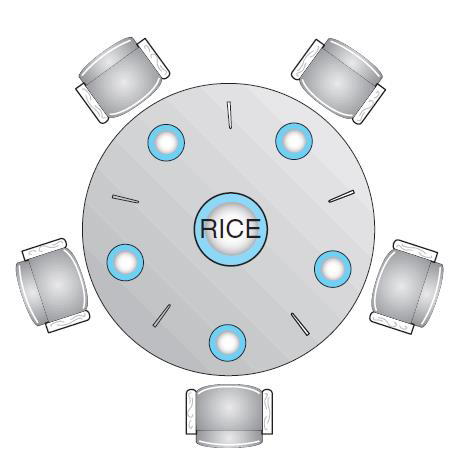

## 1. 동기화 문제의 대표적인 문제 : 식사하는 철학자들 문제

- 5명의 철학자들은 생각하기(thinking), 먹기(eating) 두가지 행동만을 반복합니다.
- 5명의 철학자들은 한짝밖에 없는 5개의 젓가락을 공유합니다.
- 철학자들이 배가 고파지면 배가 고픈 철학자의 양 옆에 있는 두 젓가락을 집어들어 밥을 먹습니다.
- 한명의 배가 고픈 철학자가 그의 양 옆에 있는 젓가락을 집고 밥을 때 그 철학자는 젓가락을 내려 놓지 않고 먹습니다.

다음 그림은 한 테이블에 다섯명의 철학자와 다섯개의 한짝인 젓가락이 배치된 모습입니다.



### 식사하는 철학자들의 문제점

- 교착상태가 없고 기아현상이 없는 여러개의 프로세스들(철학자들) 사이에서 여러개의 자원(젓가락)의 할당이 필요합니다.
- 여기서 각각의 철학자들의 프로세스들은 전부 동일한 성격의 프로세스들이 아닌 네트워크 소켓 프로세스가 될 수 있고 파일 프로세스 일수 있습니다.
- 각각의 젓가락의 자원들은 철학자들과 마찬가지로 자원의 성격이 다를 수 있습니다. 

### 식사하는 철학자들 해결안 방법 : 세마포어(Semaphore)

- 세마포어 해결안은 각각의 젓가락이 세마포어를 설정하는 것입니다.
- 한 철학자는 wait() 연산을 수행함으로써 대기하다가 젓가락을 얻습니다.
- 젓가락을 얻은 철학자가 밥을 다 먹은 후에 signal() 연산을 호출함으로써 젓가락을 놓습니다.

다음은 세마포어를 활용하여 상호 배제를 보장하는 코드입니다.

```c
semaphore chopstick[5];

...

while(true){
    wait(chopstick[i]);         // left  chopstick
    wait(chopstick[(i+1) % 5]); // right chopstick
    
    /* eat for a while */
    
    signal(chopstick[i])
    signal(chopstick[(i+1) % 5]);
    
    /* think for awhile*/
}
```

### 세마포어 해결안의 문제점 : 교착상태(DeadLock)과 기아(Starvation)

**교착상태 발생 시나리오**

1. 다섯 명의 철학자가 동시에 배가 고프졌다고 가정합니다.
2. 각각의 철학자들은 모두 젓가락을 왼쪽을 집은 다음에 오른쪽 젓가락을 집는다고 가정합니다.
3. 1번->2번 순서로 실행이 된다면 모든 철학자는 왼쪽 젓가락을 집은채로 자신의 오른쪽 철학자가 오른쪽 젓가락을 놓고자 대기하게 되고 이는 교착상태가 발생합니다.

**교착상태 문제의 해결안**

1. 철학자들의 인원수를 젓가락의 개수보다 1명 적게 배치합니다.
    - 모든 철학자들이 젓가락을 왼쪽을 집었더라도 하나의 젓가락은 남기 때문에 반드시 1명의 철학자는 밥을 먹고 젓가락을 내려놓을 수 있습니다.
2. 철학자들은 두 젓가락을 집을 수 있을때에만 젓가락을 집는 것을 허락합니다.
3. 비대칭적인 해결안을 사용
    - 홀수 번호를 부여받은 철학자들은 왼쪽 젓가락을 집은 다음에 오른쪽 젓가락을 집습니다.
    - 짝수 번호를 부여받은 철학자들은 오른쪽 젓가락을 집은 다음에 왼쪽 젓가락을 집습니다.
    - 상호 배제 보장으로 인해서 두 철학자가 동시에 젓가락을 집는 것을 허용하지 않기 때문에 이 해결안을 사용할 수 있습니다.

**교착상태 문제 해결안의 한계점**

- 상호배제와 교착상태를 해결하더라도 기아(starvation) 현상을 해결하지는 못합니다.

### 식사하는 철학자들 해결안 방법 : 모니터(Monitor)

- 철학자들은 왼쪽 젓가락, 오른쪽 젓가락 두개다 이용가능할때만 젓가락을 집습니다.
- 철학자들의 3가지 상태를 구별할 필요가 있습니다.
    1. 생각하는 상태(thinking)
    2. 배고픈 상태(hungry)
    3. 먹는 상태(eating)
- 철학자는 이웃하는 두 젓가락이 eating 상태가 아닌 경우에만 hungry상태에서 eating 상태로 전환할 수 있습니다.
- 모니터를 사용하기 위해서는 조건 변수(Condition Variable)이 필요합니다.
    - 조건변수는 철학자가 배가 고프고 철학자가 원하는 젓가락을 얻지 못할때 철학자 스스로 대기하는 것을 허용하게 합니다.

### 모니터를 활용한 식사하는 철학자들의 해결안

- 젓가락들의 분배는 모니터에 의해서 제어됩니다. (DiningPhilosopher Monitor)
- 각각의 철학자는 먹기전에 pick() 연산을 호출해야 하고 다 먹은후 putdown() 연산을 호출해야합니다.
- pick() 연산을 호출할때 젓가락을 얻지 못하면 대기해야합니다. 

**모니터를 활용한 해결안의 한계점**

- 상호배제(Mutual Exclusion)과 교착상태(DeadLock) 해결은 보장하지만 기아(Starvation) 발생은 여전히 가능성이 있습니다.
- 한 철학자가 배가 고파 젓가락을 집고자 해도 다른 철학자가 계속 빠르게 선점하여 젓가락을 집는다면 철학자는 굶어 죽을 수 있습니다.

다음은 식사하는 철학자들 문제를 위한 모니터 해결안입니다.

```c
monitor DiningPhilosophers
{
    enum {THINKING, HUNGRY, EATING} state[5];
    condition self[5];
    
    void pickup(int i){
        state[i] = HUNGRY;
        test(i);
        if(state[i] != EATING)
            self[i].wait();
    }
    
    void putdown(int i){
        state[i] = THINKING;
        test((i + 4) % 5);  // left chopstick
        test((i + 1) % 5);  // right chopstick
    }
    
    void test(int i){
        if((state[(i + 4) % 5] != EATING) &&
           (state[i] == HUNGRY) &&
           (state[(i + 1) % 5] != EATING)){
           state[i] = EATING;
           self[i].signal();
        }
    }
    
    initialization_code(){
        for(int i = 0; i < 5; i++){
            state[i] = THINKING;
        }
    }
}
```

### C언어 Pthread 라이브러리를 이용한 식사하는 철학자 문제 구현

```c
//
// Created by qkdlf on 2022-07-11 011.
//
//
// Created by qkdlf on 2022-07-11 011.
//

#include <stdio.h>
#include <stdlib.h>
#include <unistd.h>
#include <pthread.h>

#define true 1
#define NUM_PHILS 5 // 철학자들의 인원수

// THINKING : 생각중인  상태
// HUNGRY   : 배고픈    상태
// EATING   : 밥을 먹는 상태
enum {THINKING, HUNGRY, EATING} state[NUM_PHILS];

pthread_mutex_t mutex_lock;
pthread_cond_t cond_vars[NUM_PHILS];

void init();
int leftOf(int i);
int rightOf(int i);
void* philosopher(void* param);
void think(int id);
void eat(int id);
void pickup(int id);
void putdown(int id);
void test(int i);

int main(){

    pthread_t tid;
    init();
    for(int i = 0; i < NUM_PHILS; i++){
        pthread_create(&tid, NULL, philosopher, (void*) &i);
    }
    for(int i = 0; i < NUM_PHILS; i++){
        pthread_join(tid, NULL);
    }
    return 0;
}


void init(){
    for(int i = 0; i < NUM_PHILS; i++){
        state[i] = THINKING;
        pthread_cond_init(&cond_vars[i], NULL);
    }
    pthread_mutex_init(&mutex_lock, NULL);
    srand(time(0));
}

int leftOf(int i){
    return (i + NUM_PHILS - 1) % NUM_PHILS;
}

int rightOf(int i){
    return (i + 1) % NUM_PHILS;
}

void* philosopher(void* param){
    int id = *((int *) param);
    while(true){
        think(id);
        pickup(id);
        eat(id);
        putdown(id);
    }
}

void think(int id){
    printf("%d: Now, I'm thinking...\n", id);
    usleep((1 + rand() % 50) * 10000);
}

void eat(int id){
    printf("%d: Now, I'm eating...\n", id);
    usleep((1 + rand() % 50) * 10000);
}

void pickup(int id){
    pthread_mutex_lock(&mutex_lock);

    state[id] = HUNGRY;
    test(id);
    while(state[id] != EATING){
        pthread_cond_wait(&cond_vars[id], &mutex_lock);
    }

    pthread_mutex_unlock(&mutex_lock);
}

void putdown(int id){
    pthread_mutex_lock(&mutex_lock);

    state[id] = THINKING;
    test(leftOf(id));
    test(rightOf(id));

    pthread_mutex_unlock(&mutex_lock);
}

void test(int i){
    // 만약 철학자 i가 배고픈 상태이고 이웃하는 젓가락이 eating 상태가 아니라면
    // 밥을 먹습니다.
    if(state[i] == HUNGRY &&
       state[leftOf(i)] != EATING &&
       state[rightOf(i)] != EATING){
        state[i] = EATING;
        pthread_cond_signal(&cond_vars[i]);
    }
}
```

```bash
2: Now, I'm thinking...
3: Now, I'm thinking...
5: Now, I'm thinking...
5: Now, I'm thinking...
5: Now, I'm thinking...
5: Now, I'm eating...
3: Now, I'm eating...
5: Now, I'm eating...
5: Now, I'm eating...
3: Now, I'm thinking...
2: Now, I'm eating...
5: Now, I'm thinking...
5: Now, I'm thinking...
5: Now, I'm thinking...
2: Now, I'm thinking...
3: Now, I'm eating...
...
```

### Java 언어를 이용한 식사하는 철학자 문제 구현

```java
enum State{
    THINKING, HUNGRY, EATING
}

class DiningPhilosophers {
    public static void main(String[] args){
        int numOfPhils = 5;
        Philosopher[] philosophers = new Philosopher[numOfPhils];
        DiningPhilosopherMonitor monitor = new DiningPhilosopherMonitor(numOfPhils);

        for(int i = 0; i < philosophers.length; i++){
            new Thread(new Philosopher(i, monitor)).start();
        }
    }
}

class Philosopher implements Runnable{
    private int id;
    private DiningPhilosopherMonitor monitor;

    public Philosopher(int id, DiningPhilosopherMonitor monitor) {
        this.id = id;
        this.monitor = monitor;
    }

    @Override
    public void run() {
        while(true){
            think();
            monitor.pickup(id);
            eat();
            monitor.putdown(id);
        }
    }

    private void think(){
        try{
            System.out.printf("%d: Now, I'm Thinking\n", id);
            Thread.sleep((long)Math.random() * 500);
        } catch (InterruptedException e) {
            throw new RuntimeException(e);
        }

    }

    private void eat(){
        try{
            System.out.printf("%d: Now, I'm Eating\n", id);
            Thread.sleep((long)Math.random()*50);
        } catch (InterruptedException e) {
            throw new RuntimeException(e);
        }

    }
}

class DiningPhilosopherMonitor{
    private int numOfPhils;
    private State[] state;
    private Condition[] self;
    private Lock lock;

    public DiningPhilosopherMonitor(int numOfPhils) {
        this.numOfPhils = numOfPhils;
        state = new State[numOfPhils];
        self  = new Condition[numOfPhils];
        lock  = new ReentrantLock();

        for(int i = 0; i < numOfPhils; i++){
            state[i] = State.THINKING;
            self[i]  = lock.newCondition();
        }
    }

    private int leftOf(int id){
        return (id + numOfPhils - 1) % numOfPhils;
    }

    private int rightOf(int id){
        return (id + 1) % numOfPhils;
    }

    private void test(int id){
        if(state[id] == State.HUNGRY &&
           state[leftOf(id)] != State.EATING &&
           state[rightOf(id)] != State.EATING){
            state[id] = State.EATING;
            self[id].signal();
        }
    }

    public void pickup(int id){
        lock.lock();
        try{
            state[id] = State.HUNGRY;
            test(id);
            if(state[id] != State.EATING){
                self[id].await();
            }
        } catch (InterruptedException e) {
            throw new RuntimeException(e);
        } finally {
            lock.unlock();
        }

    }
    public void putdown(int id){
        lock.lock();
        try{
            state[id] = State.THINKING;
            test(leftOf(id));
            test(rightOf(id));
        }finally {
            lock.unlock();
        }
    }

}
```

```bash
0: Now, I'm Thinking
4: Now, I'm Thinking
3: Now, I'm Thinking
2: Now, I'm Thinking
1: Now, I'm Thinking
0: Now, I'm Eating
2: Now, I'm Eating
0: Now, I'm Thinking
2: Now, I'm Thinking
4: Now, I'm Eating
1: Now, I'm Eating
...
```

## 2. 대체적인 접근 방법들

### 쓰레드-안전(Thread-Safe) 동시성 애플리케이션

- 동시성 애플리케이션은 멀티코어 시스템에서 뮤텍스 락, 세마포어, 모니터와 같은 기술을 사용하여 좋은 성능을 발휘합니다.
- 그러나 경쟁 상태(Race Conditions)와 liveness hazards(교착 상태와 같은)같은 상황에 빠져버리는 위험이 증가합니다.
- 쓰레드-안전 동시성 애플리케이션의 설계를 위한 대체적인 접근방법들은 다음과 같습니다.
    1. 트랜잭션 메모리(Transactional Memory)
        - 트랜잭션이란 원자적인 실행의 단위를 의미합니다.
        - 메모리 영역 자체를 트랜잭션 자체로 만들자는 의미입니다.
    2. OpenMP
        - OpenMP란 공유 메모리 환경에서 프로그램을 병렬화해주는 표준입니다.
        - OpenMP 표준은 컴파일러 지시자의 집합을 정의하고 지시자는 컴파일러에게 코드의 블럭을 어떻게 처리할 지 알려줍니다. 
        - OpenMP를 이용하면 코드의 특정 영역을 임계 구역으로 선언하여 해당 구역을 임계 영역으로 만들어 줍니다.
    3. 함수형 프로그래밍 언어(Functional Programming Language)
        - 함수형 프로그래밍 언어를 사용하여 명령형 프로그래밍 언어에서 발생하는 동기화 문제를 원천적으로 막습니다.
        - 함수형 프로그래밍 언어는 스칼라, 하스켈 등이 있습니다.

---

### Reference

> [\[인프런\] 운영체제 공룡책 강의](https://www.inflearn.com/course/%EC%9A%B4%EC%98%81%EC%B2%B4%EC%A0%9C-%EA%B3%B5%EB%A3%A1%EC%B1%85-%EC%A0%84%EA%B3%B5%EA%B0%95%EC%9D%98/dashboard)