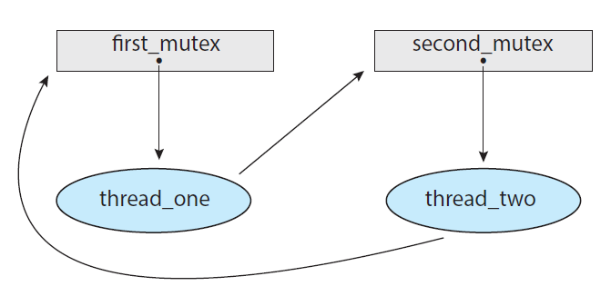
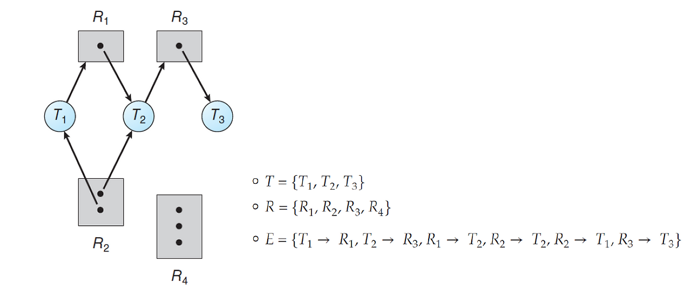
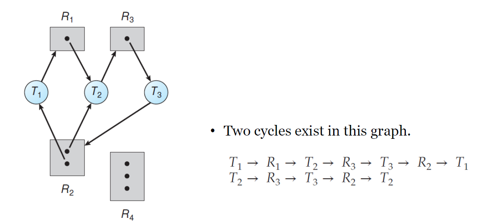
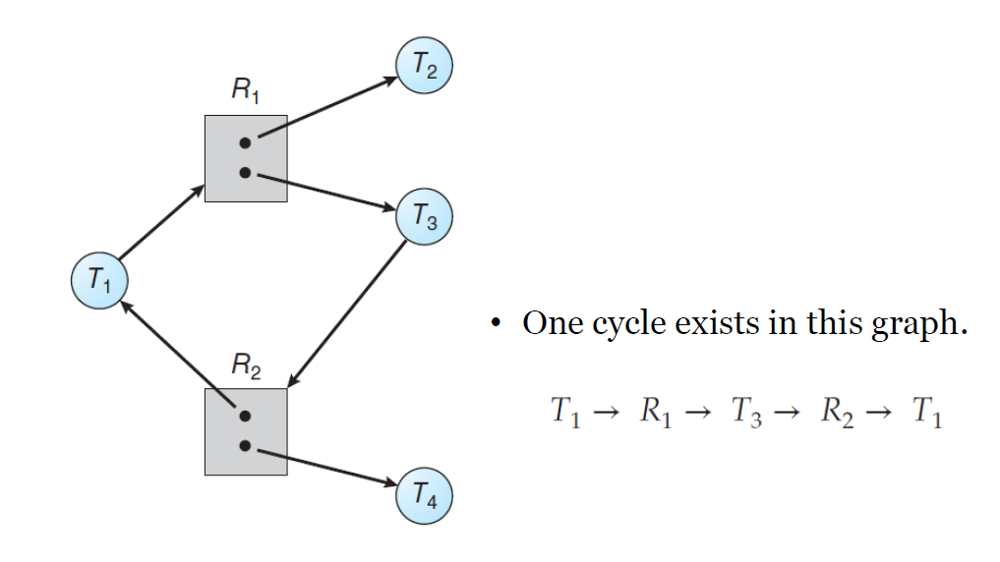

## 1. 시스템 모델(System Model)

### 교착상태(Deadlock)이란 무엇인가?

- 교착상태란 어떤 다른 프로세스에 의해서 발생된 이벤트에 의해서 모든 프로세스가 대기하는 현상
- 요청한 자원을 다른 대기중인 쓰레드가 점유하고 있기 때문에 자원을 요청한 대기중인 쓰레드(또는 프로세스)는 다시는 쓰레드 상태를 변경할 수 없습니다.

여러개의 경쟁하는 쓰레드 사이에게 분배가 될 유한한 수의 자원으로로 구성된 시스템을 고려해보자.          
자원의 종류는 몇가지 동일한 인스턴스로 구성됩니다. 예를 들어 CPU 싸이클, 파일, 입출력 기기(프린터, 드라이브 등)이 있습니다. CPU 사이클이 4개의 코어로 구성되었다면 한번에 4개의 쓰레드를 수행할 수 있고 그 이후의 쓰레드는 대기하여야 합니다.               
만약 어떤 한 쓰레드가 동일한 자원 유형의 인스턴스를 요청한다면 어떤 인스턴스의 할당이 요청을 만족하면 됩니다.           
어떤 한 쓰레드는 자원이 필요할때 "자원 요청 -> 자원 사용 -> 자원 해제"와 같은 순서로 사용할 수 있습니다. 여기서 자원의 사용은 임계 영역(Critical Section)을 의미하며 임계 영역에는 여러개의 자원을 사용하는 것을 의미합니다.

## 2. 멀티 쓰레딩 애플리케이션의 교착상태

### 교착상태(Deadlocks)는 어떻게 발생하는가?

교착상태의 대표적인 사례는 어떤 한 프로세스가 A라는 자원을 점유한 상태에서 B라는 자원을 점유하고자 할때 B 자원을 가지고 있는 프로세스가 A 자원을 점유하고자 할때 발생하는 것이 있습니다.

위 상황을 코드로 표현하면 다음과 같습니다.

```c
pthread_mutex_t first_mutex;
pthread_mutex_t second_mutex;

pthread_mutex_init(&first_mutex, NULL);
pthread_mutex_init(&second_mutex, NULL);

/* thread_one runs in this function */
void* do_work_one(void* param)
{
    pthread_mutex_lock(&first_mutex);
    pthread_mutex_lock(&second_mutex);
    
    /*Do some work*/
    
    pthread_mutex_unlock(&second_mutex);
    pthread_mutex_unlock(&first_mutex);
    
    pthread_exit(0);
}

/* thread_two runs in this function */
void* do_work_two(void* param)
{
    pthread_mutex_lock(&second_mutex);
    pthread_mutex_lock(&first_mutex);
    
    /*Do some work*/
    
    pthread_mutex_unlock(&first_mutex);
    pthread_mutex_unlock(&second_mutex);
    
    pthread_exit(0);
}
```

- 쓰레드 A는 do_work_one 함수를 수행하고 쓰레드 B는 do_work_two 함수를 수행한다고 가정합니다.
- 만약 쓰레드 A가 first_mutex lock을 가지고 쓰레드 B가 second_mutex lock을 가진다고 가정합니다.
- 그리고 쓰레드 A는 second_mutex의 lock을 가지고자 second_mutex lock이 해제될때까지 대기합니다.
- 그리고 쓰레드 B는 first_mutex의 lock을 가지고자 first_mutex lock이 해제될때까지 대기합니다.
- 쓰레드 A,B 서로 가지고 있는 lock이 해제되기를 바라며 대기하게 되며 교착상태가 발생합니다.

## 3. 교착상태의 특징

### 교착상태 발생 조건 4가지

다음과 같이 교착상태가 발생하기 위해서는 4가지 조건이 만족해야 합니다.

1. 상호 배제(Mutual Exclusion)
    - 최소 한개의 자원이 임계 영역에서 점유됩니다.
2. 점유와 대기(Hold and Wait)
    - 어떤 한 쓰레드가 최소 한개의 자원을 점유하고 다른 쓰레드가 가지고 있는 추가적인 자원을 얻고자 대기하게 되면 교착상태 발생 조건을 만족합니다.
3. 선점 불가(No preemption)
    - 자원들이 선점이 불가능할때 교착상태 발생 조건을 만족합니다.
    - 자원들의 종류에는 CPU 사이클, 파일, 입출력 기기들이 존재합니다.
4. 원형 대기(Circular Wait)
    - 대기중인 쓰레드들의 집합이 종속적인 대기 그래프가 원형이 존재할때 발생합니다. 
    - 예를 들어 A 쓰레드가 B쓰레드의 자원을 원하고 B쓰레드가 C쓰레드의 자원을 원한 상태에서 C쓰레드가 A 쓰레드의 자원을 원한다면 이와 같은 형태를 원형 대기라고 합니다.
    - 원형 대기는 최소 2개 이상의 쓰레드에서 발생할 수 있습니다.

### 자원 할당 그래프(Resource-Allocation Graph)

- 자원 할당 그래프는 교착상태를 더 쉽게 이해하기 위한 방향성 그래프입니다.
- 자원 할당 그래프는 정점의 집합 V와 간선의 집합 E로 구성되어 있습니다.
- 정점의 두가지 종류
    - T = {T1, T2, ..., Tn) : 시스템에서 활성화된 쓰레드의 집합
    - R = {R1, R2, ..., Rn) : 시스템에서 모든 자원 유형의 집합
- 방향성 간선 : Ti -> Rj (요청 가선)
    - 쓰레드 i가 자원 Rj를 요청합니다.
- 방향성 간선 : Rj -> Ti (할당 간선)
    - 자원 Rj가 쓰레드 i에게 할당되는 것을 의미합니다.

다음은 자원-할당 그래프를 표현합니다.



- 쓰레드 1에는 first_mutex lock이 할당되어 있고 second_mutex 자원을 요청하는 상태입니다.
- 쓰레드 2에는 second_mutex lock이 할당되어 있고 first_mutex 자원을 요창하는 상태입니다.

위와 같이 자원-할당 그래프를 보아서 애플리케이션이 교착상태가 일어날 가능성이 있는지 파악할 수 있습니다.

다음은 자원-할당 그래프를 집합으로 표현한 그림입니다.



- 다음 집합을 통해서 쓰레드 T1은 R1 자원을 요청하고 T2는 R3 자원을 요청한 상태입니다.
- 그리고 자원 할당 상황은 T1에는 R2 자원이 할당됨, T2에는 R1, R2가 할당됨, T3에는 R3이 할당됨을 알 수 있습니다.
- 위 그래프를 통해서 쓰레드 T3은 작업을 언젠가 마치고 T2->T1순으로 자원을 할당받게 되어서 수행을 마칠 것입니다. 즉, 교착상태가 발생하지 않을 것입니다.

다음 그림은 교착상태가 발생하는 자원-할당 그래프입니다.



- 핵심은 R2가 T1과 T2에 할당되어있기 때문에 원형대기가 발생하여 교착상태가 발생합니다.

다음 그림은 교착상태가 발생하지 않는 자원-할당 그래프입니다.



- T1->R1->T3->T2로 원형이 생성되었지만 R1과 R2 자원 유형은 인스턴스가 각각 2개입니다.
- T2와 T4가 작업을 마치고 R1, R2 자원을 반환하면서 T3, T1도 작업을 마칠 수 있기 때문에 교착상태가 발생하지 않습니다.

### 자원 할당 그래프로 보는 교착상태

- 자원 할당 그래프가 원형(Cycle)을 가지고 있지 않다면 교착상태가 확정적으로 발생하지 않습니다.
- 자원 할당 그래프가 원형(Cycle)을 가지고 있더라도 교착상태가 무조건적으로 발생하지는 않습니다.

## 4. 교착상태를 다루기 위한 방법

### 교착상태를 벗어나기 위한 3가지 방법은 다음과 같습니다.

1. 문제를 완전히 무시하는 방법
    - 마치 시스템에서 교착상태가 무조건 발생하지 않는 척합니다.
2. 교착상태를 방지(Prevent)하거나 회피(Avoid)하는 방식을 사용합니다.
    - 교착상태 방지 : 교착상태로 진입하는 것을 절대로 방지하는 방식입니다.하지만 교착상태 방지는 거의 불가능한 방법입니다.
    - 교착상태 회피 : Banker's Algorithm
3. 교착상태가 발생하는 것을 허용하는 방법
    - 단, 탐색(Detect)하고 회복(Recover)하는 절차를 수행합니다.
    - 교착상태 탐색 : 교착상태가 발생하는지 탐색하는 연산입니다.
    - 교착상태 회복 : 교착상태가 발생하기 이전으로 되돌아가는 연산입니다.

## 5. 교착상태 방지(Deadlock Prevention)

- 교착상태 방지의 아이디어는 교착상태가 발생하는 조건 4가지(상호배제, 점유와 대기, 선점 불가, 원형 대기)중 하나가 발생하는 것을 막는 방법입니다.

### 상호 배제(Mutual Exclusion)을 방지하는 방법

- 상호 배제가 발생하는 조건은 최소 하나의 자원이 공유 불가능해야 한다는 점입니다.
- 반대로 방지하기 위해서는 모든 자원이 공유되면 교착상태를 막을 수 있다는 주장입니다. 하지만 일반적으로 이 방법은 대부분의 애플리케이션에 적용할 수 없는 방법입니다.
    - 몇몇 자원들은 본질적으로 공유가 되면 안되기 때문입니다.
    - 예를 들어 뮤텍스 락같은 자원의 경우에는 여러 쓰레드에 의해서 공유되면 안되는 자원입니다.
- 즉, 정리하면 상호 배제를 방지하는 방법은 불가능한 방법입니다.

### 점유와 대기(Hold and Wait)을 방지하는 방법

- 점유와 대기를 방지하는 방법은 어떤 한 쓰레드가 자원을 요청할때 이미 점유하고 있는 자원을 해제한 다음 요청하는 방식입니다.
- 예를 들어 어떤 한 쓰레드가 A라는 자원을 요청할 때 B라는 다른 자원을 이미 점유하고 있다면 점유하고 있는 A 자원을 해제하고 요청한 B 자원을 얻을때까지 대기합니다. 그리고 요청한 B 자원을 얻은 다음에 이전에 해제한 A 자원을 요청하여 자원을 얻습니다.
- 하지만 점유와 대기를 방지하는 방법은 대부분의 응용 프로그램에서는 비 실용적입니다.

### 선점 불가(No preemption)를 방지하는 방법

- 선점 불가를 방지하는 방법은 자원을 점유하고 있는 쓰레드에 대해서 선점하여 자원을 내려놓게 하는 방법입니다.
- 예를 들어 어떤 한 쓰레드가 A라는 자원을 가지고 있는 상태에서 B라는 자원을 요청합니다. 그런데 B 자원은 다른 쓰레드가 점유하고 있는 상황이라면 다른 쓰레드가 갖고 있는 B 자원을 해제하게 하여 선점합니다.
- 점유와 대기를 방지하는 방법과 마찬가지로 이 방법은 대부분의 응용 프로그램에서는 일반적으로 적용할 수 없습니다.

### 원형 대기(Circular Wait)를 방지하는 방법 : 제일 실용적인 방법

- 모든 자원 유형들에 순서를 지정합니다.
- 그리고 각각의 쓰레드가 자원을 오름차순으로 요청하는 것을 요구합니다.
- 내가 점유하고 있는 자원보다 높은 자원 유형들만 요청합니다. 다른 말로 말하면 내가 점유하고 있는 자원보다 순서가 낮은 자원들은 요청하는 것을 막습니다.
- 하지만 이와 같은 방법은 기아(Starvation) 발생 가능성이 높아지는 단점이 있습니다.
- 그러나 이러한 방법도 교착상태 방지를 보장할 수 없습니다. 

```c
void transaction(Account from, Account to, double amount)
{
    mutex lock1, lock2;
    
    lock1 = get_lock(from);
    lock2 = get_lock(to);
    
    acquire(lock1);
        acquire(lock2);
        
            withdraw(from, amount);
            deposit(to, amount);
        release(lock2);
    release(lock1);
}

transaction(checking_account, savings_account, 25.0)
transaction(savings_account, checking_account, 50.0)
```

- 위 transaction 연산은 원자적인 연산이기 때문에 다른 쓰레드에 의해서 선점될 수 없습니다.
- 하지만 문제가 되는 부분은 첫번째 transaction 연산중에 두번째 transaction 연산이 발생하여 교착상태 문제가 발생할 수 있습니다.

### 정리하며

- 교착상태는 상호배제, 점유와 대기, 선점 불가, 원형 대기인 4가지 조건이 만족하면 발생합니다.
- 교착상태를 해결하는 방법에는 무시, 방지, 회피, 탐색 후 회피가 있습니다.
- 교착상태 방지 방법 중 상호배제, 점유와 대기, 선점 불가를 방지하는 방법은 실용적이지 못하고 원형 대기를 방지하는 방법은 가장 실용적이지만 교착상태를 방지하는 것을 보장하지는 못합니다.

---

### Reference

> [\[인프런\] 운영체제 공룡책 강의](https://www.inflearn.com/course/%EC%9A%B4%EC%98%81%EC%B2%B4%EC%A0%9C-%EA%B3%B5%EB%A3%A1%EC%B1%85-%EC%A0%84%EA%B3%B5%EA%B0%95%EC%9D%98/dashboard)