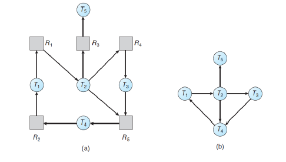
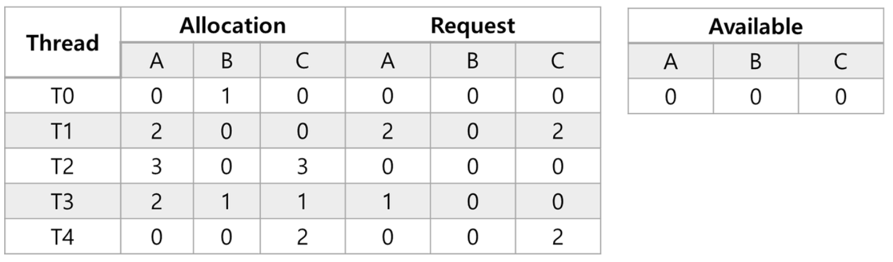
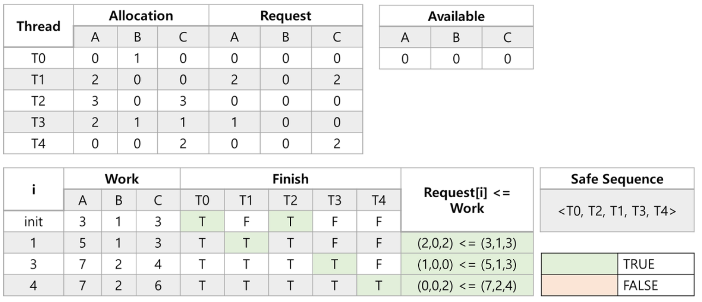
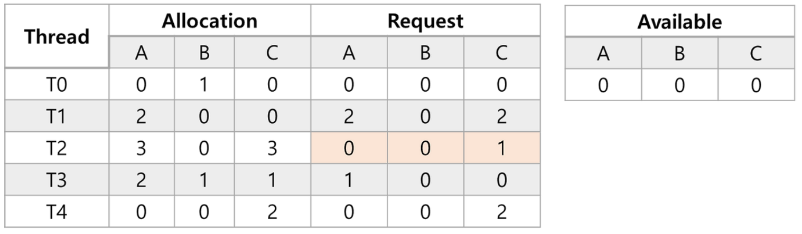
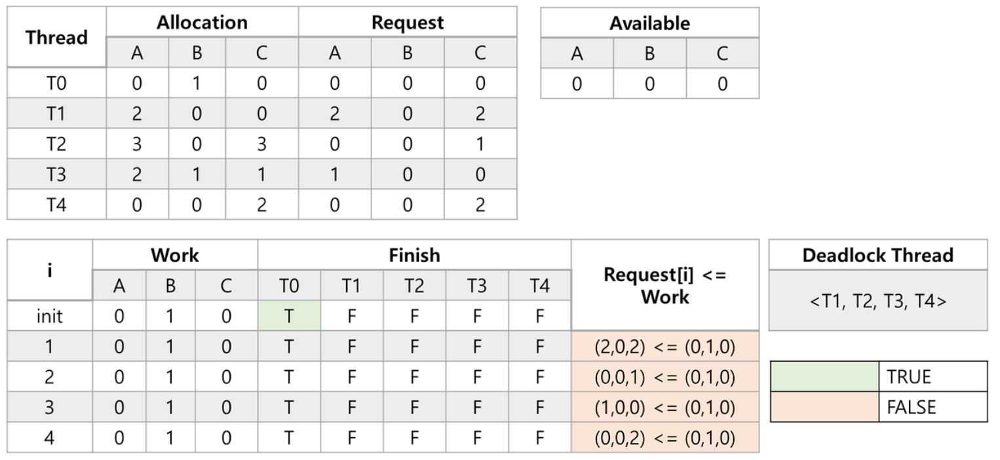

## 1. 교착상태 탐색(DeadLock Dection)

- 만약 시스템이 교착상태 방지(Prevent)또는 회피(Avoid)를 하지 않는다면 교착상태가 발생할 것입니다.
- 교착상태 탐색 환경에서의 시스템은 교착상태 발생을 허용해줍니다. 대신 교착상태가 발생했는지 안했는지를 판단하기 위한 시스템의 상태를 설명하는 알고리즘을 제공합니다. (교착상태 탐색 알고리즘)
- 시스템은 교착상태가 발생하면 회복하는 알고리즘을 제공합니다.

**각각의 자원 유형의 인스턴스가 단일 인스턴스인 경우**

- 자원-할당 그래프의 변형인 대기 그래프(wait-for graph)를 유지합니다.
- 주기적으로 대기 그래프안에 원형 대기가 있는지 탐색하는 알고리즘을 수행합니다.
- 대기 그래프의 특징은 자원-할당 그래프에서 자원을 뺀 형태입니다.

다음은 같은 자원 요청 상황을 자원-할당 그래프와 대기 그래프로 표현한 그림입니다.

**각각의 자원 유형의 인스턴스가 단일 인스턴스인 경우**

- 각각의 자원 유형에 다수의 인스턴스가 있는 시스템에는 대기 그래프를 적용할 수 없습니다.

## 2. 교착상태 탐색 알고리즘

### 교착상태 탐색 알고리즘의 데이터 구성

- Available[m]
- Allocation[n x m]
- Request[n x m] : 각각의 쓰레드의 현재 요청을 나타냅니다.
    - 만약 Request[i][j] == k라면 쓰레드 i가 자원 유형 Rj의 k개의 인스턴스를 요청한다는 의미입니다.

### 교착상태 탐색 알고리즘 수행과정

1. 길이 m과 n을 가진 Work과 Finish 배열을 초기화합니다.
    - Work 배열의 각각의 값은 Available 배열의 요소값으로 초기화합니다.
    - Finish 배열의 모든 요소에 대해서 초기화를 수행합니다.
    - 만약 Allocation[i] != 0라면 Finish[i] = false, Allocation[i] == 0이라면 Finish[i] = true
2. 다음 두 조건을 만족하는 인덱스 번호 i를 탐색합니다. 만약 두 조건을 만족하는 i가 없다면 4번 과정으로 이동합니다.
    1. Finish[i] == false
    2. Request[i] <= Work
3. 2번 과정의 두 조건을 만족하는 인덱스 번호 i가 있다면 다음 과정을 수행합니다.
    1. Work = Work + Allocation[i]
    2. Finish[i] = true
    3. 2번 과정으로 이동
4. 만약 0 <= i <n에 대해서 Finish[i] == false라면 해당 시스템은 교착상태에 있는 상태입니다. 더욱이 쓰레드 Ti는 교착상태에 있는 쓰레드를 의미합니다.

### 교착상태 탐색 알고리즘 수행 예제

- T = {T0, T1, T2, T3, T4} : 다섯개의 쓰레드를 가진 집합 T
- R = {A, B, C} : 3개의 자원 유형을 가진 집합 R
- A = 7, B = 2, C = 6 : 각각의 자원 유형에 따른 인스턴스의 개수

위 집합을 기반으로 할당과 자원 요청은 다음과 같습니다.

다음은 위 표를 기반으로 교착상태 탐색 알고리즘을 수행한 결과입니다.

- 위 수행결과와 같이 Safe Sequence가 계산되므로 위는 교착상태가 없는 상태입니다.

쓰레드 T2가 자원 요청 = (0,0,1)을 하는 경우         
이 상태는 초기 상태에서 T2가 자원 요청을 한 상태입니다.

위 표를 기반으로 교착상태 탐색 알고리즘을 수행한 결과는 다음과 같습니다.

- 수행결과 쓰레드 T0을 제외한 다른 모든 쓰레드가 교착상태에 빠지게 됨을 알 수 있습니다.

### 교착상태 탐색 알고리즘을 수행하여 교착상태가 존재하는 경우

- 교착상태가 발생되었다고 알림
- 또는 시스템이 교착상태로부터 자동적으로 회복(Recovery)을 수행합니다.
    - 프로세스와 쓰레드 종료
    - 자원 선점 수행

### 교착상태 회복(Deadlock Recovery) 방법

- 프로세스와 쓰레드의 종료
    - 모든 교착상태 프로세스를 무시합니다.
    - 교착상태 원형 대기가 종료될때까지 하나의 프로세스를 무시합니다. 하나의 프로세스를 무시하면 다른 프로세스가 작업을 수행하게 되어 풀릴 수 있습니다.
- 자원 선점
    1. 피해자 선택 : 비용을 최소화하기 위해서 선점의 순서를 고려합니다.
    2. 롤백(Rollback) : 안전한 상태로 프로세스를 롤백하고 재시작합니다.
    3. 기아(Starvation) : 피해자로 지목된 횟수를 한정하여 기아를 예방합니다.

### 정리하며
- 교착상태 탐색 알고리즘을 수행하여 교착 상태가 발생하는지를 확인합니다.
- 교착상태가 발생하면 프로세스와 쓰레드를 종료하는 방법을 사용하거나 자원을 선점하는 방법으로 교착상태로부터 회복합니다.

---

### Reference

> [\[인프런\] 운영체제 공룡책 강의](https://www.inflearn.com/course/%EC%9A%B4%EC%98%81%EC%B2%B4%EC%A0%9C-%EA%B3%B5%EB%A3%A1%EC%B1%85-%EC%A0%84%EA%B3%B5%EA%B0%95%EC%9D%98/dashboard)