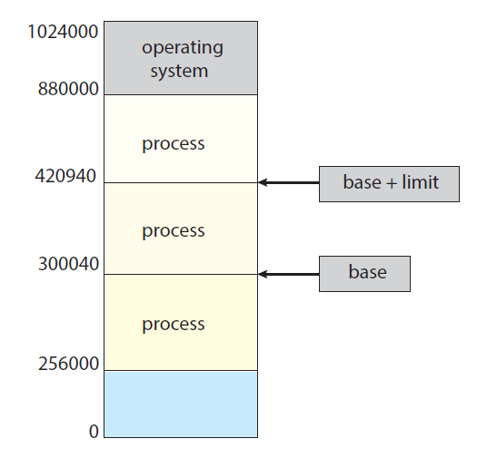
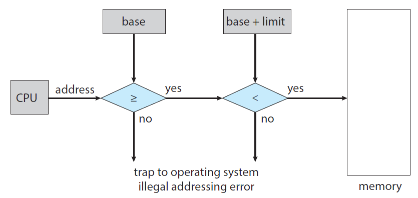
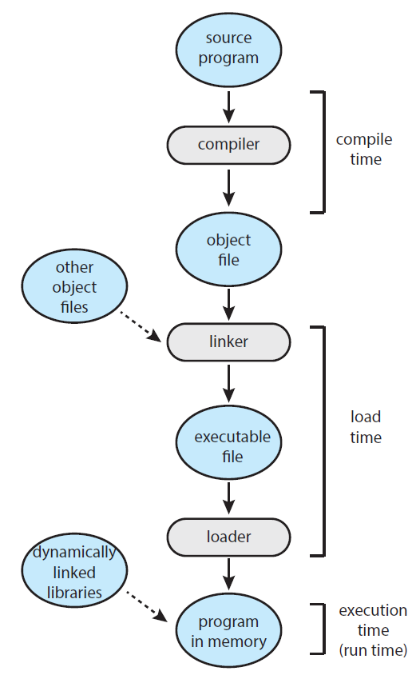
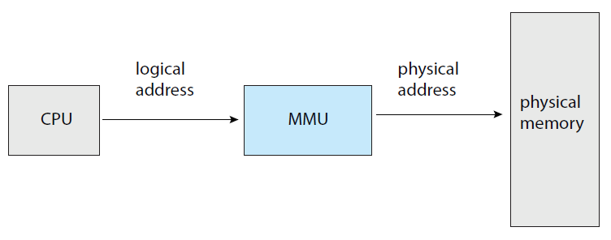
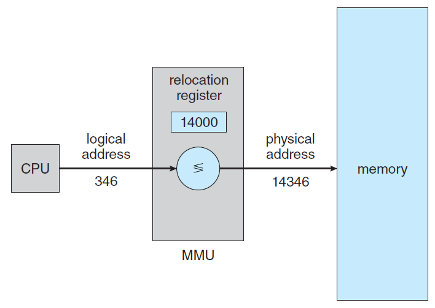
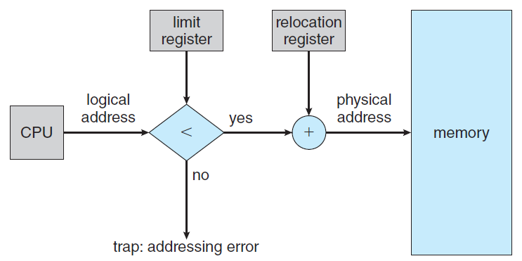
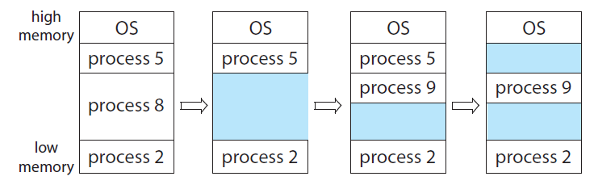
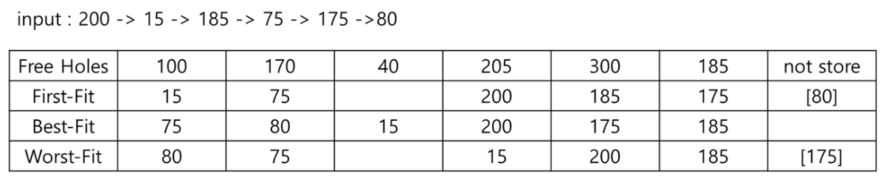
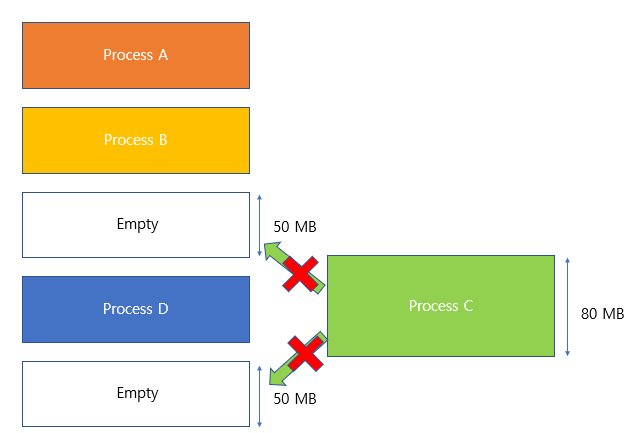
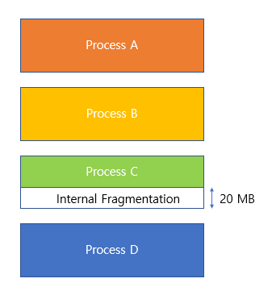

## 1. 주 메모리 관리의 배경

### 프로세스와 메모리와의 관계

- 프로세스는 실행중인 프로그램이라는 의미로 메인 메모리에 위해서 수행하는 프로그램이라는 의미입니다.
- 메모리는 각각의 주소에 바이트 배열로 구성되어 있습니다.
- CPU는 프로그램 카운터를 사용하여 메모리로부터 명령어를 가져옵니다. 그리고 프로세스 안에 명령어들도 메모리에 불러오거나 저장할 수 있습니다.

### 메모리 공간

- 각각의 프로세스는 별개의 메모리 공간을 갖는 것을 보장해야합니다.
- 메모리 공간에는 프로세스들의 시작주소와 종료주소를 정의하기 위해서 베이스 레지스터(base register)와 한계 레지스터(limit register)를 제공하고 있습니다.
- 베이스 레지스터(base register) : 메모리에 프로그램이 할당 될 때 프로그램의 시작 register 주소
- 한계 레지스터(limit register)      : 메모리에 프로그램이 할당 될 때 프로그램의 마지막 register 주소

### Base Register & Limit Register의 특징

- 프로그램이 Base Register ~ Limit Register의 범위를 넘어가는 주소에 접근하는 경우 운영체제에 의해서 트랩(trap)이 발생하고 프로그램이 강제 종료됩니다.
- 각 프로그램의 Base Register / Limit Register는 각 프로그램의 고유값이며, 이는 PCB(Process Control Block)에 저장됩니다.

다음 그림은 메모리 위에 운영체제와 다수의 프로세스들을 베이스 레지스터와 한계 레지스터로 범위를 정의한 그림입니다.

### 메모리 공간의 보호

- 메모리 공간의 보호는 CPU가 특정 메모리의 주소에 위치하는 프로세스에 접근하고자 할때 CPU의 주소값이 베이스 레지스터와 한계 레지스터의 범위 안에 있으면 접근을 허락하고 그 외의 주소는 허락하지 않도록 합니다.

다음은 CPU가 메모리에 특정 주소에 접근하고자 하는 그림입니다.

### 메모리 할당 과정(Address Binding)

Address에는 논리적 메모리 주소(Logical Memory Address)와 물리적 메모리 주소(Physical Memory Address)가 존재합니다.

- 논리적 메모리 주소(Logical Memory Address)
    - 일반적인 사용자가 사용하는 주소이며, 이진 파일을 생성할 때 부여되는 메모리 주소입니다.
    - 실제 프로그램을 실행시킬 때 메모리의 빈 공간에 논리적 메모리 주소와 물리적 메모리 주소를 대응(binding, 바인딩)시키기 때문에 사용자는 메모리 관리에 있어서 편해집니다.
- 물리적 메모리 주소(Physical Memory Address)
    - 논리적 메모리 주소에서 실제 물리적인 메모리에 접근하기 위해 사용되는 주소입니다.

### Binding 종류

Binding은 Binding을 하는 시점에 따라 다음과 같이 3가지로 구분됩니다.

1. Compile Time
- Instruction 또는 data에 주소를 컴파일 할때 바인딩하는 것입니다. 컴파일 시 주소가 결정되기 때문에 메모리 구조가 변칙적으로 작용될 수 없으며, 메모리상 이미 그 주소를 사용하고 있으면 프로그램이 돌아가지 못하는 현상이 발생합니다.
2. Load Time
- 컴파일 할때는 Instruction, data에 base register를 0이라 상정하고 상대적인 주소 값인 Logical Address를 부여한 뒤, 실제 프로그램이 메모리에 적재 될 때 Physical Address로 바인딩됩니다.
- 컴파일 타임에 바인딩 되는 것보다 좀더 탄력적이나, OS에 의해 프로세스 메모리가 변칙적으로 변경되는 상황을 수용하지 못합니다.
- Relocatable Code라고도 불립니다.
3. Execution Time(Run Time)
- 프로그램이 메모리에 적재 된 뒤 실행되는 동안 바인딩이 되는 것

### 논리적 주소 공간, 물리적 주소 공간 비교

- 논리적 주소 : CPU에 의해서 생성된 주소
- 물리적 주소 : 메모리 장치에 의해 인식되는 주소입니다. 즉, 메모리 주소 레지스터에 로드되는 주소를 의미합니다.
- 논리적 주소 공간 : 사용자 프로그램에 의해서 생성된 모든 논리적 주소들의 집합
- 물리적 주소 공간 : 이러한 논리적 주소들에 매핑되는 모든 물리적 주소들의 집합

### 메모리 관리 단위(Memory Management Unit, MMU)

- 논리적 주소를 MMU를 거치게 하면 물리적 주소로 매핑시켜줍니다.
- 즉, MMU는 논리적인 주소에서 물리적인 주소로 매핑해주는 하드웨어 기기입니다.

### MMU의 구성

- relocation register : MMU에서 베이스 레지스터(base register)

다음 그림은 relocation register를 사용하여 동적 재배치를 수행하는 그림입니다.

- CPU가 논리적인 주소 346에 접근하고자 할때 MMU는 14346 물리적인 주소로 매핑시켜 메모리 위의 프로세스에 접근 시켜준다.
- 논리적인 주소 346 + 재배치 레지스터 14000 = 물리적인 주소 14346

### 동적 로딩(Dynamic Loading)

- 프로그램 전체를 물리적인 메모리에 올리는 것은 필수적인가? : NO
- 동적 로딩(Dynamic Loading) : 메모리 공간 활용을 효율적으로 하기 위해서 모든 루틴을 한꺼번에 호출할 필요는 없고 필요할때만 호출하는 것을 의미합니다.
- 동적 로딩의 장점
    - 루틴이 오직 필요할때만 로딩 할 수 있습니다.
    - 재배치 가능한 연결된 로더가 원하는 루틴만을 호출하고 이러한 변화를 프로그램의 주소 테이블에 갱신합니다.

### 동적 연결(Dynamic Linking)과 공유 라이브러리(Shared Libraries)

- DLLs(Dynamically Linked Libraries) : 프로그램들이 실행될때 사용자 프로그램에 연결된 시스템 라이브러리입니다.
    - 예를들어 main.c, a.c, b.c 파일이 있고 컴파일하게되면 a.o, b.o, main.o 오브젝트 파일이 생성됩니다. 이러한 오브젝트 파일들의 집합을 exe파일로 만듭니다. 이때 c파일에서 호출한 fork(), wait()과 같은 라이브러리 함수는 메모리 위에서 같이 있지 않고 사용자 프로그램과 연결되어 함수를 제공합니다.
- 정적 연결(Static Linking) : 정적 연결은 시스템 라이브러리들을 다른 오브젝트 모듈처럼 취급하고 로더에 의해 이진 프로그램 코드로 결합시키는 역할을 수행합니다.
- 동적 연결(Dynamic Linking) : 동적 연결은 동적 로딩(Dynamic Loading)처럼 실행시까지 연결을 연기하는 역할을 수행합니다.
- 공유 라이브러리(Shared Library) : DLLs는 공유 라이브러리로 알려져 있고 메인 메모리안에 DLL의 인스턴스는 오직 한개이기 때문에 다수의 사용자 프로세스들이 공유할 수있습니다.

## 2. 연속적인 메모리 할당(Contiguous Memory Allocation)

- 가장 효율적인 방법으로 메인 메모리를 할당해야 합니다.
- 메모리는 보통 두가지 파티션으로 구분됩니다.
    - 운영체제를 위한 파티션
    - 사용자 프로세스를 위한 파티션
- 여러개의 사용자 프로세스들은 같은 시간에 메모리에 상주할 수 있어야합니다.
- 연속적인 메모리 할당
    - 각각의 프로세스는 다음 프로세스를 포함함하는 영역까지의 연속적인 메모리의 단일 영역을 포함하고 있습니다.

### 메모리 보호(Memory Protection)

- relocation register와 limit register를 결합함으로써 자기 소유의 메모리 영역에 접근하는 프로세스를 방지합니다.

### 메모리 할당(Memory Allocation)

- 변수-파티션 스키마(Variable-Partition Schema) 방법
    - 메모리의 가변 크기 파티션에 프로세스를 할당합니다.
    - 각각의 파티션이 정확히 하나의 프로세스를 포함하는 것을 가정합니다.
    - 아래의 그림에서 파란색 부분이 hole 부분입니다.
- hole : 이용가능한 메모리의 블록

### 동적 저장소 할당의 문제

- 어떻게 free holes의 리스트로부터 사이즈가 n의 요청을 만족하는가?
- 동적 저장소 할당의 3가지 해결안
    - First-Fit : 비어있는 공간중 들어갈 수 있는 가장 첫번째 공간에 할당합니다.
    - Best-Fit : 비어있는 공간중 들어갈수 있는 차이가 가장 작은 공간에 할당합니다.
    - Worst-Fit : 비어있는 공간중 들어갈 수 있는 차이가 가장 큰 공간에 할당합니다.

위와 같은 메모리 공간이 있다고 가정할때 200MB, 15MB, 185MB, 75MB, 175MB, 80MB가 순서대로 요청할때 First-Fit, Best-Fit, Worst-Fit으로 할당한 결과는 다음과 같습니다.

### 단편화(Fragmentation)

- 외부 단편화(external fragementation)
    - 외부 단편화는 남아있는 총 메모리 공간이 요청한 메모리 공간보다 크지만, 남아있는 공간이 연속적(contiguous)이지 않아 발생하는 현상입니다.

위 그림과 같이 남아있는 메모리 공간은 100MB이지만 프로세스 C의 크기는 80MB입니다. 하지만 어느 한쪽에 연속적으로 메모리에 올리기에는 공간이 맞지 않습니다. 따라서 남아있는 메모리 공간이 낭비되게 되는 문제가 발생합니다.

- 내부 단편화(internal fragementation)
    - 내부 단편화는 주기억장치 내 사용자 영역이 실행 프로그램보다 커서 프로그램의 사용 공간을 할당 한 후 사용되지 않고 남게 되는 현상을 의미합니다.

위 그림에서 비어있는 사용자 공간은 100MB 였고 프로세스 C의 크기는 80MB였습니다. 프로세스 C가 주기억장치 내 사용자 영역에 올라갔을때 20MB가 남게됩니다. 이 20MB 영역이 내부 단편화 현상입니다.

---

### Reference

> [\[인프런\] 운영체제 공룡책 강의](https://www.inflearn.com/course/%EC%9A%B4%EC%98%81%EC%B2%B4%EC%A0%9C-%EA%B3%B5%EB%A3%A1%EC%B1%85-%EC%A0%84%EA%B3%B5%EA%B0%95%EC%9D%98/dashboard)