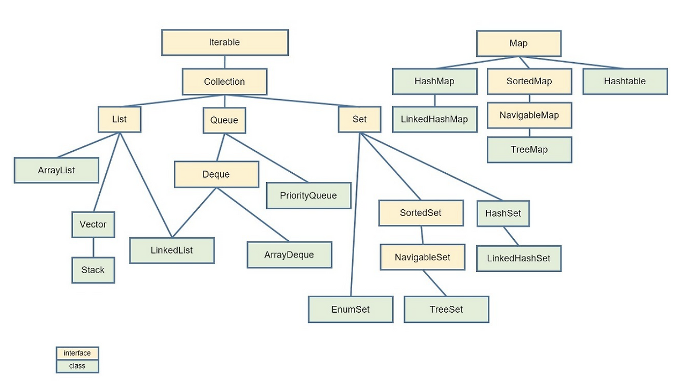

**우선, 자바의 전체 자료구조를 보면 아래와 같다.**



**그 중에서도 대표적인 자료구조는 아래와 같다.**


## 1. 선형 자료구조

- 종류 : 연결리스트, 벡터, 배열, 스택, 큐

### 1-1. 연결 리스트

- 데이터를 감싼 노드를 포인터로 연결한 자료구조
- 삽입, 삭제가 빠르지만, 접근 및 탐색은 느려진다.

**시간 복잡도**

- 삽입 삭제 : O(1)
- 접근, 탐색 : O(N)

**싱글 연결 리스트**

- next 포인터만 가진다.

```java
class Node{
    Node next;
}
```

**이중 연결 리스트, 원형 이중 연결 리스트**

- prev, next 포인터를 가진다.
- 원형 이중 연결 리스트는 처음과 끝 노드도 연결한다.

```java
class Node{
    Node prev;
    Node next;
}
```

**LinkedList**

- 양방향 포인터 구조
- 삽입, 삭제가 빠르지만 접근 및 탐색은 느리다.

### 1-2. 배열

- 고유한 인덱스를 통해 요소에 엑스사할 수 있는 자료구조
- 검색, 탐색이 빠르지만 위치를 하나하나 옮기기 때문에 삽입, 삭제는 느리다.

**시간 복잡도**

- 삽입 삭제 : O(N)
- 접근, 탐색 : O(1)

**ArrayList, Vector**

- 인덱스로 접근이 가능한 동적 배열 구조
- 접근 및 탐색이 빠르지만, 삽입, 삭제가 느리다.

**ArrayList vs Vector**

- Vector는 락을 통해 Thread Safe하다.
- 동기화 오버헤드로 인해 ArrayList가 더 빠르다.

**LinkedList vs ArrayList**

- 만약, 알고리즘에서 데이터에 삽입, 삭제가 많이 발생한다면 LinkedList를 사용하자.
- 반대로, 데이터를 조회하고 탐색이 많다면 ArrayList를 사용하자.

### 1-3. 스택, 큐

- 스택 : 후입 선출(LIFO)를 갖는 구조
- 큐 : 선입 선출(FIFO)를 갖는 구조
- 자바에서는 경우에 따라(삽입,삭제가 많거나 탐색이 많은 경우) LinkedList 또는 ArrayList를 통해 구현

**LinkedList**

```java
List<Integer> list1 = new LinkedList<>();
list1.getFirst(); = list1.peek();
list1.getLast();
list1.removeFirst(); = list1.poll();
list2.removeLast();
```

**ArrayList**

```java
List<Integer> list2 = new ArrayList<>();
list2.get(0);
list2.get(list.size()-1);
list.remove(0);
list.remove(list.size()-1);
```

## 2. 비선형 자료구조

- 종류 : 그래프, 트리, 힙, 우선순위 큐, 맵, 셋, 해시테이블

### 2-1. 그래프

- 정점, 간선(단방향, 양방향), 비용으로 이루어진 자료구조를 의미한다.

### 2-2. 트리

- 그래프의 한 종류로 계층적으로 데이터가 구성된 자료구조
- 루트노드, 내부노드, 리프노드로 구성된다.
- 간선의 수 = 노드의 수 -1

**용어 정리**

- 깊이 : 루트 노드부터 특정 노드까지 최단 거리
- 높이 : 루트 노드부터 리프 노드까지의 최장 거리
- 레벨 : 루트 노드가 가장 작은 레벨
- 서브 트리 : 트리 내의 부분 집합

**이진 트리**

- 한 노드당 자식 노드의 수가 2개 이하인 트리를 의미한다.

**이진트리 종류**

- 정이진 트리 : 한 노드당 자식 노드의 수가 0 또는 2인 트리
- 완전 이진 트리 : 왼쪽부터 채워진 트리로 마지막 레벨을 제외하면 모든 레벨이 채워져 있다.
- 변질 이진 트리 : 한 노드당 자식 노드가 하나만 있는 트리
- 포화 이진 트리 : 모든 레벨이 꽉 차 있는 이진트리
- 균형 이진 트리 : 왼쪽과 오른쪽 노드의 높이 차이가 1 이하인 트리

**이진 탐색 트리**

- 노드마다 왼쪽은 노드보다 작은 값, 오른쪽은 노드보다 큰 값으로 구성
- 삽입 순서에 따라 최소 O(logN) 또는 O(N)의 탐색 시간복잡도를 갖는다.
- 예를 들어, 5-4-3-2-1 과 같이 큰 수부터 작은 수까지 차례대로 입력된 경우 탐색시 O(N)이 소요된다.

**AVL 트리**

- 이진 탐색 트리에서 최악의 경우인 선형적인 트리가 되는 것을 방지하고 스스로 균형을 잡는 이진트리
- 탐색, 삽입, 삭제 모두 O(logN)이 된다.
- 균형을 잡기 위해 계속적으로 왼쪽 또는 오른쪽으로 회전한다.

**레드 블랙 트리**

- 균형 이진 탐색의 한 종류
- 탐색, 삽입, 삭제 모두 O(logN)이 된다.
- 빨간색, 검정색을 나타내는 추가비트를 추가하고 루트 노드, 리프 노드는 무조건 검정색, 만약 어떤 노드가 빨간색이라면 그 자식은 무조건 검정색임을 보장하며 균형을 잡는 트리이다.

### 2-3. 힙

- 완전 이진 탐색의 한 유형이다. 
- 최대 힙 : 레벨이 낮을수록 값이 크다.
- 최소 힙 : 레벨이 낮을수록 값이 작다.
- 삭제 : 루트 노드가 삭제된다. 
- 삽입 : 왼쪽부터 쌓인다.ㅍ

### 2-4. 우선순위 큐

- 우선순위가 높은 순서대로 제공되는 자료구조로 최소힙 또는 최대힙을 기반으로 구현한다.
- 자바에서는 PriorityQueue로 구현한다.

```java
PriorityQueue<Integer> minHeap = new PriorityQueue<>(Comparator.comparing(arr->arr));
PriorityQueue<Integer> maxHeap = new PriorityQueue<>(Comparator.comparing(arr->-arr));
```

### 2-5. 셋

- 중복되는 요소가 없는 자료구조를 의미한다.
- 자바에서는 HashSet, LinkedHashSet, TreeSet을 사용한다.
- 빠른 연산이 가능하다.
- 해시 사용시 원리 : 해시 함수를 통해 객체를 해시코드로 변환하고 해시 테이블을 만들어 해시 버킷에 저장한다. 또한, 해시 충돌 발생시 자동으로 체이닝을 통해 연결리스트로 객체를 저장한다.

**HashSet**

- 순서 X, 정렬 X

**LinkedHashSet**

- 순서 O, 정렬 X 

```java
Set<Integer> set = new LinkedHashSet<>();
for(int i=1; i<=10; i++){
	set.add(i);
}
// 입력한 순서대로 출력
for(int i : set){
	System.out.println(i);
}
```

**TreeSet**

- 순서 O, 정렬 O
- HashSet보다 삽입, 삭제가 느려진다.
- first(), last() : 가장 크거나 작은 값 출력
- lower(5), higher(5), floor(5), ceiling(5) : 제공된 값보다 1.작거나, 2.크거나 3.작거나같거나, 4.크거나같거나 한 값 

```java
Set<Integer> set = new TreeSet<>(Comparator.comparing(arr -> -arr));
for(int i=1; i<=10; i++){
    set.add(i);
}
for(int i : set){
    System.out.println(i);
}
```

### 2-6. 맵

- 키와 값의 조합으로 형성된 자료구조
- 자바에서는 HashMap, LinkedHashMap, TreeMap을 사용한다.
- 레드 블랙 트리 자료구조를 기반으로 형성된다.
- 해시 사용시 원리 : 해시 함수를 통해 객체를 해시코드로 변환하고 해시 테이블을 만들어 해시 버킷에 저장한다. 또한, 해시 충돌 발생시 자동으로 체이닝을 통해 연결리스트로 객체를 저장한다.

**HashMap**

- 순서 X, 정렬 X
- Hash Table로도 불리지만 자바에서 HashTable은 Thread-Safe 하다.

**LinkedHashMap**

- 순서 O, 정렬 X 

```java
Map<Integer> map = new LinkedHashMap<>();
for(int i=1; i<=10; i++){
	map.add(i);
}
// 입력한 순서대로 출력
for(int i : map){
	System.out.println(i);
}
```

**TreeMap**

- 순서 O, 정렬 O
- HashMap보다 삽입, 삭제가 느려진다.

```java
Map<Integer> map = new TreeMap<>(Comparator.comparing(arr -> -arr));
for(int i=1; i<=10; i++){
    map.add(i);
}
for(int i : map){
    System.out.println(i);
}
```